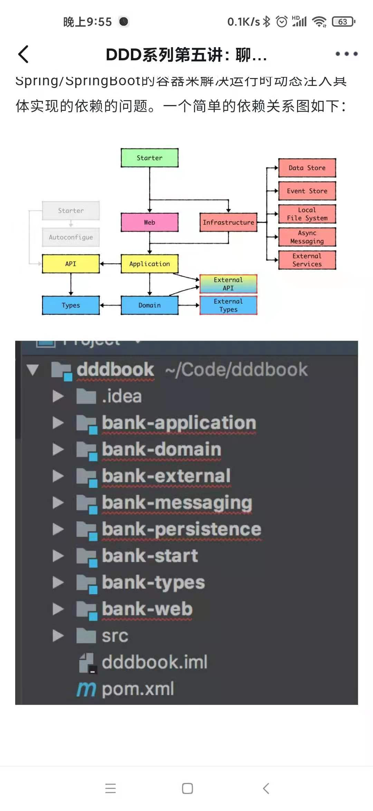

# 领域驱动设计

# 经典书籍
* Eric Evans 的 DDD 蓝皮书《Domain Driven Design》
* Vaughn Vernon 的 IDDD 红皮书 《Implementing DDD》
* Martin Fowler 的 《P of EAA》
* Dan Bergh Johnsson & Daniel Deogun 的 《Secure by Design》  
* Uncle Bob 《Clean Architecture》

# DDD落地

# DDD落地的一些可能问题
问题1:怎么解决订单domain的懒加载问题???

问题2:repository如何保存只修改过的聚合根???shopshot方案(hibernate)

问题3:jps场景下do到entity怎么转化

问题4:如何和现有的设计模式整合在一起

# 开源DDD框架
阿里巴巴 DDD开源框架COLA
[作者张建飞 COLA]( https://github.com/alibaba/COLA)

# doc
联系作者殷浩邮箱:guangmiao.lgm@alibaba-inc.com
[淘系技术之DDD系列讲解](https://mp.weixin.qq.com/s/1rdnkROdcNw5ro4ct99SqQ)

[martinfowler](https://martinfowler.com/eaaCatalog/dataTransferObject.html?spm=ata.13261165.0.0.590a62fcaM6bCk)
