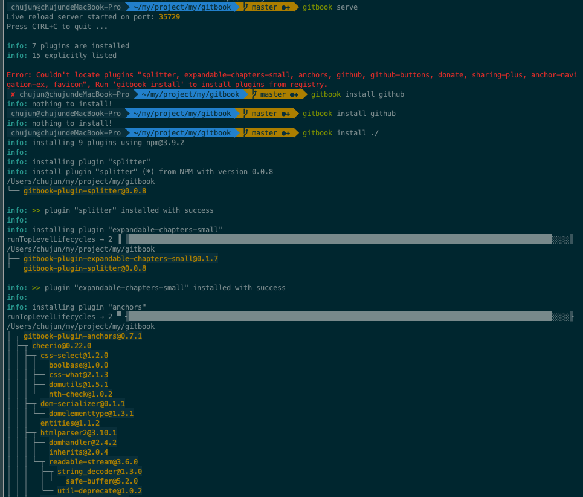

# 官网文档
[gitbook官网文档](https://docs.gitbook.com/)

# 安装

## 安装 Node.js
```
$ node -V
v13.2.0
```

## 安装gitbook
```
$npm install gitbook-cli -g
/usr/local/bin/gitbook -> /usr/local/lib/node_modules/gitbook-cli/bin/gitbook.js
+ gitbook-cli@2.3.2
added 578 packages from 672 contributors in 36.313s
```

## gitbook -V 检查命令是否安装成功
```
gitbook -V
CLI version: 2.3.2
Installing GitBook 3.2.3
|
|
xcode-select: error: tool 'xcodebuild' requires Xcode, but active developer directory '/Library/Developer/CommandLineTools' is a command line tools instance

Traceback (most recent call last):
  File "/usr/local/lib/node_modules/gitbook-cli/node_modules/npmi/node_modules/npm/node_modules/node-gyp/gyp/gyp_main.py", line 16, in <module>
    sys.exit(gyp.script_main())
  File "/usr/local/lib/node_modules/gitbook-cli/node_modules/npmi/node_modules/npm/node_modules/node-gyp/gyp/pylib/gyp/__init__.py", line 545, in script_main
    return main(sys.argv[1:])
  File "/usr/local/lib/node_modules/gitbook-cli/node_modules/npmi/node_modules/npm/node_modules/node-gyp/gyp/pylib/gyp/__init__.py", line 538, in main
    return gyp_main(args)
  File "/usr/local/lib/node_modules/gitbook-cli/node_modules/npmi/node_modules/npm/node_modules/node-gyp/gyp/pylib/gyp/__init__.py", line 523, in gyp_main
    generator.GenerateOutput(flat_list, targets, data, params)
  File "/usr/local/lib/node_modules/gitbook-cli/node_modules/npmi/node_modules/npm/node_modules/node-gyp/gyp/pylib/gyp/generator/make.py", line 2170, in GenerateOutput
    part_of_all=qualified_target in needed_targets)
  File "/usr/local/lib/node_modules/gitbook-cli/node_modules/npmi/node_modules/npm/node_modules/node-gyp/gyp/pylib/gyp/generator/make.py", line 817, in Write
    mac_bundle_deps, extra_outputs, part_of_all)
  File "/usr/local/lib/node_modules/gitbook-cli/node_modules/npmi/node_modules/npm/node_modules/node-gyp/gyp/pylib/gyp/generator/make.py", line 1453, in WriteTarget
    lambda p: Sourceify(self.Absolutify(p)))
  File "/usr/local/lib/node_modules/gitbook-cli/node_modules/npmi/node_modules/npm/node_modules/node-gyp/gyp/pylib/gyp/xcode_emulation.py", line 809, in GetLdflags
    archs = self.GetActiveArchs(self.configname)
  File "/usr/local/lib/node_modules/gitbook-cli/node_modules/npmi/node_modules/npm/node_modules/node-gyp/gyp/pylib/gyp/xcode_emulation.py", line 420, in GetActiveArchs
    xcode_archs_default = GetXcodeArchsDefault()
  File "/usr/local/lib/node_modules/gitbook-cli/node_modules/npmi/node_modules/npm/node_modules/node-gyp/gyp/pylib/gyp/xcode_emulation.py", line 118, in GetXcodeArchsDefault
    xcode_version, _ = XcodeVersion()
  File "/usr/local/lib/node_modules/gitbook-cli/node_modules/npmi/node_modules/npm/node_modules/node-gyp/gyp/pylib/gyp/xcode_emulation.py", line 1265, in XcodeVersion
    version = re.match(r'(\d\.\d\.?\d*)', version).groups()[0]
AttributeError: 'NoneType' object has no attribute 'groups'
xcode-select: error: tool 'xcodebuild' requires Xcode, but active developer directory '/Library/Developer/CommandLineTools' is a command line tools instance

Traceback (most recent call last):
  File "/usr/local/lib/node_modules/gitbook-cli/node_modules/npmi/node_modules/npm/node_modules/node-gyp/gyp/gyp_main.py", line 16, in <module>
    sys.exit(gyp.script_main())
  File "/usr/local/lib/node_modules/gitbook-cli/node_modules/npmi/node_modules/npm/node_modules/node-gyp/gyp/pylib/gyp/__init__.py", line 545, in script_main
    return main(sys.argv[1:])
  File "/usr/local/lib/node_modules/gitbook-cli/node_modules/npmi/node_modules/npm/node_modules/node-gyp/gyp/pylib/gyp/__init__.py", line 538, in main
    return gyp_main(args)
  File "/usr/local/lib/node_modules/gitbook-cli/node_modules/npmi/node_modules/npm/node_modules/node-gyp/gyp/pylib/gyp/__init__.py", line 523, in gyp_main
    generator.GenerateOutput(flat_list, targets, data, params)
  File "/usr/local/lib/node_modules/gitbook-cli/node_modules/npmi/node_modules/npm/node_modules/node-gyp/gyp/pylib/gyp/generator/make.py", line 2170, in GenerateOutput
    part_of_all=qualified_target in needed_targets)
  File "/usr/local/lib/node_modules/gitbook-cli/node_modules/npmi/node_modules/npm/node_modules/node-gyp/gyp/pylib/gyp/generator/make.py", line 817, in Write
    mac_bundle_deps, extra_outputs, part_of_all)
  File "/usr/local/lib/node_modules/gitbook-cli/node_modules/npmi/node_modules/npm/node_modules/node-gyp/gyp/pylib/gyp/generator/make.py", line 1453, in WriteTarget
    lambda p: Sourceify(self.Absolutify(p)))
  File "/usr/local/lib/node_modules/gitbook-cli/node_modules/npmi/node_modules/npm/node_modules/node-gyp/gyp/pylib/gyp/xcode_emulation.py", line 809, in GetLdflags
    archs = self.GetActiveArchs(self.configname)
  File "/usr/local/lib/node_modules/gitbook-cli/node_modules/npmi/node_modules/npm/node_modules/node-gyp/gyp/pylib/gyp/xcode_emulation.py", line 420, in GetActiveArchs
    xcode_archs_default = GetXcodeArchsDefault()
  File "/usr/local/lib/node_modules/gitbook-cli/node_modules/npmi/node_modules/npm/node_modules/node-gyp/gyp/pylib/gyp/xcode_emulation.py", line 118, in GetXcodeArchsDefault
    xcode_version, _ = XcodeVersion()
  File "/usr/local/lib/node_modules/gitbook-cli/node_modules/npmi/node_modules/npm/node_modules/node-gyp/gyp/pylib/gyp/xcode_emulation.py", line 1265, in XcodeVersion
    version = re.match(r'(\d\.\d\.?\d*)', version).groups()[0]
AttributeError: 'NoneType' object has no attribute 'groups'
gitbook@3.2.3 ../../../../var/folders/3r/4hqx7wh11735mb4k6820b9hc0000gn/T/tmp-57605wOQvFg8jv7nn/node_modules/gitbook
├── ignore@3.1.2
├── destroy@1.0.4
├── escape-string-regexp@1.0.5
├── escape-html@1.0.3
├── bash-color@0.0.4
├── nunjucks-do@1.0.0
├── cp@0.2.0
├── spawn-cmd@0.0.2
├── gitbook-plugin-livereload@0.0.1
├── q@1.4.1
├── graceful-fs@4.1.4
├── object-path@0.9.2
├── is@3.3.0
├── direction@0.1.5
├── gitbook-plugin-fontsettings@2.0.0
├── github-slugid@1.0.1
├── open@0.0.5
├── json-schema-defaults@0.1.1
├── gitbook-plugin-search@2.2.1
├── extend@3.0.2
├── semver@5.1.0
├── jsonschema@1.1.0
├── crc@3.4.0
├── urijs@1.18.0
├── immutable@3.8.2
├── front-matter@2.3.0
├── dom-serializer@0.1.0 (domelementtype@1.1.3, entities@1.1.2)
├── omit-keys@0.1.0 (isobject@0.2.0, array-difference@0.0.1)
├── error@7.0.2 (string-template@0.2.1, xtend@4.0.2)
├── send@0.13.2 (statuses@1.2.1, fresh@0.3.0, etag@1.7.0, range-parser@1.0.3, ms@0.7.1, depd@1.1.2, mime@1.3.4, debug@2.2.0, http-errors@1.3.1, on-finished@2.3.0)
├── npmi@2.0.1 (semver@4.3.6)
├── tmp@0.0.28 (os-tmpdir@1.0.2)
├── mkdirp@0.5.1 (minimist@0.0.8)
├── rmdir@1.2.0 (node.flow@1.2.3)
├── resolve@1.1.7
├── fresh-require@1.0.3 (is-require@0.0.1, shallow-copy@0.0.1, sleuth@0.1.1, astw@1.3.0, through2@0.6.5, escodegen@1.14.1, acorn@0.9.0)
├── cpr@1.1.1 (rimraf@2.4.5)
├── tiny-lr@0.2.1 (parseurl@1.3.3, livereload-js@2.4.0, qs@5.1.0, debug@2.2.0, body-parser@1.14.2, faye-websocket@0.10.0)
├── js-yaml@3.13.1 (esprima@4.0.1, argparse@1.0.10)
├── gitbook-plugin-theme-default@1.0.7
├── gitbook-plugin-lunr@1.2.0 (html-entities@1.2.0, lunr@0.5.12)
├── read-installed@4.0.3 (debuglog@1.0.1, util-extend@1.0.3, slide@1.1.6, readdir-scoped-modules@1.1.0, read-package-json@2.1.1)
├── gitbook-plugin-highlight@2.0.2 (highlight.js@9.2.0)
├── moment@2.13.0
├── gitbook-plugin-sharing@1.0.2 (lodash@3.10.1)
├── chokidar@1.5.0 (async-each@1.0.3, path-is-absolute@1.0.1, inherits@2.0.4, glob-parent@2.0.0, is-binary-path@1.0.1, is-glob@2.0.1, anymatch@1.3.2, readdirp@2.2.1)
├── i18n-t@1.0.1 (lodash@4.17.15)
├── cheerio@0.20.0 (entities@1.1.2, css-select@1.2.0, htmlparser2@3.8.3, jsdom@7.2.2, lodash@4.17.15)
├── gitbook-asciidoc@1.2.2 (gitbook-html@1.3.3, asciidoctor.js@1.5.5-1, lodash@4.17.15)
├── gitbook-markdown@1.3.2 (kramed-text-renderer@0.2.1, gitbook-html@1.3.3, kramed@0.5.6, lodash@4.17.15)
├── request@2.72.0 (tunnel-agent@0.4.3, aws-sign2@0.6.0, oauth-sign@0.8.2, forever-agent@0.6.1, is-typedarray@1.0.0, caseless@0.11.0, stringstream@0.0.6, aws4@1.9.1, isstream@0.1.2, json-stringify-safe@5.0.1, tough-cookie@2.2.2, node-uuid@1.4.8, qs@6.1.2, combined-stream@1.0.8, mime-types@2.1.26, bl@1.1.2, hawk@3.1.3, har-validator@2.0.6, http-signature@1.1.1, form-data@1.0.1)
├── juice@2.0.0 (deep-extend@0.4.2, slick@1.12.2, batch@0.5.3, cssom@0.3.1, commander@2.9.0, cross-spawn-async@2.2.5, web-resource-inliner@2.0.0)
├── nunjucks@2.5.2 (asap@2.0.6, yargs@3.32.0, chokidar@1.7.0)
└── npm@3.9.2
GitBook version: 3.2.3
```
```
$gitbook -V
CLI version: 2.3.2
GitBook version: 3.2.3
```

# 开始gitbook之旅吧
## gitbook init初始化gitbook项目
```
chujun@chujundeMacBook-Pro  ~/my/project/my  mkdir gitbook
 chujun@chujundeMacBook-Pro  ~/my/project/my  ls
annotationprocessor gitbook             gpay-arch           simpleWebApp
 chujun@chujundeMacBook-Pro  ~/my/project/my  cd gitbook
 chujun@chujundeMacBook-Pro  ~/my/project/my/gitbook  ls
 chujun@chujundeMacBook-Pro  ~/my/project/my/gitbook  gitbook init
warn: no summary file in this book
info: create README.md
info: create SUMMARY.md
info: initialization is finished
 chujun@chujundeMacBook-Pro  ~/my/project/my/gitbook  ls
README.md  SUMMARY.md
 chujun@chujundeMacBook-Pro  ~/my/project/my/gitbook  cat README.md
# Introduction

 chujun@chujundeMacBook-Pro  ~/my/project/my/gitbook  cat SUMMARY.md
# Summary

* [Introduction](README.md)

```

## gitbook serve启动gitbook项目
```
 chujun@chujundeMacBook-Pro  ~/my/project/my/gitbook  gitbook serve
Live reload server started on port: 35729
Press CTRL+C to quit ...

info: 7 plugins are installed
info: loading plugin "livereload"... OK
info: loading plugin "highlight"... OK
info: loading plugin "search"... OK
info: loading plugin "lunr"... OK
info: loading plugin "sharing"... OK
info: loading plugin "fontsettings"... OK
info: loading plugin "theme-default"... OK
info: found 1 pages
info: found 0 asset files
info: >> generation finished with success in 0.6s !

Starting server ...
Serving book on http://localhost:4000


(node:57892) [DEP0066] DeprecationWarning: OutgoingMessage.prototype._headers is deprecated
Restart after change in file gitbook搭建.md

Stopping server
info: 7 plugins are installed
info: loading plugin "livereload"... OK
info: loading plugin "highlight"... OK
info: loading plugin "search"... OK
info: loading plugin "lunr"... OK
info: loading plugin "sharing"... OK
info: loading plugin "fontsettings"... OK
info: loading plugin "theme-default"... OK
info: found 1 pages
info: found 6 asset files
info: >> generation finished with success in 0.5s !

Starting server ...
Serving book on http://localhost:4000
Restart after change in file gitbook搭建.md
```

## 浏览器浏览gitbook


## 安装插件
在book.json文件调整插件配置后，再在项目目录下执行命令gitbook install ./
当然也可以指定插件版本安装，碰到再聊


# TODO 
1. gitbook plugin插件库

# 参考资料
[简书 GitBook 使用教程](https://www.jianshu.com/p/421cc442f06c)