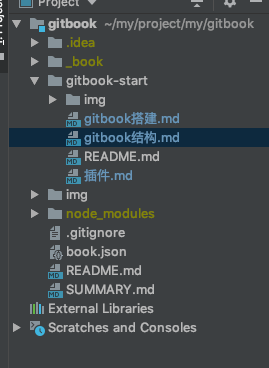

# 目录结构
```
.
├── book.json
├── README.md
├── SUMMARY.md
├── chapter-1/
|   ├── README.md
|   └── something.md
└── chapter-2/
    ├── README.md
    └── something.md
```


# book.json
用来存放配置信息 网上的一个demo

%accordion%book.json demo%accordion%
```json5
{
    "title": "Blankj's Glory",
    "author": "Blankj",
    "description": "select * from learn",
    "language": "zh-hans",
    "gitbook": "3.2.3",
    "styles": {
        "website": "./styles/website.css"
    },
    "structure": {
        "readme": "README.md"
    },
    "links": {
        "sidebar": {
            "我的狗窝": "https://blankj.com"
        }
    },
    "plugins": [
        "-sharing",
        "splitter",
        "expandable-chapters-small",
        "anchors",

        "github",
        "github-buttons",
        "donate",
        "sharing-plus",
        "anchor-navigation-ex",
        "favicon"
    ],
    "pluginsConfig": {
        "github": {
            "url": "https://github.com/Blankj"
        },
        "github-buttons": {
            "buttons": [{
                "user": "Blankj",
                "repo": "glory",
                "type": "star",
                "size": "small",
                "count": true
                }
            ]
        },
        "donate": {
            "alipay": "./source/images/donate.png",
            "title": "",
            "button": "赞赏",
            "alipayText": " "
        },
        "sharing": {
            "douban": false,
            "facebook": false,
            "google": false,
            "hatenaBookmark": false,
            "instapaper": false,
            "line": false,
            "linkedin": false,
            "messenger": false,
            "pocket": false,
            "qq": false,
            "qzone": false,
            "stumbleupon": false,
            "twitter": false,
            "viber": false,
            "vk": false,
            "weibo": false,
            "whatsapp": false,
            "all": [
                "google", "facebook", "weibo", "twitter",
                "qq", "qzone", "linkedin", "pocket"
            ]
        },
        "anchor-navigation-ex": {
            "showLevel": false
        },
        "favicon":{
            "shortcut": "./source/images/favicon.jpg",
            "bookmark": "./source/images/favicon.jpg",
            "appleTouch": "./source/images/apple-touch-icon.jpg",
            "appleTouchMore": {
                "120x120": "./source/images/apple-touch-icon.jpg",
                "180x180": "./source/images/apple-touch-icon.jpg"
            }
        }
    }
}
```
%/accordion%

## 配置说明
* 1.language
Gitbook使用的语言, 版本2.6.4中可选的语言如下：
en, ar, bn, cs, de, en, es, fa, fi, fr, he, it, ja, ko, no, pl, pt, ro, ru, sv, uk, vi, zh-hans, zh-tw
例如，配置使用简体中文 "language" : "zh-hans"
* 2.links
在左侧导航栏添加链接信息
```
"links" : {
    "sidebar" : {
        "Home" : "https://www.baidu.com"
    }
}
```
* 3.styles
自定义页面样式， 默认情况下各generator对应的css文件
```
"styles": {
    "website": "styles/website.css",
    "ebook": "styles/ebook.css",
    "pdf": "styles/pdf.css",
    "mobi": "styles/mobi.css",
    "epub": "styles/epub.css"
}
```


# SUMMARY.md
 表达GitBook 的章节目录，支持Markdown语法
```
# Summary

* [介绍](README.md)

* [gitbook start](gitbook-start/README.md)
    * [搭建](gitbook-start/gitbook搭建.md)
        * [搭建1](gitbook-start/gitbook搭建.md)
        * [搭建2](gitbook-start/gitbook搭建.md)
    * [结构](gitbook-start/gitbook结构.md)
    * [插件](gitbook-start/插件.md)
```
也可以用标题或者水平分割线标识将GitBook目录分为几个不同的部分：
```
# Summary

### Part I

* [Introduction](README.md)
* [Writing is nice](part1/writing.md)
* [GitBook is nice](part1/gitbook.md)

### Part II

* [We love feedback](part2/feedback_please.md)
* [Better tools for authors](part2/better_tools.md)

----

* [Last part without title](part3/title.md)
```


