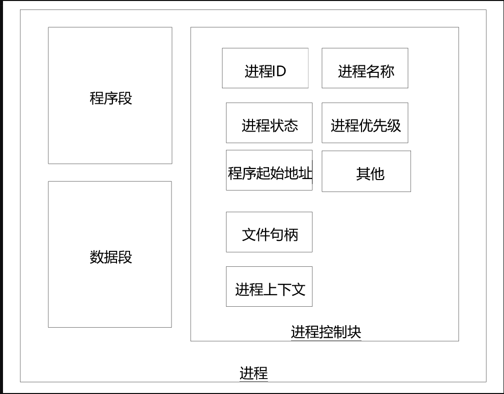
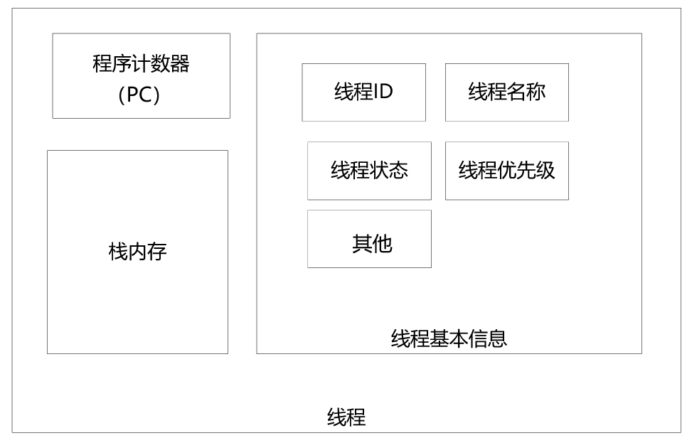
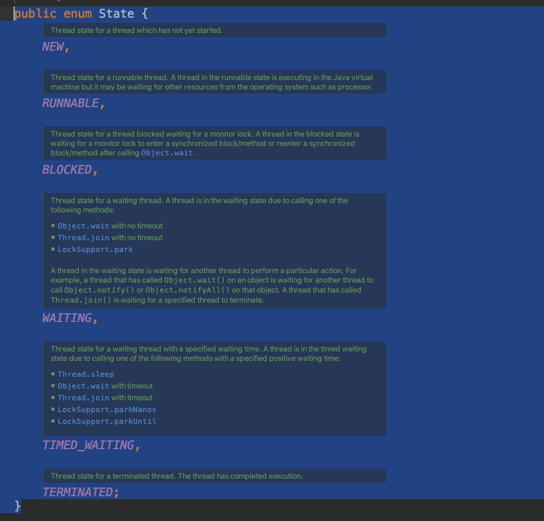
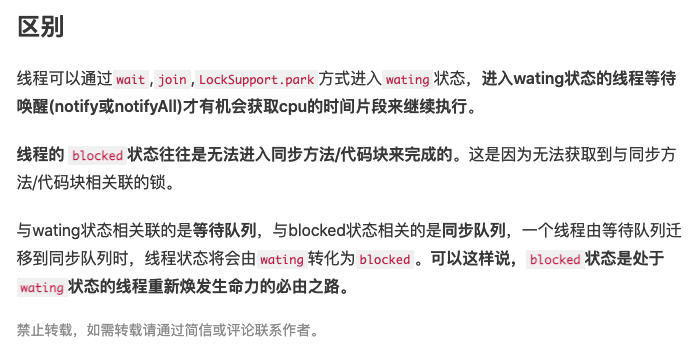
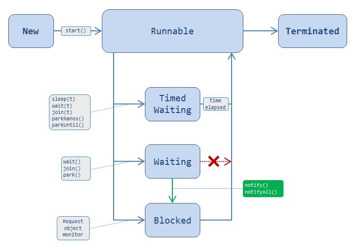

# 进程 VS 线程
(这儿对进程的定义貌似还不错，不过还是要参考最标准的书籍看看)
进程的定义一直以来没有完美的标准。
一般来说，一个进程由程序段、数据段和进程控制块三部分组成。进程的大致结构如图1-2所示。



## 1.2.2 线程基本原理

线程内存结构
JDK1.8中每个线程创建时默认被分配1MB大小的栈内存。

堆内存 VS 栈内存

工作原理:栈内存的工作机制

## 1.2.3 线程 VS 进程
内存结构
关系

# 1.3
Thread
新建，就绪，运行，阻塞，等待，时间等待，结束
```java
public static enum State {
             NEW,                           //新建
             RUNNABLE,              //就绪、运行
             BLOCKED,               //阻塞
             WAITING,               //等待
             TIMED_WAITING,   //计时等待
             TERMINATED;            //结束
     }
```


cj:有意思问题 BLOCKED和WAITING的区别
很有趣的是java源码里对这两个状态的描述反而更容易引起人误解了


如下说明就清晰很多，来一个线程状态图可能就清晰很多了
Waiting->Blocked->Runnable(从waiting状态到runnable状态，blocked状态不可跳过)


[Java thread state transition, WAITING to BLOCKED, or RUNNABLE?](https://stackoverflow.com/questions/28378592/java-thread-state-transition-waiting-to-blocked-or-runnable)

如下辅助阅读
[WAIT和BLOCKED线程状态之间的区别](https://qastack.cn/programming/15680422/difference-between-wait-and-blocked-thread-states)
[Java Thread wait() => blocked?](https://stackoverflow.com/questions/2534147/java-thread-wait-blocked)


## 1.3.3创建线程的四种方法
方法一：继承Thread类创建线程类
方法二：实现Runnable接口创建线程类
好处：相比第一种方式
逻辑和数据更好分离。（怎么理解？？？）
通过实现Runnable接口的方法创建多线程更加适合同一个资源被多段业务逻辑并行处理的场景。
在同一个资源被多个线程逻辑异步、并行处理的场景中，通过实现Runnable接口的方式设计多个target执行目标类
可以更加方便、清晰地将执行逻辑和数据存储分离，
更好地体现了面向对象的设计思想


