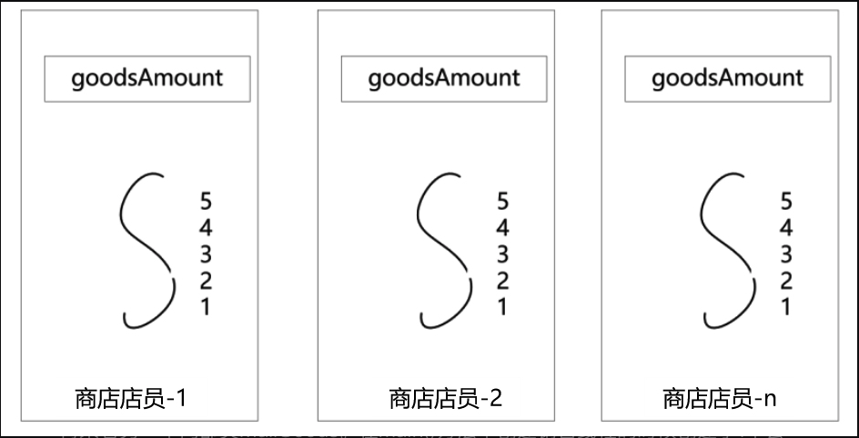
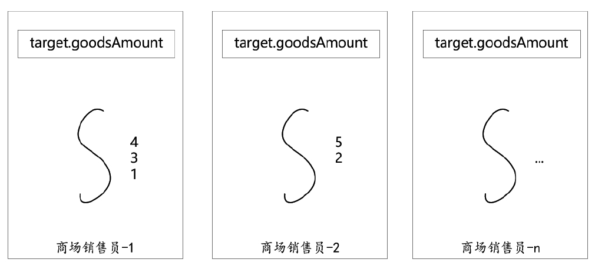

# 进程 VS 线程

(这儿对进程的定义貌似还不错，不过还是要参考最标准的书籍看看)
进程的定义一直以来没有完美的标准。 一般来说，一个进程由程序段、数据段和进程控制块三部分组成。进程的大致结构如图1-2所示。


## 1.2.2 线程基本原理


线程内存结构 JDK1.8中每个线程创建时默认被分配1MB大小的栈内存。

堆内存 VS 栈内存

工作原理:栈内存的工作机制

## 1.2.3 线程 VS 进程

内存结构 关系

# 1.3

Thread 新建，就绪，运行，阻塞，等待，时间等待，结束

```java
public static enum State {
    NEW,                           //新建
    RUNNABLE,              //就绪、运行
    BLOCKED,               //阻塞
    WAITING,               //等待
    TIMED_WAITING,   //计时等待
    TERMINATED;            //结束
}
```

cj:有意思问题 BLOCKED和WAITING的区别 很有趣的是java源码里对这两个状态的描述反而更容易引起人误解了


如下说明就清晰很多，来一个线程状态图可能就清晰很多了 Waiting->Blocked->Runnable(从waiting状态到runnable状态，blocked状态不可跳过)


[Java thread state transition, WAITING to BLOCKED, or RUNNABLE?](https://stackoverflow.com/questions/28378592/java-thread-state-transition-waiting-to-blocked-or-runnable)

如下辅助阅读
[WAIT和BLOCKED线程状态之间的区别](https://qastack.cn/programming/15680422/difference-between-wait-and-blocked-thread-states)
[Java Thread wait() => blocked?](https://stackoverflow.com/questions/2534147/java-thread-wait-blocked)

## 1.3.3创建线程的四种方法

方法一：继承Thread类创建线程类

方法二：实现Runnable接口创建线程类

好处：相比第一种方式 逻辑和数据更好分离。（怎么理解？？？思考下实际应用场景） 通过实现Runnable接口的方法创建多线程更加适合同一个资源被多段业务逻辑并行处理的场景。
在同一个资源被多个线程逻辑异步、并行处理的场景中，通过实现Runnable接口的方式设计多个target执行目标类 可以更加方便、清晰地将执行逻辑和数据存储分离， 更好地体现了面向对象的设计思想

### demo演示

考虑一下如下业务场景，两种不同的售卖方式

* 一家商场物品有若干个，n个销售员同时卖这批物品
* n家自营门店，物品若干个，每个门店有自己的店员售卖自己店里的物品




[代码示例地址](https://github.com/chujun/javaddu/blob/master/src/main/java/com/jun/chu/java/javaHighConcurrencyCoreProgramming/concurrency/base/SalesDemo.java)


> 通过对比可以看出：
>
>（1）通过继承Thread类实现多线程能更好地做到多个线程并发地完成各自的任务，访问各自的数据资源。
>
>（2）通过实现Runnable接口实现多线程能更好地做到多个线程并发地完成同一个任务，访问同一份数据资源。
> 多个线程的代码逻辑可以方便地访问和处理同一个共享数据资源（如例子中的MallGoods.goodsAmount），
> 这样可以将线程逻辑和业务数据进行有效的分离，更好地体现了面向对象的设计思想。
>
>（3）通过实现Runnable接口实现多线程时，如果数据资源存在多线程共享的情况，
> 那么数据共享资源需要使用原子类型（而不是普通数据类型），或者需要进行线程的同步控制，
> 以保证对共享数据操作时不会出现线程安全问题。
>
>总之，在大多数情况下，偏向于通过实现Runnable接口来实现线程执行目标类，这样能使代码更加简洁明了。
> 后面介绍线程池的时候会讲到，异步执行任务在大多数情况下是通过线程池去提交的，而很少通过创建一个新的线程去提交，
> 所以更多的做法是，通过实现Runnable接口创建异步执行任务，而不是继承Thread去创建异步执行任务。


方法三：使用Callable和FutureTask创建线程
jdk1.5引入Callable接口和FutureTask背景:Thread和Runnable不能获取异步执行结果

TODO:cj

TODO:cj后续学习

* [ ] LockSupport.parkNanos(millisecond * 1000L * 1000L); 学习一下


