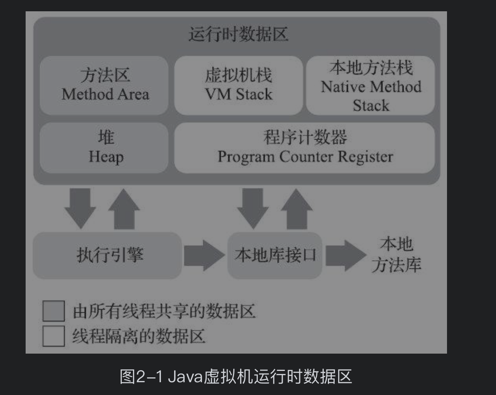
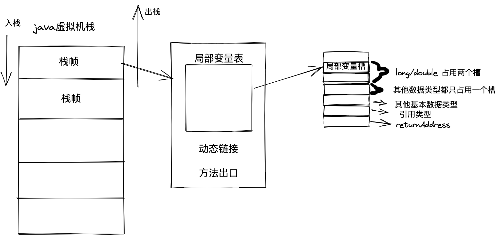
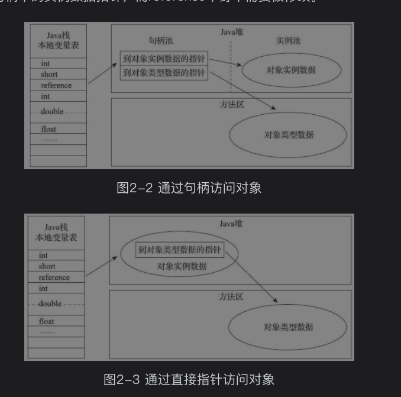

#

# 名句
* Java与C++之间有一堵由内存动态分配和垃圾收集技术所围成的高墙，墙外面的人想进去，墙里面的人却想出来。

# 主要分为四大部分
* 自动内存管理
* 虚拟机程序执行子系统
* 程序编译与代码优化
* 高效并发

# 第二章：java内存区域和内存溢出异常
## java内存划分区域
官方参考《Java虚拟机规范》
[图重要系列]

线程私有 vs 线程共有

##
### 对象访问方式

# 本书面向读者
初级程序员 xxx
中高级程序员 get

# 书籍信息
* 深入理解Java虚拟机：JVM高级特性与最佳实践（第3版）
* 周志明
* 出版社：机械工业出版社
* 出版时间：2019-11
* ISBN：9787111641247

# 资料
## 官网地址
[openjdk不同版本](http://openjdk.java.net/)
## 源码地址
[华章图书网站](http://www.hzbook.com/)

## 官网贵方
* java虚拟机规范
* java语言规范

## 书籍
* 《垃圾回收算法手册：自动内存管理的艺术》专业性极强
* 《Virtual Machines：Versatile Platforms for Systems and Processes》虚拟化技术的百科全书
* 《Java性能优化权威指南》从操作系统到基于Java的上层程序性能度量和调优进行全面介绍。其中涉及Java虚拟机的内容具备一定深度和很好的可实践性

## 网站资源
* [高级语言虚拟机圈子](http://hllvm.group.iteye.com/)

