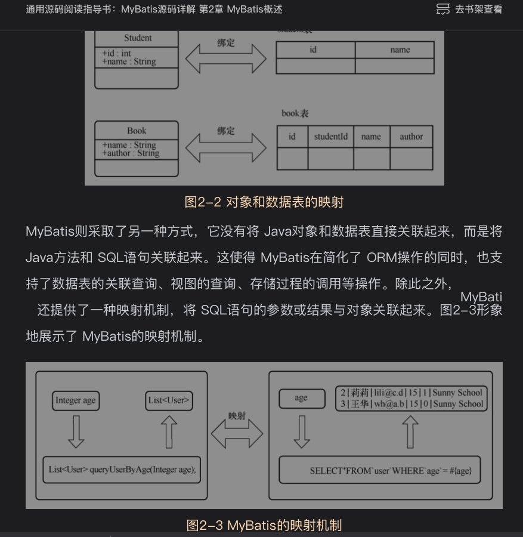

# 2.1背景介绍
## 2.1.1传统数据库连接方式

## 2.1.2 引入ORM框架(解决上述问题)
## 2.1.3Mybatis
核心功能：将java方法和SQL语句关联起来

# 2.2快速上手
略过了,已经很了解了,官网资料很详细了,新手可以看看

推荐了一个spring的一个快速创建spring boot项目的工具类

使用Spring Initializr快速创建spring boot项目官网

# 资料
[Spring Initializr](https://start.spring.io)