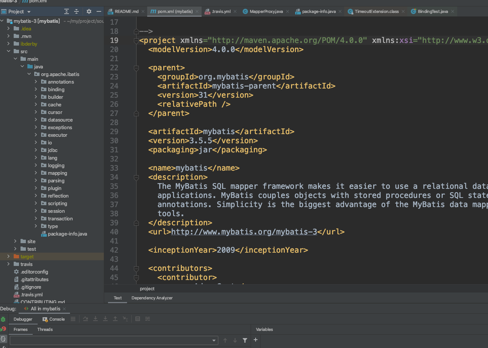
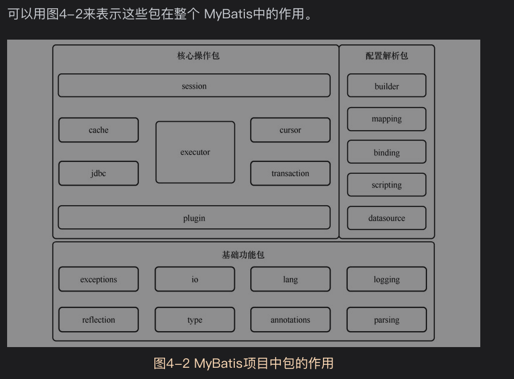

# 4.1包结构

# 4.2分组结构
大致分为以下三类
* 基础功能包：提供外围基础功能，功能相对独立，与业务逻辑耦合小。例如文件读取功能，反射操作功能等
* 配置解析包：完成配置解析、存储等工作，主要在系统初始化阶段运行
* 核心操作包：用来完成数据库操作

基础功能包
* exception
* reflection
* annotations
* lang
* type
* io
* logging
* parsing

配置解析包
* binding
* builder
* mapping
* scripting
* datasource

核心操作包
* jdbc
* cache
* transaction
* cursor
* executor
* session
* plugin

*4mybatis项目中包的作用*

选择从最外围源码入手的原因有
* 很少依赖核心源码，相对独立。
* 核心代码依赖外围源码.读完外围源码后再读核心源码，可以有效降低核心源码的阅读难度

*整个源码阅读过程如同剥洋葱一般，由外及内，逐层深入*

第二篇：基础功能包源码阅读
5,6,7,8,9,10,11
第三篇：配置解析包源码阅读
12，13，14，15，16，17
第四篇：核心操作包源码阅读
18，19，20，21，22，23，24