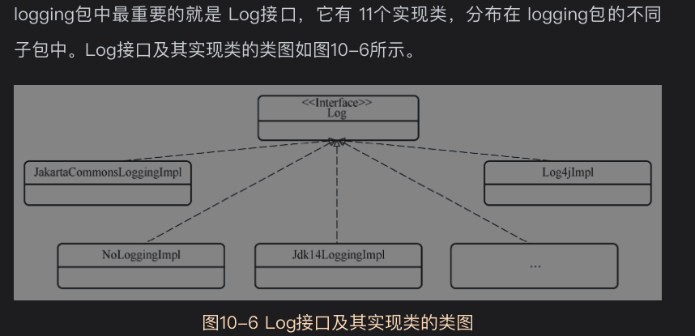
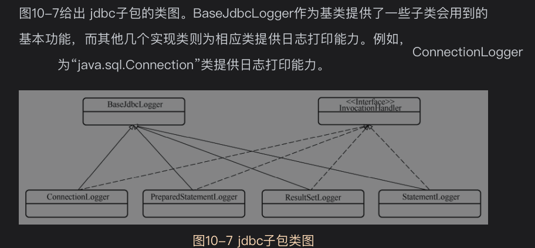

logging包负责Mybatis操作中的日志记录工具


# 10.1背景知识
## 10.1.1适配器模式

## 10.1.2日志框架与日志级别
Java领域的日志框架非常丰富,例如log4j,Logging,common-logging,slf4j,logback等等

## 10.1.3基于反射的动态代理
基于Java的Proxy类和InvocationHandler接口可以实现动态代理
条件：被代理的对象必须有父接口

# 10.2Log接口

*10Log接口及其实现类的类图*


```java
public interface Log {

  boolean isDebugEnabled();

  boolean isTraceEnabled();

  void error(String s, Throwable e);

  void error(String s);

  void debug(String s);

  void trace(String s);

  void warn(String s);

}
```
# 10.3Log接口的实现类
10多个实现类，
* NoLoggingImpl类最简单，它是一种不打印日志的实现类，内部几乎没有任何操作逻辑
* StdOutImpl：使用系统System.out和System.err打印日志
* Sl4fJLocationAwareLoggerImpl和Slf4jLoggerImpl类是Slf4jImpl类的装饰器
* Log4j2LoggerImpl和Log4j2AbstractLoggerImpl是Log4j2Impl类的装饰器
* 等等


# 10.4LogFactory
Log接口的实现类主要都是对象适配器，最终实际工作委托给被适配的目标对象来完成
```
static {
    //日志框架加载顺序
    tryImplementation(LogFactory::useSlf4jLogging);
    tryImplementation(LogFactory::useCommonsLogging);
    tryImplementation(LogFactory::useLog4J2Logging);
    tryImplementation(LogFactory::useLog4JLogging);
    tryImplementation(LogFactory::useJdkLogging);
    tryImplementation(LogFactory::useNoLogging);
  }
```

可以在配置文件settings节点配置自定义的日志输出方式，可以覆盖上面的日志实现
```
  /**
   * 也可以指定自定义logger实现，可以覆盖已有的日志实现类
   */
  public static synchronized void useCustomLogging(Class<? extends Log> clazz) {
    setImplementation(clazz);
  }
```

# 10.5JDBC日志打印
jdbc子包和其他子包源码逻辑完全不同。

## 背景
jdbc日志一般和mybatis日志是分开的，如果希望查看jdbc错误日志怎么办呢

jdbc子包就是为了解决这个问题

## 类图与设计实现
jdbc子包基于代理模式，让mybatis能够将JDBC的操作日志打印出来，方便mybatis调试

*10日志包下的jdbc子包类图*

以*ConnectionLogger*为例，继承了基类BaseJdbcLogger，实现了InvocationHandler接口

```java
public final class ConnectionLogger extends BaseJdbcLogger implements InvocationHandler {

  private final Connection connection;

  private ConnectionLogger(Connection conn, Log statementLog, int queryStack) {
    super(statementLog, queryStack);
    this.connection = conn;
  }

  /**
   * 代理方法
   * @param proxy 代理对象
   * @param method 代理方法
   * @param params 代理参数
   * @return 方法执行结果
   * @throws Throwable
   */
  @Override
  public Object invoke(Object proxy, Method method, Object[] params)
      throws Throwable {
    try {
      //Object申明的方法直接执行即可,例如toString，hashcode等等
      if (Object.class.equals(method.getDeclaringClass())) {
        return method.invoke(this, params);
      }
      if ("prepareStatement".equals(method.getName())) {
        if (isDebugEnabled()) {
          //输出方法中的参数信息
          debug(" Preparing: " + removeBreakingWhitespace((String) params[0]), true);
        }
        //交给目标对象执行
        PreparedStatement stmt = (PreparedStatement) method.invoke(connection, params);
        //创建代理对象PreparedStatementLogger
        stmt = PreparedStatementLogger.newInstance(stmt, statementLog, queryStack);
        return stmt;
      } else if ("prepareCall".equals(method.getName())) {
        if (isDebugEnabled()) {
          debug(" Preparing: " + removeBreakingWhitespace((String) params[0]), true);
        }
        PreparedStatement stmt = (PreparedStatement) method.invoke(connection, params);
        stmt = PreparedStatementLogger.newInstance(stmt, statementLog, queryStack);
        return stmt;
      } else if ("createStatement".equals(method.getName())) {
        Statement stmt = (Statement) method.invoke(connection, params);
        stmt = StatementLogger.newInstance(stmt, statementLog, queryStack);
        return stmt;
      } else {
        //直接调用connection类方法
        return method.invoke(connection, params);
      }
    } catch (Throwable t) {
      throw ExceptionUtil.unwrapThrowable(t);
    }
  }

  /**
   * 创建Connection代理对象
   * Creates a logging version of a connection.
   *
   * @param conn - the original connection
   * @return - the connection with logging
   */
  public static Connection newInstance(Connection conn, Log statementLog, int queryStack) {
    InvocationHandler handler = new ConnectionLogger(conn, statementLog, queryStack);
    ClassLoader cl = Connection.class.getClassLoader();
    return (Connection) Proxy.newProxyInstance(cl, new Class[]{Connection.class}, handler);
  }

  /**
   * return the wrapped connection.
   *
   * @return the connection
   */
  public Connection getConnection() {
    return connection;
  }

}
```

生成ConnectionLogger代理对象的地方
```
protected Connection getConnection(Log statementLog) throws SQLException {
    Connection connection = transaction.getConnection();
    if (statementLog.isDebugEnabled()) {
      //启用调试日志
      //生成Connection代理的具有日志记录功能的代理对象ConnectionLogger
      return ConnectionLogger.newInstance(connection, statementLog, queryStack);
    } else {
      //返回原始的Connection对象
      return connection;
    }
  }
```
ConnectionLogger的invoke方法主要完成了一下两个附加操作
* 在prepareStatement，prepareCall这两个方法执行之前增加了日志打印功能
* 在需要返回PreparedStatement对象，StatementLogger对象的方法中，返回的是
这些对象的具有日志打印功能的代理对象。这样PreparedStatement对象，StatementLogger对象中的方法也可以打印日志
  
BaseJdbcLogger的其他几个实现类的逻辑与ConnectionLogger的实现逻辑完全一致，详见源码。

# 资料

