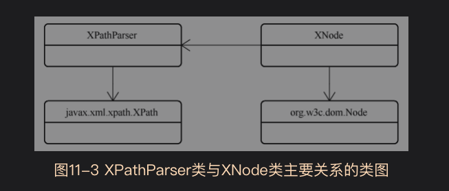

# 11.1背景知识
## 11.1.1XML文件
定义文档可以使用DTD(Document Type Definition，文档类型定义),也可以用Schema


## 11.1.2XPath
解析xml的一种方式


## 11.2XML解析
mybatis的parsing包是用来进行XML文件解析的包
*XPathParser*与*XNode*类是最为关键的类

XPathParser类内包含了XPath对象，因此具有了xml解析能力

```java
public class XPathParser {
    /**
     * 被解析的文档对象
     */
    private final Document document;
    /**
     * 是否开启验证
     */
    private boolean validation;

    /**
     * 通过EntityResolver可以申明寻找DTD文件的方法，例如通过本地寻找，而不是只能通过网络下载DTD文件
     */
    private EntityResolver entityResolver;
    /**
     * Mybatis配置文件的properties节点信息
     */
    private Properties variables;
    /**
     * XPath xml文件解析工具对象
     */
    private XPath xpath;
}
```
XPathParser具有多个重载的构造方法，还提供了XML文档中节点解析功能的"eval*"方法
最终都会调用如下方法,通过XPath解析xml文件内容
```
private Object evaluate(String expression, Object root, QName returnType) {
    try {
      //对指定节点root运行解析语法expression，获得returnType类型的解析结果
      return xpath.evaluate(expression, root, returnType);
    } catch (Exception e) {
      throw new BuilderException("Error evaluating XPath.  Cause: " + e, e);
    }
  }
```

同样的XNode类是org.w3c.dom.Node类的包装类，只是多了一些属性。

```java
/**
 * 本质上是对Node对象的包装类，多提供了一个属性
 * @author Clinton Begin
 */
public class XNode {
    //表示XML文件的一个节点
    private final Node node;
    //节点名,可以从Node中获取
    private final String name;
    //节点体,可以从Node中获取
    private final String body;
    //节点属性，可以从Node中获取
    private final Properties attributes;
    //Mybatis配置文件中的properties节点属性
    private final Properties variables;
    //XML解析器
    private final XPathParser xpathParser;
}
```
XNode类同样封装了很多"get*"和"eval*"方法,从而能够解析自身节点内的信息

# 11.3文档解析中的变量替换
Mybatis配置文件中properties节点会在解析配置文件的最开始就被解析,以供解析后续节点时发挥作用.
那么这个是如何实现的呢?

*PropertyParser*是属性解析器，能够基于mybatis配置文件的属性信息进行解析


下面以*GenericTokenParser*为例讲解，它是一个通用的占位符解析器
* 不仅可以用来解析mybatis配置文件的占位符
* SQL语句的解析，例如SQL语句中的"${","}"占位符


```java
/**
 * 标记处理器接口
 */
public interface TokenHandler {
  /**
   * 输入变量名称，返回变量值
   */
  String handleToken(String content);
}
```

```java
/**
 * 示例
 * 假设openToken="＃{", closeToken="}”，
 * 向 GenericTokenParser中的 parse方法传入的参数为
 * “jdbc：mysql：//127.0.0.1：3306/${dbname}？serverTimezone=UTC”，
 * 则 parse方法会将被“＃{”和“}”包围的 dbname 字符串解析出来，
 * 作为输入参数传入 handler 中的handleToken方法，
 * 然后用 handleToken方法的返回值替换“${dbname}”字符串。
 * @author Clinton Begin
 */
public class GenericTokenParser {
    //占位符的起始标志
    private final String openToken;
    //占位符的结束标志
    private final String closeToken;
    //占位符处理器
    private final TokenHandler handler;

    /**
     * 解析算法
     * 该解析方法主要完成占位符的定位问题，具体替换工作交给TokenHandler处理
     *
     * 示例
     * 假设openToken="＃{", closeToken="}”，
     * 向 GenericTokenParser中的 parse方法传入的参数为
     * “jdbc：mysql：//127.0.0.1：3306/${dbname}？serverTimezone=UTC”，
     * 则 parse方法会将被“＃{”和“}”包围的 dbname 字符串解析出来，
     * 作为输入参数传入 handler 中的handleToken方法，
     * 然后用 handleToken方法的返回值替换“${dbname}”字符串。
     *
     * 这个解析方法貌似不支持嵌套表达式,形如"${a${w}c}"
     * @param text
     * @return
     */
    public String parse(String text) {
        //这里省略
    }
}
```

PropertyParser类的内部类VariableTokenHandler继承了TokenHandler该接口
VariableTokenHandler可以支持键的默认值，形如"${key:defaultValue}"里的"key:defaultValue"的处理

直接看源码吧，一幕了然。不再过于描述了
```java
public class PropertyParser {

  private static final String KEY_PREFIX = "org.apache.ibatis.parsing.PropertyParser.";
  /**
   * The special property key that indicate whether enable a default value on placeholder.
   * <p>
   *   The default value is {@code false} (indicate disable a default value on placeholder)
   *   If you specify the {@code true}, you can specify key and default value on placeholder (e.g. {@code ${db.username:postgres}}).
   * </p>
   * @since 3.4.2
   */
  public static final String KEY_ENABLE_DEFAULT_VALUE = KEY_PREFIX + "enable-default-value";

  /**
   * The special property key that specify a separator for key and default value on placeholder.
   * <p>
   *   The default separator is {@code ":"}.
   * </p>
   * @since 3.4.2
   */
  public static final String KEY_DEFAULT_VALUE_SEPARATOR = KEY_PREFIX + "default-value-separator";

  private static final String ENABLE_DEFAULT_VALUE = "false";
  private static final String DEFAULT_VALUE_SEPARATOR = ":";

  private PropertyParser() {
    // Prevent Instantiation
  }

  public static String parse(String string, Properties variables) {
    VariableTokenHandler handler = new VariableTokenHandler(variables);
    GenericTokenParser parser = new GenericTokenParser("${", "}", handler);
    return parser.parse(string);
  }

  private static class VariableTokenHandler implements TokenHandler {
    //输入的属性变量，HashTable的子类
    private final Properties variables;
    //是否启用默认值
    private final boolean enableDefaultValue;
    //如果启用默认值,用于表示键和默认值之间的分隔符
    private final String defaultValueSeparator;

    private VariableTokenHandler(Properties variables) {
      this.variables = variables;
      this.enableDefaultValue = Boolean.parseBoolean(getPropertyValue(KEY_ENABLE_DEFAULT_VALUE, ENABLE_DEFAULT_VALUE));
      this.defaultValueSeparator = getPropertyValue(KEY_DEFAULT_VALUE_SEPARATOR, DEFAULT_VALUE_SEPARATOR);
    }

    private String getPropertyValue(String key, String defaultValue) {
      return (variables == null) ? defaultValue : variables.getProperty(key, defaultValue);
    }

    /**
     * 如果启用默认值，就会形如"key:defaultValue"格式
     * 如果没有启用默认值，就会形如"key"格式
     * @param content
     * @return
     */
    @Override
    public String handleToken(String content) {
      if (variables != null) {
        String key = content;
        if (enableDefaultValue) {
          //寻找是否有默认分隔符
          final int separatorIndex = content.indexOf(defaultValueSeparator);
          String defaultValue = null;
          if (separatorIndex >= 0) {
            //分隔符之前是键
            key = content.substring(0, separatorIndex);
            //分隔符之后是默认值
            defaultValue = content.substring(separatorIndex + defaultValueSeparator.length());
          }
          if (defaultValue != null) {
            return variables.getProperty(key, defaultValue);
          }
        }
        if (variables.containsKey(key)) {
          return variables.getProperty(key);
        }
      }
      //没有发现,就原样返回
      return "${" + content + "}";
    }
  }

}
```


