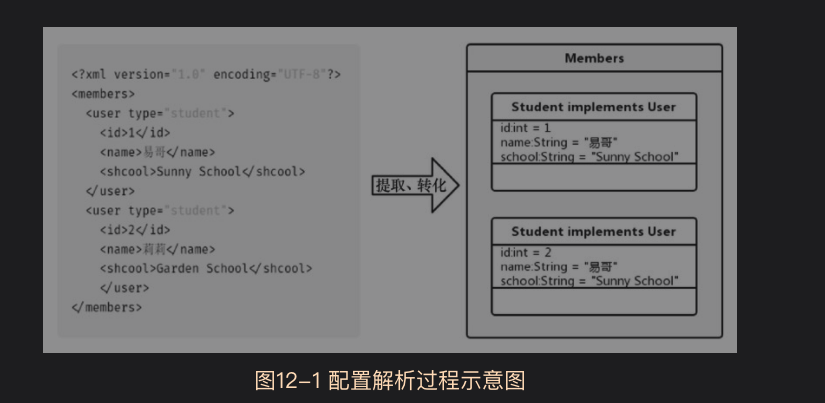
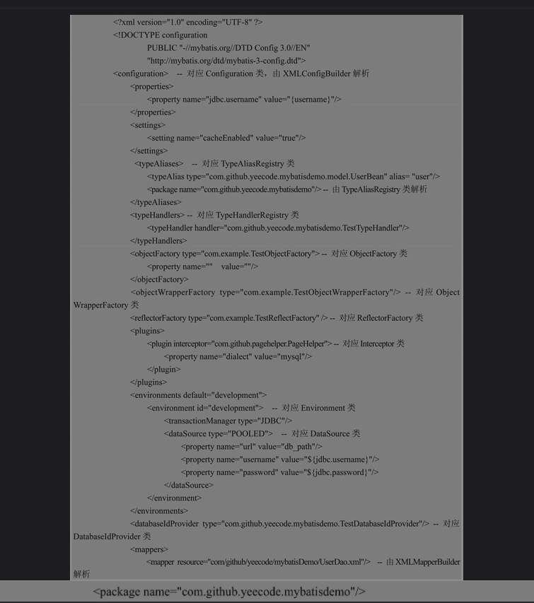
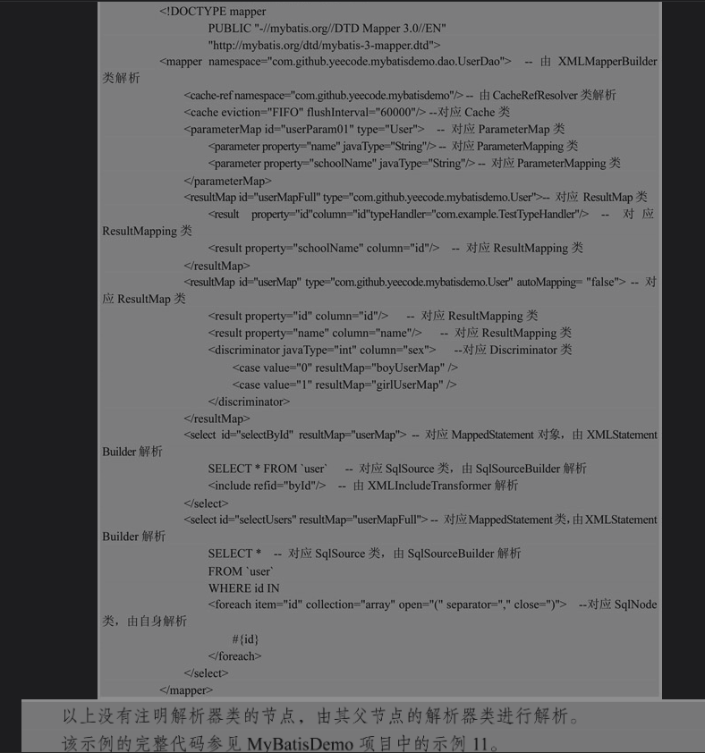

mybatis的配置主要依赖两个文件
* 配置文件，包含mybatis的基本配置信息
* 映射文件，设置java对象和数据库属性之间的映射关系

*配置解析的过程实际上就是将配置信息提取、转化，最终在java对象中保存的过程*

依照此思路，可以将与配置解析相关的类分为两种
* 解析器类：提供配置的解析功能，负责完成配置信息的提取，转化，
  例如XMLConfigBuilder,XMLMappingBuilder,CacheRefResolver,XMLStatementBuilder
* 解析实体类:提供配置的保存功能。
  例如Configuration，ReflectorFactory，Environment，DataSource,
  ParameterMap,ParameterMapping,Discriminator,SqlNode

当然也有可能一些类既是解析实体类，又是解析器类  

mybatis配置文件各个节点对应的解析器类和解析示例类标注如下

映射文件节点对应的解析器类和解析实体类标注如下

总结：阅读其他开源项目的配置解析类源码时，也可以参考以下方法
* 从类的角度分析，将源码中的解析器类和解析实体类划分出来
* 从配置文件的角度分析，将各个配置信息对应的解析器类和解析实体类找出来

