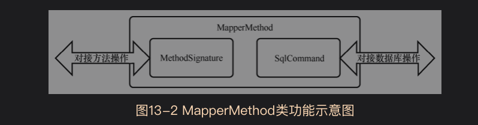

binding包是主要用来处理Java方法与SQL语句之间绑定关系的包


所以binding包主要具有以下两个功能
* 为映射接口中的抽象方法接入对应的数据库操作
* 维护映射接口中抽象方法与数据库操作节点之间的关联关系


# 13.1数据库操作的接入
先来分析为映射接口的抽象方法接入对应的数据库操作
主要通过基于反射的动态代理原理实现的(10.1.3节里有介绍)

*13数据库操作接入相关类的类图*


# 13.1.1数据库操作的方法化
要想将一个数据库操作接入一个抽象方法中，首先要做的就是将数据库操作节点转化为一个方法，而*MapperMethod*类
就表示数据库操作转化后的方法。
每个MappingMethod对象对应了一个数据库操作节点，调用MapperMethod实例中的execute方法就可以触发节点中的SQL语句

MapperMethod类有两个属性，两个内部类MethodSignature类和SqlCommand类

MethodSignature内部类指代一个具体方法的签名.
```java
public static class MethodSignature {
    //该方法返回类型是否为集合类型
    private final boolean returnsMany;
    //该方法返回类型是否为map
    private final boolean returnsMap;
    //该方法返回类型是否为空
    private final boolean returnsVoid;
    //该方法返回类型是否是游标类型
    private final boolean returnsCursor;
    //该方法返回类型是否为Optional类型
    private final boolean returnsOptional;
    //该方法返回类型
    private final Class<?> returnType;
    //如果该方法返回类型为map，则这里记录所有map的key
    private final String mapKey;
    //特殊参数处理，resultHandler参数的位置
    private final Integer resultHandlerIndex;
    //特殊参数处理，rowBounds参数的位置
    private final Integer rowBoundsIndex;
    //参数名称解析器
    private final ParamNameResolver paramNameResolver;

    public MethodSignature(Configuration configuration, Class<?> mapperInterface, Method method) {
        Type resolvedReturnType = TypeParameterResolver.resolveReturnType(method, mapperInterface);
        if (resolvedReturnType instanceof Class<?>) {
            this.returnType = (Class<?>) resolvedReturnType;
        } else if (resolvedReturnType instanceof ParameterizedType) {
            this.returnType = (Class<?>) ((ParameterizedType) resolvedReturnType).getRawType();
        } else {
            this.returnType = method.getReturnType();
        }
        this.returnsVoid = void.class.equals(this.returnType);
        this.returnsMany = configuration.getObjectFactory().isCollection(this.returnType) || this.returnType.isArray();
        this.returnsCursor = Cursor.class.equals(this.returnType);
        this.returnsOptional = Optional.class.equals(this.returnType);
        this.mapKey = getMapKey(method);
        this.returnsMap = this.mapKey != null;
        this.rowBoundsIndex = getUniqueParamIndex(method, RowBounds.class);
        this.resultHandlerIndex = getUniqueParamIndex(method, ResultHandler.class);
        this.paramNameResolver = new ParamNameResolver(configuration, method);
    }
}
```
SqlCommand内部类指代一条SQL语句。

```java
public static class SqlCommand {
    //SQL语句的名称
    private final String name;
    //SQL语句的种类
    private final SqlCommandType type;

    public SqlCommand(Configuration configuration, Class<?> mapperInterface, Method method) {
      final String methodName = method.getName();
      final Class<?> declaringClass = method.getDeclaringClass();
      MappedStatement ms = resolveMappedStatement(mapperInterface, methodName, declaringClass,
          configuration);
      if (ms == null) {
        if (method.getAnnotation(Flush.class) != null) {
          name = null;
          type = SqlCommandType.FLUSH;
        } else {
          throw new BindingException("Invalid bound statement (not found): "
              + mapperInterface.getName() + "." + methodName);
        }
      } else {
        name = ms.getId();
        type = ms.getSqlCommandType();
        if (type == SqlCommandType.UNKNOWN) {
          throw new BindingException("Unknown execution method for: " + name);
        }
      }
    }

    public String getName() {
      return name;
    }

    public SqlCommandType getType() {
      return type;
    }

    /**
     * 找出指定接口指定方法对应的MappedStatement类
     * @param mapperInterface 映射接口
     * @param methodName 映射接口中具体操作方法名
     * @param declaringClass 操作方法所在的类。一般是映射接口本身,也可能是映射接口的父类
     * @param configuration mybatis全局配置信息
     * @return 对象
     */
    private MappedStatement resolveMappedStatement(Class<?> mapperInterface, String methodName,
                                                   Class<?> declaringClass, Configuration configuration) {
        //数据库操作语句的编号:"接口名.方法名"
        String statementId = mapperInterface.getName() + "." + methodName;
        //configuration保存了解析后的所有操作语句,去查找该语句
        if (configuration.hasStatement(statementId)) {
            return configuration.getMappedStatement(statementId);
        } else if (mapperInterface.equals(declaringClass)) {
            //递归结束，仍然没有找到匹配的结果
            return null;
        }
        //从方法的定义类开始，沿着父类向上寻找。找到接口类时停止
        for (Class<?> superInterface : mapperInterface.getInterfaces()) {
            if (declaringClass.isAssignableFrom(superInterface)) {
                MappedStatement ms = resolveMappedStatement(superInterface, methodName,
                    declaringClass, configuration);
                if (ms != null) {
                    return ms;
                }
            }
        }
        return null;
    }
  }
```


还有一个内部类ParamMap，是HashMap的子类，但是更为严格，get方法重载了，具体看源码，当获取不存在的键值时，直接抛出异常。

从MapperMethod源码中的两个基本属性可以看出MapperMethod将一个数据库操作语句和一个java方法绑定在了一起
它的内部类MethodSignature属性保存了这个方法的详细信息；
它的SqlCommand属性持有这个方法对应的SQL语句


只要调用了MapperMethod对象的execute方法，就可以随之触发具体的数据库操作.

## 13.1.2数据库操作方法的接入

# 13.2抽象方法与数据库操作节点的关联

# 13.3数据库操作接入总结

## 13.3.1初始化阶段

## 13.3.2数据读写阶段

# 13.4MyBatis与Spring、Spring Boot的整合


