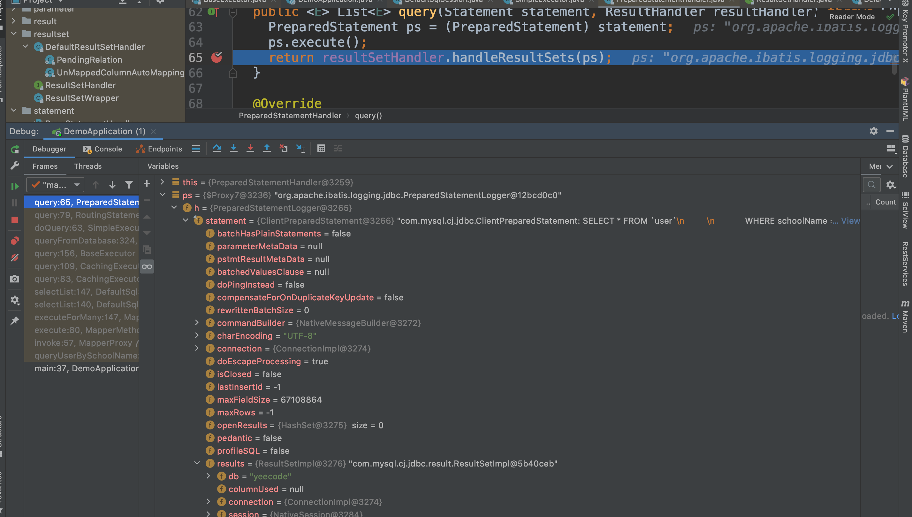
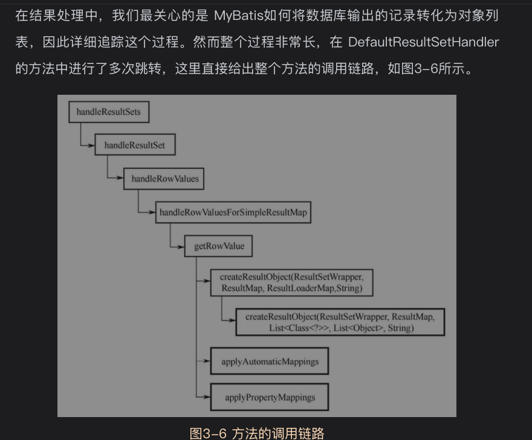

#
纯粹的mybatis spring boot项目

最简单的mybatis项目主体源码
```java
@SpringBootApplication
public class DemoApplication {
    public static void main(String[] args) {
        // 第一阶段：MyBatis的初始化阶段
        String resource = "mybatis-config.xml";
        // 得到配置文件的输入流
        InputStream inputStream = null;
        try {
            inputStream = Resources.getResourceAsStream(resource);
        } catch (IOException e) {
            e.printStackTrace();
        }
        // 得到SqlSessionFactory
        SqlSessionFactory sqlSessionFactory =
                new SqlSessionFactoryBuilder().build(inputStream);

        // 第二阶段：数据读写阶段
        try (SqlSession session = sqlSessionFactory.openSession()) {
            // 找到接口对应的实现
            UserMapper userMapper = session.getMapper(UserMapper.class);
            // 组建查询参数
            User userParam = new User();
            userParam.setSchoolName("Sunny School");
            // 调用接口展开数据库操作
            List<User> userList =  userMapper.queryUserBySchoolName(userParam);
            // 打印查询结果
            for (User user : userList) {
                System.out.println("name : " + user.getName() + " ;  email : " + user.getEmail());
            }
        }
    }
}
```
mybatis的操作主要分为两大阶段

* 1.mybatis初始化阶段,用来完成mybatis运行环境的准备工作，只在mybatis启动时运行一次
* 2.数据读写阶段。该阶段由业务系统数据读写操作触发，完成CRUD等数据库操作

# 3.1初始化阶段追踪

主要工作
* 配置文件解析
* 数据库连接

## 3.1.1静态代码块执行
## 3.1.2获取InputStream
```
// 第一阶段：MyBatis的初始化阶段
        String resource = "mybatis-config.xml";
        // 得到配置文件的输入流
        InputStream inputStream = null;
        try {
            inputStream = Resources.getResourceAsStream(resource);
        } catch (IOException e) {
            e.printStackTrace();
        }
```


io包下的*Resource*类和*ClassLoaderWrapper*类，通过类加载器加载外部文件

ClassLoaderWrapper核心源码解析
2个属性值
```shell
ClassLoader defaultClassLoader;
ClassLoader systemClassLoader;
```
4个核心方法
getResourceAsStream(String resource, ClassLoader[] classLoader)
getResourceAsURL(String resource, ClassLoader[] classLoader)
classForName(String name, ClassLoader[] classLoader)
ClassLoader[] getClassLoaders(ClassLoader classLoader)


另一个问题,会有些类加载器会尝试加载呢
*ClassLoaderWrapper*类加载器顺序
```
ClassLoader[] getClassLoaders(ClassLoader classLoader) {
    return new ClassLoader[]{
        classLoader,
        defaultClassLoader,
        Thread.currentThread().getContextClassLoader(),
        getClass().getClassLoader(),
        systemClassLoader};
  }
```
查看类加载器顺序值,3ClassLoaderWrapper的classloader数组列表值

defaultClassLoader属性值默认为空,可以手动设置该属性

## 3.1.3配置信息读取
```
// 得到SqlSessionFactory
        SqlSessionFactory sqlSessionFactory =
                new SqlSessionFactoryBuilder().build(inputStream);
```
*SqlSessionFactoryBuilder*类build方法核心逻辑
```
public SqlSessionFactory build(InputStream inputStream, String environment, Properties properties) {
    try {
      XMLConfigBuilder parser = new XMLConfigBuilder(inputStream, environment, properties);
      return build(parser.parse());
    } catch (Exception e) {
      throw ExceptionFactory.wrapException("Error building SqlSession.", e);
    } finally {
      ErrorContext.instance().reset();
      try {
        inputStream.close();
      } catch (IOException e) {
        // Intentionally ignore. Prefer previous error.
      }
    }
  }
```
核心逻辑
* 先生成XMLConfigBuilder对象，并调用其parse方法，得到一个*Configuration*对象
  Configuration这是个核心类，配置信息类，配置文件中的所有信息都会存储到该对象中
* 调用SqlSessionFactoryBuilder自身的build方法，传入上一步得到的Configuration对象

看一下XMLConfigurationBuilder的parse核心逻辑
```java
public class XMLConfigurationBuilder {
    public Configuration parse() {
        if (parsed) {
            throw new BuilderException("Each XMLConfigBuilder can only be used once.");
        }
        parsed = true;
        parseConfiguration(parser.evalNode("/configuration"));
        return configuration;
    }
    
    private void parseConfiguration(XNode root) {
        try {
            //issue #117 read properties first
            propertiesElement(root.evalNode("properties"));
            Properties settings = settingsAsProperties(root.evalNode("settings"));
            loadCustomVfs(settings);
            loadCustomLogImpl(settings);
            typeAliasesElement(root.evalNode("typeAliases"));
            pluginElement(root.evalNode("plugins"));
            objectFactoryElement(root.evalNode("objectFactory"));
            objectWrapperFactoryElement(root.evalNode("objectWrapperFactory"));
            reflectorFactoryElement(root.evalNode("reflectorFactory"));
            settingsElement(settings);
            // read it after objectFactory and objectWrapperFactory issue #631
            environmentsElement(root.evalNode("environments"));
            databaseIdProviderElement(root.evalNode("databaseIdProvider"));
            typeHandlerElement(root.evalNode("typeHandlers"));
            mapperElement(root.evalNode("mappers"));
        } catch (Exception e) {
            throw new BuilderException("Error parsing SQL Mapper Configuration. Cause: " + e, e);
        }
    }
}  
```
可以一眼看出来parseConfiguration方法一次解析了配置文件configuration节点下的各个子节点，
包括关联了所有映射文件的mapper子节点。

进入每个子方法初步瞄一眼，最后落脚点都是将配置信息存储到Configuration对象中，
所以Configuration保存了配置文件的所有设置信息，也保存了映射文件的信息

## 3.1.4 总结
主要步骤
* 1.根据配置文件位置，获取它的输入流InputStream
* 2.从配置文件根节点开始，逐层解析配置文件所有信息(包括映射文件)，不断将
  解析结果放入到Configuration对象中
* 3.以配置好的Configuration对象为参数，获取一个SqlSessionFactory对象

# 3.2数据读写阶段追踪
## 3.2.1获取SqlSession
```
SqlSession session = sqlSessionFactory.openSession()
```
DefaultSqlSessionFactory的openSessionFromDataSource核心源码
```java
public class DefaultSqlSessionFactory implements SqlSessionFactory {
  private SqlSession openSessionFromDataSource(ExecutorType execType, TransactionIsolationLevel level, boolean autoCommit) {
    Transaction tx = null;
    try {
      final Environment environment = configuration.getEnvironment();
      final TransactionFactory transactionFactory = getTransactionFactoryFromEnvironment(environment);
      tx = transactionFactory.newTransaction(environment.getDataSource(), level, autoCommit);
      final Executor executor = configuration.newExecutor(tx, execType);
      return new DefaultSqlSession(configuration, executor, autoCommit);
    } catch (Exception e) {
      closeTransaction(tx); // may have fetched a connection so lets call close()
      throw ExceptionFactory.wrapException("Error opening session.  Cause: " + e, e);
    } finally {
      ErrorContext.instance().reset();
    }
  }
}

```
## 3.2.2映射接口文件与映射文件的绑定
再重新强调一遍,映射接口文件是指UserMapper.java等有接口定义的java文件
而映射文件是指UserMapper.xml等包含SQL语句的xml文件(当然现在也支持注解方式了)
```
// 找到接口对应的实现
UserMapper userMapper = session.getMapper(UserMapper.class);
```
查看源码可知，该方法实现是通过Configuration类的getMapper方法转接，最终进入*MapperRegistry*类中的getMapper方法
```java
public class MapperRegistry {
  public <T> T getMapper(Class<T> type, SqlSession sqlSession) {
    final MapperProxyFactory<T> mapperProxyFactory = (MapperProxyFactory<T>) knownMappers.get(type);
    if (mapperProxyFactory == null) {
      throw new BindingException("Type " + type + " is not known to the MapperRegistry.");
    }
    try {
      return mapperProxyFactory.newInstance(sqlSession);
    } catch (Exception e) {
      throw new BindingException("Error getting mapper instance. Cause: " + e, e);
    }
  }
}
```

## 3.2.3映射接口的代理
问题:业务系统中映射接口没有实现类，那么mybatis怎么


上面可以看出，最终得到的是mapperProxyFactory.newInstance(sqlSession)返回的对象
进入*MapperProxyFactory*类的newInstance方法可知,实现的是一个java的基于反射的动态代理对象
```java
public class MapperProxyFactory<T> {
  protected T newInstance(MapperProxy<T> mapperProxy) {
    return (T) Proxy.newProxyInstance(mapperInterface.getClassLoader(), new Class[] { mapperInterface }, mapperProxy);
  }

  public T newInstance(SqlSession sqlSession) {
    final MapperProxy<T> mapperProxy = new MapperProxy<>(sqlSession, mapperInterface, methodCache);
    return newInstance(mapperProxy);
  }
}
```
方法最终返回的是类似UserMapper接口的动态代理对象(类似org.apache.ibatis.binding.MapperProxy@117159c0)。


接下来样例代码操作映射接口查询
```
List<User> userList =  userMapper.queryUserBySchoolName(userParam);
```
主要就是看这个动态代理对象*MapperProxy*干了什么活呢?
查看*MapperProxy*的invoke核心方法
```java
public class MapperProxy<T> implements InvocationHandler, Serializable {
  @Override
  public Object invoke(Object proxy, Method method, Object[] args) throws Throwable {
    try {
      if (Object.class.equals(method.getDeclaringClass())) {
          //例如调用Object类的hashCode,toString等方法
        return method.invoke(this, args);
      } else if (method.isDefault()) {
          //调用default方法
        return invokeDefaultMethod(proxy, method, args);
      }
    } catch (Throwable t) {
      throw ExceptionUtil.unwrapThrowable(t);
    }
    final MapperMethod mapperMethod = cachedMapperMethod(method);
    return mapperMethod.execute(sqlSession, args);
  }
}
```

触发*MapperMethod*对象的execute方法，核心方法如下
```java
public class MapperMethod {
  public Object execute(SqlSession sqlSession, Object[] args) {
    Object result;
    switch (command.getType()) {
      case INSERT: {
        Object param = method.convertArgsToSqlCommandParam(args);
        result = rowCountResult(sqlSession.insert(command.getName(), param));
        break;
      }
      case UPDATE: {
        Object param = method.convertArgsToSqlCommandParam(args);
        result = rowCountResult(sqlSession.update(command.getName(), param));
        break;
      }
      case DELETE: {
        Object param = method.convertArgsToSqlCommandParam(args);
        result = rowCountResult(sqlSession.delete(command.getName(), param));
        break;
      }
      case SELECT:
        if (method.returnsVoid() && method.hasResultHandler()) {
          executeWithResultHandler(sqlSession, args);
          result = null;
        } else if (method.returnsMany()) {
          result = executeForMany(sqlSession, args);
        } else if (method.returnsMap()) {
          result = executeForMap(sqlSession, args);
        } else if (method.returnsCursor()) {
          result = executeForCursor(sqlSession, args);
        } else {
          Object param = method.convertArgsToSqlCommandParam(args);
          result = sqlSession.selectOne(command.getName(), param);
          if (method.returnsOptional()
                  && (result == null || !method.getReturnType().equals(result.getClass()))) {
            result = Optional.ofNullable(result);
          }
        }
        break;
      case FLUSH:
        result = sqlSession.flushStatements();
        break;
      default:
        throw new BindingException("Unknown execution method for: " + command.getName());
    }
    if (result == null && method.getReturnType().isPrimitive() && !method.returnsVoid()) {
      throw new BindingException("Mapper method '" + command.getName()
              + " attempted to return null from a method with a primitive return type (" + method.getReturnType() + ").");
    }
    return result;
  }

  private <E> Object executeForMany(SqlSession sqlSession, Object[] args) {
    List<E> result;
    Object param = method.convertArgsToSqlCommandParam(args);
    if (method.hasRowBounds()) {
      RowBounds rowBounds = method.extractRowBounds(args);
      result = sqlSession.selectList(command.getName(), param, rowBounds);
    } else {
      result = sqlSession.selectList(command.getName(), param);
    }
    // issue #510 Collections & arrays support
    if (!method.getReturnType().isAssignableFrom(result.getClass())) {
      if (method.getReturnType().isArray()) {
        return convertToArray(result);
      } else {
        return convertToDeclaredCollection(sqlSession.getConfiguration(), result);
      }
    }
    return result;
  }
}
```
会触发executeForMany方法
追踪到这里，mybatis已经完成了为映射接口注入实现的过程。
对映射接口中抽象方法的调用转变成为了对SqlSession的数据库查询操作selectList

## 3.2.4SQL语句的查找
数据库查询操作调用到了DefaultSqlSession的select方法
```java
public class DefaultSqlSession implements SqlSession {
  @Override
  public <E> List<E> selectList(String statement, Object parameter, RowBounds rowBounds) {
    try {
      MappedStatement ms = configuration.getMappedStatement(statement);
      return executor.query(ms, wrapCollection(parameter), rowBounds, Executor.NO_RESULT_HANDLER);
    } catch (Exception e) {
      throw ExceptionFactory.wrapException("Error querying database.  Cause: " + e, e);
    } finally {
      ErrorContext.instance().reset();
    }
  }
}
```
MappedStatement对象对应了我们设置的一个数据库操作节点，主要定义了数据库操作语句、输入/输出参数等信息

## 3.2.5查询结果缓存
使用*Executor*的query方法执行sql语句,该接口有两个子类
*BaseExecutor*和*CachingExecutor*类.
当前流程实际执行的是CachingExecutor方法
```java
public class CachingExecutor implements Executor {
  @Override
  public <E> List<E> query(MappedStatement ms, Object parameterObject, RowBounds rowBounds, ResultHandler resultHandler) throws SQLException {
    BoundSql boundSql = ms.getBoundSql(parameterObject);
    CacheKey key = createCacheKey(ms, parameterObject, rowBounds, boundSql);
    return query(ms, parameterObject, rowBounds, resultHandler, key, boundSql);
  }
}
```
需要注意的是*BoundSql*类是经过层层转化后去除掉if,where等标签的SQL语句，
而*CacheKey*是为该次查询操作计算出来的缓存键.
这两个类如何生成，暂时先不考虑，后续再研究，先走主流程
走到CachingExecutor的另一个query方法
```java
public class CachingExecutor implements Executor {
  @Override
  public <E> List<E> query(MappedStatement ms, Object parameterObject, RowBounds rowBounds, ResultHandler resultHandler, CacheKey key, BoundSql boundSql)
          throws SQLException {
    Cache cache = ms.getCache();
    if (cache != null) {
      flushCacheIfRequired(ms);
      if (ms.isUseCache() && resultHandler == null) {
        ensureNoOutParams(ms, boundSql);
        @SuppressWarnings("unchecked")
        List<E> list = (List<E>) tcm.getObject(cache, key);
        if (list == null) {
          list = delegate.query(ms, parameterObject, rowBounds, resultHandler, key, boundSql);
          tcm.putObject(cache, key, list); // issue #578 and #116
        }
        return list;
      }
    }
    return delegate.query(ms, parameterObject, rowBounds, resultHandler, key, boundSql);
  }
}
```
查看当前查询操作是否命中缓存，如果是，则从缓存中获取数据结果，否则，便通过delegate调用query方法。
## 3.2.6数据库查询
delegate调用的query方法再次调用Executor接口中的query方法，
这次实际调用的是BaseExecutor的query方法
```java
public class CachingExecutor implements Executor {
    @Override
    public <E> List<E> query(MappedStatement ms, Object parameter, RowBounds rowBounds, ResultHandler resultHandler, CacheKey key, BoundSql boundSql) throws SQLException {
        ErrorContext.instance().resource(ms.getResource()).activity("executing a query").object(ms.getId());
        if (closed) {
            throw new ExecutorException("Executor was closed.");
        }
        if (queryStack == 0 && ms.isFlushCacheRequired()) {
            clearLocalCache();
        }
        List<E> list;
        try {
            queryStack++;
            list = resultHandler == null ? (List<E>) localCache.getObject(key) : null;
            if (list != null) {
                handleLocallyCachedOutputParameters(ms, key, parameter, boundSql);
            } else {
                list = queryFromDatabase(ms, parameter, rowBounds, resultHandler, key, boundSql);
            }
        } finally {
            queryStack--;
        }
        if (queryStack == 0) {
            for (DeferredLoad deferredLoad : deferredLoads) {
                deferredLoad.load();
            }
            // issue #601
            deferredLoads.clear();
            if (configuration.getLocalCacheScope() == LocalCacheScope.STATEMENT) {
                // issue #482
                clearLocalCache();
            }
        }
        return list;
    }
}
```
该query方法比较杂，相对比较复杂，其中的关键操作是queryFromDatabase方法
```
list = queryFromDatabase(ms, parameter, rowBounds, resultHandler, key, boundSql);
```
```java
public abstract class BaseExecutor implements Executor {
  private <E> List<E> queryFromDatabase(MappedStatement ms, Object parameter, RowBounds rowBounds, ResultHandler resultHandler, CacheKey key, BoundSql boundSql) throws SQLException {
    List<E> list;
    localCache.putObject(key, EXECUTION_PLACEHOLDER);
    try {
      list = doQuery(ms, parameter, rowBounds, resultHandler, boundSql);
    } finally {
      localCache.removeObject(key);
    }
    localCache.putObject(key, list);
    if (ms.getStatementType() == StatementType.CALLABLE) {
      localOutputParameterCache.putObject(key, parameter);
    }
    return list;
  }
}
```
进一步看doQuery方法，实际执行的是SimpleExecutor的doQuery方法
```java
public class SimpleExecutor extends BaseExecutor {
  @Override
  public <E> List<E> doQuery(MappedStatement ms, Object parameter, RowBounds rowBounds, ResultHandler resultHandler, BoundSql boundSql) throws SQLException {
    Statement stmt = null;
    try {
      Configuration configuration = ms.getConfiguration();
      StatementHandler handler = configuration.newStatementHandler(wrapper, ms, parameter, rowBounds, resultHandler, boundSql);
      stmt = prepareStatement(handler, ms.getStatementLog());
      return handler.query(stmt, resultHandler);
    } finally {
      closeStatement(stmt);
    }
  }
}
```
生成java.sql包中Statement类，调用StatementHandler的query方法
经过RoutingStatementHandler里的delegate属性，
最终执行PreparedStatementHandler类的query方法
```java
public class PreparedStatementHandler extends BaseStatementHandler {
  @Override
  public <E> List<E> query(Statement statement, ResultHandler resultHandler) throws SQLException {
    PreparedStatement ps = (PreparedStatement) statement;
    ps.execute();
    return resultSetHandler.handleResultSets(ps);
  }
}
```
`ps.execute();`java.sql包中的PreparedStatement类执行了真正的SQL语句，
然后把执行结果交给*ResultHandler*对象处理
查询数据库结果存放在PreparedStatement对象里，层次较深,h>statement>result


这一步过程比较复杂,主要步骤如下
* 在进行数据库查询前，先查询缓存；如果确实需要查询数据库，则数据库查询之后的结果也放入缓存中
* SQL语句执行经过层层转化，依次经过MappedStatement对象，Statement对象和PreparedStatement对象，最后才得以真正执行
* 最终数据库查询得到的结果交给ResultHandler对象处理

## 3.2.7处理结果集
最终执行的方法是DefaultResultSetHandler类的handleResultSets方法
```java
public class DefaultResultSetHandler implements ResultSetHandler {
  @Override
  public List<Object> handleResultSets(Statement stmt) throws SQLException {
    ErrorContext.instance().activity("handling results").object(mappedStatement.getId());

    final List<Object> multipleResults = new ArrayList<>();

    int resultSetCount = 0;
    ResultSetWrapper rsw = getFirstResultSet(stmt);

    List<ResultMap> resultMaps = mappedStatement.getResultMaps();
    int resultMapCount = resultMaps.size();
    validateResultMapsCount(rsw, resultMapCount);
    while (rsw != null && resultMapCount > resultSetCount) {
      ResultMap resultMap = resultMaps.get(resultSetCount);
      handleResultSet(rsw, resultMap, multipleResults, null);
      rsw = getNextResultSet(stmt);
      cleanUpAfterHandlingResultSet();
      resultSetCount++;
    }

    String[] resultSets = mappedStatement.getResultSets();
    if (resultSets != null) {
      while (rsw != null && resultSetCount < resultSets.length) {
        ResultMapping parentMapping = nextResultMaps.get(resultSets[resultSetCount]);
        if (parentMapping != null) {
          String nestedResultMapId = parentMapping.getNestedResultMapId();
          ResultMap resultMap = configuration.getResultMap(nestedResultMapId);
          handleResultSet(rsw, resultMap, null, parentMapping);
        }
        rsw = getNextResultSet(stmt);
        cleanUpAfterHandlingResultSet();
        resultSetCount++;
      }
    }

    return collapseSingleResultList(multipleResults);
  }
}
```
查询出来的结果被遍历后放入到列表multipleResults中并返回

问题之mybatis如何将数据库输出的记录转化为对象列表???


重点关注最后三个方法
* createResultObject 创建输出结果对象，本示例中为User对象
* applyAutomaticMapping 在自动属性映射功能开始的情况下，该方法将数据记录的赋值给输出结果对象
* applyPropertyMapping 该方法按照用户映射设置，给输出结果对象的属性赋值

createResultObject源码
```java
public class DefaultResultSetHandler implements ResultSetHandler {
  private Object createResultObject(ResultSetWrapper rsw, ResultMap resultMap, ResultLoaderMap lazyLoader, String columnPrefix) throws SQLException {
    this.useConstructorMappings = false; // reset previous mapping result
    final List<Class<?>> constructorArgTypes = new ArrayList<>();
    final List<Object> constructorArgs = new ArrayList<>();
    Object resultObject = createResultObject(rsw, resultMap, constructorArgTypes, constructorArgs, columnPrefix);
    if (resultObject != null && !hasTypeHandlerForResultObject(rsw, resultMap.getType())) {
      final List<ResultMapping> propertyMappings = resultMap.getPropertyResultMappings();
      for (ResultMapping propertyMapping : propertyMappings) {
        // issue gcode #109 && issue #149
        if (propertyMapping.getNestedQueryId() != null && propertyMapping.isLazy()) {
          resultObject = configuration.getProxyFactory().createProxy(resultObject, lazyLoader, configuration, objectFactory, constructorArgTypes, constructorArgs);
          break;
        }
      }
    }
    this.useConstructorMappings = resultObject != null && !constructorArgTypes.isEmpty(); // set current mapping result
    return resultObject;
  }
}
```
applyAutomaticMapping核心源码
```java
public class DefaultResultSetHandler implements ResultSetHandler {
  private boolean applyAutomaticMappings(ResultSetWrapper rsw, ResultMap resultMap, MetaObject metaObject, String columnPrefix) throws SQLException {
    List<UnMappedColumnAutoMapping> autoMapping = createAutomaticMappings(rsw, resultMap, metaObject, columnPrefix);
    boolean foundValues = false;
    if (!autoMapping.isEmpty()) {
      for (UnMappedColumnAutoMapping mapping : autoMapping) {
        final Object value = mapping.typeHandler.getResult(rsw.getResultSet(), mapping.column);
        if (value != null) {
          foundValues = true;
        }
        if (value != null || (configuration.isCallSettersOnNulls() && !mapping.primitive)) {
          // gcode issue #377, call setter on nulls (value is not 'found')
          metaObject.setValue(mapping.property, value);
        }
      }
    }
    return foundValues;
  }
}
```
基本思路就是训话遍历每个属性，然后调用metaObject.setValue(mapping.property,value)语句为属性赋值

## 3.2.8总结
TODO:cj 待梳理uml时序图

在这个数据库操作阶段，mybatis完成的工作可以概述如下

* 建立连接数据库的SqlSession
* 查找当前映射接口中抽象方法对应的数据库操作节点，根据该节点生成接口的实现
* 接口的动态代理实现拦截对映射接口抽象方法的调用，并将其转化为数据查询操作
* 对数据库操作节点中的数据库操作语句进行多次处理，最终得到标准的SQL语句
* 尝试从缓冲中查找操作结果，如果找到则返回；如果找不到则继续从数据库中查询
* 从数据库中查询结果
* 处理结果集
* 建立输出对象
* 根据输出结果对输出对象的属性赋值
* 在缓冲中记录查询结果
* 返回查询结果

不懂的没关系，后面再详细阅读源代码