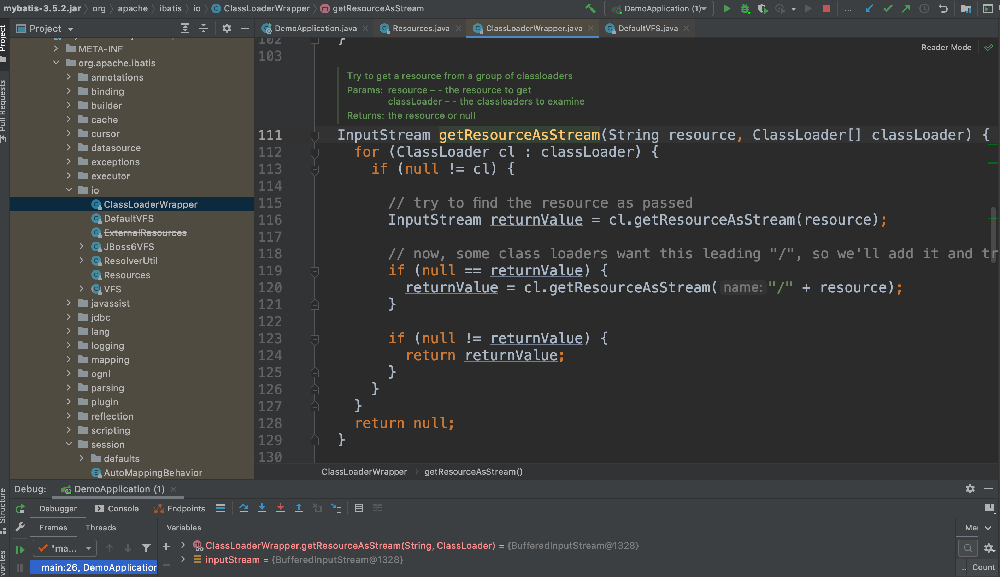
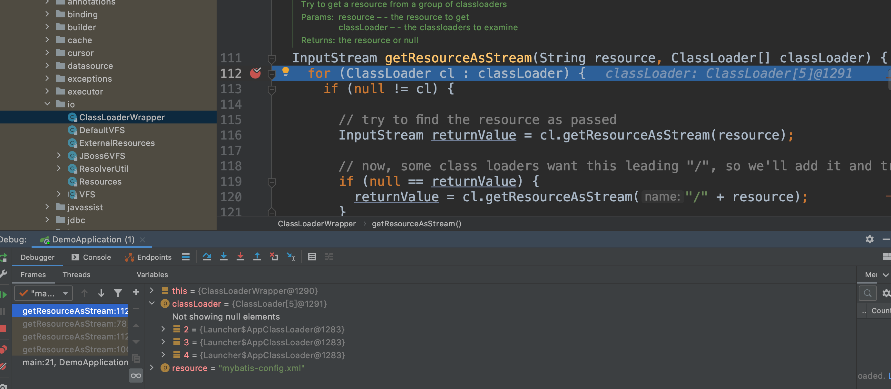

#
纯粹的mybatis spring boot项目

最简单的mybatis项目主体源码
```java
@SpringBootApplication
public class DemoApplication {
    public static void main(String[] args) {
        // 第一阶段：MyBatis的初始化阶段
        String resource = "mybatis-config.xml";
        // 得到配置文件的输入流
        InputStream inputStream = null;
        try {
            inputStream = Resources.getResourceAsStream(resource);
        } catch (IOException e) {
            e.printStackTrace();
        }
        // 得到SqlSessionFactory
        SqlSessionFactory sqlSessionFactory =
                new SqlSessionFactoryBuilder().build(inputStream);

        // 第二阶段：数据读写阶段
        try (SqlSession session = sqlSessionFactory.openSession()) {
            // 找到接口对应的实现
            UserMapper userMapper = session.getMapper(UserMapper.class);
            // 组建查询参数
            User userParam = new User();
            userParam.setSchoolName("Sunny School");
            // 调用接口展开数据库操作
            List<User> userList =  userMapper.queryUserBySchoolName(userParam);
            // 打印查询结果
            for (User user : userList) {
                System.out.println("name : " + user.getName() + " ;  email : " + user.getEmail());
            }
        }
    }
}
```
mybatis的操作主要分为两大阶段

* 1.mybatis初始化阶段,用来完成mybatis运行环境的准备工作，只在mybatis启动时运行一次
* 2.数据读写阶段。该阶段由业务系统数据读写操作触发，完成CRUD等数据库操作

# 3.1初始化阶段追踪

主要工作
* 配置文件解析
* 数据库连接

## 3.1.1静态代码块执行
## 3.1.2获取InputStream
```
// 第一阶段：MyBatis的初始化阶段
        String resource = "mybatis-config.xml";
        // 得到配置文件的输入流
        InputStream inputStream = null;
        try {
            inputStream = Resources.getResourceAsStream(resource);
        } catch (IOException e) {
            e.printStackTrace();
        }
```


io包下的*Resource*类和*ClassLoaderWrapper*类，通过类加载器加载外部文件

ClassLoaderWrapper核心源码解析
2个属性值
```shell
ClassLoader defaultClassLoader;
ClassLoader systemClassLoader;
```
4个核心方法
getResourceAsStream(String resource, ClassLoader[] classLoader)
getResourceAsURL(String resource, ClassLoader[] classLoader)
classForName(String name, ClassLoader[] classLoader)
ClassLoader[] getClassLoaders(ClassLoader classLoader)



另一个问题,会有些类加载器会尝试加载呢
*ClassLoaderWrapper*类加载器顺序
```
ClassLoader[] getClassLoaders(ClassLoader classLoader) {
    return new ClassLoader[]{
        classLoader,
        defaultClassLoader,
        Thread.currentThread().getContextClassLoader(),
        getClass().getClassLoader(),
        systemClassLoader};
  }
```
查看类加载器顺序值,3ClassLoaderWrapper的classloader数组列表值

defaultClassLoader属性值默认为空,可以手动设置该属性

## 3.1.3配置信息读取
```
// 得到SqlSessionFactory
        SqlSessionFactory sqlSessionFactory =
                new SqlSessionFactoryBuilder().build(inputStream);
```
*SqlSessionFactoryBuilder*类build方法核心逻辑
```
public SqlSessionFactory build(InputStream inputStream, String environment, Properties properties) {
    try {
      XMLConfigBuilder parser = new XMLConfigBuilder(inputStream, environment, properties);
      return build(parser.parse());
    } catch (Exception e) {
      throw ExceptionFactory.wrapException("Error building SqlSession.", e);
    } finally {
      ErrorContext.instance().reset();
      try {
        inputStream.close();
      } catch (IOException e) {
        // Intentionally ignore. Prefer previous error.
      }
    }
  }
```
核心逻辑
* 先生成XMLConfigBuilder对象，并调用其parse方法，得到一个*Configuration*对象
  Configuration这是个核心类，配置信息类，配置文件中的所有信息都会存储到该对象中
* 调用SqlSessionFactoryBuilder自身的build方法，传入上一步得到的Configuration对象

看一下XMLConfigurationBuilder的parse核心逻辑
```java
public class XMLConfigurationBuilder {
    public Configuration parse() {
        if (parsed) {
            throw new BuilderException("Each XMLConfigBuilder can only be used once.");
        }
        parsed = true;
        parseConfiguration(parser.evalNode("/configuration"));
        return configuration;
    }
    
    private void parseConfiguration(XNode root) {
        try {
            //issue #117 read properties first
            propertiesElement(root.evalNode("properties"));
            Properties settings = settingsAsProperties(root.evalNode("settings"));
            loadCustomVfs(settings);
            loadCustomLogImpl(settings);
            typeAliasesElement(root.evalNode("typeAliases"));
            pluginElement(root.evalNode("plugins"));
            objectFactoryElement(root.evalNode("objectFactory"));
            objectWrapperFactoryElement(root.evalNode("objectWrapperFactory"));
            reflectorFactoryElement(root.evalNode("reflectorFactory"));
            settingsElement(settings);
            // read it after objectFactory and objectWrapperFactory issue #631
            environmentsElement(root.evalNode("environments"));
            databaseIdProviderElement(root.evalNode("databaseIdProvider"));
            typeHandlerElement(root.evalNode("typeHandlers"));
            mapperElement(root.evalNode("mappers"));
        } catch (Exception e) {
            throw new BuilderException("Error parsing SQL Mapper Configuration. Cause: " + e, e);
        }
    }
}  
```
可以一眼看出来parseConfiguration方法一次解析了配置文件configuration节点下的各个子节点，
包括关联了所有映射文件的mapper子节点。

进入每个子方法初步瞄一眼，最后落脚点都是将配置信息存储到Configuration对象中，
所以Configuration保存了配置文件的所有设置信息，也保存了映射文件的信息

## 3.1.4 总结
主要步骤
* 1.根据配置文件位置，获取它的输入流InputStream
* 2.从配置文件根节点开始，逐层解析配置文件所有信息(包括映射文件)，不断将
  解析结果放入到Configuration对象中
* 3.以配置好的Configuration对象为参数，获取一个SqlSessionFactory对象

# 3.2数据读写阶段追踪
## 3.2.1获取SqlSession
```
SqlSession session = sqlSessionFactory.openSession()
```
DefaultSqlSessionFactory的openSessionFromDataSource核心源码
```java
public class DefaultSqlSessionFactory implements SqlSessionFactory {
  private SqlSession openSessionFromDataSource(ExecutorType execType, TransactionIsolationLevel level, boolean autoCommit) {
    Transaction tx = null;
    try {
      final Environment environment = configuration.getEnvironment();
      final TransactionFactory transactionFactory = getTransactionFactoryFromEnvironment(environment);
      tx = transactionFactory.newTransaction(environment.getDataSource(), level, autoCommit);
      final Executor executor = configuration.newExecutor(tx, execType);
      return new DefaultSqlSession(configuration, executor, autoCommit);
    } catch (Exception e) {
      closeTransaction(tx); // may have fetched a connection so lets call close()
      throw ExceptionFactory.wrapException("Error opening session.  Cause: " + e, e);
    } finally {
      ErrorContext.instance().reset();
    }
  }
}

```
## 3.2.2映射接口文件与映射文件的绑定
再重新强调一遍,映射接口文件是指UserMapper.java等有接口定义的java文件
而映射文件是指UserMapper.xml等包含SQL语句的xml文件(当然现在也支持注解方式了)
```
// 找到接口对应的实现
UserMapper userMapper = session.getMapper(UserMapper.class);
```
查看源码可知，该方法实现是通过Configuration类的getMapper方法转接，最终进入*MapperRegistry*类中的getMapper方法
```java
public class MapperRegistry {
  public <T> T getMapper(Class<T> type, SqlSession sqlSession) {
    final MapperProxyFactory<T> mapperProxyFactory = (MapperProxyFactory<T>) knownMappers.get(type);
    if (mapperProxyFactory == null) {
      throw new BindingException("Type " + type + " is not known to the MapperRegistry.");
    }
    try {
      return mapperProxyFactory.newInstance(sqlSession);
    } catch (Exception e) {
      throw new BindingException("Error getting mapper instance. Cause: " + e, e);
    }
  }
}
```

## 3.2.3映射接口的代理
问题:业务系统中映射接口没有实现类，那么mybatis怎么


上面可以看出，最终得到的是mapperProxyFactory.newInstance(sqlSession)返回的对象
进入*MapperProxyFactory*类的newInstance方法可知,实现的是一个java的基于反射的动态代理对象
```java
public class MapperProxyFactory<T> {
  protected T newInstance(MapperProxy<T> mapperProxy) {
    return (T) Proxy.newProxyInstance(mapperInterface.getClassLoader(), new Class[] { mapperInterface }, mapperProxy);
  }

  public T newInstance(SqlSession sqlSession) {
    final MapperProxy<T> mapperProxy = new MapperProxy<>(sqlSession, mapperInterface, methodCache);
    return newInstance(mapperProxy);
  }
}
```
方法最终返回的是类似UserMapper接口的动态代理对象(类似org.apache.ibatis.binding.MapperProxy@117159c0)。


接下来样例代码操作映射接口查询
```
List<User> userList =  userMapper.queryUserBySchoolName(userParam);
```
主要就是看这个动态代理对象干了什么活呢?
查看*MapperProxy*的invoke核心方法
```java
public class MapperProxy<T> implements InvocationHandler, Serializable {
  @Override
  public Object invoke(Object proxy, Method method, Object[] args) throws Throwable {
    try {
      if (Object.class.equals(method.getDeclaringClass())) {
        return method.invoke(this, args);
      } else if (method.isDefault()) {
        return invokeDefaultMethod(proxy, method, args);
      }
    } catch (Throwable t) {
      throw ExceptionUtil.unwrapThrowable(t);
    }
    final MapperMethod mapperMethod = cachedMapperMethod(method);
    return mapperMethod.execute(sqlSession, args);
  }
}
```


## 3.2.4SQL语句的查找
## 3.2.5查询结果缓存
## 3.2.6数据库查询
## 3.2.7处理结果集
## 3.2.8总结