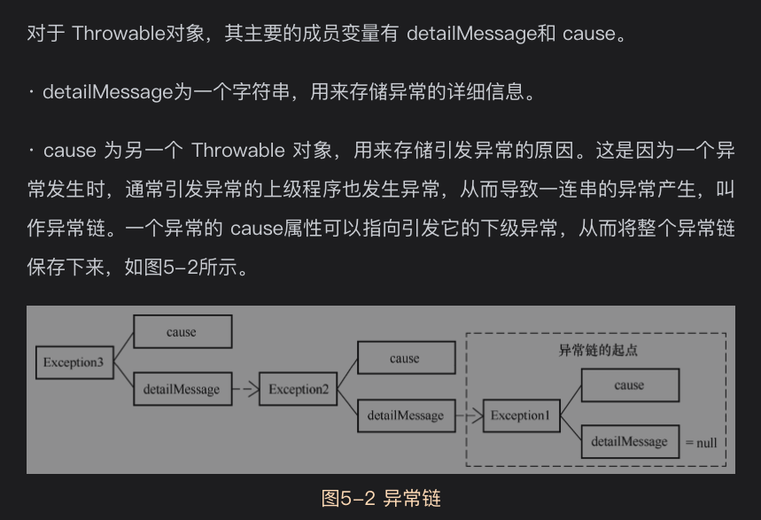
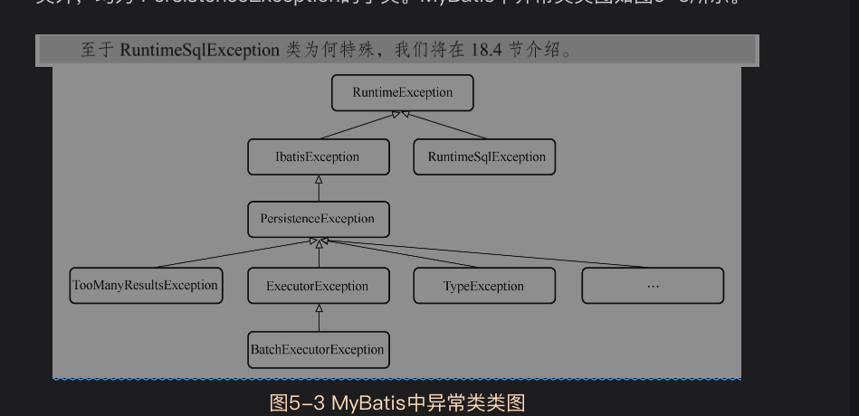
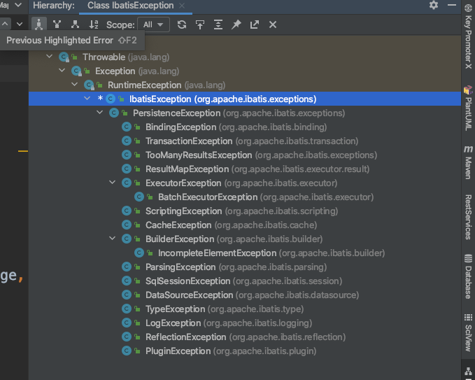

最简单的包,只有4个类

# 5.1背景知识
你需要掌握的
## 5.1.1java的异常

## 5.1.2序列化与反序列化

# 5.2Exception类
exception包包含IbatisException类，PersistenceException类和TooManyResultsException类
其他包中也有很多异常类，例如RuntimeSqlException类

# 5.3ExceptionFactory类
负责生产Exception的工厂,基于ErrorContext类生成
