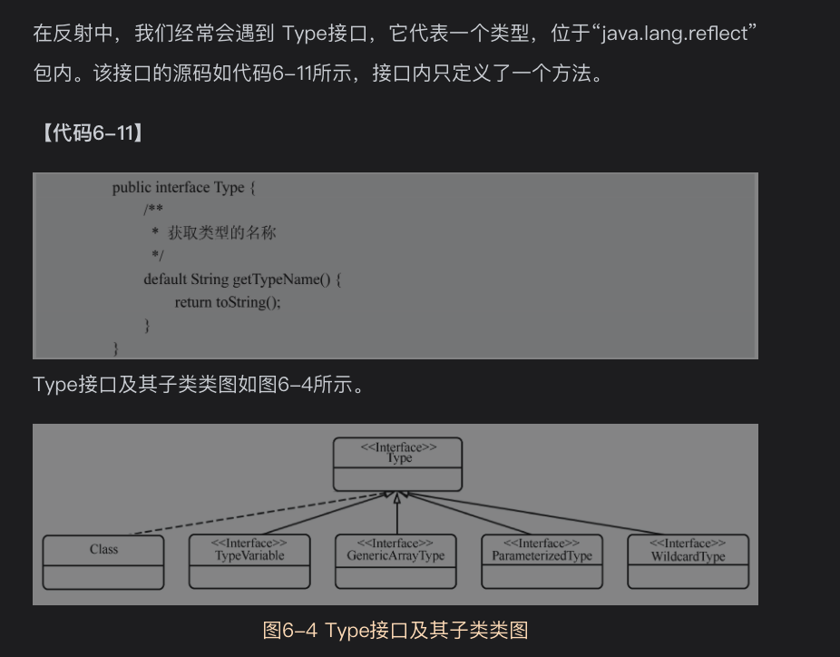
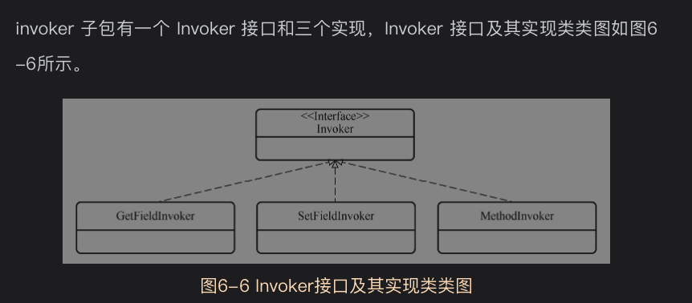
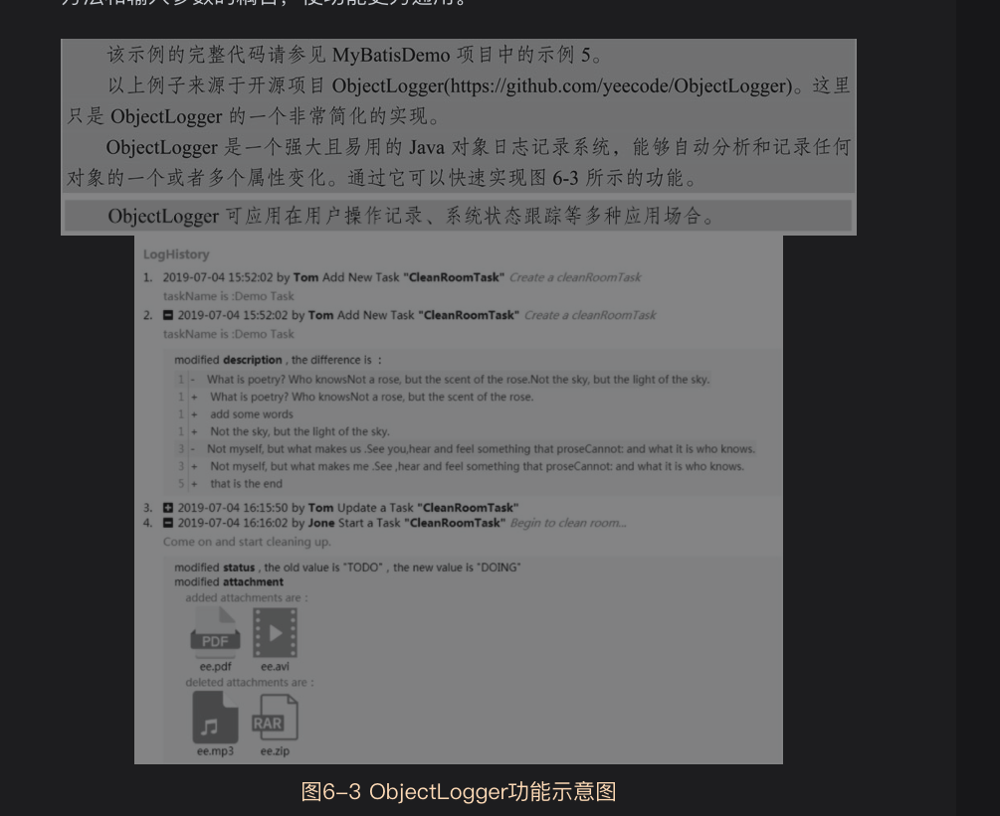

#  6.1背景知识
## 6.1.1装饰器设计模式

## 6.1.2反射

## 6.1.3Type接口及其子类
Type是一个类型接口，其子类有
* Class:表示运行的java程序中的类和接口，枚举类型(属于类)，注解(属于接口)也是Class的子类
* TypeVariable：类型变量的父接口，例如Map<K,V>中的K，V是类型变量
* GenericArrayType，代表参数化的类型，例如Collection<String>就是参数化的类型
* ParameterizedType：它表示包含ParameterizedType或者TypeVariable元素的列表
* WildcardType：表示通配符表达式，例如"?"，"? extend Number"，"? super Integer"

# 6.2对象工厂子包factory
reflection包下的factory子包是一个对象工厂自爆，用来基于反射生产出各种对象
*ObjectFactory*,
DefaultObjectFactory是默认的对象工厂实现,
对一些集合类接口进行了特殊处理,例如List,Set，SortedSet,Map接口

# 6.3执行器子包invoker
基于反射实现对象方法的调用和对象属性的读写,进一步封装和简化这些操作
Invoker接口三个实现
* GetFieldInvoker:负责对象属性的读操作
* SetFieldInvoker:负责对象属性的写操作
* MethodInvoker:负责对象其他方法的操作

接口两个方法
* invoke方法
* getType方法

# 6.4属性子包property
用来完成与对象属性相关的操作

# 6.5对象包装器子包wrapper
使用装饰器模式对各种类型的对象(包括基本Bean对象，集合对象，Map对象)进行进一步的封装,为其增加一些功能，使他们更便于使用。

# 6.6反射核心类
*Reflector*

# 6.7反射包装类

# 6.8异常拆包工具
ExceptionUtil

# 6.9参数名解析器

# 6.10泛型解析器

# 资料
[ObjectLogger业务对象日志记录系统](https://github.com/yeecode/ObjectLogger/blob/master/README_CN.md)
