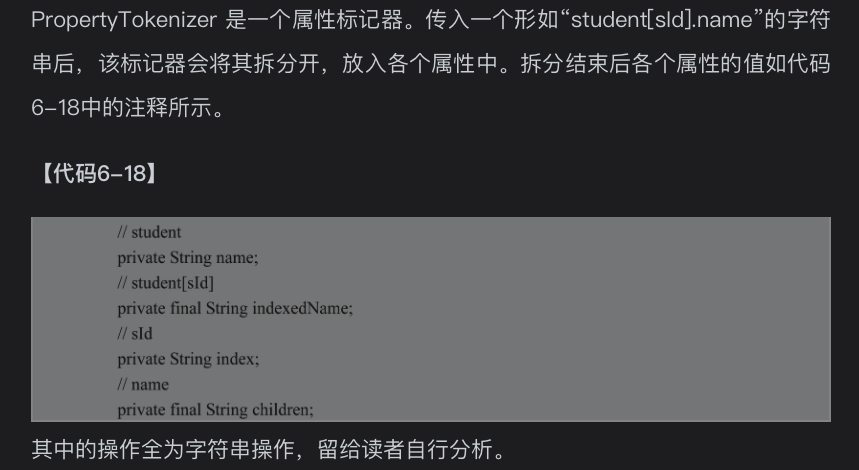
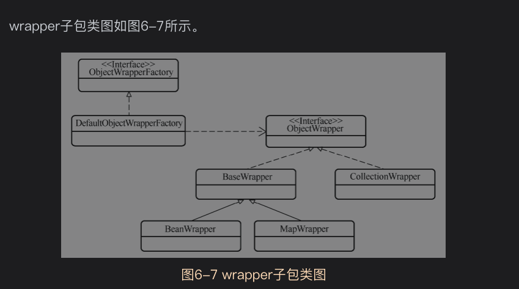
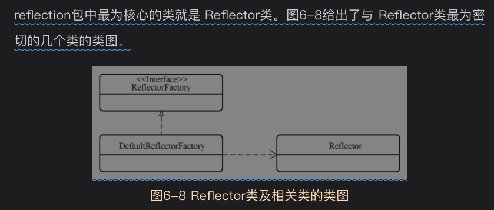
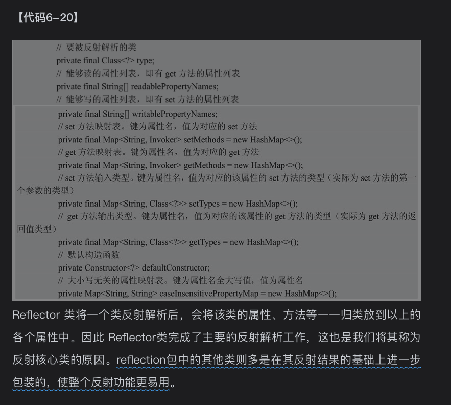
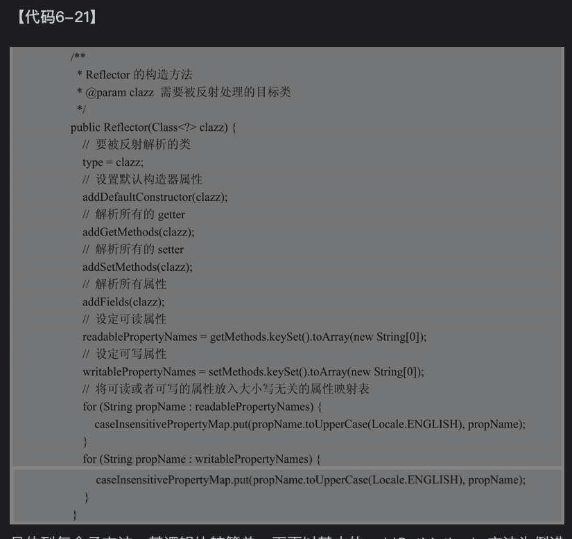

#  6.1背景知识
## 6.1.1装饰器设计模式

## 6.1.2反射

## 6.1.3Type接口及其子类
Type是一个类型接口，其子类有
* Class:表示运行的java程序中的类和接口，枚举类型(属于类)，注解(属于接口)也是Class的子类
* TypeVariable：类型变量的父接口，例如Map<K,V>中的K，V是类型变量
* ParameterizedType，代表参数化的类型，例如Collection<String>就是参数化的类型
* GenericArrayType：它表示包含ParameterizedType或者TypeVariable元素的列表
* WildcardType：表示通配符表达式，例如"?"，"? extend Number"，"? super Integer"


# 6.2对象工厂子包factory
reflection包下的factory子包是一个对象工厂自爆，用来基于反射生产出各种对象
*ObjectFactory*,
DefaultObjectFactory是默认的对象工厂实现,
对一些集合类接口进行了特殊处理,例如List,Set，SortedSet,Map接口

# 6.3执行器子包invoker
基于反射实现对象方法的调用和对象属性的读写,进一步封装和简化这些操作
Invoker接口三个实现
* GetFieldInvoker:负责对象属性的读操作
* SetFieldInvoker:负责对象属性的写操作
* MethodInvoker:负责对象其他方法的操作

接口两个方法
* invoke方法
* getType方法


# 6.4属性子包property
用来完成与对象属性相关的操作

PropertyCopier属性复制器，可以方便的将一个对象的属性复制到另一个对象中
实现原理很简单：通过反射获取当前类申明的所有属性(getDeclaredFields,不包含父类申明的属性)，然后复制给目标对象
,然后再循环遍历类的父类属性赋值给目标对象

*PropertyNamer*提供属性名称相关的操作功能，例如通过get，set方法名找出对应的属性等。
需要保证对象属性，方法命名遵循Java Bean的命名规范

*PropertyTokenizer*类是一个属性标记器。
专门处理这种规则字符串"student[sld].name",甚至可以迭代方式处理形如"a.b.c","student.teacher[sld].name"这种复杂形式字符串
例如传入一个形如"student[sld].name"的字符串后，该标记器会将其拆分开,放入各个属性中



# 6.5对象包装器子包wrapper
使用装饰器模式对各种类型的对象(包括基本Bean对象，集合对象，Map对象)进行进一步的封装,为其增加一些功能，使他们更便于使用。


ObjectWrapperFactory是对象包装器工厂的接口，
DefaultObjectWrapperFactory是它的默认实现。不过该默认实现中并没有实现任何功能，
mybatis允许用户通过配置文件中的objectWrapperFactory节点注入新的ObjectWrapperFactory

TODO:cj to be done 
# 6.6反射核心类Reflect
*Reflector*负责对一个类进行反射解析，并将解析后的结果在属性中存储起来(减少重复反射解析的消耗成本)
reflect包中的其他类多是在其反射结果的基础上进一步包装的，使整个反射功能更易用。







# 6.7反射包装类

# 6.8异常拆包工具
ExceptionUtil

# 6.9参数名解析器

# 6.10泛型解析器
*TypeParameterResolver*是泛型参数解析器，帮助mybatis推断出
属性、返回值、输入参数中泛型的具体类型。

这么说比较虚，直接看样例代码运行效果
```java
public class User<T> {
    public List<T> getInfo() {
        return null;
    }
}

public class Student extends User<Number> {

}

@SpringBootApplication
public class DemoApplication {
    public static void main(String[] args) {
        try {
            // 使用TypeParameterResolver分析User类中getInfo方法输出结果的具体类型
            Type type1 = TypeParameterResolver.resolveReturnType(User.class.getMethod("getInfo"), User.class);
            System.out.println("User类中getInfo方法的输出结果类型 :\n" + type1);

            // 使用TypeParameterResolver分析Student类中getInfo方法输出结果的具体类型
            Type type2 = TypeParameterResolver.resolveReturnType(User.class.getMethod("getInfo"), Student.class);
            System.out.println("Student类中getInfo方法的输出结果类型 :\n" + type2);
        } catch (Exception ex) {
            ex.printStackTrace();
        }
    }
}
```
执行结果
```
User类中getInfo方法的输出结果类型 :
ParameterizedTypeImpl [rawType=interface java.util.List, ownerType=null, actualTypeArguments=[class java.lang.Object]]
Student类中getInfo方法的输出结果类型 :
ParameterizedTypeImpl [rawType=interface java.util.List, ownerType=null, actualTypeArguments=[class java.lang.Number]]

Process finished with exit code 0
```
User类的getInfo方法输出参数类型是List<Object>,而
子类Student类的getInfo方法输出参数类型是List<Number>

TypeParameterResolver主要有三个方法
* resolveFieldType:解析属性的泛型
* resolveReturnType:解析方法返回值的泛型
* resolveParamTypes:解析方法输入参数的泛型

上述这三个方法都是将要解析的变量从属性、方法返回值、方法输入参数中找出来。
变量的泛型解析才是最核心的工作

以resolveParamTypes方法为例，该方法将变量从方法输入参数中找出后，对每个变量都调用了
resolveType 方法,resolveType是最重要的方法
```
/**
     * 解析方法输入参数
     *
     * @param method  目标方法
     * @param srcType 目标方法所属的类，可能是子类，也可能是父类
     * @return 解析结果
     */
    public static Type[] resolveParamTypes(Method method, Type srcType) {
        //取出方法的所有输入参数
        Type[] paramTypes = method.getGenericParameterTypes();
        //定义目标方法的类或接口
        Class<?> declaringClass = method.getDeclaringClass();
        //解析结果
        Type[] result = new Type[paramTypes.length];
        for (int i = 0; i < paramTypes.length; i++) {
            //对每个输入参数一次调用resolveType方法
            result[i] = resolveType(paramTypes[i], srcType, declaringClass);
        }
        return result;
    }
```

如果还是看不懂，没关系，直接看mybatis里面的源码


# 资料
[ObjectLogger业务对象日志记录系统](https://github.com/yeecode/ObjectLogger/blob/master/README_CN.md)
