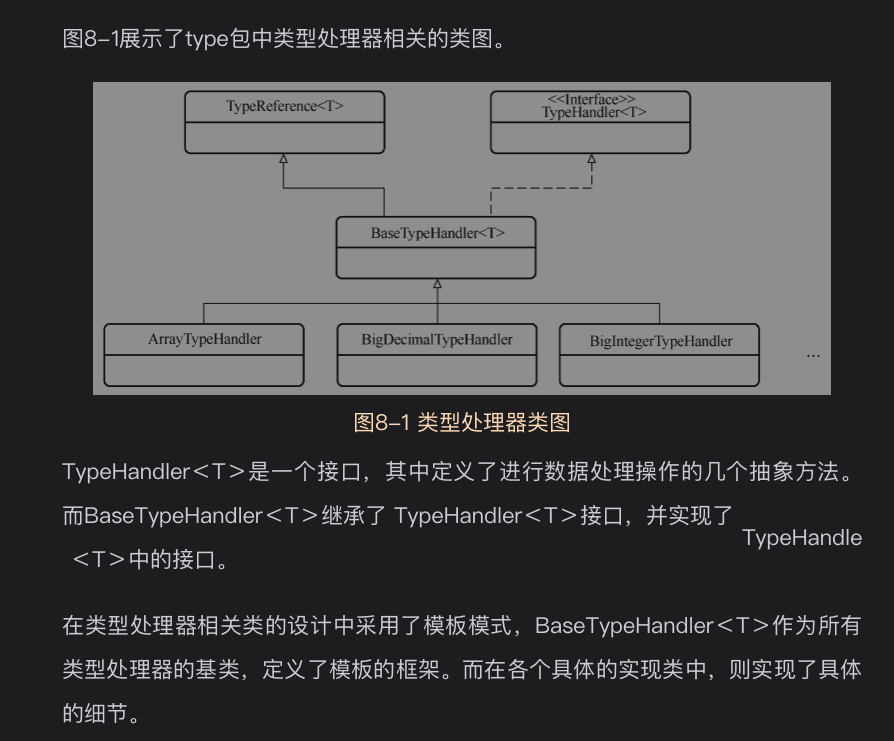

type类有55个之多，比较繁杂，此时一定要注意归类总结

经过梳理，主要分为六组
类型处理器:1个接口，1个基础实现类，1个辅助类，43个实现类
TypeHandler：类型处理器接口
BaseTypeHandler:类型处理器的基础实现
TypeReference：类型参考器
-*TypeHandler:43个类型处理器(里面ArrayTypeHandler和UnknownTypeHandler比较特别一点)

类型注册表：3个
-SimpleTypeRegistry：基本类型注册表，内部用set维护了所有java基本类型集合
-TypeAliasRegistry：类型别名注册表，内部使用hashmap维护所有类型的别名和类型的映射关系
-TypeHandlerRegistry：类型处理器注册表，内部维护所有类型和对应类型处理器的映射关系

注解类
-Alias：使用该注解可以给类设置别名，设置后，别名和类型的映射关系便存入
—MappedJdbcTypes：自定义扩展某些处理器处理某些JDBC类型，只需继承BaseTypeHandler子类，然后加上该注解，申明它要处理的JDBC类型即可
-MappedTypes：自定义扩展处理器处理某些Java类型,实现TypeHandler接口,在类上加上该注解

异常类：1个
-TypeException：表示与类型处理相关的异常

工具类：1个
ByteArrayUtils:提供数组转化的工具方法

枚举类:1个
JdbcType

# 8.1模板模式
略

# 8.2类型处理器
## 8.2.1类型处理器的基类与实现类
作为一个ORM框架,处理Java对象和数据库关系之间的映射是Mybatis工作中的重要部分。
不同类型的字段所需的读/写方法各不相同,因此需要对不同类型的字段采取相应的处理方式。

在类型处理器相关类的设计中采用了模板模式，BaseTypeHandler作为所有类型处理器的基类,定义了模板的框架.
而在各个具体的实现类中，则实现了具体的细节。

*8-1类型处理器类图*


TypeHandler接口定义
```java
public interface TypeHandler<T> {

  void setParameter(PreparedStatement ps, int i, T parameter, JdbcType jdbcType) throws SQLException;

  /**
   * @param columnName Colunm name, when configuration <code>useColumnLabel</code> is <code>false</code>
   */
  T getResult(ResultSet rs, String columnName) throws SQLException;

  T getResult(ResultSet rs, int columnIndex) throws SQLException;

  T getResult(CallableStatement cs, int columnIndex) throws SQLException;

}
```
*BaseTypeHandler*
* 模板设计模式,处理Java类型处理器的基类
* 自定义Java类型处理器，只要继承该类即可

40多个类型TypeHandler处理器中最特别的是*UnknownTypeHandler*
先通过类型处理器注册表查找对应合适的类型处理器,如果未找到，则兜底为ObjectTypeHandler

## 8.2.2TypeReference类
会有一个问题，当mybatis取到某一个TypeHandler时,却不知道它到底是用来处理哪一个Java类型的处理器?
解决方案:定义了一个TypeReference抽象类。判断该当前TypeHandler子类用来处理的目标类型。
实现简单:反射取出TypeHandler实现类中的泛型参数T的类型，这个值的类型便是TypeHandler能处理的目标类型
TypeReference getSuperclassTypeParameter方法源码
```java
public abstract class TypeReference<T> {

    private final Type rawType;

    protected TypeReference() {
        rawType = getSuperclassTypeParameter(getClass());
    }

    /**
     * 解析出当前TypeHandler实现类能够处理的目标类型
     * @param clazz TypeHandler实现类
     * @return 该TypeHandler实现类能够处理的目标类型
     */
    Type getSuperclassTypeParameter(Class<?> clazz) {
        //获取clazz类的带有泛型的直接父类
        Type genericSuperclass = clazz.getGenericSuperclass();
        if (genericSuperclass instanceof Class) {
            // try to climb up the hierarchy until meet something useful
            if (TypeReference.class != genericSuperclass) {
                //genericSuperclass不是TypeReference类本身，说明没有解析到足够上层，将clazz类的父类作为输入参数递归调用
                return getSuperclassTypeParameter(clazz.getSuperclass());
            }
            //说明clazz实现了TypeReference类,但是却没有使用泛型
            throw new TypeException("'" + getClass() + "' extends TypeReference but misses the type parameter. "
                + "Remove the extension or add a type parameter to it.");
        }
        //运行到这里说明genericSuperclass是泛型类.获取泛型的第一个参数，即T
        Type rawType = ((ParameterizedType) genericSuperclass).getActualTypeArguments()[0];
        // TODO remove this when Reflector is fixed to return Types
        if (rawType instanceof ParameterizedType) {
            //获取参数化类型的实际类型
            rawType = ((ParameterizedType) rawType).getRawType();
        }

        return rawType;
    }

    public final Type getRawType() {
        return rawType;
    }

    @Override
    public String toString() {
        return rawType.toString();
    }

}
```

# 8.3 类型注册表
现在各种类型处理器有了，那怎么快速找到数据类型对应的类型处理器呢？

这个时候就需要各种类型注册表来帮忙了
* SimpleTypeRegistry:简单类型注册表，通过set变量维护所有java基本类型
* TypeAliasRegistry：类型别名注册表，使用map维护类型别名和类型的对应关系。
* TypeHandlerRegistry:最核心

TypeHandlerRegistry类属性分析
```java
public final class TypeHandlerRegistry {
    //JDBC类型与对应类型处理器的映射
    private final Map<JdbcType, TypeHandler<?>> jdbcTypeHandlerMap = new EnumMap<>(JdbcType.class);

    //Java类型与Map<JdbcType,TypeHandler<?>>的映射
    private final Map<Type, Map<JdbcType, TypeHandler<?>>> typeHandlerMap = new ConcurrentHashMap<>();

    //未知类型的处理器
    private final TypeHandler<Object> unknownTypeHandler = new UnknownTypeHandler(this);

    //建为typeHandler.getClass(),值为typeHandler。里面存储了所有的类型处理器
    private final Map<Class<?>, TypeHandler<?>> allTypeHandlersMap = new HashMap<>();

    //空的Map<JdbcType,TypeHandler<?>>，表示该Java类型没有对应的Map<JdbcType,TypeHandler<?>>
    private static final Map<JdbcType, TypeHandler<?>> NULL_TYPE_HANDLER_MAP = Collections.emptyMap();

    //默认的枚举类型处理器
    private Class<? extends TypeHandler> defaultEnumTypeHandler = EnumTypeHandler.class;

    
}
```


# 资料