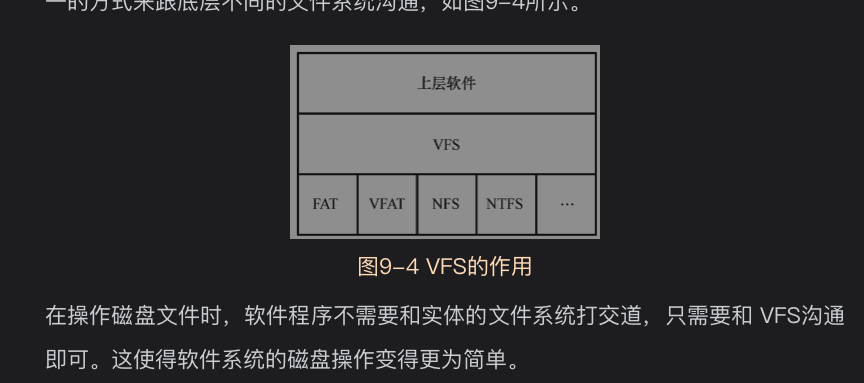
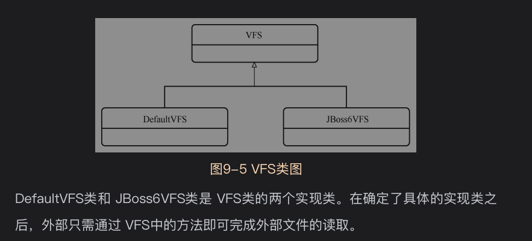
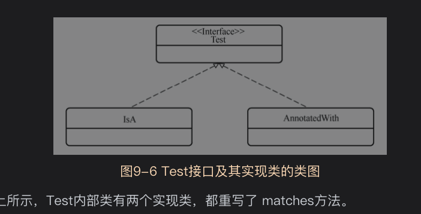

io包即输入/输出，负责完成Mybatis中与输入/输出相关的操作

* 磁盘文件读写
* 内存中类文件(class文件)操作

# 9.1背景知识
## 9.1.1单例模式
## 9.1.2代理模式(Proxy Pattern)
## 9.1.3静态代理
静态是指被代理对象和代理对象在程序中是确认的，不会在程序运行过程中发生变化

## 9.1.4VFS
VFS(Virtual File System)作为一个虚拟文件系统层将各个磁盘文件系统差异屏蔽起来，
提供了统一的操作接口


单例模式

# 9.2VFS实现类

```java
public abstract class VFS {
    /** The built-in implementations.*/
    public static final Class<?>[] IMPLEMENTATIONS = {JBoss6VFS.class, DefaultVFS.class};

    /** The list to which implementations are added by {@link #addImplClass(Class)}. */
    public static final List<Class<? extends VFS>> USER_IMPLEMENTATIONS = new ArrayList<>();

    /** 单例模式Singleton instance holder. */
    private static class VFSHolder {
        static final VFS INSTANCE = createVFS();

        @SuppressWarnings("unchecked")
        static VFS createVFS() {
            // Try the user implementations first, then the built-ins
            List<Class<? extends VFS>> impls = new ArrayList<>();
            //用户自定义优先级最高，DefaultVFS兜底,一定有效,保证一定存在有效的VFS
            impls.addAll(USER_IMPLEMENTATIONS);
            impls.addAll(Arrays.asList((Class<? extends VFS>[]) IMPLEMENTATIONS));

            // Try each implementation class until a valid one is found
            VFS vfs = null;
            for (int i = 0; vfs == null || !vfs.isValid(); i++) {
                Class<? extends VFS> impl = impls.get(i);
                try {
                    vfs = impl.newInstance();
                    if (vfs == null || !vfs.isValid()) {
                        if (log.isDebugEnabled()) {
                            log.debug("VFS implementation " + impl.getName() +
                                " is not valid in this environment.");
                        }
                    }
                } catch (InstantiationException | IllegalAccessException e) {
                    log.error("Failed to instantiate " + impl, e);
                    return null;
                }
            }

            if (log.isDebugEnabled()) {
                log.debug("Using VFS adapter " + vfs.getClass().getName());
            }

            return vfs;
        }
    }
}
```
用户自定义实现类优先级最高，DefaultVFS实现类兜底,它的isValid方法永远返回true，一定存在

## 9.2.1DefaultVFS类

* list(URL,String):列出指定url下符合条件的资源名称
* listResources(JarInputStream,String):列出给定jar包中符合条件的资源名称
* findJarForResource(URL):找出指定路径上的jar包，返回jar包的准确路径
* getPackagePath(String)：将jar包名称转为路径
* isJar:判断指定路径上是否是jar

以上方法采用直接读取文件的api方法实现，结构不复杂，但细节很多，暂时就不深入研究了.
了解主体功能就好

## 9.2.2JBoss6VFS类
JBoss是基于J2EE的开放源代码的应用服务器，JBoss6VFS是借鉴JBoss6设计的一套VFS实现类
两个内部类都是静态代理类
* VirtualFile:仿照JBoss中的VirtualFile类设计的一个功能子集
* VFS:仿照JBoss中的VFS类设计的一个功能子集

研究源码发现：这两个内部类的方法都没有实现具体的操作，而是通过静态代理模式的方式调用底层JBoss中的相关方法

如果确定代理类存在，则isValid返回true，表示JBoss6VFS可用，反之，返回false，表示JBoss6VFS不可用


# 9.3类文件加载
*ClassLoaderWrapper*
封装了5中类加载器
```
/**
   * 类加载器加载顺序
   */
  ClassLoader[] getClassLoaders(ClassLoader classLoader) {
    return new ClassLoader[]{
        classLoader,
        defaultClassLoader,
        Thread.currentThread().getContextClassLoader(),
        getClass().getClassLoader(),
        systemClassLoader};
  }
```
依次是:
* 作为参数传入的类加载器,可能为null；
* 系统默认的类加载器，如未设置则为null
* 当前线程的线程上下文中的类加载器
* 当前对象的类加载器
* 系统类加载器，在ClassLoaderWrapper的构造方法中设置

读取类文件是，依次从上诉类加载器数组中找寻，找到一个即返回结果

```
/**
   * Attempt to load a class from a group of classloaders
   *
   * @param name        - the class to load
   * @param classLoader - the group of classloaders to examine
   * @return the class
   * @throws ClassNotFoundException - Remember the wisdom of Judge Smails: Well, the world needs ditch diggers, too.
   */
  Class<?> classForName(String name, ClassLoader[] classLoader) throws ClassNotFoundException {

    for (ClassLoader cl : classLoader) {

      if (null != cl) {

        try {

          Class<?> c = Class.forName(name, true, cl);

          if (null != c) {
            return c;
          }

        } catch (ClassNotFoundException e) {
          // we'll ignore this until all classloaders fail to locate the class
        }

      }

    }

    throw new ClassNotFoundException("Cannot find class: " + name);

  }
```

# 9.4ResolverUtil类
工具类，完成类的筛选,筛选条件可以是
* 判断类是否是某个接口或类的子类(IsA)
* 类是否具有某个注解(AnnotatedWith)
类中有个一个内部类筛选器Test,matches判断指定类是否满足筛选条件

* IsA类中的matches方法可以判断目标类是否具有某个注解
* AnnotatedWith类中的matches方法可以判断目标类是否具有某个注解

ResolverUtils类中的find方法即支持筛选出指定路径下的符合指定条件的类文件
具体见源码

# 资料

  


