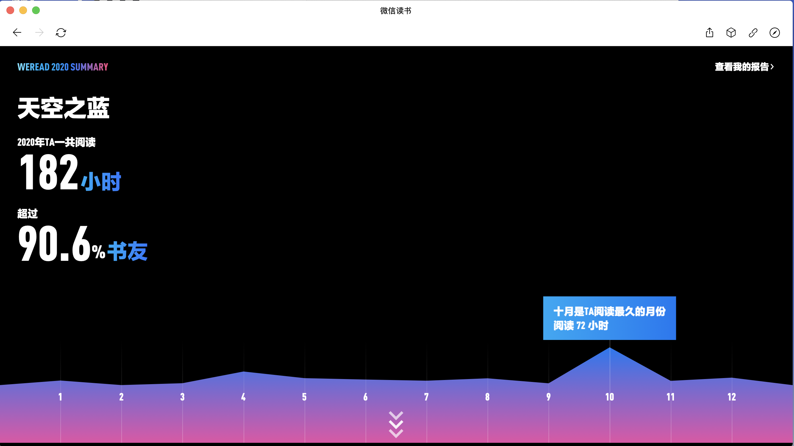
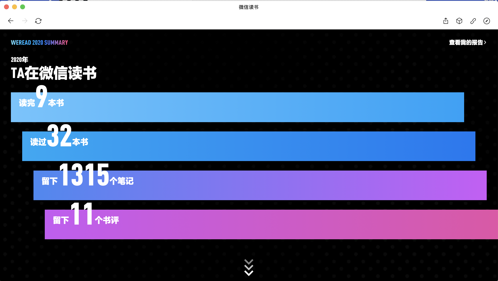
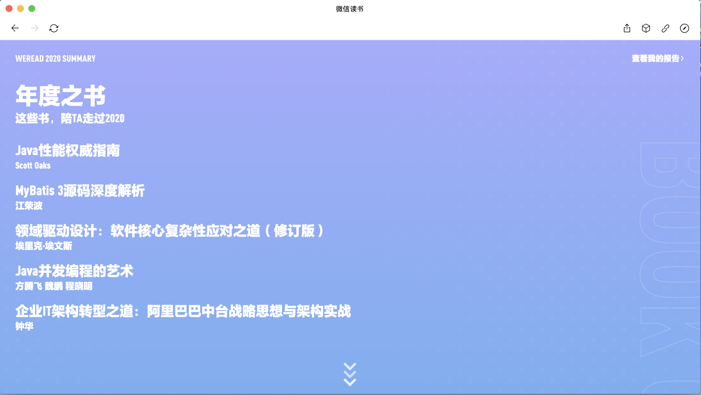

# 已读书籍列表
## 技术类
* <<领域驱动设计-软件核心复杂性应对之道>>埃里克.埃文斯(******)
* <<企业IT架构转型之道>>钟华(****)  
* <<mybatis 3源码深度解析>>江荣波(***半)
* <<java并发编程的艺术>>方腾飞，魏鹏，程晓明(***半)

### 入门类
* <<Python编程:从入门到实践>>埃里克.马瑟斯(***)
* <<Robot Framework自动化测试框架核心指南>>张永清(***)

## 个人
### 心灵鸡汤
* <<十分钟冥想>>安迪.普迪科姆(*****)

## 方法论
* <<番茄工作法图解:简单易行的时间管理方法>>史蒂夫.诺特伯格(****)

## 科学
### 科学史话
* <<上帝掷骰子吗？量子物理史话>>曹天元(******)

## 小说类
### 宇宙科幻类
* <<我真没想当救世主>>火中物(****)

## 漫画类
* <<你今天真好看>>莉兹.克里莫(***半) 忘了是什么东西

# 在读书籍列表
## 技术类
* <<java性能权威指南>>Scott Oaks(*****)
* <<高性能mysql>>(****半)
* <<MySQL技术内幕:Innodb存储引擎>>姜承尧(****半)

# 微信读书报告
## 
读书时长182h，读完9本

# 资料