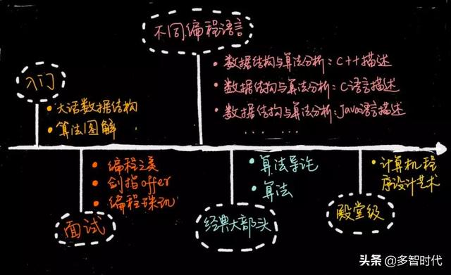

# 算法类

入门级别：《大话数据结构》和《算法图解》
面试宝典：《编程之美》、《剑指 offer》、《编程珠玑》
经典级别：《算法导论》、《算法》
殿堂级经典：计算机程序设计艺术

如果说《计算机程序设计艺术》敢称数据结构与算法界的经典书第二，应该无人敢称第一

《计算机程序设计艺术》系列著作被公认为是对经典计算机科学的论述，曾在1999年被《美国科学家》期刊评选为20世纪相当重要的12部学术专著之一。

# 链接
[算法导论吃透后的水平_市面上算法书比比皆是，究竟哪些书值得看？](https://blog.csdn.net/weixin_39588104/article/details/110867513?share_token=0d97bfe9-ce2b-41b9-abd2-624025498661)