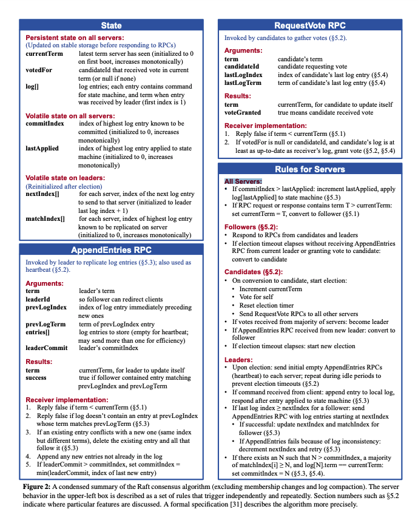
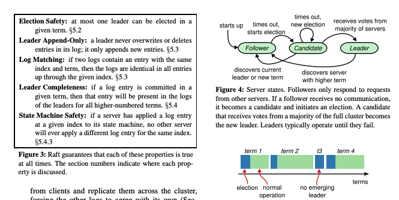

# 一种可理解的一致性算法研究（扩展版本）
Diego Ongaro and John Ousterhout
斯坦福大学

# 专有名词
* Paxos：一种一致性算法
* replicated log:复制日志
* overlapping majorities：重叠的大多数
* FSM:有限状态机
# 单词
* coherency:一致性
* coherent:有条理的，连贯的
* in spite of：尽管
* struggle:艰难行进
* decomposition:分解
* nondeterminism：非确定性
# 图重要

# 概要
Raft是一种管理复制日志的一致性算法。它等效于multi-Paxos，并且是高效的，但它的结构不同于Paxos；
相比于Paxos，Raft更易于理解，并且它为构建实际系统提供了更好的基础。
为了增强可理解性，Raft拆分了一系列保证一致性的关键元素，例如主选举，日志复制，安全性，
并且它提供了更深粒度的一致性来减少必须考虑的状态数量(相比Paxos而言)。
学习用户研究结果表明对于学生来说Raft比Paxos更容易学习。
Raft也提供了新机制来改变集群成员关系，通过使用来重叠的大多数来保证安全性。

# 介绍
一致性算法允许一系列机器以有机整体组方式协同工作，可以容忍少量机器的故障。
正因如此，它在构建大规模可靠性软件系统中扮演了关键性角色。
在过去的十多年里，Paxos在一致性算法谈论中占据了主导位置，绝大多数一致性的实现都是基于Paxos或者受其影响，
并且Paxos成为教学学生学习一致性的最主要手段。

不幸的是，Paxos相当难以理解，尽管它尝试了大量方式简化理解。
更多的是，Paxos体系若要支持实际业务系统要求复杂的变更。结果系统构建者和学生都在跟Paxos做艰苦斗争。

我们经历艰苦斗争之后，我们致力于寻找新的为搭建系统和教学提供更好基础的一致性算法。
我们的目标是不寻常的，在于我们致力于可理解性：我们能够定义设计这样一种针对实际业务系统的一致性算法嘛？
它能以比Paxos更简单易懂的方式描述。
# 参考
## 翻译
[Raft论文翻译](https://willzhuang.github.io/2018/03/04/Raft%E8%AE%BA%E6%96%87%E7%BF%BB%E8%AF%91/)

# 原文
# In Search of an Understandable Consensus Algorithm(Extended Version)
Diego Ongaro and John Ousterhout
Stanford University
# Abstract
Raft is a consensus algorithm for managing a replicated
log. It produces a result equivalent to (multi-)Paxos, and
it is as efficient as Paxos, but its structure is different
from Paxos; this makes Raft more understandable than
Paxos and also provides a better foundation for building practical systems. 
In order to enhance understandability, Raft separates the key elements of consensus, such as
leader election, log replication, and safety, and it enforces
a stronger degree of coherency to reduce the number of
states that must be considered. Results from a user study
demonstrate that Raft is easier for students to learn than
Paxos. Raft also includes a new mechanism for changing
the cluster membership, which uses overlapping majorities to guarantee safety.

# 1 Introduction
Consensus algorithms allow a collection of machines
to work as a coherent group that can survive the failures of some of its members. Because of this, they play a
key role in building reliable large-scale software systems.
Paxos [15, 16] has dominated the discussion of consensus algorithms over the last decade: most implementations
of consensus are based on Paxos or influenced by it, and
Paxos has become the primary vehicle used to teach students about consensus.

Unfortunately, Paxos is quite difficult to understand, in
spite of numerous attempts to make it more approachable.
Furthermore, its architecture requires complex changes
to support practical systems. As a result, both system
builders and students struggle with Paxos.

After struggling with Paxos ourselves, we set out to
find a new consensus algorithm that could provide a better foundation for system building and education. 
Our approach was unusual in that our primary goal was understandability: could we define a consensus algorithm for
practical systems and describe it in a way that is significantly easier to learn than Paxos? Furthermore, we wanted
the algorithm to facilitate the development of intuitions
that are essential for system builders. It was important not
just for the algorithm to work, but for it to be obvious why
it works.

The result of this work is a consensus algorithm called
Raft. In designing Raft we applied specific techniques to
improve understandability, including decomposition (Raft
separates leader election, log replication, and safety) and
state space reduction (relative to Paxos, Raft reduces the
degree of nondeterminism and the ways servers can be inconsistent with each other). A user study with 43 students
at two universities shows that Raft is significantly easier
to understand than Paxos: after learning both algorithms,
33 of these students were able to answer questions about
Raft better than questions about Paxos.

Raft is similar in many ways to existing consensus algorithms (most notably, Oki and Liskov’s Viewstamped
Replication [29, 22]), but it has several novel features:
* Strong leader: Raft uses a stronger form of leadership than other consensus algorithms. For example,
log entries only flow from the leader to other servers.
This simplifies the management of the replicated log
and makes Raft easier to understand. 
* Leader election: Raft uses randomized timers to elect leaders. 
  This adds only a small amount of mechanism to the heartbeats already required for any consensus algorithm,
  while resolving conflicts simply and rapidly.  
* Membership changes: Raft’s mechanism for
  changing the set of servers in the cluster uses a new
  joint consensus approach where the majorities of
  two different configurations overlap during transitions. This allows the cluster to continue operating
  normally during configuration changes.

We believe that Raft is superior to Paxos and other consensus algorithms, both for educational purposes and as a
foundation for implementation. It is simpler and more understandable than other algorithms; it is described completely enough to meet the needs of a practical system;
it has several open-source implementations and is used
by several companies; its safety properties have been formally specified and proven; and its efficiency is comparable to other algorithms.

The remainder of the paper introduces the replicated
state machine problem (Section 2), discusses the strengths
and weaknesses of Paxos (Section 3), describes our general approach to understandability (Section 4), presents
the Raft consensus algorithm (Sections 5–8), evaluates
Raft (Section 9), and discusses related work (Section 10).

# 2 Replicated state machines

