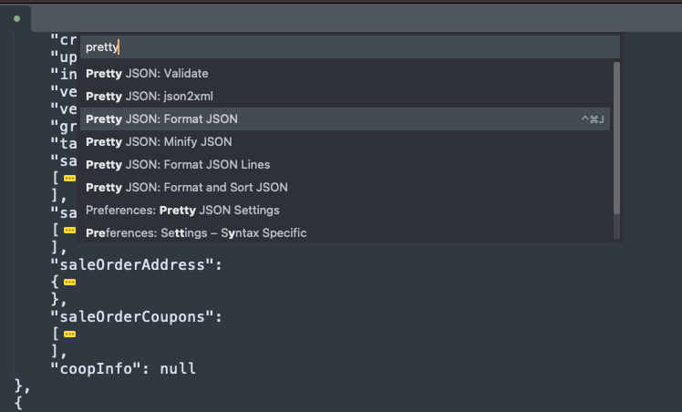

# 介绍

# 自定义快捷键
## 设置pretty json的快捷键
配置方式：Preference -> Key Bindings

右侧配置如下快捷键
```
[
	{ "keys": ["ctrl+command+j"], "command": "pretty_json" },
]
```

验证Ctrl+Shift+P 弹框中输入 Pretty Json 查看命令右侧是否存在快捷键

