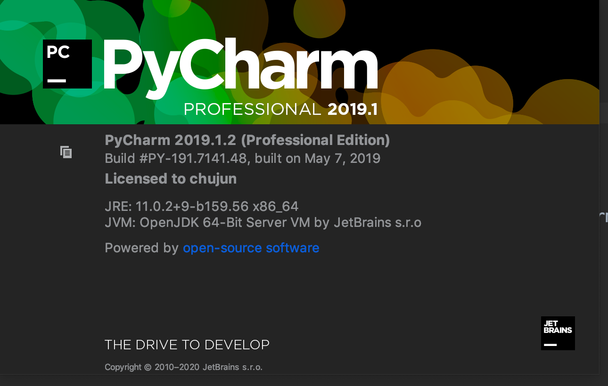

# 永久激活
# 原理
基于java agent方式实现 

# 资源准备
## jetbrains-agent.jar 位置
[jetbrains-agent.jar](jetbrains-agent.jar)

## 激活码(待定，本人实验时并不需要)
```
D00F1BDTGF-eyJsaWNlbnNlSWQiOiJEMDBGMUJEVEdGIiwibGljZW5zZWVOYW1lIjoiaHR0cHM6Ly96aGlsZS5pbyIsImFzc2lnbmVlTmFtZSI6IiIsImFzc2lnbmVlRW1haWwiOiIiLCJsaWNlbnNlUmVzdHJpY3Rpb24iOiJVbmxpbWl0ZWQgbGljZW5zZSB0aWxsIGVuZCBvZiB0aGUgY2VudHVyeS4iLCJjaGVja0NvbmN1cnJlbnRVc2UiOmZhbHNlLCJwcm9kdWN0cyI6W3siY29kZSI6IklJIiwicGFpZFVwVG8iOiIyMDg5LTA3LTA3In0seyJjb2RlIjoiUlMwIiwicGFpZFVwVG8iOiIyMDg5LTA3LTA3In0seyJjb2RlIjoiV1MiLCJwYWlkVXBUbyI6IjIwODktMDctMDcifSx7ImNvZGUiOiJSRCIsInBhaWRVcFRvIjoiMjA4OS0wNy0wNyJ9LHsiY29kZSI6IlJDIiwicGFpZFVwVG8iOiIyMDg5LTA3LTA3In0seyJjb2RlIjoiREMiLCJwYWlkVXBUbyI6IjIwODktMDctMDcifSx7ImNvZGUiOiJEQiIsInBhaWRVcFRvIjoiMjA4OS0wNy0wNyJ9LHsiY29kZSI6IlJNIiwicGFpZFVwVG8iOiIyMDg5LTA3LTA3In0seyJjb2RlIjoiRE0iLCJwYWlkVXBUbyI6IjIwODktMDctMDcifSx7ImNvZGUiOiJBQyIsInBhaWRVcFRvIjoiMjA4OS0wNy0wNyJ9LHsiY29kZSI6IkRQTiIsInBhaWRVcFRvIjoiMjA4OS0wNy0wNyJ9LHsiY29kZSI6IkdPIiwicGFpZFVwVG8iOiIyMDg5LTA3LTA3In0seyJjb2RlIjoiUFMiLCJwYWlkVXBUbyI6IjIwODktMDctMDcifSx7ImNvZGUiOiJDTCIsInBhaWRVcFRvIjoiMjA4OS0wNy0wNyJ9LHsiY29kZSI6IlBDIiwicGFpZFVwVG8iOiIyMDg5LTA3LTA3In0seyJjb2RlIjoiUlNVIiwicGFpZFVwVG8iOiIyMDg5LTA3LTA3In1dLCJoYXNoIjoiODkwNzA3MC8wIiwiZ3JhY2VQZXJpb2REYXlzIjowLCJhdXRvUHJvbG9uZ2F0ZWQiOmZhbHNlLCJpc0F1dG9Qcm9sb25nYXRlZCI6ZmFsc2V9-3OPFIX9/KSL76ctAKOwpBPCCAfUhUbucdNbtqMaTqRryvKEvrFqCKncE0eMHA2YkrcP2CtV9LKjlIXhJMqp0N821Qv1AhuIJrDMBubqiEtiqnGkcGV35DF0GzyUQaUdN6fTbZna05riHzR6yzgEzo9R3RIzCTDMQdB/0EojWM0nCBkPsLdncZeDv3+Y+VA8ZH3/BBvzwR1e0gWsT3mfT9tIvwxPuEhNrQFNOP1PZOjC8nX9h/J7ag5X3JQL1CQVi4TnEipdy0fxKbDPKTloM3Y/bA23uaW+Q/JQFBRKRR0q3FYJ1DQuSc7YmeJ7Q2IHq7u5QYz8jPZJtP6PKs6g/tQ==-MIIECDCCAfCgAwIBAgIJAI5/xwNtz47cMA0GCSqGSIb3DQEBCwUAMBgxFjAUBgNVBAMMDUpldFByb2ZpbGUgQ0EwIBcNMTgwODIzMDcwNDA3WhgPMjExODA3MzAwNzA0MDdaMBExDzANBgNVBAMMBnByb2QzeTCCASIwDQYJKoZIhvcNAQEBBQADggEPADCCAQoCggEBAOZ3WopNRg9J8k3apGYFEUGRlvkRsQnQSEz1yMKY4YWg9ElxmuF0mQRAaIj3WOl1eqTn1CXsn4vXV7GODJk9A/rCqEk960sPesWn/RVz7zo5+KazE3Y9yYtwskKxlnkFNp82Kha6dUGDSwG2lYh0Sria2ByOhgr6gmyXtC0PKqlIlTAPcBvz0MEnKTZkxfSqdiHo/meTlMRd9885vr4P52Fd9Ryxe3yVAKZSP9ZzPmRvCvgF1oGCgobZJ5d7FvTwkGt2t4pjy/RlU6FDcXNMHLk4pfJqr3lnEkAh2MbCGlGo1i6Rc6DtgISuJn2AUkrQKhI6F0U7o9e5qPEOjNkhznMCAwEAAaNaMFgwCQYDVR0TBAIwADALBgNVHQ8EBAMCBaAwHQYDVR0OBBYEFJDgSMx4XrLktYOG827wP7VULTnJMB8GA1UdIwQYMBaAFDAS51akWaJlzxC2x4yP3iAYbqtxMA0GCSqGSIb3DQEBCwUAA4ICAQBxRyfCpL7q2VurGfh9XqaC4GsGp6ut3l/rOEyc6DP148A69DRmZ7saqfZW87DcLkmcynPhyBOxdcGwtwKlR9E/+X923JeL6VPQCTY5WyJKib36vQCnoC4ELTnw1yc51v2j+MaZXjrlzBIcCUocWK14WS4iBycUwLuMszz6rJ8xluuYDKDeNcS/AjQf+yTUfDXjktHLgcE27sSEQUQ+7bpbKHkJ5xBvaupJEPX+ndj7V2eD+/sO03jgnsWVa2nky7yDXX/5KCqzL5kAA1n2t2dWSJXxpac8O2bPyRhk6dUSwzNr+IjCjHqUKIouB0nosi85Q5MaIE0pwOOSggnawpnjmL3qDnsS/n7NUcX/mF4eiNQ8cMJmKIgfS6rntKuQY2zSod+4+G0AFbiihVTnKsRf7CiJa/VniZdaGdbclT8KzRnNKJ1TrPO8rVPjg+SpvqTq75xynS08/OXCpoJ3aVeBWZJYJmheHhvJw2RiNW2P2GSIw+m6HIIsthUtvvHqdKpIaThFHAOKmw0LpPO7uGs/z/Q3un7+lqSlW7akUoSCHdiAJ4wWv+qFEgE4mq8bKtHoa9yy6FZBoORbbRTj8WkS+UvCLN5p7kZenmKYnWCzBf02O1ULpMsR5WvKCGCekSwWf3lAF9lYTL12JaFTw9iH1nSkyvcu7AoXlWI50hOhmA==
```

# 步骤
1. 先选择free体验进入pycharm
2. 创建一个项目
3.  “Help” -> “Edit Custom VM Options …”，如果提示是否要创建文件，请点”Yes”。
4. 在打开的vmoptions编辑窗口末行添加：-javaagent:你pycharm的安装目录/jetbrains-agent.jar

```
# custom PyCharm VM options
-Xms128m
-Xmx750m
-XX:ReservedCodeCacheSize=240m
-XX:+UseCompressedOops
-Dfile.encoding=UTF-8
-XX:+UseConcMarkSweepGC
-XX:SoftRefLRUPolicyMSPerMB=50
-ea
-Dsun.io.useCanonCaches=false
-Djava.net.preferIPv4Stack=true
-Djdk.http.auth.tunneling.disabledSchemes=""
-XX:+HeapDumpOnOutOfMemoryError
-XX:-OmitStackTraceInFastThrow
-Xverify:none

-XX:ErrorFile=$USER_HOME/java_error_in_pycharm_%p.log
-XX:HeapDumpPath=$USER_HOME/java_error_in_pycharm.hprof
-javaagent:/Users/chujun/my/project/gitBackupConfig/pycharm/jetbrains-agent.jar
```

5. 修改完配置文件之后重启pycharm(使得javaagent生效)
6. 输入激活码
点击菜单栏中的 “Help” -> “Register …”，选择最后一种License server激活方式，地址填入：http://jetbrains-license-server 
（报错的话，就填报错的那个地址，没有截图了），或者点击按钮：”Discover Server”来自动填充地址，完成激活
7. 查看有效期 Help->About这里可以看到你的pycharm的版本号、许可来源、有效期、以及一些环境


#参考资料
[2019Pycharm永久激活](https://www.jianshu.com/p/355a6920116f)