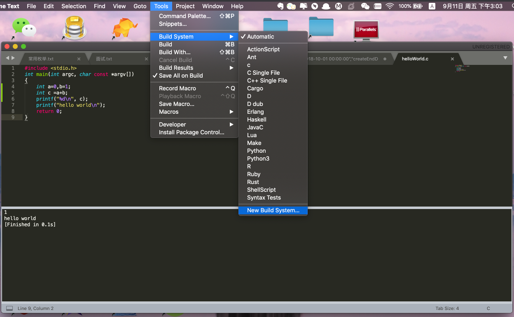
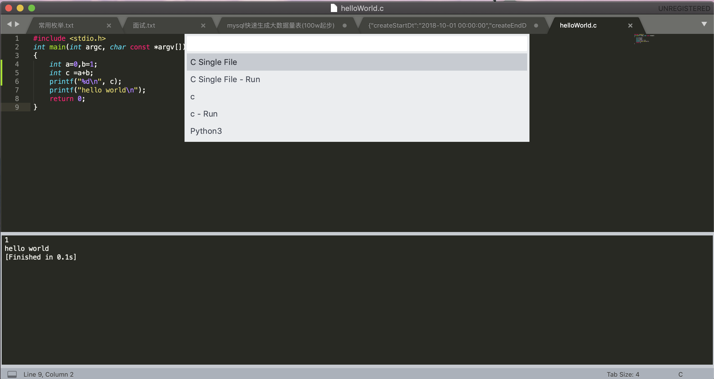

# mac搭建C开发环境简易版本
## gcc安装
* homebrew安装
* 
* gcc -v查看版本
```
chujun@chujundeMacBook-Pro  /usr/local/Cellar/mysql/8.0.21  gcc -v
Configured with: --prefix=/Library/Developer/CommandLineTools/usr --with-gxx-include-dir=/Library/Developer/CommandLineTools/SDKs/MacOSX10.14.sdk/usr/include/c++/4.2.1
Apple LLVM version 10.0.1 (clang-1001.0.46.4)
Target: x86_64-apple-darwin18.7.0
Thread model: posix
InstalledDir: /Library/Developer/CommandLineTools/usr/bin
```

## sublime安装

## 搭建C开发环境
* 打开New Build System

* 输入一下代码,保存成c.sublime-build
```
{
    "cmd" : ["gcc -o ${file_base_name} $file_name"],
    "shell" : true,
    "working_dir" : "$file_path",
    "selector": "source.c",
    "encoding":"utf-8",
    "variants" :
    [{
        "name" : "Run",
        "cmd" : "./${file_base_name}"
    }]
}
```

## 开发
* 创建文件,保存为helloWorld.c
```
#include <stdio.h>
int main(int argc, char const *argv[])
{
	int a=0,b=1;
	int c =a+b;
	printf("%d\n", c);
    printf("hello world\n");
    return 0;
}
```
* 编辑，运行 shift+com+b , c 编译 ，c - Run 运行
