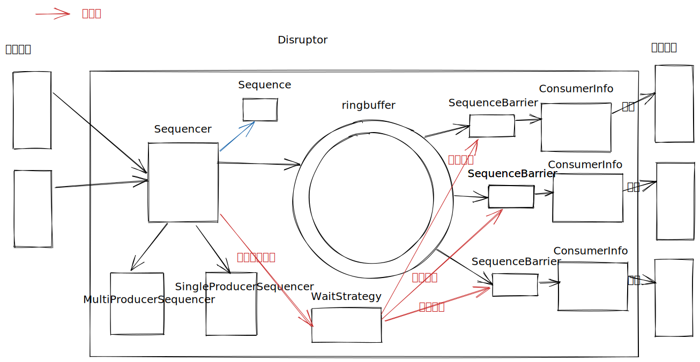

# 介绍

空空如也

# 作者

Martin Fowler

# 高效原因

## 伪共享

## 超大数组环形结构RingBuffer(无锁)

##  预分配缓存对象，使用缓存的循环覆盖取代缓存的新增删除等

## disruptor并发模型
todo说明

# 设计

## 官网

[disruptor github](https://github.com/LMAX-Exchange/disruptor)
[性能测试报告](https://github.com/LMAX-Exchange/disruptor/wiki/Performance-Results)
[Blogs-And-Articles](https://github.com/LMAX-Exchange/disruptor/wiki/Blogs-And-Articles)
## 权威文档

[https://lmax-exchange.github.io/disruptor/](https://lmax-exchange.github.io/disruptor/)
[https://lmax-exchange.github.io/disruptor/disruptor.html](https://lmax-exchange.github.io/disruptor/disruptor.html)
[user-guide](https://lmax-exchange.github.io/disruptor/user-guide/index.html)

## 权威文章

[author Martin Fowler for <<The LMAX Architecture>>](https://martinfowler.com/articles/lmax.html)

## 博客
[并发框架Disruptor译文](https://developer.aliyun.com/article/88456?spm=a2c6h.14164896.0.0.48b348c27Hirdo)
## 讲得好系列博客
[Disruptor 源码解读](https://xie.infoq.cn/article/3ed1885602c2ca022bd00ee3c)
[源码解读-阿里云开发社区-Disruptor深入解读](https://developer.aliyun.com/article/553297)

## 工具
* jmh