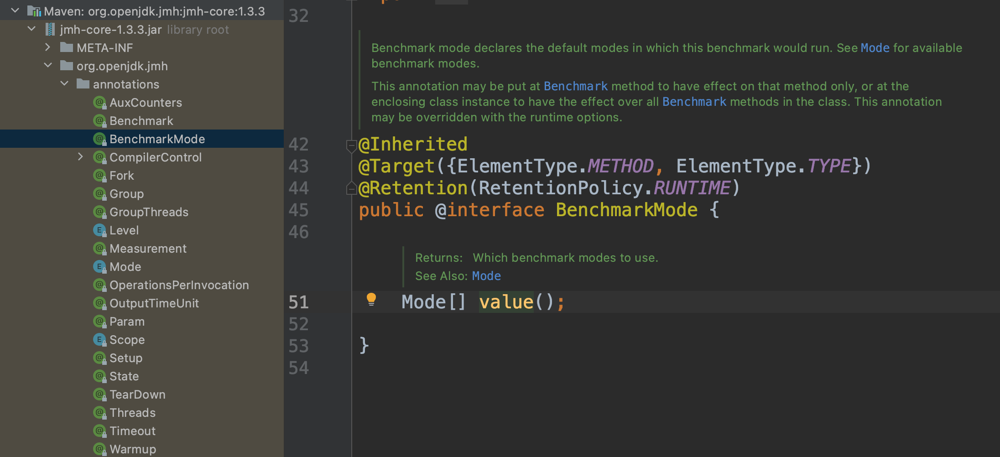

# 介绍

JMH，即Java Microbenchmark Harness，这是专门用于进行代码的微基准测试的一套工具API。

简单地说就是在 method 层面上的 benchmark，精度可以精确到微秒级。

# 最佳基准测试原则
todo

# 
JMH 5种Model（参见枚举源码说明）
* Throughput	：吞吐量（default）Measures the number of operations per second, meaning the number of times per second your benchmark method could be executed.
* Average Time：单次执行平均耗时	Measures the average time it takes for the benchmark method to execute (a single execution).
* Sample Time：执行耗时最大值，最小值	Measures how long time it takes for the benchmark method to execute, including max, min time etc.
* Single Shot Time：适合测试无需预热的方法（冷启动）	Measures how long time a single benchmark method execution takes to run. This is good to test how it performs under a cold start (no JVM warm up).
* All	Measures： 全部 all of the above.

# 注解列表

大多数注解含义都是见文识意的
* @Benchmark
* @BenchmarkMode(Mode.Throughput) 重点
* @OutputTimeUnit
* @State(Scope.Thread) 状态对象(state object)
* @Setup @Setup和@TearDown方法执行时间不统计在基准测试运行时间测量
* @TearDown

## state  
state scope
* thread:线程,每个线程进行基准测试都会创建状态对象的实例
* group:线程组,线程组共享
* benchmark:全局共享

状态对象要求
* 类必须是public
* 如果类是内部类，必须有static修饰
* 类必须有无参构造器

状态对象也可以使用@Setup and @TearDown两个注解

# 资料
## 官网

[jmh官网sample](http://hg.openjdk.java.net/code-tools/jmh/file/tip/jmh-samples/src/main/java/org/openjdk/jmh/samples/)

## 典型解释
[Jakob Jenkov java-performance/jmh.html](http://tutorials.jenkov.com/java-performance/jmh.html)

## 博客
[Java 并发编程笔记：JMH 性能测试框架](http://blog.dyngr.com/blog/2016/10/29/introduction-of-jmh/)
[jmh Java微基准测试框架JMH](https://www.xncoding.com/2018/01/07/java/jmh.html)

