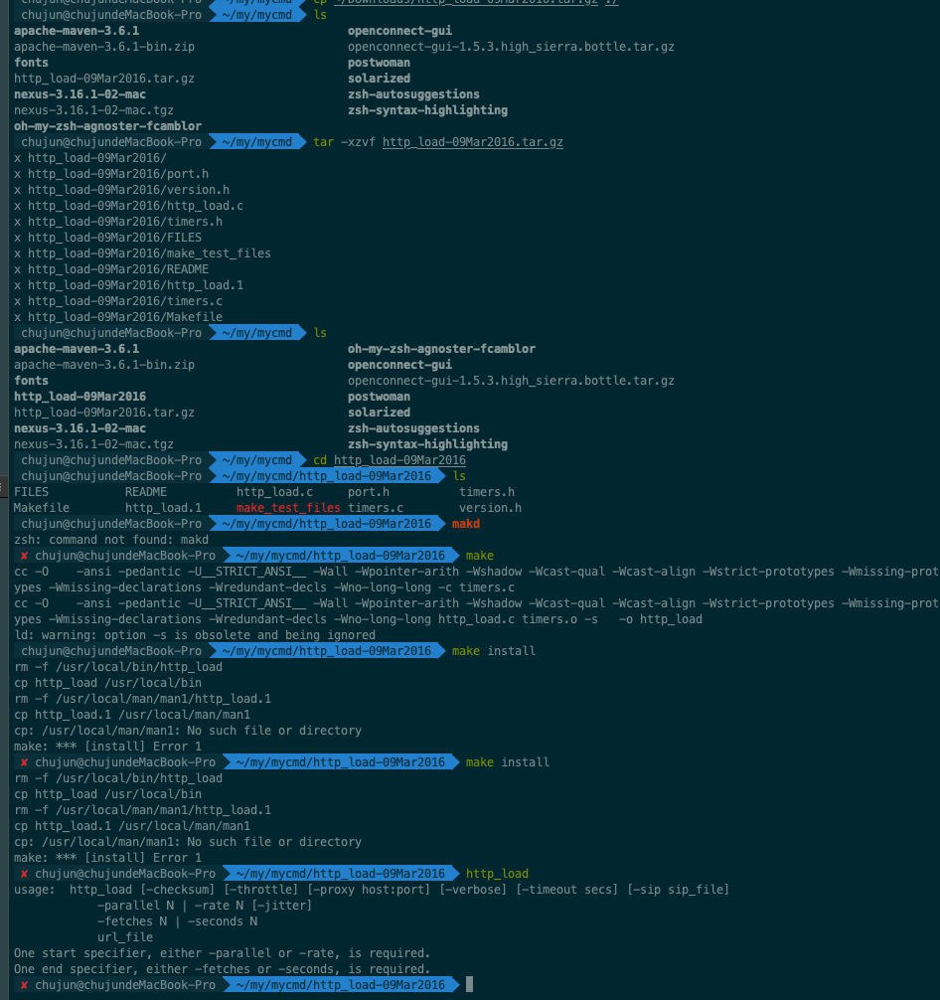

# http_load
# 官网
[官网](http://www.acme.com/software/http_load/)

# 说明
一款多线程http测试web服务器性能工具，可以测试服务器的吞吐量


# 安装

```css
tar xzvfhttp_load-12mar2006.tar.gz
make
make install
```

%accordion%http_load安装%accordion%



%/accordion%

## 验证安装成功，执行http_load命令
```bash
usage:  http_load [-checksum] [-throttle] [-proxy host:port] [-verbose] [-timeout secs] [-sip sip_file]
            -parallel N | -rate N [-jitter]
            -fetches N | -seconds N
            url_file
One start specifier, either -parallel or -rate, is required.
One end specifier, either -fetches or -seconds, is required.
```
 
## 常见错误
### 当man失败是不影响功能使用
```
m -f /usr/local/bin/http_load
cp http_load /usr/local/bin
rm -f /usr/local/man/man1/http_load.1
cp http_load.1 /usr/local/man/man1
cp: /usr/local/man/man1: No such file or directory
make: *** [install] Error 1
```

# 常见使用
## 常见参数
```
-parallel 简写-p ：含义是并发的用户进程数。
-rate 简写-r ：含义是每秒的访问频率

-fetches 简写-f ：含义是总计的访问次数
-seconds 简写-s ：含义是总计的访问时间
```

## 使用示例
```
http_load -r 10 -s 5 first.txt
49 fetches, 1 max parallel, 686147 bytes, in 5.00346 seconds
14003 mean bytes/connection
9.79323 fetches/sec, 137135 bytes/sec
msecs/connect: 0.438143 mean, 0.647 max, 0.225 min
msecs/first-response: 1.69065 mean, 11.311 max, 0.977 min
HTTP response codes:
  code 200 -- 49
```

## 结果分析
```
1. 49 fetches, 1 max parallel, 686147 bytes, in 5.00346 seconds 
  本次测试共发起了49个请求，最大并发数为1,总传输字节数686147字节，总运行时间为5.00346秒

2. 14003 mean bytes/connection
  每一个连接的传输字节数 686147/49=14003 bytes
3. 9.79323 fetches/sec, 137135 bytes/sec
  每秒响应用户数9.79323，每秒字节数137135
4. msecs/connect: 0.438143 mean, 0.647 max, 0.225 min
  每个连接的平均响应时间:0.438143,最大响应时间为0.647，最小响应时间为0.225 
5. msecs/first-response: 1.69065 mean, 11.311 max, 0.977 min

6. HTTP response codes:
      code 200 -- 49
   http响应code为200的数量为49，和总请求数一致   
```
特殊说明：这里，我们一般会关注到的指标是fetches/sec、msecs/connect
他们分别对应的常用性能指标参数
qpt-每秒响应用户数和response time，每连接响应用户时间。

### 准备url文件，可以包含多个url,文件格式是每行一个URL

```bash
$ cat first.txt
http://localhost:4000/
```

### 1.基于并发数
http_load -parallel 10 -seconds 5  first.txt
```
$ http_load -p 10 -s 5  first.txt
14863 fetches, 10 max parallel, 2.08127e+08 bytes, in 5.00013 seconds
14003 mean bytes/connection
2972.52 fetches/sec, 4.16242e+07 bytes/sec
msecs/connect: 0.16341 mean, 24.721 max, 0.036 min
msecs/first-response: 3.08797 mean, 36.806 max, 0.816 min
HTTP response codes:
  code 200 -- 14863
```

### 2.基于每秒速率
http_load -rate 10 -seconds 5  first.txt
```
$ http_load -r 10 -s 5 first.txt
49 fetches, 1 max parallel, 686147 bytes, in 5.00141 seconds
14003 mean bytes/connection
9.79724 fetches/sec, 137191 bytes/sec
msecs/connect: 0.441245 mean, 0.906 max, 0.26 min
msecs/first-response: 0.983673 mean, 1.656 max, 0.574 min
HTTP response codes:
  code 200 -- 49
```

# 实际应用场景

## 根据订单分页接口生成随机订单号压测订单详情接口
* 分析接口结构
* 请求接口
```bash
curl -d '{"startDt":"2020-01-01 00:00:00","endDt":"2020-04-01 00:00:00","pageSize":100}' \
-H 'Content-Type: application/json' \
http://47.96.53.33:8080/trade-in-center/trade-in-orders/page-search-order-no
```
```json
{"code":200,"resultMessage":"","data":["20200331153726111211","20200331153651697711","20200331153627691174","20200327161215398299","20200327151425267264","20200327144453313140","20200327095125158911","20200324182551537810","20200324182229452176","20200324171048289835","20200324171016507499","20200324113712728653","20200324113249702433","20200324113136646523","20200324111523101623","20200324105018366336","20200324104956503779","20200324094738086014","20200324092530842206","20200324092103755525","20200323175313387399","20200323174150782444","20200323172940534423","20200323172707301781","20200323172604305226","20200323172545129128","20200323172516904144","20200323105904771179","20200320174313008253","20200320171513404759","20200320162534445399","20200320150826548809","20200320140930529715","20200319110755431253","20200318194702309248","20200318191730473431","20200318173213712489","20200318163142897242","20200318150006968309","20200317192155298111","20200317172100936503","20200317160922103218","20200317154405069385","20200317151326020842","20200317135927106006","20200317133503563053","20200317124226093032","20200317113100014880","20200317102810154253","20200316193854800724","20200316182947965213","20200316181813351803","20200316172136542406","20200316152906809925","20200314150946619222","20200314150902056850","20200313183145000623","20200313182345331285","20200313181156046853","20200313174929181366","20200313170510161027","20200312210901604964","20200312210302370368","20200312205433985738","20200312203839484848","20200312203313890996","20200312203211870934","20200312202903112548","20200312202901933000","20200312202401943065","20200312195307982098","20200312193825674397","20200312181002101386","20200312155909639353","20200312155902355886","20200312154051584513","20200312154030066097","20200312153942541928","20200312153932310900","20200312143452341453","20200312113145123752","20200312112959935008","20200312112754331902","20200312111555300098","20200311194713162905","20200311192413387568","20200311192101157638","20200311191139080636","20200311180921786401","20200311180329999197","20200311180224785448","20200311175757987431","20200311175208412877","20200311175010785457","20200311174804088694","20200311172333481314","20200311172012213636","20200311164345517962","20200311163514037648","20200311160550810267"],"page":0,"pageSize":100,"totalCount":694}
```

* jq命令行处理json数据 (详情参考jq文档)
* 生成urls文件
```bash
curl -d '{"startDt":"2020-01-01 00:00:00","endDt":"2020-04-01 00:00:00","pageSize":100}' \
-H 'Content-Type: application/json' \
http://47.96.53.33:8080/trade-in-center/trade-in-orders/page-search-order-no \
| jq '.data'|jq '.[]'|sed 's/"//g' | sort|uniq -u\
|sed 's/^/http:\/\/47.96.53.33:8080\/trade-in-center\/trade-in-orders\/&/g'\
> query_order.txt
```
* TODO


# TODO
* 能测试get请求，post请求还不知道怎么配置


# 参考资料
[http_load使用详解](https://www.cnblogs.com/shijingjing07/p/6539179.html)