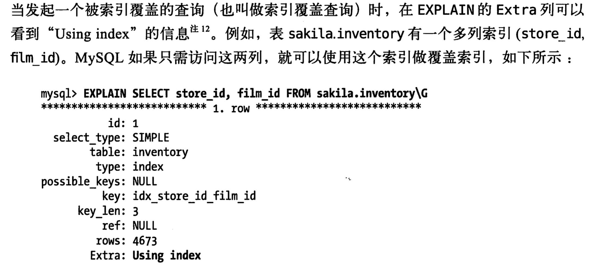
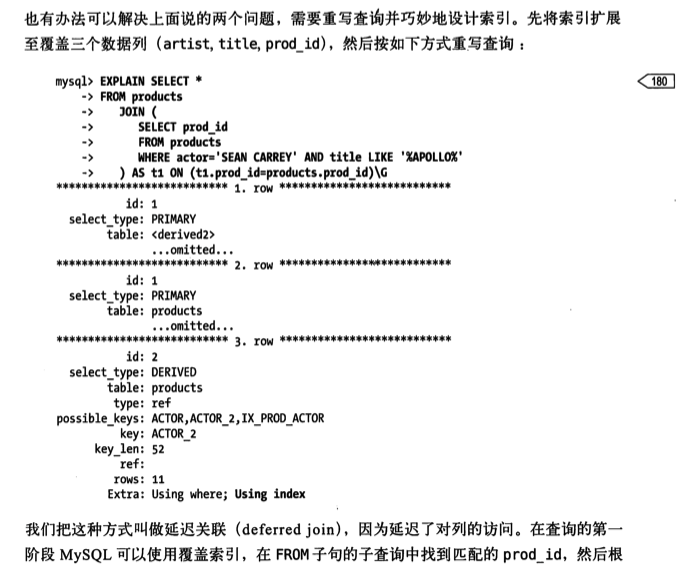
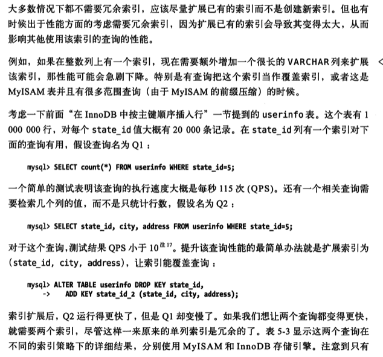
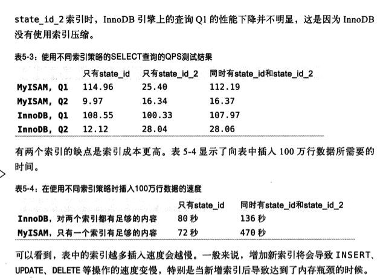

#5.1 索引基础
在mysql中，存储引擎使用索引，先在索引中找到对应值，然后根据匹配的索引记录找到对应的数据行

##5.1.1索引类型
在mysql中,索引是在存储引擎层而不是服务器层实现的,所以没有统一的索引标准，不同存储引擎的索引类型也不一样

索引类型
###B-Tree索引
B-Tree数数据结构自行维基百科(通常意味着所有值都是顺序存储的，并且每一个叶子页到根的距离相同)

innodb用的就是B+Tree索引，后面还会详细介绍

*B-Tree结构大致逻辑结构*


观察可知道和索引值相等的节点也在叶子页中

***[图重要系列]理解了这张图,B-Tree索引的逻辑结构，才能理解Mysql的最左匹配原则,多列匹配，范围匹配限制等索引规则,
其实都能根据这张图推理可知***

大致搜索算法步骤
1. 从索引根节点(上图未画出)开始进行搜索,
2. 根节点槽中存放了只想子节点的指针，存储引擎根据这些指针向下层查找。通过比较节点页的值(可能是多个列组成的值)和要查找的值
可以找到合适的指针进入下层子节点，这些指针实际上定义了当前节点的子节点页中值的上限和下限。
3. 最终存储引擎要么是找到对应的值，要么该记录不存在。

B-Tree对索引列是顺序组织存储的，所以适合查找范围数据

*下面是B-Tree结构之多列值索引,key(last_name,first_name,dob)[图重要系列]*


####B-Tree索引适合的查询类型(其实能根据上面B-Tree结构图推理可知)
```mysql
create table people(
    last_name varchar(50) not null,
    first_name varchar(50) not null,
    dob date not null,
    gender enum('m','f') not null,
    key(last_name,first_name,dob)
);
```
* 全值匹配:和索引中的所有列进行匹配，例如查找姓名为Cuba Allen,出生于1960-01-01的人
* 匹配最左前缀:查找所有姓为Allen的人，即只使用索引的第一列
* 匹配列前缀:可以只匹配某一列的值的开头部分.例如查找所有以J开头的姓的人,只使用了索引的第一列
* 匹配范围值:例如查找姓在Allen和Barrymore之间的人.这里只使用了索引的第一列
* 精确匹配某一列并范围匹配另外一列:例如查找所有姓为Allen,并且名字是字母K开头的人。即第一列last_name全匹配，第二列first_name范围匹配
* 只访问索引的查询:即只需要访问索引，而无需访问数据行.后面单独谈论这种"覆盖索引"的优化

* 用于查询中的ORDER BY操作(按顺序查找):如果order by子句满足前面列出的几种查询类型，则这个索引也可以满足对应的排序需求

####B-Tree索引的限制(其实也能根据上面B-Tree结构图推理可知)
* 如果不是按照索引的最左列开始查找，则无法使用索引.例如查找名字(first_name)为Bill的人，也无法查找某个特定生日(dob)的人,
也无法查找姓(last_name)以某个字母结尾的人
* 不能跳过索引中的列.例如无法查询姓(last_name)为Smith并且在某个特定日期出生的人.索引部分使用,mysql只能使用索引的第一列
* 如果查询中有某个列的查询范围,则其右边所有列都无法索引查询.例如查询where last_name='Smith' and
first_name like 'J%' and dob='1976-12-23'，这个查询只能使用索引的前两列,因为like是一个范围条件

*索引的顺序是相当重要*

###哈希索引
基于哈希表实现,只有精确匹配索引所有列的查询才有效。
每一行数据，存储引擎都会针对索引所有列计算一个哈希码(hash code)。
哈希碰撞

缺点
* 哈希索引只包含哈希值和数据行指针，不存储字段值。所以必须读取行
* 哈希索引数据并不是顺序存储的，所以无法拥有排序
* 不支持部分索引列匹配查找。因为哈希索引是用索引所有列内容计算哈希值。例如(A,B)建立哈希索引，如果只查询数据列A，则无法使用该索引.
* 哈希索引只支持等值比较查询，包括=,in.不支持任何范围查询
* 访问哈希索引数据非常快，除非有很多哈希冲突
* 如果哈希冲突非常严重的话，索引维护操作也可能非常高。

特定使用场合
数据仓库应用中有一种经典的"星型"schema，需要关联很多查找表，哈希索引就非常适合查找表的需求。

Innodb引擎有一种特别的功能叫"自适应哈希索引"(adaptive hash index),当Innodb注意到某些索引值被使用得非常频繁时，
它会在内存中基于B-Tree索引之上再创建一个哈希索引。(用户无法控制)
(这个不就是类似于应用系统中加上本地缓存HashMap嘛，一个道理，只不过取了个高大上的名字自适应哈希索引)

####创建自定义哈希索引
思路：在B-Tree索引基础上创建一个伪哈希索引。使用哈希值而不是索引值作为B-Tree进行索引列查找。需要在where子句中
手动使用哈希函数.

案例:字段存储url，并需要查询
```mysql
select * from website where url="https://www.mysql.com";
```
可以删除原来url列的索引，而新增一个索引列url_crc，使用crc32做哈希
```mysql
select * from website where url="https://www.mysql.com" and url_crc=CRC32("https://www.mysql.com");
```
这样会效率极高

缺陷:需要维护哈希值，可以手动维护，也可以使用触发器实现


###空间数据索引(R-Tree)
mysql对GIS支持并不完善,对GIS支持较完善的是PostgreSQL的PostGIS

###全文索引
搜索引擎

###其他索引类别
分形树索引(TukuDB,较新的一个数据结构,既有B-Tree的很多优点，也避免了B-Tree的一些缺点)


#5.2索引的优点

三大优点
* 1.索引大大减少了服务器需要扫描的数据量。
* 2.索引可以帮助服务器避免排序和临时表。
* 3.索引可以将随机I/O变为顺序I/O。

#####"三星索引"
* 1.将相关记录放到一起则获得"一星"
* 2.如果索引中的数据顺序和查找的排列顺序一致则获得"二星"
* 3.如果索引中的列包含了查询中需要的全部列则获得"三星"

##索引的适用范围
* 非常小表,不必要适用索引，大部分情况下简单的全表扫描更高效
* 中到大型的表，索引非常有效
* 特大型表，建立和使用索引的代价将随之增长。
需要一种技术可以直接区分出查询需要的一组数据,而不是一条记录一条记录地匹配，例如可以使用分区技术[参考第7章]
表的数量特别多，也可以考虑建议一个元数据信息表。例如执行哪些需要聚合多个应用分布在多个表的数据的查询，则需要记录
"哪个用户的信息存储在哪个表中"的元数据,这样在查询时就可以直接忽略哪些不包含指定用户信息的表.

#5.3高性能的索引策略
##5.3.1独立的列
"独立的列"指的是索引列不能是表达式的一部分，也不能是函数的参数
(自序:好像也不绝对，例如前面的crc32(url)函数,以及JPA中的)
`" AND (o.status in (:statuses) OR COALESCE(:statuses,NULL) IS NULL)" +`

下面查询无法使用actor_id列的索引:
```mysql
select actor_id from sakila.actor where actor_id+1=5;
```
```mysql
select * from mytable where TO_DAYS(CURRENT_DATE)-TO_DAYS(date_col)<=10;
```
```mysql
## c_user_id索引,id主键索引
#走索引
select * from t_user_1q where c_user_id ="100000";
##没走索引
select * from t_user_1q where c_user_id ="100000"+"1";
#走索引
select * from t_user_1q where id =100000;
##走了索引
select * from t_user_1q where id =100000+1;

```

最佳实践
*简化where条件的习惯，始终将索引列单独放在比较符号的一侧.*

##5.3.2 前缀索引和索引选择性
场景有时候需要索引很长的字符列,这会让索引变得大而慢.可以考虑索引开始的部分字符，这样可以大大节约索引空间，从而提高索引效率。

缺点：
* 降低索引选择性(是指不重复的索引值(也成基数,cardinality)和数据表的记录总数(#T)的比值，范围从1/#T到1之间)
* mysql无法使用前缀索引做ORDER BY和GROUP BY，也无法使用前缀索引做覆盖扫描

索引选择性越高查询效率越高，可以在查询时过滤掉更多的行。
唯一索引选择性是1，这是最好的索引选择性，查询性能也是最好的(当然也是有成本的,构建成本相应也高了)

对于BLOB，TEXT或者很长的VARCHAR类型的列，必须使用前缀索引，因为mysql不允许索引这些列的完整长度.

####前缀索引的应用技巧
* 选择足够长的前缀以保证较高的选择性--->使得前缀索引的选择性接近于索引整个列(即，前缀的"基数"应该接近于完整列的"基数")
* 同时又不能太长(以便节约空间)

####案例:如何具体计算一个前缀索引的长度呢
#####方法一(看看就好)


#####方法二:计算完整列的选择性，并使前缀的选择性接近于完整列的选择性,另外需要关注下你希望前缀索引长度下的数据分布情况
```
select count(DISTINCT  city)/COUNT(*) as a from sakila.city_demo;
+--------------+
| a            |
+--------------+
|        0.0312|
+--------------+
```
可以在一个查询中针对不同前缀长度进行计算，这对于大表非常有用.
```
select count(DISTINCT LEFT(city,3))/COUNT(*) AS sel3,
    count(DISTINCT LEFT(city,4))/COUNT(*) AS sel4,
    count(DISTINCT LEFT(city,5))/COUNT(*) AS sel5,
    count(DISTINCT LEFT(city,6))/COUNT(*) AS sel6,
    count(DISTINCT LEFT(city,7))/COUNT(*) AS sel7,
from sakila.city_demo;
+--------+--------+--------+--------+--------+
|sel3    |sel4    |sel5    |sel6    |sel7    |
+--------+--------+--------+--------+--------+
|  0.0239|  0.0293|  0.0305|  0.0309|  0.0310|
+--------+--------+--------+--------+--------+
```
查询限时当前缀长度到达7的时候，再增加前缀长度，选择性提升的幅度已经很小了。

注意：只看平均选择性还是不够的，也有例外的情况，需要考虑最欢情况下的选择性。
平均选择性让你认为前缀长度为4或者5的索引已经足够了，但如果数据分布很不均匀，可能就会有陷阱.

例如观察前缀为4的最长出现城市的次数，可以看到数据分布明显不均匀
```
select count(*) as cnt,LEFT(city,4)as pref
from sakila.city_demo GROUP BY perf order by cnt desc limit 5;

+--------------+--------------+
|cnt           |pref          |
+--------------+--------------+
|           205|San           |
|           200|Sant          |
|           135|Sout          |
|           104|Chan          |
|            91|Toul          |
+--------------+--------------+
```
*真实数据，真实城市名上可能很多城市都以"San","New"词开头*

##5.3.3多列索引
新手玩家索引方式，为每个可能的where列创建单独的索引
```mysql
##demo
create table t(
  c1 int,
  c2 int,
  c3 int,
  key(c1),
  key(c2),
  key(c3)  
);
```
这样一来最好的情况下也只能是一星索引，其性能比起真正最优的索引可能差几个数量级。

案例
表film_actor在字段film_id和actor_id上各有一个单列索引，
但对于下面这个查询where条件，这两个单列索引都不是好的选择
```mysql
select film_id,actor_id from sakila.film_actor 
where actor_id=1 or film_id=1;
```
在老mysql版本中(书中最新也才5.1版本，估计现在不会这么傻了)，mysql对这个查询会使用全表扫描。
除非改写成如下的两个查询UNION方式
```mysql
select film_id,actor_id from sakila.film_actor
where actor_id=1
UNION ALL 
select film_id,actor_id from sakila.film_actor

where film_id=1 and actor_id<>1;
## 感觉actor_id<>=1没必要要啊
```
但在mysql5.0和更新的版本中，查询能够同时使用这两个单列索引进行扫描，并将结果合并。

这种算法有三个变种
* OR条件的联合
* AND条件的相交
* 组合前两种情况的联合及相交


索引合并策略有时候是一种优化的结果，但实际上更多时候说明了表上的索引建的很糟糕
* 当服务器对多个索引做相交操作时（通常有多个AND条件），通常说明需要一个包含所有相关列的多级索引，
而不是多个单独的单列索引
* 当服务器需要对多个索引做联合操作时(通常有多个OR条件),通常需要耗费大量CPU和内存资源在算fan的
缓存、排序和合并操作上。特别是有些索引选择性不高，需要合并扫描返回大量数据的时候。
* 优化器不会把这些计算到"查询成本"(cost)中去，优化器只关心随机页面读取。导致查询成本被低估，导致该执行计划还不如直接走全表扫描。

可以通过参数*optimizer_switch*来关闭索引合并功能，也可以使用ignore index提示让优化器忽略掉某些索引.


###5.3.4选择合适的索引列顺序
针对索引类型范围
针对B-Tree索引，哈希或者其他类型索引并不会像B-Tree索引一样按顺序存储数据
三星索引的一个重要标志：多列索引的顺序

####question如何选择索引的列顺序呢？
一个经验法则:将选择性最高的列放到索引最前列。（没有放之四海皆准的法则）
有些场景可能有帮助，但通常不如避免随机IO和排序那么重要(TODO:cj这个怎么理解呢)
* 当不考虑排序和分组是，将选择性最高的列放在前面通常是好的.但是性能不仅仅依赖于所有列的选择性(整体基数),
也和查询条件的具体值有关(值的分布).也可能需要根据哪些运行频率最高的查询来调整索引列的顺序

案例选择哪一个列作为多列索引列的第一列呢？
```mysql
select * from payment where staff_id=2 and customer_id=584;
```

如果没有类似的具体查询来运行，那么最好还是按照经验法则来做，因为经验法则考虑的是全局基数和选择性，而不是某个具体查询:
```
mysql> select count(DISTINCT  staff_id)/count(*) as staff_id_selectivity,
count(distinct customer_id)/count(*) as customer_id_selectivity,
count(*) from payment\G;
******************1.row*************
staff_id_selectivity:0.0001
customer_id_selectivity:0.0373
count(*):16049
```
customer_id选择性更高，所以将其作为索引列的第一列

案例二：值分布不均
在某些应用中，对没有登录的用户，都将其用户名记录为"guest",这样guest就成为了一个特殊用户ID。
查询其他账号ID正常，但查询这个账号可能就会出现服务器性能问题了。

案例三:值分布不均的问题
管理员组用户数据过多


###5.3.5聚簇索引
概念上:聚簇索引并不是一种单独的索引类型，而是一种*数据存储方式*。具体细节依赖其实现方式，
*innodb的聚簇索引实际上在同一个结构中保存了B-Tree索引和数据行*。

*数据存储结构*


*特征*
* 表数据行存放在索引的叶子页(leaf page)中，节点页还是只包含了索引列。
* "聚簇"表示数据行和相邻兼职紧凑的存储在一起(不过需要注意的是innodb只聚集在同一个页面中的记录,包含相邻键值的页面可能会相距甚远)
* 因为无法同时把数据行存放在两个不同的地方，一个表只能有一个聚簇索引
(覆盖索引可以模拟多个聚簇索引的情况，本章后面介绍，TODO:cj这个怎么理解)
* a1.innodb通过主键聚集数据,""被索引的列"就是主键列。
* a2.如果没有定义主键,innodb会选择一个唯一的非空索引替代
* a3.如果没有没有这样的索引，innodb会隐式定义一个主键来作为聚簇索引
* a总.innodb不论何种情况，一定会有聚簇索引(想想也对，数据行存储在聚簇索引中，不然怎么存储数据行呢)
* 因为是存储引擎负责实现索引，因此不是所有的存储引擎都支持聚簇索引。

*优点*
* 可以把相关数据保存在一起,这样只需要从磁盘读取少数数据页就能获取某个用户的全部邮件。
如果没有使用聚簇索引，则每封邮件都可能导致一次磁盘I/O.
* 数据访问更快.聚簇索引将索引和数据保存在同一个B-Tree中，因此从聚簇索引中获取数据通常
比在非聚簇索引中查找要快(减少了一次回表啊)
* 使用覆盖索引扫描的查询可以直接使用页节点中的主键值

*缺点*
* 1.聚簇索引最大限度的提高了I/O密集型应用的性能，但如果全部数据都放在内存，则访问顺序就没那么重要了，聚簇索引也就没什么优势了
* 2.插入速度严重依赖插入顺序。按照主键顺序插入是加载数据到Innodb表中速度最快的方式。
但如果不是按照主键顺序加载数据，那么加载完成后最好使用*OPTIMIZE TABLE*命令重新组织下表
* 3.更新聚簇索引列的代价很高，因为会强制innodb将每个被更新的行移动到新的位置。
* 4.基于聚簇索引的表在插入新行，或者主键被更新导致需要移动行的时候，可能面临"页分裂"问题。当行的主键值要求必须将这一行插入到某个已满的页中时，
存储引擎会将该页分裂成两个页面来容纳该行(那不是两页都不满了)，这就是一次*页分裂*操作。页分裂
会导致表占用更多的磁盘空间
* 聚簇索引可能导致全表扫描变慢，尤其是行比较稀疏，或者由于页分裂导致数据存储不连续的时候
* 二级索引(非聚簇索引)可能比想象的要更大一些，因为在二级索引的叶子节点包含了引用行的主键列
* 二级索引访问数据行需要两次索引查找(回表),而不是一次.

缺点4页分裂问题告诉我们最佳实践：
* 表一定要有id作为主键(大表，不过也是db常规最佳实践了),不然其他列成为聚簇索引后问题很大。
* 主键id自增，没事别更新主键id值,别跳id插入

为什么需要两次索引查找？
因为二级索引中保存的"行指针"的实质，保存的是行的主键值，而不是指向行的物理位置。

----->找到二级索引的叶子节点对应的行主键值----->根据行主键值去聚簇索引查找对应的数据行

#### innodb和myisam的数据分布对比

数据情况
该表主键取值1~10000，按照随机顺序插入并使用*OPTIMIZE TABLE*命令做了优化。
换句话说，数据在磁盘上的存储方式已经最优,但行的顺序是随机的。
列col2的值是从1~100之间随机赋值，所以有很多重复值

```mysql
create table layout_test(
    col1 int not null,
    col2 int not null,
    PRIMARY KEY(col1),
    key(col2)
);
```
*myisam数据分布情况*(了解下即可)


*innodb数据分布*
*Innodb表的主键分布图*[图重要系列]


从图中看显示了整个表，而不单单是索引，还有数据行信息
在innodb中，聚簇索引"就是"表
聚簇索引的每一个叶子节点都包含了
* 主键值，
* 事务ID，
* 用于事务和MVCC的回滚指针
* 以及所有的剩余列(在这个例子中是col2)

*innodb表的二级索引分布图*

二级索引的叶子节点存储的不是"行指针"，而是主键值，并以此作为指向行的"指针"。
这种方式优点：减少了当出现行移动或者数据页分裂时二级索引的维护工作。
缺点：使用主键值当作指针会让二级索引占用更多的空间

*innodb和myisam聚簇和非聚簇表对比图*


##### 在innodb表中按主键顺序插入行
DB最佳实践:
* 表id作为主键,使用AUTO_INCREMENT自增列，可以保证数据行按顺序写入
* 避免随机(不连续值的分布范围非常大)聚簇索引，例如UUID作为聚簇索引，
它使聚簇索引插入变得完全随机，这是最坏的情况，使得数据没有任何聚集特性。

顺序主键的缺点???(先思考下后面有)

案例测试
```mysql
## 第一张表使用整数ID插入user_info表
create TABLE user_info(
    id int unsigned not null AUTO_INCREMENT,
    name varchar(64) not null DEFAULT '',
    email varchar(64) not null DEFAULT '',
    password varchar(64)not null DEFAULT '',
    dob date DEFAULT null,
    country_id smallint unsigned not null DEFAULT '0',
    PRIMARY KEY (id),
    UNIQUE KEY email(email),
    KEY country_id(country_id)
)ENGINE=innodb;
```
```
## 第二张表，除了主键改为UUID，其他和第一张表完全一样
create TABLE user_info_uuid(
    uuid varchar(36) not null,
    ...
    PRIMARY KEY (uuid)
    ...
)
```
测试
* 1.向两个表各插入100w条记录
* 2.再分别插入300w记录，使得索引的大小超过服务器的内存空间

|表名|行数|时间秒|索引大小MB|
|---|---|---|---|
|user_info|100w|137|342|
|user_info_uuid|100w|180|544|
|user_info|300w|1233|1036|
|user_info_uuid|300w|4522|1701|

可以观察到UUID主键插入行花费时间更长，索引占用空间也更大
* 一方面由于主键字段更长
* 另一方面由于页分裂和碎片导致的(TODO:cj 怎么从mysql内部数据观察出来呢)

*向聚簇索引插入 顺序索引值*
聚簇索引也是有排序顺序的(这点不要忘记)


因为主键值是顺序的,所以innodb把新记录存储在上条记录后面,当达到页最大填充因子时,新纪录会写入新页中。
这样主键页就会近似于被顺序的记录填满(二级索引页可能是不一样的)

页的最大填充因子(innodb默认最大填充因子是页大小的15/16，留出部分空间用于以后修改)
*向聚簇索引插入 无序索引值UUID*

因为新行主键值UUID是无序的，所以innodb无法简单的总是把新行插入到索引的最后，而是总需要为新记录寻找到合适的位置
---通常是已有数据的中间位置--这样就有很多额外缺点问题
* 无法利用缓存(内存最近访问原则)写入目标页也可能已经刷到磁盘上并从缓存中移除，或者是还没有被加载到缓存中，
innodb在插入之前不得不先找到并从磁盘读取目标到内存中，这将*导致大量随机I/O*
* 写入是乱序的，innodb不得不*频繁做页分裂操作*，以便为新记录分配空间。同时
页分裂会导致移动大量数据，一次插入最少需要修改三个页而不是一个页(TODO:cj 为啥不是两个????)
* 因为频繁页分裂，页会变得稀疏并被不规则地填充，所以最终会有*数据碎片*

可能需要做一次OPTIMIZE TABLE来重建表并优化页的填充

顺序主键缺点？
高并发工作负载下，innodb按主键顺序插入可能会造成明显争用。
* 主键"上界"会成为热点，因为所有插入都发生在这里，所以并发插入可能导致*间隙锁竞争*
* 另一个热点可能是AUTO_INCREMENT锁机制；

如果遇到第二个问题，可能需要重新考虑设计表或者应用，或者更改innodb_autoinc_lock_mode配置

##5.3.6覆盖索引
定义:如果一个索引包含(或者说覆盖)所有需要查询的字段的值，那么就称这个索引为覆盖索引。

* 索引条目大小通常远远小于数据行大小，这样可以极大地减少数据量。
* 索引是按照列值顺序存储的（至少单个页内是如此），所以对于I/O密集型的范围查询会比随机从
磁盘读取每一行数据的I/O要少得多。
* 对于innodb的聚集索引，如果索引是覆盖索引，可以有效避免二次回表查询。

不是所有的索引类型都有资格成为覆盖索引，像哈希索引，全文索引等不存储索引的值，mysql只能用B-Tree索引做覆盖索引。

当发起一个覆盖索引查询时，explain的extra列可以看到"Using index"的信息



陷阱
索引覆盖查询还有不少陷阱可能导致无法实现优化。mysql查询优化器会在执行查询前判断是否有一个索引能进行覆盖。
假设索引覆盖了where条件中的字段，但不是真个查询涉及的字段。如果条件为假,mysql5.5和更早的版本也总会回表获取数据行，
尽管并不需要这一行且最终挥别过滤掉(TODO:cj 如何验证5.7，5.8不存在该问题了)

###案例
```
explain select * from products where actor='SEAN CARREY' and title like '%APOLLO%'\G
***************************[ 1. row ]***************************
id            | 1
select_type   | SIMPLE
table         | products
partitions    | <null>
type          | REF
possible_keys | ACTOR,ID_PROD_ACTOR
key           | ACTOR
key_len       | 52
ref           | const
rows          | 10
filtered      | <null>
Extra         | Using where
```
索引无法覆盖该查询，两个原因：
* 没有任何索引能够覆盖这个查询。因为查询了表中所有列。理论上mysql有一个捷径可以利用:where条件中的列
是有索引可以覆盖的，因此mysql可以使用该索引找到对应的actor并检查title是否匹配(cj:不读取数据行怎么匹配，索引中又没有title)，过滤之后
在读取需要的数据行
* mysql不能在索引中执行like操作。这是底层存储引擎API的限制，mysql5.5和更早版本只允许再索引中做简单比较操作(例如等于，不等于以及大于)。
mysql支持索引做最左前缀匹配的like比较，但是不能做通配符开头的like查询。这种情况只能提取数据行的值而不是索引值来做比较(cj:B-tree索引也有这个限制)

#### 一种优化方案
重新设计索引，将索引扩展至覆盖三个数据列(actor,title,prod_id)，然后按如下方式重写查询:
```mysql
explain select * from products
    join(
        select product_id from products where actor='SEAN CARREY' and title like '%APOLLO%'
    )as t1 on(t1.prod_id=products.prod_id)
```
执行计划如下

这种方式成为延迟关联(deferred join)，因为延迟了对列的访问，在查询的第一阶段mysql可以使用覆盖索引,
在from字据中的子查询中找到匹配的prod_id,然后根据这些prod_id值在外层查询匹配获取需要的所有列值。
这样做的好处是虽然无法使用索引覆盖整个查询，但总算比完全无法利用索引覆盖的好.

需要注意的是这样优化的效果取决于where条件匹配返回的行数。
不同数据量比较如下


###未来Mysql版本的改进
上面提到的很多限制是由于存储引擎API设计所导致的，目前API设计不允许myslq将过滤条件传到存储引擎层。
如果后续版本能做到这点，可以把查询发送到数据上，
而不是现在这样只能把数据从存储引擎拉到服务器层，再根据查询条件过滤。
mysql5.6版本(未正式发布)包含了再存储引擎API上所做的一个重要的改进，
其被称为"索引条件推送(index condition pushdown)"。这个特性将大大改善现在查询执行方式，如此一来上面介绍的很多技巧也不再需要了。

## 5.3.7使用索引扫描来做排序
mysql两种方式生成有序的结果:
* 通过排序操作
* 按索引顺序扫描
如果explain出来的type列值为"index"，则说明mysql使用了索引扫描来做排序(不要和Extra列的"Using index"搞混淆了)

扫描索引本身是很快的，因为只需要从一条记录移动到紧接着的下一条记录，但是如果索引不能覆盖查询的列，那就不得不每扫描一条记录
就回表查询一次对应的行。而这基本都是随机I/O(除非正好是主键聚簇索引)，
*因此按索引顺序读取数据的速度通常比顺序的全表扫描慢，尤其是在I/O密集型的工作负载时(如果索引顺序读取的数据过多的情况下)*。


* 只有当索引的列顺序和Order by子句的顺序完全一致，并且所有列的排序方向(倒序或正序)都一致时，mysql
才能够使用索引来对结果排序
* 如果查询需要关联多张表，只有order by子句引用的字段全部为第一张表时才能使用索引做排序。
* order by子句和查找性查询的限制是一样的，需要满足索引的最左前缀匹配要求；否则mysql都需要执行排序操作，而无法利用索引排序
* 如果前导列为常量的时候，例如where子句或者join子句中对这些列指定了常量，则order by可以使用索引排序

###案例
联合索引rental_date
```
create table rental(
    ...
    primary key(rental_id),
    unique key rental_date(rental_date,inventory_id,customer_id),
    ...
)
```

从explain中可以看出没有出现文件排序(filesort)操作
```bash
explain select rental_id,staff_id from rental
where rental_date='2020-12-08' order by inventory_id,customer_id
***************** 1.row ****************
type :ref
possible_key:rental_date
key:rental_date
rows:1
Extra:Using where
```
即使order by子句本身不满足最左匹配前缀要求，也可以用于查询排序，这是因为索引第一列被指定为一个常数。

可以使用索引排序的例子
* where rental_date='2020-12-08' order by inventory_id desc;
* where rental_date='2020-12-08' order by rental_date,inventory_id;

不可以使用索引排序的例子
* where rental_date='2020-12-08' order by inventory_id desc,customer_id asc;
(查询使用了不同的排序方式，但是索引列都是正序排序的)
* where rental_date='2020-12-08' order by inventory_id ,staff_id
(使用了不在索引中的列)
* where rental_date='2020-12-08' order by customer_id
* where rental_date>'2020-12-08' order by inventory_id,customer_id
(查询列是范围条件)
* where rental_date='2020-12-08' and inventory_id in(1,2) order by customer_id
(inventory_id上有多个等于条件，对于排序来说，这也是一种范围查询)

## 5.3.8压缩(前缀压缩)索引
MyISAM

## 5.3.9冗余和重复索引
重复索引:在相同的列上按照相同的顺序创建的相同类型的索引。应该避免这样创建索引
而在一个列上创建不同类型的索引满足不同的查询需求，不算重复索引

冗余索引
如果创建了索引(A,B),再创建索引A就是冗余索引
而创建索引(B,A)不算冗余索引,索引B也不算冗余索引，
其他不同类型索引(例如哈希索引或者全文索引)也不会是B-Tree索引的冗余索引

有时冗余索引可能是需要的
### 案例



### 检测冗余索引
* 通过写一些复杂的访问information_schema查询来找，这样可能导致线上服务有性能问题
* Shlomi Noach的common_schema中的一些视图定位，common_schema是一系列可以安装到服务器上的常用存储和视图
* 使用Percona Toolkit中的pt-duplicate-key-checker，通过该工具分析表结构找出冗余和重复索引

## 5.3.10未使用的索引

### 检测无用的索引
* Percona Server/MariaDB打开userstates服务器变量(默认关闭)，服务器运行一段时间，再通过查询information_schema.index_statistics
就能查到每个索引的使用频率
* Percona Toolkit中的pt-index-usage,该工具可以读取查询日志，并对日志中查询进行explain操作，然后打印出关于索引和查询的报告
该工具还可以了解查询的执行计划--例如有些情况有些类似的查询执行方式不一样，也可以将结果写入到mysql表中，方便查询结果

## 5.3.11索引和锁
索引让查询锁定更少的行

innodb只有在访问行的时候才会对其加锁，而索引可以减少innodb访问的行数，从而减少锁的数量。
但这只有innodb在存储引擎层能够过滤掉所有不需要的行时才有效。
如果索引无法过滤掉无效的行，那么在innodb检索到数据并返回给服务层以后，mysql服务器才能应用where子句(mysql5.6版本可以改善)，这时无法避免锁定行了。

### 案例(注意这个案例在本地mysql5.8版本测试无效了)
```mysql
set AUTOCOMMIT =0;
begin;
select actor_id from actor where actor_id<5 and actor_id<>1 for update;
```

```
+------------+
|actor_id    |
+------------+
|           2|
|           3|
|           4|
+------------+
```
这条查询仅仅返回2-4之间的行，但是实际上获取了1~4之间的行的拍他锁。
innodb会锁住第1行，这是因为mysql为该查询选择的执行计划是索引范围扫描：
```mysql
explain select actor_id from actor where actor_id<5 and actor_id<>1 for update;
```
```
+----+-------------+--------+------------+------+---------------+--------+---------+--------+--------+----------+--------+
| id | select_type | table  | partitions | type | possible_keys | key    | key_len | ref    | rows   | filtered | Extra  |
+----+-------------+--------+------------+------+---------------+--------+---------+--------+--------+----------+--------+
| 1  | SIMPLE      | actor  | <null>     | range| <null>        | PRIMARY| <null>  | <null> | <null> | <null>   | Using where;Using index |
+----+-------------+--------+------------+------+---------------+--------+---------+--------+--------+----------+--------+
```
底层存储引擎的操作是"从索引的开头开始获取满足条件actor_id<5的记录"，服务器并没有告诉innodb
可以过滤第1行的where条件。注意到explain的extra列出现了"Using where"，这表示mysql服务器将存储引擎返回行以后再应用where过滤条件。

下面第二个查询就能证明第1行确实已经被锁定，尽管第一个查询结果并没有这个第1行。
另开一个窗口执行如下查询:
```mysql
set AUTOCOMMIT =0;
begin;
select actor_id from actor where actor_id=1 for update;
```
这个查询会挂起，直到第一个事务释放第1行的锁。

本地mysql5.8版本实战时已经不会被锁定了，应该是5.6版本之后支持了索引条件推送功能，
当然查询 where actor_id=2时还是会阻塞的，下面截图里面没有体现出来(TODO:cj 如何查询当前表锁定了哪些行)


# 5.4索引案例学习
具体看原书吧 
在线约会网站，用户信息包含很多列,国家,地区,城市，性别，眼睛颜色等等
### 支持多种过滤条件
### 5.4.2避免多个范围条件查询
如果未来版本mysql能够实现*松散索引扫描*(TODO:cj 这是个什么东西)，就能在一个索引上使用多个范围条件，也就不需要为上面的这类查询使用in()列表
### 5.4.3优化排序

# 5.5维护索引和表
三个主要目的
* 找到并修复损坏的表
* 维护准确的索引统计信息
* 减少碎片

## 5.5.1找到并修复损坏的表
运行Check Table检查是否发生了表损坏，通常能知道大多数表和索引的错误.
运行REPAIR TABLE命令来修复损坏的表。如果存储引擎不支持，也可通过一个不做任何操作(no-op)的alter操作来重建表,例如修改表的存储引擎为当前的引擎
>alter table innodb_tb1 engine=innodb;

innodb引擎一般不会出现表损坏，一般一定是发生了严重的错误，重要的是需要查出根源问题。可能原因
* 数据库硬件问题例如内存或者磁盘问题(有可能)
* 数据库管理员的错误例如在mysql外部操作了数据文件(有可能)
* innodb本身的缺陷(不太可能)

## 5.5.2更新索引统计信息
mysql查询优化器会通过两个API来了解存储引擎的索引值的分布信息,以决定如何使用索引.

两个API
* records_in_range():通过向存储引擎传入两个边界值获取在这个范围大概有多少条记录。
MyISAM该接口返回精确值，而innodb则返回一个估算值
* info()：该接口返回各种类型的数据,包括索引的基数(每个键值有多少条记录)

如果存储引擎优化器提供的扫描行数信息是不准确的数据，或者执行计划本事太复杂以致无法朱雀地获取各个阶段匹配的行数,
那么优化器会使用索引统计信息来估算扫描行数。

mysql优化器使用的是基于成本的模型,而衡量成本的主要指标就是一个查询需要扫描多少行.

如果表没有统计信息，或者统计信息不准确，优化器就有可能做出错误的决定。可以通过运行ANALYZE TABLE来重新生成统计信息决绝这个问题.

不同存储引擎实现索引统计信息方式不同,所以需要进行ANALYZE TABLE的频率也因不同的引擎而不同,每次运行的成本也不同:
* Memory引擎根本不存储索引统计信息
* MyISAM将索引统计信息存储在磁盘上，ANALYZE TABLE需要进行一次全索引扫描来计算索引基数.在整个过程中需要锁表.
* 知道mysql5.5版本，innodb也不再磁盘存储索引统计信息,而是通过随机的索引访问进行评估并将其存储在内存中。

可以使用SHOW INDEX FROM命令来查看索引基数(Cardinality),例如：
```bash
mysql root@localhost:trade_in_center> show index from t_user\G;
```
结果如下:
```
mysql 8.0.21
mycli 1.22.2
Chat: https://gitter.im/dbcli/mycli
***************************[ 1. row ]***************************
Table         | t_user
***************************[ 1. row ]***************************
Table         | t_user
Non_unique    | 0
Key_name      | PRIMARY
Seq_in_index  | 1
Column_name   | id
Collation     | A
Cardinality   | 994008
Sub_part      | <null>
Packed        | <null>
Null          |
Index_type    | BTREE
Comment       |
Index_comment |
Visible       | YES
Expression    | <null>
***************************[ 2. row ]***************************
Table         | t_user
Non_unique    | 1
Key_name      | idx_user_id
Seq_in_index  | 1
Column_name   | c_user_id
Collation     | A
Cardinality   | 994008
Sub_part      | <null>
Packed        | <null>
Null          |
Index_type    | BTREE
Comment       |
Index_comment |
Visible       | YES
Expression    | <null>
***************************[ 3. row ]***************************
Table         | t_user
Non_unique    | 1
Key_name      | idx_pro_city
Seq_in_index  | 1
Column_name   | c_province_id
Collation     | A
Cardinality   | 1000
Sub_part      | <null>
Packed        | <null>
Null          |
Index_type    | BTREE
Comment       |
Index_comment |
Visible       | YES
Expression    | <null>
***************************[ 4. row ]***************************
Table         | t_user
Non_unique    | 1
Key_name      | idx_pro_city
Seq_in_index  | 2
Column_name   | c_city_id
Collation     | A
Cardinality   | 100254
Sub_part      | <null>
Packed        | <null>
Null          |
Index_type    | BTREE
Comment       |
Index_comment |
Visible       | YES
Expression    | <null>
```
索引列基数:显示了存储引擎估算索引类有多少个不同的取值。
在mysql5.0和更新版本中，还可以通过information_schema.statistics表方便查询这些信息
需要注意的是如果服务器上的库表非常多，则从这里获取元数据速度可能会非常慢，还会给mysql带来额外压力，慎用。
命令其他输出字段含义见mysql官网文档

### innodb索引统计信息
innodb通过抽样方式计算统计信息。
首先随机地读取少量索引页面，然后以此为样本计算索引的统计信息
老版本innodb，样本页面数是8.新版本innodb可以通过参数*innodb_stats_sample_pages*来设置样本页的数量。
理论上来说可以帮助生成更准确的索引信息，特别是对于某些超大的数据表来说，但具体设置多大合适依赖具体环境.

```mysql
##本机mysql5.8
SHOW variables like 'innodb_stats%';
```
```
"innodb_stats_auto_recalc"	"ON"
"innodb_stats_include_delete_marked"	"OFF"
"innodb_stats_method"	"nulls_equal"
"innodb_stats_on_metadata"	"OFF"
"innodb_stats_persistent"	"ON"
"innodb_stats_persistent_sample_pages"	"20"
"innodb_stats_transient_sample_pages"	"8"
```
innodb计算索引统计信息时机
* 表首次打开(TODO:cj 这是什么时候)
* 执行ANALYZE TABLE
* 表的大小发生非常大的变化(大小变化超过十六分之一或者新插入了20亿行都会触发)

有些场景也会触发索引统计信息的更新
* 打开某些Information_schema表
* 使用show table status和show index
* mysql客户端开启自动补全功能时候

可以通过关闭参数*innodb_stats_on_metadata*来避免上面的问题

## 5.5.3减少索引和数据的碎片
表的数据存储可能会锁片化


### 类型
#### 行锁片（row fragmentation)
定义：数据行被存储为多个地方的多个片段中。即使查询只从索引中访问一行记录。
#### 行间锁片(intra-row fragmentation)
定义：逻辑上顺序的页，或者行在磁盘上不是顺序存储的。行间碎片对诸如全表扫描和聚簇索引扫描之类有很大影响，
因为这些操作原本可以从磁盘上顺序存储的数据中获益。
#### 剩余空间锁片(free space fragmentation)
定义：数据页中有大量的空闲空间.这会导致服务器读取大量不需要的数据，从而造成浪费。

MyISAM三种碎片都可能发生，而innodb不会出现短小的碎片，innodb会移动短小的行并重写到一个片段中
每种类型碎片产生原因?

解决方案
* 可以通过*OPTIMIZE TABLE*或者导出再导入的方式来重新整理数据。这对多数存储引擎都是有效的。
* innodb新增"在线"添加和删除索引功能，可以通过先删除，然后再重新创建索引的方式来消除索引的碎片化。
* 也还可以通过不做任何操作的ALTER TABLE操作来重建表
```
ALTER TABLE <tb> engine=<engine>;
```
如何检测产生了碎片?

如何检测是否清除了碎片?


# 资料
##书籍
[索引->Tapio Lahdenmaki和Mike Leach编写的Relational Database Index Design and the Optimizers]
里面详细介绍了如何计算索引的成本和作用，如果评估查询速度，如何分析索引维护的代价和其带来的好处等
## 
[explain official document](https://dev.mysql.com/doc/refman/8.0/en/explain-output.html)
[Shlomi Noach common_schema](http://code.google.com/p/common-schema/)