mysql优化器机制

齐头并进，举案齐眉

* 查询优化
* 索引优化
* 库表结构优化

# 6.1为什么查询速度会慢

查询最重要的是响应时间.查询任务可以由一系列子任务组成，每一个子任务都会消耗一定时间.

优化查询，实际上要优化其子任务(又回到了第三章的方法论了)

* 要么消除其中一些子任务
* 要么减少子任务的执行次数
* 要么让子任务运行得更快

从MySQL体系架构图中可以看出查询的生命周期大致如下： 从客户端到服务器,然后在服务器上进行解析，生成执行计划，执行，并返回结果给客户端。
"执行"算是真个生命周期最重要的阶段，其中包括大量为了检索数据到存储引擎的调用以及调用后的数据处理，包括排序,分组等。

查询可能花费时间地方(很多通用性能优化时间花费)

* 网络
* CPU计算
* 生成统计信息和执行计划
* 锁等待(互斥等待)
* I/O操作
* 上下文切换
* 系统调用等等

# 6.2慢查询基础:优化数据访问

查询性能低下最基本的原因是访问数据太多

分析方法确认是否访问了不必要的数据

* 1.确认应用程序是否在检索大量超过需要的数据.这通常意味着访问了太多的行,但有时候也可能是访问了太多的列(然而在现有orm框架下基本列全访问,开发便捷角度出发).
* 2.确认MySQL服务器层是否在分析大量超过需要的数据行(分析+量化)

## 6.2.1是否想数据库请求了不需要的数据

最终这些多余数据又被丢弃了

坏处:

* 增加mysql服务器负担
* 增加网络开销
* 消耗应用服务器的CPU和内存资源

### 典型案例场景

1.查询不需要的记录

2.多表关联时返回全部列

```mysql
SELECT *
FROM actor
         INNER JOIN film_actor USING (actor_id)
         INNER JOIN film USING (film_id)
WHERE film.title = 'Academy Dinosaur';
```

返回了全部数据列,正确应该是只取需要的列 select actor.* from ...

3.总是取出全部列 典型的业务开发代码:"select *"
select 所有列名 简化*解析，如果这么用需要明确知道代价和好处 好处:提高研发效率，加上缓存机制 坏处:有一定的性能影响

4.重复查询相同的数据 同一个业务请求中处理总是查询相同的数据

## 6.2.2Mysql是否在扫描额外的记录

首先对于mysql,最简单的衡量查询开销的三个指标如下:

* 响应时间
* 扫描行数
* 返回行数

这三个指标都会记录到mysql的慢日志中，所以检查慢日志记录是找出扫描行数过多的查询的好办法。

### 响应时间

最重要的指标，两部分时间之和：服务时间和排队时间(等待时间)(计算机所有响应时间都可以分为该两部分)
服务时间：数据库处理这个查询真正花了多长时间. 排队时间：服务器因为等待某系资源(CPU/锁/IO等等)而没有真正执行查询的时间-可能是等I/O操作完成，也可能是等待行锁，等等。 不幸的是很难测量各个部分等待时间

需要注意的是响应时间可能是一个问题的结果也可能是一个问题的原因，需要用到第三章的
"单个查询问题还是服务器问题"一节介绍的技术来确定到底是因还是果。

#### 响应时间"快速上限估计"方法:

了解这个查询需要哪些索引以及它的执行计划是什么， 然后计算大概需要多少个顺序和随机I/O， 再用其乘以再具体硬件条件下一次I/O的消耗时间. 最后把这些消耗都加起来，就可以获得一个大概参考值来判断当前响应时间是不是一个合理的值.

预估方法来源于参考资料书籍1

### 扫描的行数和返回行数

一般扫描行数对返回行数比率通常较小，一般在1:1和10:1之间

### 扫描的行数和访问类型

在评估查询开销时候，需要考虑下从表中找到某一行数据的成本. explain语句中的type列反应了访问类型(详见官方文档，里面有详细介绍)
常数引用,唯一索引查询，范围扫描,索引扫描，全表扫描 快---------------------------------->慢

如果查询没有办法找到合适的访问类型，那么解决的最好办法通常是增加一个合适的索引,

#### 案例

使用索引和不使用explain的type类型和预计扫描行数大不相同


一般mysql使用where条件的三种方式，从好到坏依次为:

* 在索引中使用where条件来过滤掉不匹配的记录，这是在存储引擎层完成的。不需要mysql服务器介入
* 使用索引覆盖扫描(在Extra列中出现了Using index)来返回记录,直接从索引中过滤不需要的记录 并返回命中的结果。这是在mysql服务器层完成的，但无须再回表查询记录(这个操作怎么理解呢)
* 从数据表中返回数据，然后过滤不满足条件的记录(Extra列中出现Using where).这在mysql服务器 层完成，mysql需要先从数据表读出记录然后过滤。

如果发现查询需要扫描大量的数据但只返回少数的行(可能场景之一汇总聚合查询),那么通常可以尝试下面的技巧去优化它:

* 使用索引覆盖扫描，把所有需要用的列都放到索引中,这样存储引擎无需回表获取数据行就可以返回结果
* 改变库表结构。例如使用单独的汇总表（第4章提到过)
* 重写这个复杂的查询，让mysql优化器能够以更优化的方式执行这个查询(本章后续讨论的问题)

# 6.3重构查询的方式

通过应用端代码调整查询

## 6.3.1一个复杂查询还是多个简单查询

## 6.3.2切分查询

有时会把一个大查询切分成小查询，每个查询功能完全一样,每次只返回一小部分查询结果。

典型场景删除旧的数据。定期清除大量数据时，如果用一个大的语句一次性完成的话， 则可能需要一次锁住很多数据，占满整个事务日志，耗尽系统资源，阻塞很多小的但重要的查询。

每个月运行一次下面查询

```mysql
DELETE
FROM messages
WHERE created < DATE_SUB(NOW(), INTERVAL 3 MONTH);
```

```
rows_affected=0
do{
    rows_affected = do_query(
        "delete from messages where created<date_sub(now(),interval 3 month)
        limit 10000")
} while rows_affected>0
```

一次删除一万行数据一般来说是一个比较高效而且对服务器影响也最小的做法. 如果每次删除数据后，暂停一会再做下一次删除，这样可以将服务器上原本一次性的压力分散到 一个很长的时间段中，就可以大大降低对服务器的影响，还可以减少删除时锁的持有时间。

## 6.3.3 分解关联查询

```mysql
SELECT *
FROM tag
         JOIN tag_post ON tag_post.tag_id = tag.id
         JOIN post ON tag_post.post_id = post.id
WHERE tag.tag = 'mysql';
```

可以分解成多个单查询替代

```mysql
SELECT *
FROM tag
WHERE tag = 'mysql';
SELECT *
FROM tag_post
WHERE tag_id = 1234;
SELECT *
FROM post
WHERE post.id IN (123, 456, 567, 9098, 8904);
```

优势:

* 让缓存效率更高.方便缓存单标查询结果对象。
* 将查询分解后，执行单个查询可以减少锁的竞争。
* 在应用层做关联，可以更容易对数据库进行拆分(分库分表)。
* 查询本身效率也会有所提升。
* 减少冗余记录的查询
* 相当于在应用中失效了哈希关联，而不使用mysql的嵌套循环关联。

# 6.4查询执行的基础

mysql查询执行路径图


* 1.客户端发送一条查询给服务器
* 2.服务器先检查查询缓存,命中缓存则立刻返回存储在缓存中的结果。否则进入下一个阶段
* 3.服务器进行SQL解析、预处理，再由优化器生成对应的执行计划。
* 4.mysql根据优化器生成的执行计划，调用存储引擎的API来执行查询。
* 5.将结果返回给客户端。

## 6.4.1 mysql客户端/服务器通信协议

"半双工"
一旦一端开始发生消息，另一端要接收完整个消息才能响应它。

优势简单 缺点：没法流量控制 mysql服务器端一般要等所有数据都已经发送给客户端才能释放这条查询所占用的资源。

### 查询状态

mysql连接(或者说线程)状态,详见mysql官网手册
[general thread states](https://dev.mysql.com/doc/refman/8.0/en/general-thread-states.html)
使用show full processlist命令可以查看连接状态

* Sleep:线程等待客户端发送新的请求
* Query:线程正在执行查询或者正在将结果发送给客户端
* Locked:在mysql服务器层面，该线程正在等待表锁。在存储引擎级别实现的锁，例如innodb的行锁，并不会体现在线程状态中。
* Analyzing and statistics：线程正在收集存储引擎的统计信息，并生成查询的执行计划
* Copying to tmp table[on disk] 线程正在执行查询，并且将其结果都复制到一个临时表中，这种状态 要么是在做group by操作，要么是文件排序操作，或者是union操作。如果这个状态后面还有"on disk"
  标记， 那表示mysql正在将一个内存临时表放到磁盘上。
* Sorting result 线程正在对结果集进行排序
* Sending data 这表示多种情况：线程可能在多个状态之间传送数据，或者在生成结果集，或者在向客户端返回数据

了解这个状态的基本含义非常有用，如果看到大量的不正常的状态，例如statistics正在占用大量时间，便于分析问题

## 6.4.2查询缓存

如果查询缓存是打开的，那么mysql会优先检查这个查询是否命中查询缓存中的数据。 这个检查是通过一个对大小写敏感的哈希查找实现的。 如果命中缓存，则直接从缓存中拿到结果并返回给客户端。不会有后续的步骤例如查询解析，生成执行计划等步骤了。(
第7章查询缓存一节会学到更多细节)

## 6.4.3查询优化处理

查询的生命周期下一步是将一个SQL转化成一个执行计划，MySQL再依照这个执行计划和存储引擎进行交互。 包括多个子阶段：解析SQL，预处理，优化SQL执行计划

### 语法解析器和预处理

mysql通过关键字将SQL语法进行解析，并成成一颗对应的"解析树"。 mysql解析器将使用MySQL语法规则验证和解析查询。例如是否使用错误的关键字，或者使用关键字顺序是否正确
预处理器则根据一些mysql规则进一步检查解析树是否合法，例如检查数据表和数据列是否存在，还会解析名字和别名。 预处理器还会验证权限

### 查询优化器

优化器将语法树转化为执行计划。 一条查询可以有多种执行方式，最后都返回相同结果。 优化器作用就是找到这其中最好的执行计划。

MySQL使用基于成本的优化器，它尝试预测一个查询使用某种执行计划时的成本，并选择其中成本最小的一个。 最初：成本的最小单位是随机读取一个4K数据页的成本，后来(成本计算公式)变得复杂,并引入一些"因子"来估算某些操作的代价，
如当执行一次where条件比较的成本。 可以通过查询当前会话的Last_query_cost的值得知mysql计算的当前查询的成本
> show status like 'Last_query_cost';

```
select * from base_trade_in_order;
show status like 'Last_query_cost';
+-----------------+---------------+
| Variable_name   | Value         |
+-----------------+---------------+
| Last_query_cost | 2225.599000 |
+-----------------+---------------+
```

该结果表示mysql优化器认为大概需要做2225个数据页的随机查询才能完成上面查询。 这是根据一系列统计信息计算得来的：

* 每个表或者索引的页面个数
* 索引的基数(索引中不同值的数量)
* 索引和数据行的长度
* 索引分布情况

优化器在评估成本时候不考虑任何层面的缓存，它假设读取任何数据都需要一次磁盘I/O.

mysql优化器选择错误的执行计划因素有

* 统计信息不准确。mysql依赖存储引擎提供的统计信息来评估成本，但有的存储引擎提供的信息是准确的，有的偏差很大。 例如innodb因为其MVCC的架构，并不能维护一个数据表的行数的精确统计信息。
* 执行计划中的成本估算不等同实际执行的成本。所以即使统计信息精确，优化器给出的执行计划也可能不是最优的。 例如有时候某个执行计划虽然需要读取更多的页面，但是它的成本缺更小。
  因为如果这些页面都是顺序读或者这些页面都已经在内存的话，那么它的访问成本将很小。 MySQL层面并不知道哪些页面在内存中，哪些在磁盘上，所以查询实际执行过程中到底需要多少次物理I/O是无法得知的。
* Mysql的最优可能可能和你想的最优不一样。你可能希望执行时间尽可能得短， 但是Mysql只是基于器成本模型选择最优的执行计划，而有时这并不是最快的执行计划
* MySQL从不考虑其他并发执行的查询，这会影响当前查询的速度
* MySQL也并不是任何时候都基于成本的优化，有时也会基于一些固定的规则。 例如如果存在全文搜索的MATCH()子句，则在存在全文索引的时候使用全文索引。
* MySQL不会考虑不受其控制的操作的成本，例如执行存储过程或者用户自定义函数的成本
* 有时优化器无法估算所有可能的执行计划，所以它可能错误实际上最优的执行计划。

mysql查询优化器是非常复查的部件，使用了多种优化策略生成一个认为的最优执行计划 优化策略简单分为两种

* 静态优化(编译时优化)：直接对解析树进行分析，完成优化。 静态优化只做一次。在第一次完成后就一直有效，即使使用不同的参数重复执行查询也不会发生变化。 静态优化不依赖于特别的数值，例如where条件中带入的一些常数
  例如优化器可以通过一些简单的代数变换将where条件转换成另一种等价形式。
* 动态优化(运行时优化)则和查询上下文有关，可能还和其他因素有关。 都需要在每次查询时候重新评估。甚至有时在一次查询执行过程中也会重新优化。

  例如where条件中的取值，索引中条目对应的数据行数等。

#### mysql能够处理的优化类型有

* 重新定义关联表的顺序 数据表的关联并不总数按照在查询中指定的顺序进行。进行关联的顺序是优化器很重要的一部分功能，本章后续还会深入介绍
* 将外连接转化为内连接 并不是所有的OUTER JOIN语句都必须以外连接的方式执行，诸多因素， 例如where条件，库表结构都可能会让外连接等价于一个内连接。 mysql能识别并重写查询，让其可以调整关联顺序
* 使用等价变化规则 使用一些等价变化来简化并规范表达式。 例如(5=5 and a>5)将被改写成a>5.再例如(a<b and b=c) and a=5将会被改写为b>5 and b=c and a=5.
* 优化count(),min()和max()
  索引和列是否可为空通常可以帮助Mysql优化这类表达式。 例如要找到某一列最小值，只需要查询对应B-Tree索引最左端的记录，mysql可以直接获取索引的第一行记录。
  在B-Tree缩影中，优化器会将这个表达式作为一个常数对待。类似的查询一个最大值。 explain执行计划中会有"select tables optimized away"表示优化器已经从执行计划中移除了该表，并以一个常数取而代之。
* 预估并转化为常数表达式 当mysql检测到一个表达式可以转化为常数的时候，就会把该表达式未做常数进行优化处理。 例如用户自定义变量在查询中没有发生变化就可以转换为一个常数。数学表达式则是另一种典型例子。
  还有甚至有时一个查询也能够转化为一个常数。 例如在索引中上执行min()函数，甚至是主键或者唯一键查找语句也可以转化为常数表达式。
  如果where子句中使用了该类索引的常数条件，mysql可以在查询开始阶段就先查找到这些值，并转化为常数表达式
  ```mysql
  EXPLAIN SELECT ord.trade_in_order_no,ord.id,proc.process_id
  FROM base_trade_in_order ord
  INNER JOIN trade_in_order_process proc ON ord.id =  proc.trade_in_order_id
  WHERE ord.trade_in_order_no='20190419155537559457';
  ```
  explain
  ```
  id,select_type,table,partitions,type,possible_keys,key,key_len,ref,rows,filtered,Extra
  1,SIMPLE,ord,,const,"PRIMARY,idx_trade_in_order_no",idx_trade_in_order_no,129,const,1,100.00,Using index
  1,SIMPLE,proc,,ref,index_trade_in_order_id,index_trade_in_order_id,4,const,1,100.00,
  ```
  mysql分两步执行这个查询，也就是上面执行计划的两行输出。 第一步：从base_trade_in_order表找到需要的行。因为在id字段有主键索引,所以mysql优化器知道这只会返回一行数据。
  优化器在生成执行计划的时候就已经通过索引信息知道这将返回多少行数据。所以表访问类型是const。 第二步：mysql将第一步返回的id列当做一个已知取值的列来处理。因为优化器在第一步执行完成后，该值就会使明确的了。
  另一种看到常数条件的情况通常是等式将常数值从一个表传到另一个表，这可以通过where、using或者on语句来限制某取值为常数。
* 覆盖索引扫描 当索引中的列包含所有查询中需要使用的列的时候，mysql就使用索引返回需要的数据，而无需查询对应的数据行。
* 子查询优化 mysql在某些情况下可以将子查询转换一种效率更高的形式，从而减少多个查询多次对数据进行访问。
* 提前终止查询 在发现已经满足查询需求的时候，mysql总是能够立刻终止查询。 例如limit子句，还有发现了一个不成立的条件，这是mysql可以立刻返回一个空结果.
  ```
  explain select * from t_user where id=-1;
  ```
  ```
  +----+-------------+--------+------------+--------+---------------+--------+---------+--------+--------+----------+--------------------------------+
  | id | select_type | table  | partitions | type   | possible_keys | key    | key_len | ref    | rows   | filtered | Extra                          |
  +----+-------------+--------+------------+--------+---------------+--------+---------+--------+--------+----------+--------------------------------+
  | 1  | SIMPLE      | <null> | <null>     | <null> | <null>        | <null> | <null>  | <null> | <null> | <null>   | no matching row in const table |
  +----+-------------+--------+------------+--------+---------------+--------+---------+--------+--------+----------+--------------------------------+
  ```
* 等值传播 如果两个列的值通过等式关联，那么mysql能够把其中一个列的where条件传递到另一个列上。
* 列表in()比较 在很多数据库系统中，in()完全等同于多个OR条件的子句， 然后在mysql中是不成立的。将in()列表中的数据先进行排序，然后通过二分查找方式来确定列表中的值是否满足条件，这是一个O(log n)复杂度的操作,
  等价地转化成OR则查询的复杂度为O(n)
* 等等

### 数据和索引的统计信息

数据和索引的统计信息由存储引擎实现，所以mysql优化器在生成查询的执行计划时，需要向存储引擎获取相应的统计信息。

### mysql如何执行关联查询

mysql中关联一词比一般意义上理解的要更广泛。 mysql中认为任何一个查询都是一次"关联"--并不仅仅是一个查询需要到两个表匹配才叫关联， 所以每一个查询，每一个片段(包括子查询，甚至基于单标的select)都可能是关联。

理解mysql如何执行关联查询至关重要。先看union查询例子。（mysql概念中，每个查询都是一次关联，读取结果临时表也是一种关联）

* 对于union查询，mysql先将一系列单个查询结果放到一个临时表中，
* 然后再重新独处临时表数据来完成union查询。

mysql关联执行策略:mysql对任何关联都执行嵌套循环关联操作(N层嵌套循环语句)

* 先在一个表中循环去除单条数据，然后再嵌套循环到下一个表中寻找匹配的行，一次下去直到找到所有表中匹配的行为止。
* 然后根据各个表匹配的行，返回查询中需要的各个列。

通过泳道图展示mysql如何完成关联查询
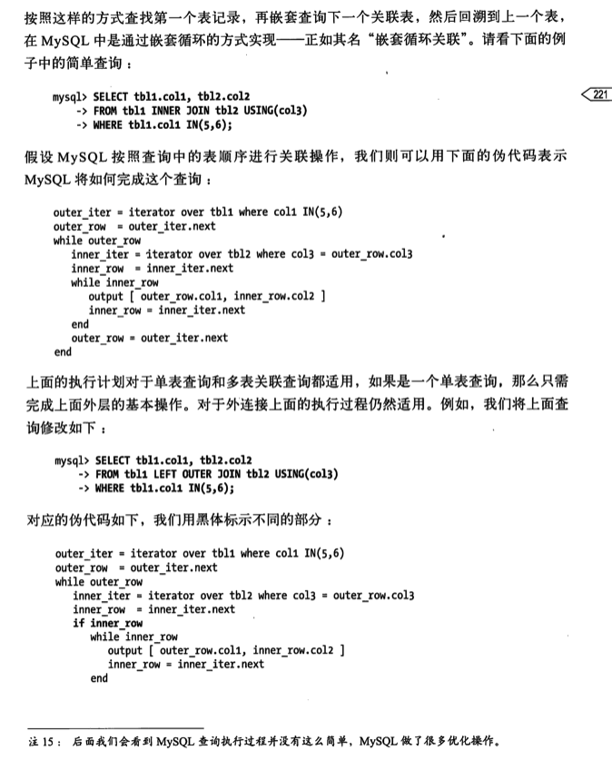
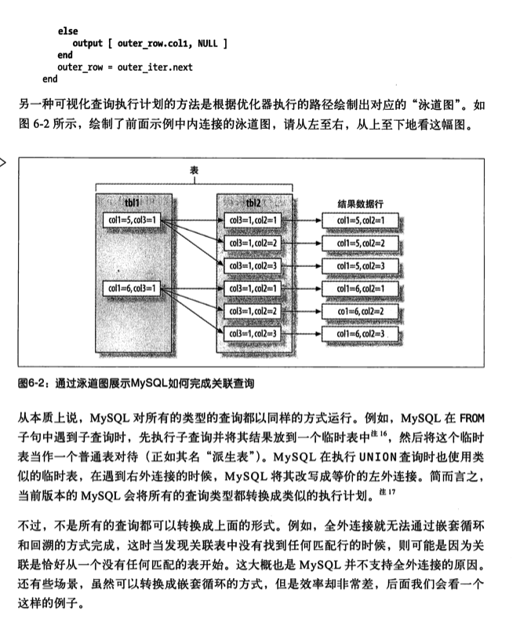

### 执行计划

和其他关系数据库不同，mysql并不会生成查询字节码来执行查询。 而是mysql生成查询的医科指令数，然后通过存储引擎执行完成这棵指令并返回结果。

对某个查询执行explain extended后，再执行show warnings，就可以看出重构出的查询
(mysql根据执行计划生成输出。这和原查询有完全相同语义，但是查询语句可能并不完全相同)
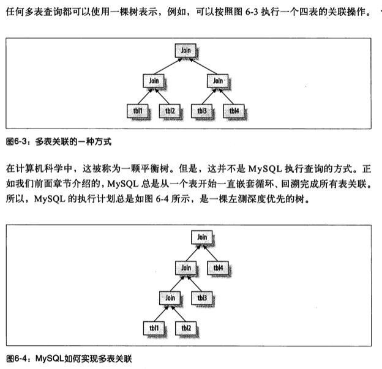

#### 小实验

貌似explain extended中extended已经被标记成待删除标记了，用explain也可以

```
explain select * from t_user;
+----+-------------+--------+------------+------+---------------+--------+---------+--------+--------+----------+--------+
| id | select_type | table  | partitions | type | possible_keys | key    | key_len | ref    | rows   | filtered | Extra  |
+----+-------------+--------+------------+------+---------------+--------+---------+--------+--------+----------+--------+
| 1  | SIMPLE      | t_user | <null>     | ALL  | <null>        | <null> | <null>  | <null> | 994008 | 100.0    | <null> |
+----+-------------+--------+------------+------+---------------+--------+---------+--------+--------+----------+--------+

show warnings;
+-------+------+-----------------------------------------------------------------------------------------------------------------------------------------------------------------------------------------------------------------------------------------------------------------------------------------------------------------------------------------------------------------------------------+
| Level | Code | Message                                                                                                                                                                                                                                                                                                                                                                           |
+-------+------+-----------------------------------------------------------------------------------------------------------------------------------------------------------------------------------------------------------------------------------------------------------------------------------------------------------------------------------------------------------------------------------+
| Note  | 1003 | /* select#1 */ select `trade_in_center`.`t_user`.`id` AS `id`,`trade_in_center`.`t_user`.`c_user_id` AS `c_user_id`,`trade_in_center`.`t_user`.`c_name` AS `c_name`,`trade_in_center`.`t_user`.`c_province_id` AS `c_province_id`,`trade_in_center`.`t_user`.`c_city_id` AS `c_city_id`,`trade_in_center`.`t_user`.`create_time` AS `create_time` from `trade_in_center`.`t_user` |
+-------+------+-----------------------------------------------------------------------------------------------------------------------------------------------------------------------------------------------------------------------------------------------------------------------------------------------------------------------------------------------------------------------------------+
```

### 关联查询优化器

mysql优化器最重要的一部分就是关联查询优化。它决定了多个表关联时的顺序。 通常多表关联的时候，可以有多重不同的关联顺序来获得相同的执行结果。

#### 案例

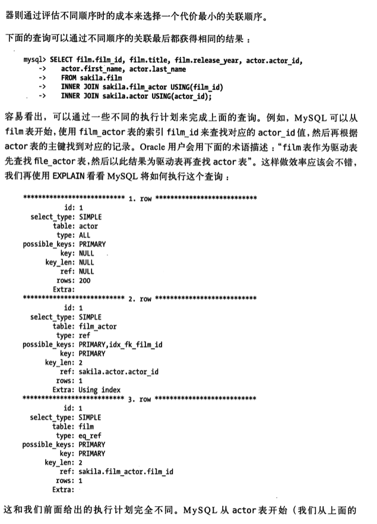
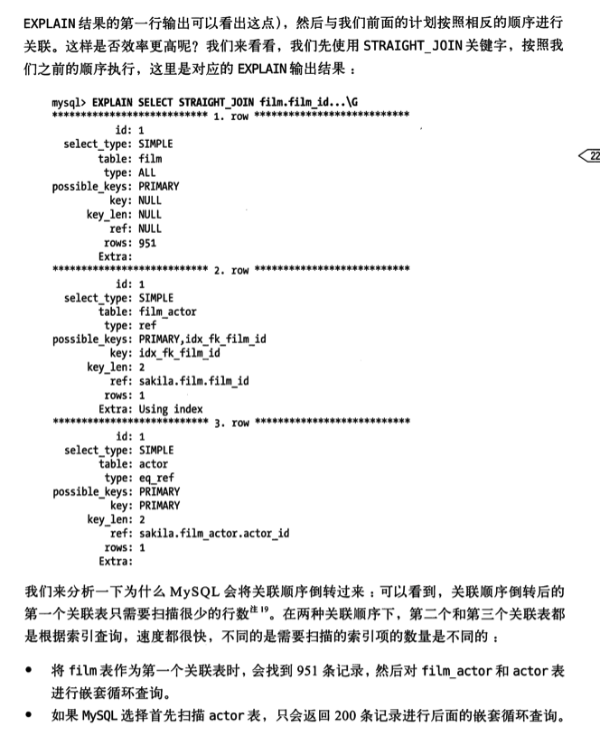
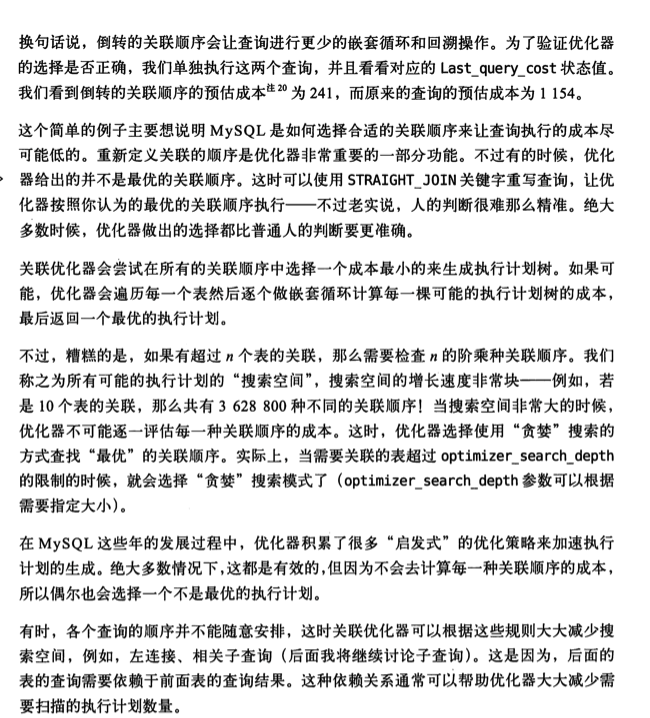

### 排序优化

排序是一个成本很高的操作，从性能角度出发，应该尽可能避免排序或者尽可能避免对大量数据进行排序。 当不能使用索引生成排序结果时，mysql只能自己进行排序。 如果数据量小则在内存中排序，如果数据量大需要使用磁盘。
mysql将这个过程统称为文件排序(filesort)。即使完全是内存排序不需要磁盘也是如此。

排序算法：

* 如果需要排序的数据量小于"排序缓存区"，mysql使用内存进行"快速排序"算法
* 如果内存不够排序，那么mysql先将数据分块，对每个独立块使用"快速排序"算法， 并将各个快排序结果存放到磁盘上，然后将各个排好序的快进行合并(merge)排序算法，最后返回排序结果

#### mysql有两种策略排序方式

* 两次传输排序 读取行指针和需要排序的字段，对其进行排序，然后再根据排序结果读取所需要的数据行。 这需要两次数据传输，即需要从数据表中读取两次数据， 缺点:
  第二次读取数据的时候，因为是读取排序列进行排序后的所有记录，这会产生大量随机I/O，所以两次数据传输成本非常高。 优点:在排序的时候存储尽可能少的数据，这就让"排序缓存区"中可能容纳尽可能多的行数进行排序
* 单次传输排序 先读取查询所需要的所有列，然后再根据给定列进行排序，最后直接返回排序结果。
  优点：因为不在需要从数据表中读取两次数据，对于I/O密集型应用，这样效率高很多。相比两次传输排序，这个算法只需要一次顺序I/O读取所有数据，而无需任何随机I/O。
  缺点：如果返回列非常多，非常大，会额外占用大量空间，而这些列对排序操作本身是没有任何作用的。因为单条排序记录很大，所以可能会有更多的排序快需要合并。

两个算法各有优缺点，都有各自适用的场景. 当查询需要所有列的总长度不超过参数*max_length_for_sort_data*时,mysql使用单次传输排序(貌似mysql5.8版本该参数已经标记成待废弃状态了,详见资料引用1)

需要注意的是mysql在进行文件排序的时候需要使用的临时存储空间可能会比想象的要大得多。 因为对mysql在排序时，对每一个排序记录都会分配一个足够长的定长空间来存放。这个定长空间必须足够长以容纳其中最长的字符串。
例如，如果是VARCHAR则需要分配其完整长度；如果使用utf-8字符集，那么mysql将会为每个字符预留三个字节。

关联查询文件排序
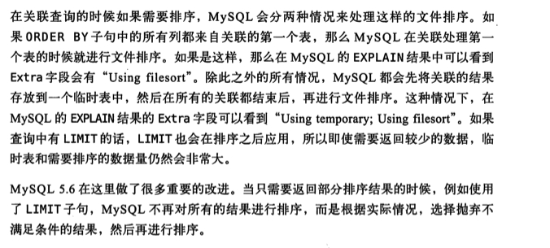

## 6.4.4查询执行引擎

在执行计划逐步执行过程中，有大量操作需要通过调用存储引擎实现的接口来完成，这些接口称为"handler API"接口。
mysql在优化阶段就为每个表创建了一个handler实例，优化器根据这些实例接口可以获取表的相关信息，包括表的所有列名、索引统计信息等等。

存储引擎实现的底层接口只有几十个。但可以通过像搭积木方式完成查询的大部分操作 例如有一个查询某个索引的第一行的接口，在有一个查询某个索引条目的下一个条目的功能，就可以完成全索引扫描操作 优势：让mysql的存储引擎插件式架构成为可能。
缺点：也给优化器带来了一定的限制。

## 6.4.5返回结果给客户端

查询执行的最后一个阶段是将结果返回给客户端。 如果查询可以被缓存，那么mysql在这个阶段也会将结果存放到查询缓存中

mysql将结果集返回客户端是一个增量，逐步返回的过程。 例如前面的关联操作，一但服务器处理完最后一个关联表，开始生成第一条结果是，mysql就开始向客户端逐步返回结果集了。
好处：服务端无需存储太多的结果，也就不会因为要返回太多结果而消耗太多内存。

结果集中的每一行都会一个满足mysql通信协议的封包发送，再通过tcp协议进行传输， 在tcp传输过程中，可能对mysql的封包进行缓存然后批量传输。

# 6.5 mysql查询优化器的局限性

需要注意的是mysql的万能"嵌套循环"并不是对每种查询都是最优的。

## 6.5.1 关联子查询

mysql的子查询实现非常糟糕，最糟糕的一类查询是where条件中包含IN()的子查询语句。

### 案例

希望查询某个演员(actor_id为1)参演过的所有影片信息，用如下子查询实现

```mysql
SELECT *
FROM film
WHERE film_id IN (SELECT film_id FROM film_actor WHERE actor_id = 1);
```

一般来说in()列表查询速度很快，所以我们会认为上面的查询会这样执行
```
-- SELECT GROUP_CONCAT(film_id) from film_actor where actor_id=1; 
-- Result:2,3,4,11
select * from film where film_id in (2,3,4,11);
```
然后mysql却不是这么实现了，对in()列表中的选项有专门的优化策略，mysql会将相关外层表压到子查询中，它
认为这样可以更高效率得查找到数据行，例如下面的查询样子:
```mysql
select * from film 
  where exists(
      select * from film_actor where actor_id=1 and film_actor.film_id =film.film_id
  )
```
通过explain可以看到子查询是一个相关子查询（dependent subquery)
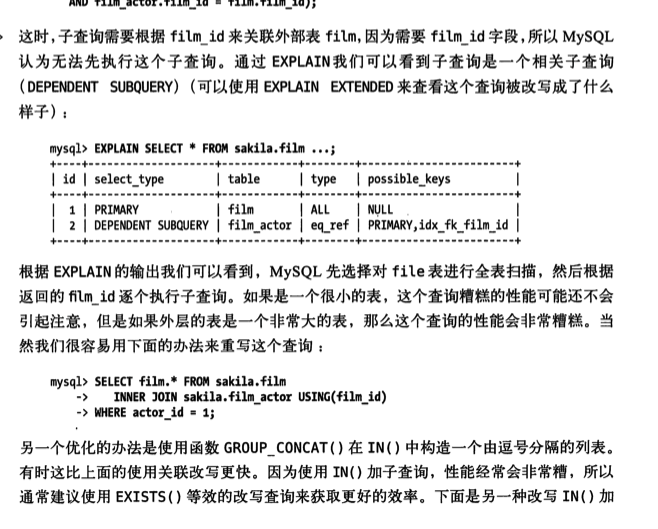

如果外层是一个非常大的表，那么这个查询的性能会非常糟糕

#### 优化方法
使用函数group_concat()在in()中构造一个由逗号分隔的列表。
有时这比上面的使用关联改写更快，因为in()加子查询，性能经常会非常糟,例如
```mysql
select * from film
    where exists(
        select * from film_actor 
            where actor_id=1 and film_actor.film_id=film.film_id
      );
```

本机实验
```
explain SELECT a.* from base_trade_in_order a 
  where a.id in (
    select b.trade_in_order_id from trade_in_order_price_item b 
      where b.active=1 and order_create=1 a nd amount<-100000
  );
+----+--------------+-------------+------------+--------+-----------------------+---------+---------+-------------------------------+--------+----------+-------------+
| id | select_type  | table       | partitions | type   | possible_keys         | key     | key_len | ref                           | rows   | filtered | Extra       |
+----+--------------+-------------+------------+--------+-----------------------+---------+---------+-------------------------------+--------+----------+-------------+
| 1  | SIMPLE       | <subquery2> | <null>     | ALL    | <null>                | <null>  | <null>  | <null>                        | <null> | 100.0    | Using where |
| 1  | SIMPLE       | a           | <null>     | eq_ref | PRIMARY               | PRIMARY | 4       | <subquery2>.trade_in_order_id | 1      | 100.0    | <null>      |
| 2  | MATERIALIZED | b           | <null>     | ALL    | idx_trade_in_order_id | <null>  | <null>  | <null>                        | 2947   |   0.33   | Using where |
+----+--------------+-------------+------------+--------+-----------------------+---------+---------+-------------------------------+--------+----------+-------------+
# 自己可以show warnings观察执行计划生成的mysql语句
```
### 如何用好关联子查询
并不是所有关联子查询性能都会很差，如果有人说"别用关联子查询"，不用理他。
不过实践是真理的唯一标准。
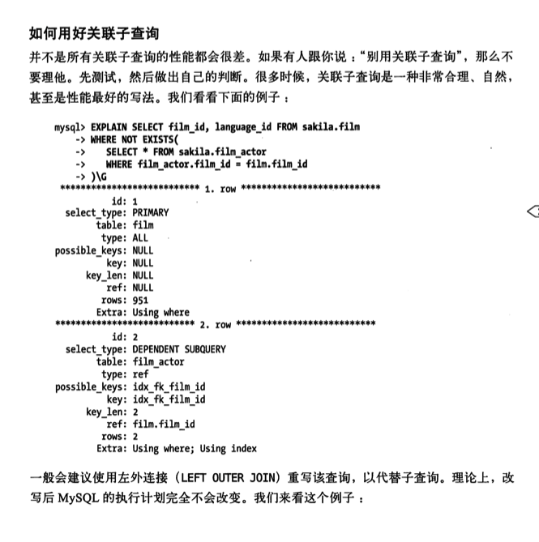
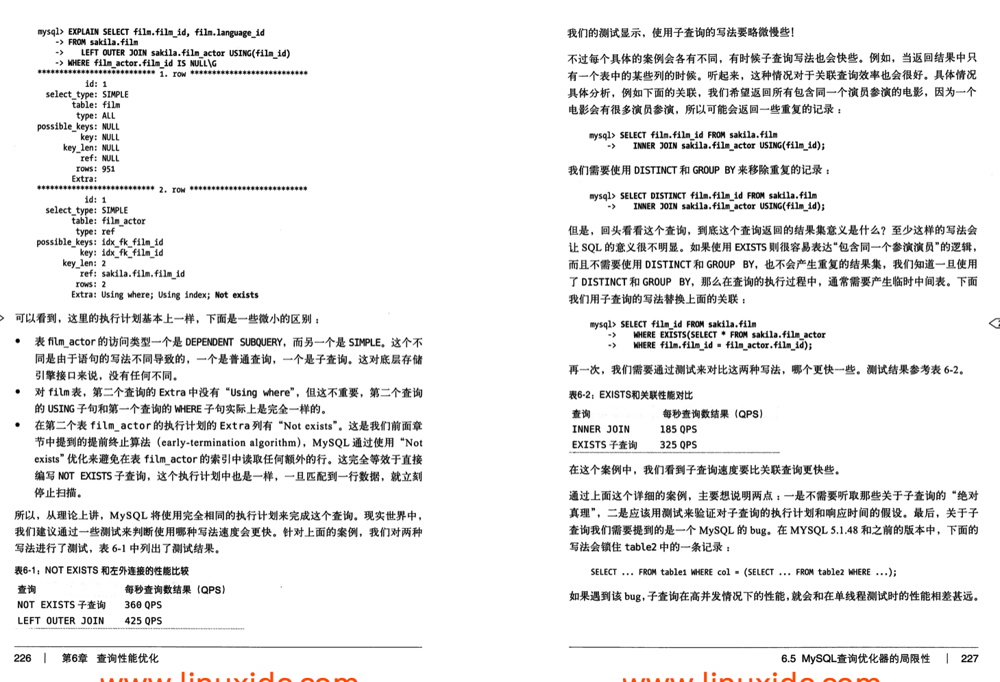

## 6.5.2union的限制
```mysql
(select first_name,last_name
from actor order by last_name)
UNION  ALL 
(select first_name,last_name
    from customer
    order by last_name)
limit 20;
```
====>
```mysql
(select first_name,last_name
from actor order by last_name
    limit 20)
UNION  ALL 
(select first_name,last_name
    from customer
    order by last_name
    limit 20)
limit 20;
```
## 6.5.3索引合并优化

## 6.5.4等值传递
in()列表如果非常大可能会有性能问题

## 6.5.5并行执行
mysql无法利用多核特性来并行执行查询，很多其他关系型数据库能提供这个特性

## 6.5.6哈希关联

## 6.5.7松散索引扫描
因为历史原因,mysql并不支持松散索引扫描，也就无法按照不连续的方式扫描一个索引。
通常mysql索引扫描需要先定义一个起点和终点，
即使需要的数据只是这个段索引中很少数的几个，mysql仍需要扫描这段索引中每一个条目

### 案例
假如有索引(a,b)
```mysql
select ... from tb1 where b between 2 and 3;
```
因为索引前导字段是列a，但查询只指定了字段b，mysql无法使用这个索引，从而只能通过全表扫描找到匹配的行
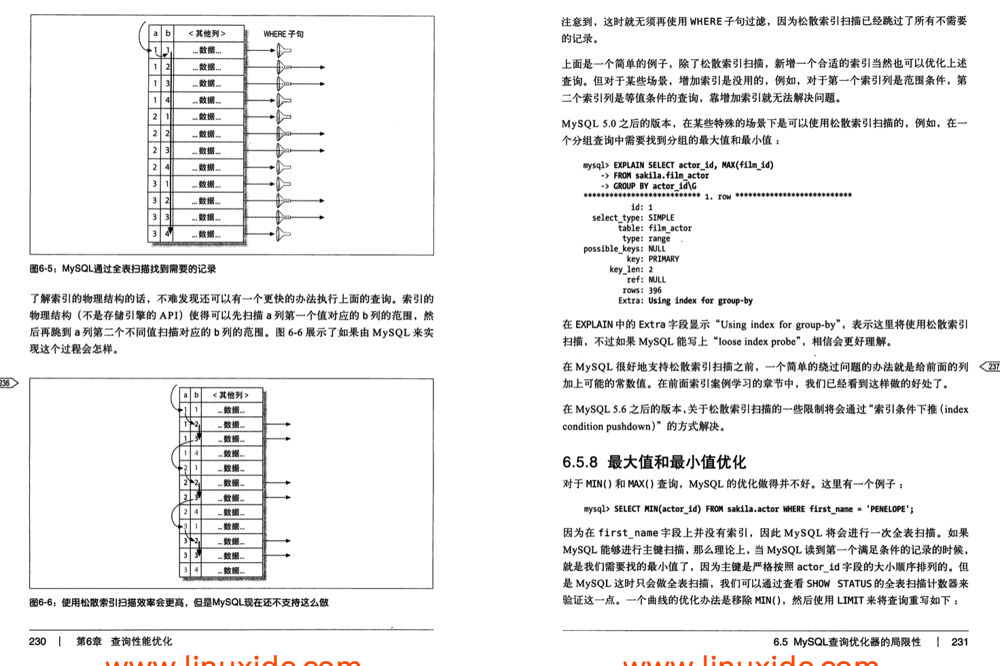

## 6.5.8最大值和最小值优化
对于min()和max()查询，mysql的优化做的并不好。例如
```mysql
select min(actor_id) from actor where first_name ='PENELOPE';
```
因为first_name字段上并没有索引，因此mysql将会进行一次全表扫描。
如果mysql能够进行主键扫描，那么理论上当mysql读到第一个满足条件的记录时候，就是我们需要的最小值了，
因为主键是严格按照actor_id字段的大小顺序排列的。

但是mysql这时只会做全表扫描,我们可以通过show status的全表扫描计数器来验证这一点。

一个曲线优化方法是移除min()，然后使用limit来将查询重写如下
```mysql
select actor_id from actor use index(primary)
where first_name = 'PENELOPE' limit 1;
```
## 6.5.9在同一个表上查询和更新
mysql不允许一个sql对同一张表同时进行查询和更新。
```mysql
update tb1 as outer_tb1
    set cnt=(
        select count(*) from tb1 as innor_tb1
        where innor_tb1.type=outer_tb1.type
      )      
```
```
ERROR 1093(HY000):you can't specify target table 'outer_tb1' for update in from clause
```
可以通过生成表的形式来绕过上面限制。把表当做一个临时表
子查询会在update语句打开表之前就完成
```mysql
update tb1
    innor join(
        select type,count(*) as cnt
        from tb1 
        GROUP BY type
  )as der using(type)
set tb1.cnt=der.cnt
```
# 6.6 查询优化器的提示(hint)
如果对优化器的执行计划不满意，可以使用优化器提供的几个提示(hint)来控制最终的执行计划。
具体提示见mysql官方手册

## HIGH_PRIORITY和LOW_PRIORITY
控制mysql访问某个数据表的队列顺序
前者mysql会将此select语句调度到所有正在等待表锁以便修改数据的语句之前
## DELAYED

##STRAIGHT_JOIN

##SQL_SMALL_RESULT和SQL_BIG_RESULT
只对SELECT语句有效，告诉优化器对GROUP BY或者DISTINCT查询如何使用临时表以及排序。
前者告诉优化器结果集会很小，可以将结果集放在内存中的索引临时表，以避免排序操作
后者告诉优化器结果集可能会非常大，建议使用磁盘临时表做排序操作。
## SQL_BUFFER_RESULT

## SQL_CACHE和SQL_NO_CACHE

## SQL_CALC_FOUND_ROWS

## FOR UPDATE和LOCK IN SHARE MODE
主要控制select语句的锁机制，但只对实现了行级锁的存储引擎有效。
使用该提示会对符合查询条件的数据行加锁。
对于INSERT....SELECT语句是需要这两个提示的，因为mysql会默认给这些记录加上读锁。

注意这两个提示会让某些优化无法正常使用，例如索引覆盖扫描。
innodb不能在不访问主键的情况下排他地锁定行，因为行的版本信息保存在主键中。

## USE INDEX、IGNORE INDEX和FORCE INDEX
这几个提示会告诉优化器使用或者不适用哪些索引来查询（例如，在决定关联顺序的时候使用哪个索引）。

mysql还提供了一些参数用来控制优化器的行为：
* optimizer_search_depth
  在穷举执行计划时的限度。如果查询长时间处于"Statistics"状态，那么可以参考调低次参数
* optimizer_prune_level
  
* optimizer_switch


# 6.7 优化特定类型的查询
汇总一波,方便参考和查阅

## 6.7.1优化count()查询
count()是一个特殊的函数，有两种不同的作用
* 可以统计某个列值的数量,要求列值是非空的(不统计NULL)
  如果在COUNT()的括号中指定了列或者列的表达式，则统计的就是这个表达式有值的结果数
* 也可以统计行数，例如最简单的就是当我们使用count(*)的时候，她会忽略所有的列而直接统计所有的行数
  最常见的错误就是在括号内指定了一个列却希望统计结果集的行数。
  
### 关于MyISAM的神话

### 使用近似值
精确度要求不高的话，可以考虑通过explain的估算行数来查看

## 6.7.2优化关联查询
* 确保ON或者USING子句中的列有索引。在创建索引的时候就要考虑关联的顺序。
  当表A和表B用c关联时候，如果优化器的关联顺序是B，A，那么就不需要在B表的对应列上建上索引。
  一般除非有其他理由，否则只需要在关联顺序中的第二个表的相应列上创建索引。

## 6.7.3优化子查询
最重要的建议是尽量使用关联查询替代，至少当前版本mysql版本需要这样。
如果使用的是mysql5.6就可以直接忽略关于子查询的这些建议了。

## 6.7.4优化group by和distinct
很多场景，mysql都是用相同的办法优化这两种查询。
使用索引优化这是最有效的优化办法

在无法使用索引的时候，group by使用两种策略来完成分组
* 使用临时表
* 文件排序
前面的*SQL_BIG_RESULT*和*SQL_SMALL_RESULT*

具体案例见书籍吧

## 6.7.5优化limit分页

一个常见的问题就是，limit的偏移量非常大的时候。
例如limit 1000，20这样的查询，这时mysql需要查询10020条记录然后只返回最后20条，前面10000条记录都将被抛弃，这样代价非常高。

优化这种查询
* 在页面限制分页的数量
* 优化大偏移量的性能
* 业务层改造分页查询形式,例如如果允许的话，转化为主键范围查询 where id>XXX order by id limit 20

最简单的办法就是尽可能地使用索引覆盖扫描，而不是查询所有的列。
然后根据需要做一次额外的关联操作再返回所需的列(非两次查询)。

### 案例
```mysql
select film_id,description from film order by title limit 50,5;
```
如果这个表非常大，那么这个查询可以优化成如下
```mysql
select film.film_id,film.description
from film
    innor join(
        select film_id from film
        order by title limit 50,5
  )as lim using(film_id);
```
这里的"延迟关联"将大大提升查询效率，让mysql扫描尽可能少的页面，获取需要访问的记录后再根据关联列回原表查询所需要的所有列。
这个技术也可以用于优化关联查询中的limit子句。


## 6.7.6优化SQL_CALC_FOUND_ROWS

## 6.7.7优化UNION查询
mysql总是通过创建并填充临时表的方式来执行union查询，因此很多优化策略在union查询中都没法很好地使用。

## 6.7.8静态查询分析
Percona Toolkit中的pt-query-advisor能够解析查询日志，分析查询模式，
然后给出所有可能存在潜在问题的查询，并给出足够详细的建议。

## 6.7.9使用用户自定义变量
貌似有很多案例可用,有兴趣的可以直接去看看书籍

# 6.8案例学习

## 6.8.1使用MySQL构建一个队列表
这是一个取巧的做法，在高流量高并发场景下表现并不好。
典型模式是一个表包含多种类型的记录：未处理记录，已处理记录，正在处理记录等等。
* 一个或者多个消费者线程在表中查找未处理记录
* 然后声称正在处理中
* 当处理完成后，再将记录更新成已处理状态

缺点
* 队列表越来越大和索引深度的增加，找到未处理记录的速度会随之变慢
  --->将队列表分为两部分，将已处理记录归档或者存放到历史表(activity中的task表就是这么干的），可以始终保证队列表很小
* 处理过程先找到未处理记录然后加锁。加锁操作则会让各个消费者进程增加竞争
  需要解决的问题是如何让消费者标记正在处理的记录，而不至于让多个消费者重复处理一个记录。
  一般使用SELECT FOR UPDATE来实现，这通常是扩展性问题的根据，这会导致大量事务阻塞并等待。
  需要尽量避免使用SELECT FOR UPDATE.

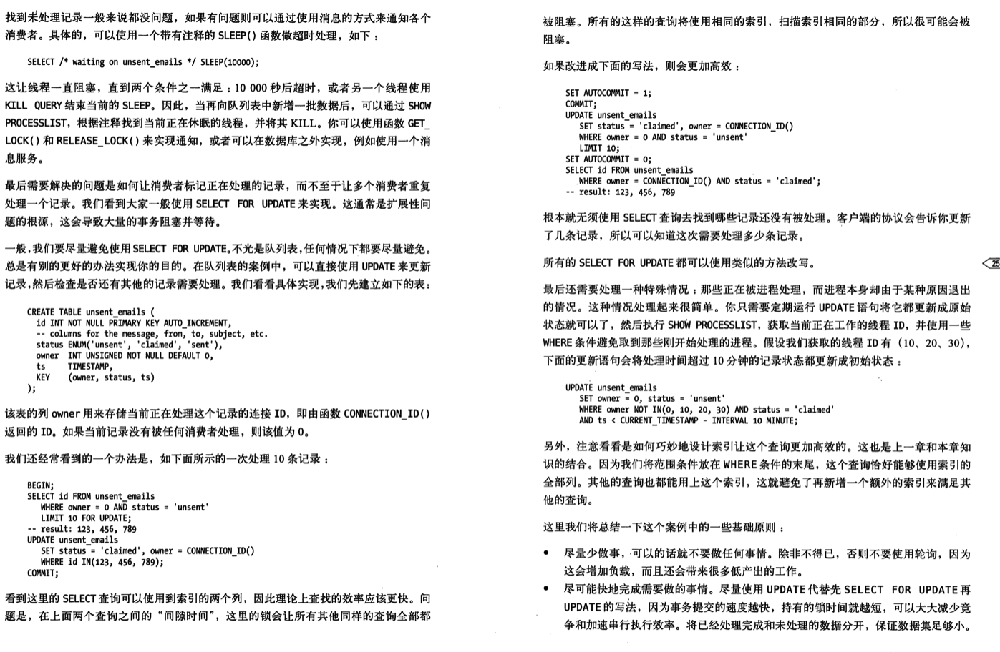

## 6.8.2 计算两点之间的距离

## 6.8.3使用用户自定义函数

# 6.9总结

# 参考资料

## 书籍

* 1.Lahdenmaki和Mike Leach编写的Relational Database Index Design and Optimizers(Wiley出版社)
* 2.Bill Karwin的SQL Antipatterns(一本实践性书籍)，介绍如何使用SQL解决各种程序猿疑难杂症
## 资料

* 1.[mysql 8.2.1.16 ORDER BY Optimization](https://dev.mysql.com/doc/refman/8.0/en/order-by-optimization.html)
