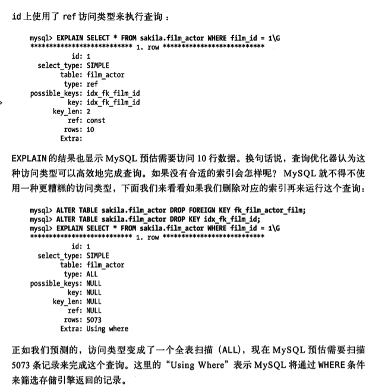
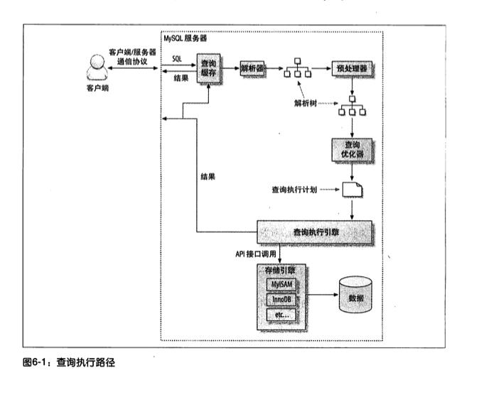

mysql优化器机制

齐头并进，举案齐眉
* 查询优化
* 索引优化
* 库表结构优化

# 6.1为什么查询速度会慢
查询最重要的是响应时间.查询任务可以由一系列子任务组成，每一个子任务都会消耗一定时间.
优化查询，实际上要优化其子任务(又回到了第三章的方法论了)
* 要么消除其中一些子任务
* 要么减少子任务的执行次数
* 要么让子任务运行得更快

从MySQL体系架构图中可以看出查询的生命周期大致如下：
从客户端到服务器,然后在服务器上进行解析，生成执行计划，执行，并返回结果给客户端。
"执行"算是真个生命周期最重要的阶段，其中包括大量为了检索数据到存储引擎的调用以及调用后的数据处理，包括排序,分组等。

查询可能花费时间地方(很多通用性能优化时间花费)
* 网络
* CPU计算
* 生成统计信息和执行计划
* 锁等待(互斥等待)
* I/O操作
* 上下文切换
* 系统调用等等


# 6.2慢查询基础:优化数据访问
查询性能低下最基本的原因是访问数据太多

分析方法确认是否访问了不必要的数据
* 1.确认应用程序是否在检索大量超过需要的数据.这通常意味着访问了太多的行,但有时候也可能是访问了太多的列(然而在现有orm框架下基本列全访问,开发便捷角度出发).
* 2.确认MySQL服务器层是否在分析大量超过需要的数据行(分析+量化)

## 6.2.1是否想数据库请求了不需要的数据
最终这些多余数据又被丢弃了

坏处:
* 增加mysql服务器负担
* 增加网络开销
* 消耗应用服务器的CPU和内存资源

### 典型案例场景
1.查询不需要的记录

2.多表关联时返回全部列
```mysql
select * from actor 
    inner join film_actor using(actor_id)
    INNER JOIN film using(film_id)
    where film.title='Academy Dinosaur';
```
返回了全部数据列,正确应该是只取需要的列 select actor.* from ...

3.总是取出全部列
典型的业务开发代码:"select *"
select 所有列名 简化*解析，如果这么用需要明确知道代价和好处
好处:提高研发效率，加上缓存机制
坏处:有一定的性能影响

4.重复查询相同的数据
同一个业务请求中处理总是查询相同的数据

## 6.2.2Mysql是否在扫描额外的记录
首先对于mysql,最简单的衡量查询开销的三个指标如下:
* 响应时间
* 扫描行数
* 返回行数

这三个指标都会记录到mysql的慢日志中，所以检查慢日志记录是找出扫描行数过多的查询的好办法。

### 响应时间
最重要的指标，两部分时间之和：服务时间和排队时间(等待时间)(计算机所有响应时间都可以分为该两部分)
服务时间：数据库处理这个查询真正花了多长时间.
排队时间：服务器因为等待某系资源(CPU/锁/IO等等)而没有真正执行查询的时间-可能是等I/O操作完成，也可能是等待行锁，等等。
不幸的是很难测量各个部分等待时间

需要注意的是响应时间可能是一个问题的结果也可能是一个问题的原因，需要用到第三章的
"单个查询问题还是服务器问题"一节介绍的技术来确定到底是因还是果。

#### 响应时间"快速上限估计"方法:
了解这个查询需要哪些索引以及它的执行计划是什么，
然后计算大概需要多少个顺序和随机I/O，
再用其乘以再具体硬件条件下一次I/O的消耗时间.
最后把这些消耗都加起来，就可以获得一个大概参考值来判断当前响应时间是不是一个合理的值.

预估方法来源于参考资料书籍1

### 扫描的行数和返回行数

一般扫描行数对返回行数比率通常较小，一般在1:1和10:1之间

### 扫描的行数和访问类型 
在评估查询开销时候，需要考虑下从表中找到某一行数据的成本.
explain语句中的type列反应了访问类型(详见官方文档，里面有详细介绍)
常数引用,唯一索引查询，范围扫描,索引扫描，全表扫描
快---------------------------------->慢

如果查询没有办法找到合适的访问类型，那么解决的最好办法通常是增加一个合适的索引,

#### 案例
使用索引和不使用explain的type类型和预计扫描行数大不相同


一般mysql使用where条件的三种方式，从好到坏依次为:
* 在索引中使用where条件来过滤掉不匹配的记录，这是在存储引擎层完成的。不需要mysql服务器介入
* 使用索引覆盖扫描(在Extra列中出现了Using index)来返回记录,直接从索引中过滤不需要的记录
并返回命中的结果。这是在mysql服务器层完成的，但无须再回表查询记录(这个操作怎么理解呢)
* 从数据表中返回数据，然后过滤不满足条件的记录(Extra列中出现Using where).这在mysql服务器
层完成，mysql需要先从数据表读出记录然后过滤。


如果发现查询需要扫描大量的数据但只返回少数的行(可能场景之一汇总聚合查询),那么通常可以尝试下面的技巧去优化它:
* 使用索引覆盖扫描，把所有需要用的列都放到索引中,这样存储引擎无需回表获取数据行就可以返回结果
* 改变库表结构。例如使用单独的汇总表（第4章提到过)
* 重写这个复杂的查询，让mysql优化器能够以更优化的方式执行这个查询(本章后续讨论的问题)

# 6.3重构查询的方式
通过应用端代码调整查询
## 6.3.1一个复杂查询还是多个简单查询

## 6.3.2切分查询
有时会把一个大查询切分成小查询，每个查询功能完全一样,每次只返回一小部分查询结果。

典型场景删除旧的数据。定期清除大量数据时，如果用一个大的语句一次性完成的话，
则可能需要一次锁住很多数据，占满整个事务日志，耗尽系统资源，阻塞很多小的但重要的查询。

每个月运行一次下面查询
```mysql
delete from messages where created<date_sub(now(),interval 3 month);
```

```
rows_affected=0
do{
    rows_affected = do_query(
        "delete from messages where created<date_sub(now(),interval 3 month)
        limit 10000")
} while rows_affected>0
```
一次删除一万行数据一般来说是一个比较高效而且对服务器影响也最小的做法.
如果每次删除数据后，暂停一会再做下一次删除，这样可以将服务器上原本一次性的压力分散到
一个很长的时间段中，就可以大大降低对服务器的影响，还可以减少删除时锁的持有时间。

## 6.3.3 分解关联查询
```mysql
select * from tag
    join tag_post on tag_post.tag_id=tag.id
    join post on  tag_post.post_id=post.id
where tag.tag='mysql';
```
可以分解成多个单查询替代
```mysql
select * from tag where tag='mysql';
select * from tag_post where tag_id=1234;
select * from post where post.id in (123,456,567,9098,8904);
```
优势:
* 让缓存效率更高.方便缓存单标查询结果对象。
* 将查询分解后，执行单个查询可以减少锁的竞争。
* 在应用层做关联，可以更容易对数据库进行拆分(分库分表)。
* 查询本身效率也会有所提升。
* 减少冗余记录的查询
* 相当于在应用中失效了哈希关联，而不使用mysql的嵌套循环关联。


# 6.4查询执行的基础
mysql查询执行路径图

* 1.客户端发送一条查询给服务器
* 2.服务器先检查查询缓存,命中缓存则立刻返回存储在缓存中的结果。否则进入下一个阶段
* 3.服务器进行SQL解析、预处理，再由优化器生成对应的执行计划。
* 4.mysql根据优化器生成的执行计划，调用存储引擎的API来执行查询。
* 5.将结果返回给客户端。

## 6.4.1 mysql客户端/服务器通信协议
"半双工"
一旦一端开始发生消息，另一端要接收完整个消息才能响应它。

优势简单
缺点：没法流量控制
mysql服务器端一般要等所有数据都已经发送给客户端才能释放这条查询所占用的资源。

### 查询状态
mysql连接(或者说线程)状态,详见mysql官网手册
[general thread states](https://dev.mysql.com/doc/refman/8.0/en/general-thread-states.html)
使用show full processlist命令可以查看连接状态

* Sleep:线程等待客户端发送新的请求
* Query:线程正在执行查询或者正在将结果发送给客户端
* Locked:在mysql服务器层面，该线程正在等待表锁。在存储引擎级别实现的锁，例如innodb的行锁，并不会体现在线程状态中。
* Analyzing and statistics：线程正在收集存储引擎的统计信息，并生成查询的执行计划
* Copying to tmp table[on disk] 线程正在执行查询，并且将其结果都复制到一个临时表中，这种状态
要么是在做group by操作，要么是文件排序操作，或者是union操作。如果这个状态后面还有"on disk"标记，
那表示mysql正在将一个内存临时表放到磁盘上。
* Sorting result 线程正在对结果集进行排序
* Sending data 这表示多种情况：线程可能在多个状态之间传送数据，或者在生成结果集，或者在向客户端返回数据

了解这个状态的基本含义非常有用，如果看到大量的不正常的状态，例如statistics正在占用大量时间，便于分析问题

## 6.4.2查询缓存
如果查询缓存是打开的，那么mysql会优先检查这个查询是否命中查询缓存中的数据。
这个检查是通过一个对大小写敏感的哈希查找实现的。
如果命中缓存，则直接从缓存中拿到结果并返回给客户端。不会有后续的步骤例如查询解析，生成执行计划等步骤了。(第7章查询缓存一节会学到更多细节)

## 6.4.3查询优化处理
查询的生命周期下一步是将一个SQL转化成一个执行计划，MySQL再依照这个执行计划和存储引擎进行交互。
包括多个子阶段：解析SQL，预处理，优化SQL执行计划

### 语法解析器和预处理
mysql通过关键字将SQL语法进行解析，并成成一颗对应的"解析树"。
mysql解析器将使用MySQL语法规则验证和解析查询。例如是否使用错误的关键字，或者使用关键字顺序是否正确
预处理器则根据一些mysql规则进一步检查解析树是否合法，例如检查数据表和数据列是否存在，还会解析名字和别名。
预处理器还会验证权限

### 查询优化器
优化器将语法书转化为执行计划。
一条查询可以有多种执行方式，最后都返回相同结果。
优化器作用就是找到这其他最好的执行计划。

MySQL使用基于成本的优化器，它尝试预测一个查询使用某种执行计划时的成本，并选择其中成本最小的一个。
最初：成本的最小单位是随机读取一个4K数据页的成本，后来(成本计算公式)变得复杂,并引入一些"因子"来估算某些操作的代价，
如当执行一次where条件比较的成本。
可以通过查询当前会话的Last_query_cost的值得知mysql计算的当前查询的成本
>show status like 'Last_query_cost';

```
select * from base_trade_in_order;
show status like 'Last_query_cost';
+-----------------+---------------+
| Variable_name   | Value         |
+-----------------+---------------+
| Last_query_cost | 2225.599000 |
+-----------------+---------------+
```
该结果表示mysql优化器认为大概需要做2225个数据页的随机查询才能完成上面查询。
这是根据一系列统计信息计算得来的：
* 每个表或者索引的页面个数
* 索引的基数(索引中不同值的数量)
* 索引和数据行的长度
* 索引分布情况

优化器在评估成本时候不考虑任何层面的缓存，它假设读取任何数据都需要一次磁盘I/O.

mysql优化器选择错误的执行计划可有有
* 统计信息不准确。mysql依赖存储引擎提供的统计信息来评估成本，但有的存储引擎提供的信息是准确的，有的偏差很大。
例如innodb因为其MVCC的架构，并不能维护一个数据表的行数的精确统计信息。
* 执行计划中的成本估算不等同实际执行的成本。所以即使统计信息精确，优化器给出的执行计划也可能不是最优的。例如有时候某个执行计划虽然需要读取更多的页面，但是它的成本缺更小。
因为如果这些页面都是顺序读或者这些页面都已经在内存的话，那么它的访问成本将很小。MySQL层面并不知道哪些页面在内存中，哪些在磁盘上，所以查询实际执行过程中到底需要多少次物理I/O是无法得知的。
* Mysql的最优可能可能和你想的最优不一样。你可能希望执行时间尽可能得短，但是Mysql只是基于器成本模型选择最优的执行计划，而有时这并不是最快的执行计划
* MySQL从不考虑其他并发执行的查询，这会影响当前查询的速度
* MySQL也并不是任何时候都基于成本的优化，有时也会基于一些固定的规则。例如如果存在全文搜索的MATCH()子句，则在存在全文索引的时候使用全文索引。
* MySQL不会考虑不受其控制的操作的成本，例如执行存储过程或者用户自定义函数的成本
* 有时优化器无法估算所有可能的执行计划，所以它可能错误实际上最优的执行计划。


# 参考资料
## 书籍
* 1.Lahdenmaki和Mike Leach编写的Relational Database Index Design and Optimizers(Wiley出版社)


