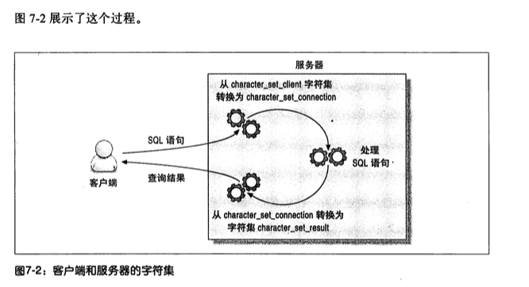
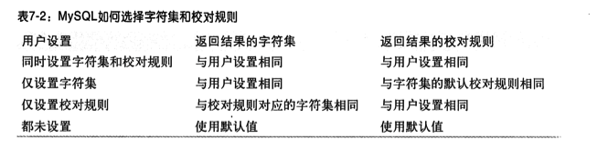
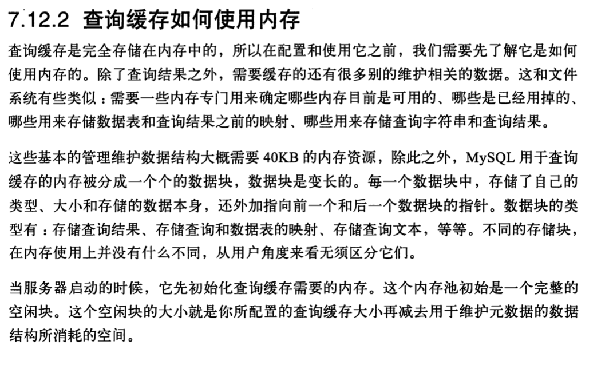
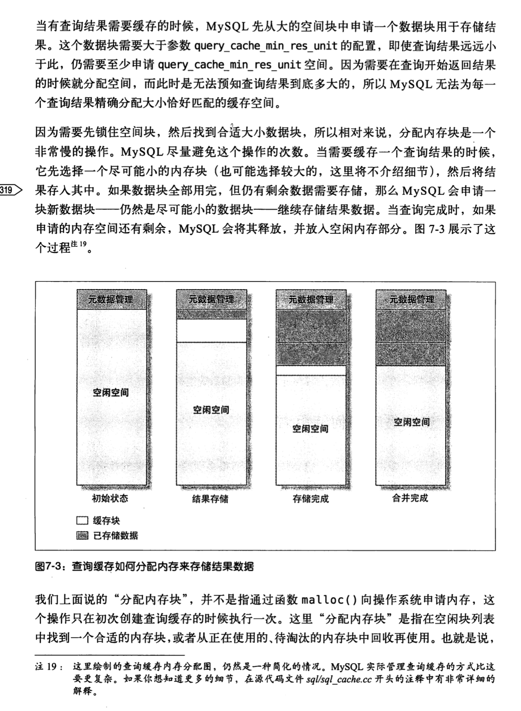
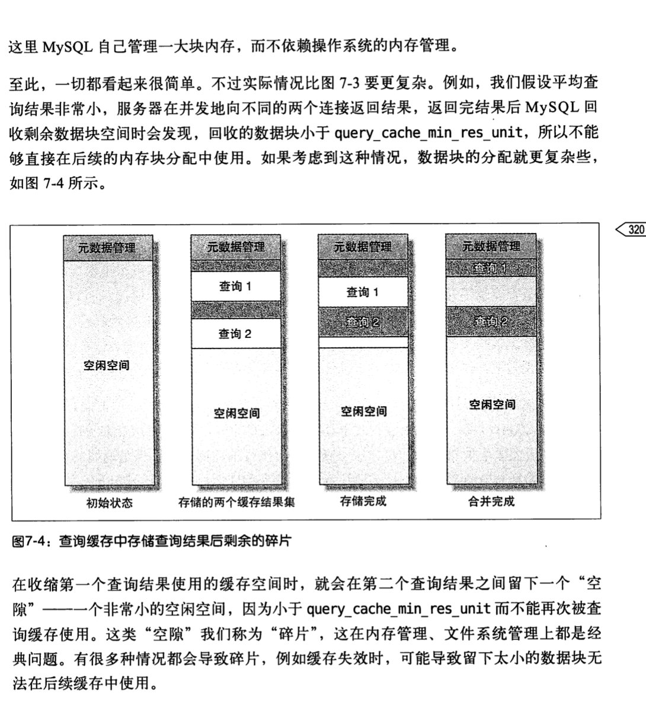

# 7.1分区表
最主要目的
根据分区定义过滤那些没有我们需要数据的分区，这样查询就无需扫描所有分区--提高查询效率

使用CREATE TABLE *PARTITION BY*语句

我们通常所说的数据库sharding应该没用到mysql的分区表，自定义路由策略
扩展性，迁移性更方便
## 7.1.1分区表的原理

## 7.1.2分区表的类型

## 7.1.3如何使用分区表

## 7.1.4什么情况下会出问题

## 7.1.5查询优化

## 7.1.6合并表
要淘汰的技术

# 7.2视图
应用程序猿不推荐使用，详细见书籍

# 7.3外检约束
应用程序猿不推荐使用，详细见书籍

# 7.4在mysql内部存储代码
应用程序猿不推荐使用，详细见书籍
## 7.4.1存储过程和函数
## 7.4.2触发器
## 7.4.3事件
例如定时执行*optimize table*事件
# 7.5游标

# 7.6绑定变量

# 7.7用户自定义函数

# 7.8插件

# 7.9字符集和校对
"校对"是指一组用于某个字符集的排序规则。

## 7.9.1 mysql如何使用字符集
每种字符集都可能有多重校对规则，并且都有一个默认的校对规则。
每个校对规则都是针对某个特定的字符集的，和其他字符集没有关系。

校对规则和字符集总是一起使用的。

MySQL的设置可以分为两类
* 创建对象时的默认值
* 在服务器和客户端通信时的设置

### 创建对象时的默认设置
数据库，表，字段(从高到底)都可以有默认值，最底层默认设置优先级最高
### 服务器和客户端通信时的设置
* 服务端总是假设客户端按照character_set_client设置的字符来传输数据和SQL语句的
* 当服务器收到客户端的SQL语句时，它先将其转化为字符集character_set_connection
  它还是用这个设置来决定如何将数据转化成字符串
* 当服务器返回数据或者错误信息给客户端时，它会将其转换成character_set_result


```
#mysql5.7查看char字符集相关配置
show variables like 'char%';
+--------------------------+---------------------------------------+
| Variable_name            | Value                                 |
+--------------------------+---------------------------------------+
| character_set_client     | utf8                                  |
| character_set_connection | utf8                                  |
| character_set_database   | utf8mb4                               |
| character_set_filesystem | binary                                |
| character_set_results    | utf8                                  |
| character_set_server     | utf8                                  |
| character_set_system     | utf8                                  |
| character_sets_dir       | /u01/mysql57_20200430/share/charsets/ |
+--------------------------+---------------------------------------+
```
## MySQL如何比较两个字符串的大小

## 一些特殊情况

## 7.9.2选择字符集和校对规则

极简原则
先为服务器选择一个合理的字符集，然后根据不同的实际情况，让某些列选择合适的字符集

校对规则
是否以大小写敏感的方式比较字符串,或者以字符串编码的二进制值来比较大小
规则前缀分别为
* _cs:大小写敏感
* _ci:大小写不敏感
* _bin:二进制

我们平时使用的字符集和校对规则是utf8和utf8_general_ci, 
比较时是大小写不敏感，最后面的空格也会被忽略



查看表每个列字符集和校对规则
>show full columns from tb_name;

```
show full columns from t_user;
+---------------+-------------+--------------------+------+-----+---------+----------------+---------------------------------+---------+
| Field         | Type        | Collation          | Null | Key | Default | Extra          | Privileges                      | Comment |
+---------------+-------------+--------------------+------+-----+---------+----------------+---------------------------------+---------+
| id            | int         | <null>             | NO   | PRI | <null>  | auto_increment | select,insert,update,references |         |
| c_user_id     | varchar(36) | utf8mb4_0900_ai_ci | NO   | MUL |         |                | select,insert,update,references |         |
| c_name        | varchar(22) | utf8mb4_0900_ai_ci | NO   | MUL |         |                | select,insert,update,references |         |
| c_province_id | int         | <null>             | NO   | MUL | <null>  |                | select,insert,update,references |         |
| c_city_id     | int         | <null>             | NO   |     | 1       |                | select,insert,update,references |         |
| create_time   | datetime    | <null>             | NO   |     | <null>  |                | select,insert,update,references |         |
+---------------+-------------+--------------------+------+-----+---------+----------------+---------------------------------+---------+
```

## 7.9.3字符集和校对规则如何影响查询
例如，数据表film在列title上有索引，
```mysql
explain select title from film order by title;
```
需要注意的是只有排序查询要求的字符集与服务器数据的字符集相同的时候，才能使用索引进行排序。
*索引根据数据列的校对规则*进行排序
```
show create table t_user\G;
***************************[ 1. row ]***************************
Table        | t_user
Create Table | CREATE TABLE `t_user` (
  `id` int NOT NULL AUTO_INCREMENT,
  `c_user_id` varchar(36) NOT NULL DEFAULT '',
  `c_name` varchar(22) NOT NULL DEFAULT '',
  `c_province_id` int NOT NULL,
  `c_city_id` int NOT NULL DEFAULT '1',
  `create_time` datetime NOT NULL,
  PRIMARY KEY (`id`),
  KEY `idx_user_id` (`c_user_id`),
  KEY `idx_pro_city` (`c_province_id`,`c_city_id`) USING BTREE,
  KEY `idx_name` (`c_name`) USING BTREE
  ) ENGINE=InnoDB AUTO_INCREMENT=1000001 DEFAULT CHARSET=utf8mb4 COLLATE=utf8mb4_0900_ai_ci
```

```
explain select * from t_user order by c_name limit 100;
+----+-------------+--------+------------+-------+---------------+----------+---------+--------+------+----------+--------+
| id | select_type | table  | partitions | type  | possible_keys | key      | key_len | ref    | rows | filtered | Extra  |
+----+-------------+--------+------------+-------+---------------+----------+---------+--------+------+----------+--------+
| 1  | SIMPLE      | t_user | <null>     | index | <null>        | idx_name | 90      | <null> | 100  | 100.0    | <null> |
+----+-------------+--------+------------+-------+---------------+----------+---------+--------+------+----------+--------+
```
毫无疑问走了索引，但是如果我们调整了不同的校对规则呢，再看看explain计划
```
explain select * from t_user order by c_name collate utf8mb4_bin limit 100 ;
+----+-------------+--------+------------+------+---------------+--------+---------+--------+--------+----------+----------------+
| id | select_type | table  | partitions | type | possible_keys | key    | key_len | ref    | rows   | filtered | Extra          |
+----+-------------+--------+------------+------+---------------+--------+---------+--------+--------+----------+----------------+
| 1  | SIMPLE      | t_user | <null>     | ALL  | <null>        | <null> | <null>  | <null> | 994008 | 100.0    | Using filesort |
+----+-------------+--------+------------+------+---------------+--------+---------+--------+--------+----------+----------------+
```
此时发现没法利用索引，需要使用文件排序.也可以理解，因为索引值大小需要通过数据列的校对规则比较

在多字节字符集中，一个字符不再是一个字节。计算字符串的长度有
* LENGTH()：返回字节长度
* CHAR_LENGTH()：返回字符长度

```
mysql root@localhost:trade_in_center> select CHAR_LENGTH('你好');
+---------------------+
| CHAR_LENGTH('你好') |
+---------------------+
| 2                   |
+---------------------+
1 row in set
Time: 0.007s
mysql root@localhost:trade_in_center> select LENGTH('你好');
+----------------+
| LENGTH('你好') |
+----------------+
| 6              |
+----------------+
1 row in set
Time: 0.010s
```

# 7.10全文索引
了解下即可，使用还是看基于Lucene的ES吧

# 7.11分布式(XA)事务
mysql通过两阶段提交协议实现

# 7.12查询缓存
默认关闭，mysql8中已经废弃掉该功能了

查询缓存对应用端透明

缓存失效策略
跟踪查询中涉及到的每个表，如果这些表发生变化，那么和这个表相关的所有查询缓存都将会失效(多核情况下这样子容易形成单点)
缺点：可能数据变更时有可能对应的查询结果并没有变更
优点：
* 实现简单
* 对应用程序无感

## 既然缓存能提高查询效率,那为什么mysql5.8中将查询缓存功能废弃呢
cj:有意思问题
需要注意的是:查询缓存操作是一个加锁排他操作(想想如果有这样一个订单缓存,一涉及到订单变更或新增，缓存就失效，那个订单缓存如果再加上排他锁，资源竞争得有多严重)
TODO:cj 在单核情况下，工作线程有多少个,redis单个工作线程

* 查询缓存经过性能测试被发现是一个影响服务器扩展性的因素
* 可能成为整个服务器的资源竞争点
* 在多核服务器上还可能导致服务器僵死

## 7.12.1mysql如何判断缓存命中
缓存存放在一个哈希引用表中，
哈希值影响因素:查询本身,当前要查询的数据库,客户端协议的版本等。

当判断缓存是否命中是，mysql不会解析，"正规化"或者参数化查询语句,而是直接使用SQL语句和客户端发送过来的其他原始信息.
任何字符上的不同，例如空格，注释-任何的不同-都会导致缓存的不命中。

无法使用缓存的场景
* 查询语句包含不确定的数据，例如函数NOW()或者CURRENT_DATE(),current_user,connection_id,任何用户自定义函数，存储函数，用户变量，临时表，mysql库系统表，或者任何包含列级别权限的表等等(具体见官网手册)

```mysql
DATE_SUB(CURRENT_DATE,INTERVAL 1 DAY) ##not cacheable!
DATE_SUB('2021-01-04',INTERAVL 1 DAY) ##Cacheable
```

查询缓存的消耗
* 读查询在开始之前必须先检查是否命中缓存
* 如果读查询可以被缓存，把结构存入查询缓存，这会有一定额外的系统消耗
* 写操作有影响，当向某个表写入数据时候，mysql必须将对应表的所有缓存都设置失效。如果查询缓存非常大或者碎片很多，这个操作可能会带来很大系统消耗
* 对查询缓存是一个加锁排他操作
* 对innodb用户来说，事务的MVCC特性，长时间运行的事务会大大降低查询缓存的命中率
  (因为innodb的mvcc特性会将未提交的修改对其他事务屏蔽，在这个事务提交之前，这个表的相关查询是无法被缓存的，只能在这个事务提交后才能被缓存)
* 如果查询缓存使用了很大量的内存，缓存失效操作可能会成为一个非常严重的问题瓶颈。
  (如果缓存中存放了大量的查询结果，那么缓存失效操作时整个系统都可能会僵死一会儿，因为这个操作是靠一个全局锁操作保护的，所有需要做该操作的查询都需要等待这个锁，例如检测是否命中缓存，缓存失效检测，TODO:cj这是为什么呢其实和分布式锁内查询业务信息是一回事)

## 7.12.2查询缓存如何使用内存
了解即可，详见书籍，毕竟都废弃了



### 配置
query_cache_min_res_unit

## 7.12.3什么情况下查询缓存能发挥作用
了解即可，毕竟都要废弃了
只有当缓存带来的资源节约大于其本身的资源消耗时才会给系统带来性能提升,这就需要性能测试

### 查询缓存命中率
是指使用查询缓存返回结果占总查询的比率（Qcache_hits/Qcache_hits+Com_select)
缓存未命中原因
* 前面提到的查询语句无法被缓存情况
* 缓存失效
* 缓存了查询结果，但由于查询缓存内存用完，mysql需要将某些缓存"逐出"

缓存失效原因
* 缓存碎片
* 内存不足(show status通过Com_lowmen_prunes来查看多少次失效是由于内存不足导致的)
* 数据修改(可以通过Com_*查看数据修改情况，例如Com_update,Com_delete)

正常来说Qcache_inserts应该远远小于Qcache_select

## 7.12.4如何配置和维护查询缓存
了解即可，详见书籍

* query_cache_type:是否打开缓存
* query_cache_size:查询缓存使用的总内存空间，单位是字节，必须是1024的整数倍
* query_cache_min_res_unit:在查询缓存中的分配内存块时的最小单位
* query_cache_limit:
* query_cache_wlock_invalidate:如果某个数据表被其他连接锁住，是否仍然从查询缓存中返回结果。

### 减少碎片
FLUSH QUERY CACHE
RESET QUERY CACHE

### 提高查询缓存的使用率


## 7.12.5innodb和查询缓存
innodb mvcc机制
事务是否可以访问查询缓存取决于当前事务ID以及对应的数据表上是否有所。
每一个innodb表的内存数据字典都保存了一个事务ID号，如果当前事务ID小于该事务ID，则无法访问查询缓存

如果表上有任何锁，例如SELECT FOR UPDATE，那么则无法缓存

## 7.12.6通用查询缓存优化

## 7.12.7查询缓存的替代方案

# 7.13总结

# 资料
[mysql8.0 retiring support for the query cache](https://mysqlserverteam.com/mysql-8-0-retiring-support-for-the-query-cache/)