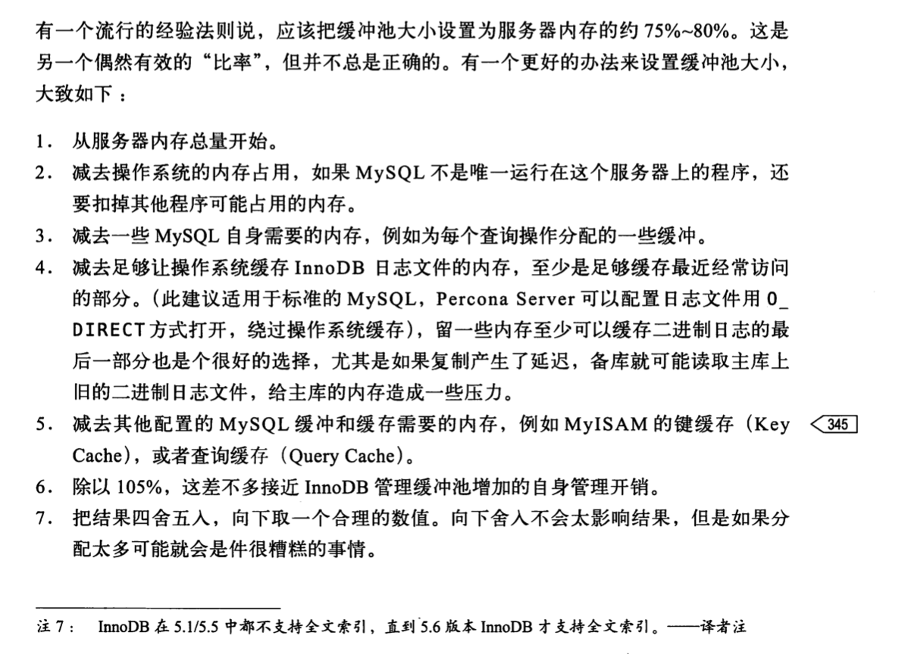
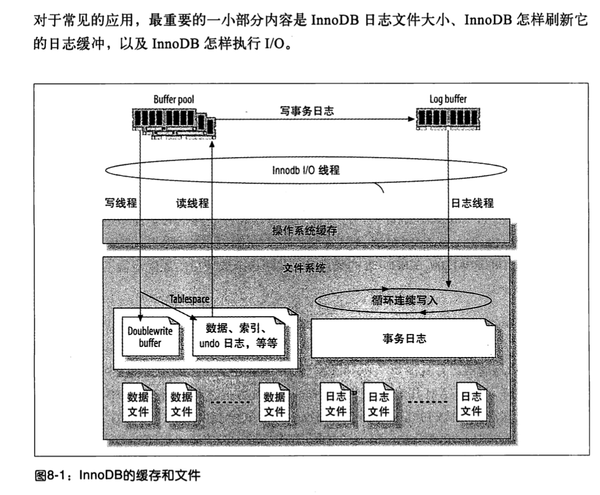
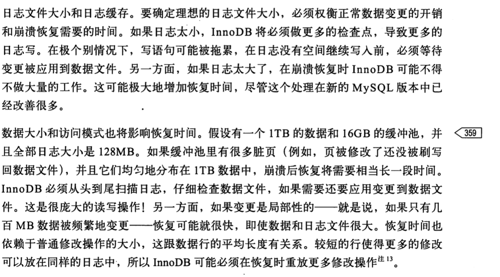
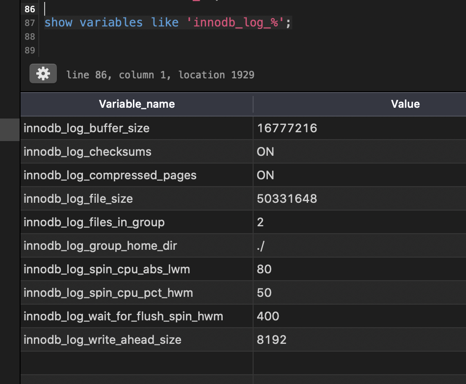
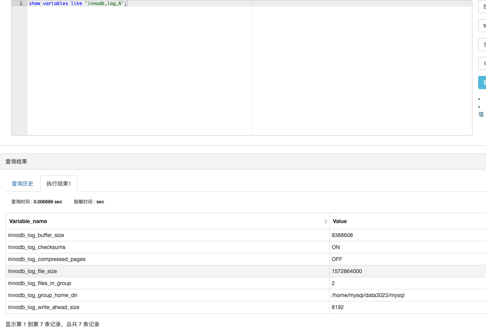
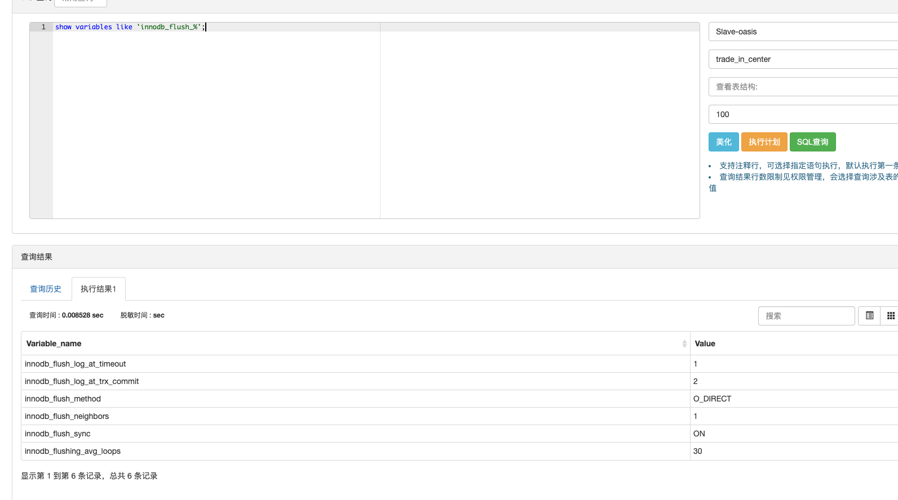
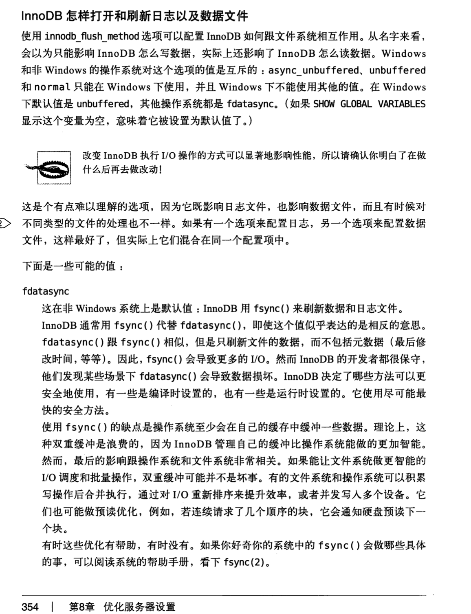
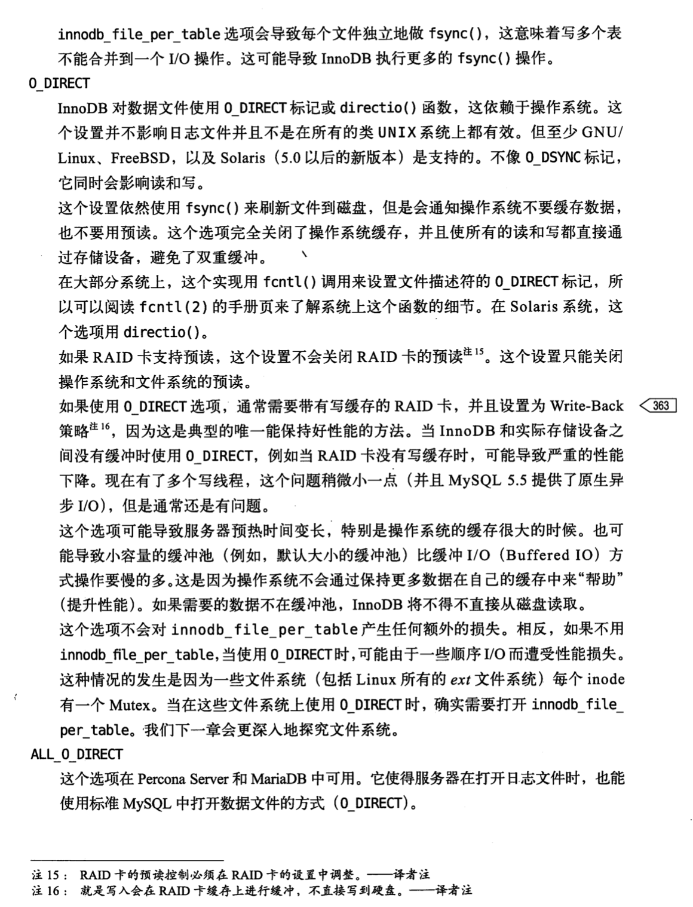
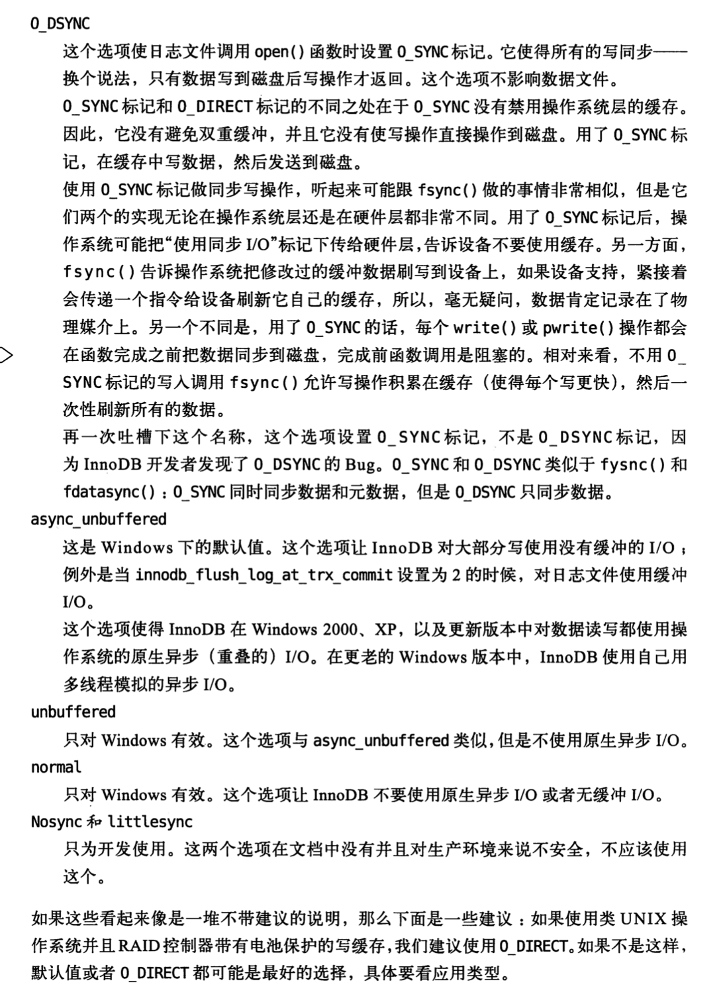

## 如何创建一个好配置的最快方法
no 不是从学习配置项开始
no 从问哪个配置项应该怎么设置或者怎么修改开始
no 从检查服务器行为和询问那个配置项可以提升性能开始
yes 从理解mysql内核和行为开始
    --->利用这些知识指导配置mysql
    --->将想要的配置和当前配置进行比较，然后纠正重要并且有价值的不同之处

保证基本配置正确
特殊的配置项不应该成为服务器基本配置文件的一部分，只有当发现特定性能问题才应该设置它们

另一个节省时间和避免麻烦的好办法是使用默认配置，除非明确知道默认值会有问题。默认配置是经过最多实际测试的。

# 8.1MySQL配置的工作原理
mysql的配置机制

问题：mysql从哪里获得配置信息？
命令行参数和配置文件

配置文件格式
```
# Default Homebrew MySQL server config
[mysqld]
# Only allow connections from localhost
secure_file_priv=''
bind-address = 127.0.0.1

# Slow Query Log
slow_query_log                 = ON
slow_query_log_file            = /Users/chujun/logs/mysql/data/slow.log   # Adjust AppArmor configuration: /etc/apparmor.d/local/usr.sbin.mysqld
log_queries_not_using_indexes  = 0                                   # Interesting on developer systems!
long_query_time                = 0.1		# unit:second
# min_examined_row_limit         = 100
```

服务器通常读取mysqld这一段，许多客户端会读取client部分

## 8.1.1语法，作用域和动态性
配置项设置都是用小写，单词质检用下划线或者横线隔开
```
usr/sbin/mysqld --auto-increment-offset=5
usr/sbin/mysqld --auto_increment_offset=5
```

作用域
* 服务器级别(全局)
* 会话级别(针对连接)


运行时动态配置变量
```mysql
set SORT_BUFFER_SIZE =1;
set GLOBAL SORT_BUFFER_SIZE =1;
set @@sort_buffer_size:=1;
set @@SESSION .sort_buffer_size:=1;
set @@GLOBAL .SORT_BUFFER_SIZE :=1
```
mysql关闭时可能丢失这些配置

## 8.1.2设置变量的副作用
常见变量

* key_buffer_size
* table_cache_size
* thread_cache_size
* query_cache_size
* read_buffer_size
* read_rnd_buffer_size
* sor_buffer_size

如果查询必须使用一个更大的排序缓存才能比较好的执行，可以先在查询执行前增加sort_buffer_size的会话级别的值，执行完后恢复为default。
```mysql
set @@SESSION.SORT_BUFFER_SIZE :=1;
##Execute the query...
set @@SESSION.SORT_BUFFER_SIZE :=DEFAULT;
```
```mysql
set @saved_sort_buffer_size:=@@SESSION.sort_buffer_size;
set @@SESSION.sort_buffer_size:=1;
##execute the query
set @@session.sort_buffer_size:=@saved_sort_buffer_size;
```

## 8.1.3入门
设置变量值时需要注意的是值并不是越大越好，如果设置的值太高，可能更容易导致问题：可能会由于内存不足导致服务器内存交换，或者超过地址空间。

## 8.1.4通过基准测试迭代优化
一个认知:通常不建议通过建立一套基准测试方案，然后不断迭代验证配置项的修改来找到最佳配置方案


# 8.2什么不该做

* 放弃基于命中率的优化

# 8.3创建mysql配置文件
首先没有万能的适合所有场景的"最佳配置文件"

本书中的基础配置文件
```
[mysqld]
#general
datadir =/var/lib/mysql
socket  =/var/lib/mysql/mysql.sock
pid_file=/var/lib/mysql/mysql.pid
user = mysql
port=3305
default_storage_engine=innodb
#innodb
innodb_buffer_pool_size=<value>
innodb_log_file_size=<value>
innodb_file_per_table=1
innodb_flush_method=0_DIRECT
#myisam
key_buffer_size=<value>
#logging
log_error=/var/lib/mysql/mysql-error.log
slow_query_log=/var/lib/mysql/mysql-slow.log
#other
tmp_table_size=32M
max_heap_table_size=32M
query_cache_type=0
query_cache_size=0
max_connections=<value>
thread_cache=<value>
table_cache=<value>
#打开的操作系统文件句柄数量
open_files_limit=65535
[client]
socket=/var/lib/mysql/mysql.sock
port=3306
```

配置文件的第一件事是设置数据的位置

设置innodb缓存池大小的参考


案例


## 8.3.1检查mysql服务器状态变量

```shell
#每个60秒查看状态变量的增量变化(-r参数)
mysqladmin extended-status -ri60 -uroot -proot
mysqladmin -help
```

# 8.4配置内存使用
mysql内存消耗分为两类
* 可以控制的内存
* 不可控制的内存

配置内存步骤
1.确定可以使用的内存上限
2.确定每个连接mysql需要使用多少内存，例如排序缓存和临时表
3.确定操作系统需要多少内存才够用。包括同一台机器上其他程序使用的内存，如定时任务
4.把剩下的内存全部给mysql的缓存，例如innodb的缓冲池

## 8.4.1mysql可以使用多少内存
例如通常32位linux内核通常限制任意进程可以使用的内存量在2.5-2.7GB范围内，运行时地址空间溢出是非常危险的，不过现在基本都是64位操作系统了

## 8.4.2每个连接需要的内存
mysql保持一个连接(线程)只需少量的内存，它要求一个基本量的内存来执行任何给定查询。

了解mysql内存峰值消耗值是很有意义的

## 8.4.3为操作系统保留内存
操作系统毫无疑问也需要保留足够的内存给它工作，
如果没有虚拟内存正在交换(Paging)到磁盘，就是表明操作系统内存足够的最佳迹象(如何观察虚拟内存数量呢:linux vmstat命令)
至少应该为操作系统保留max(1-2GB内存,总内存的5%)内存

## 8.4.4为缓存分配内存
mysql最重要的缓存:
* innodb缓冲池
* innodb日志文件和myisam数据的操作系统缓存
* myisam键缓存
* 查询缓存
* 无法手工配置的缓存，例如二进制日志和表定义文件的操作系统缓存
* 等等


## 8.4.5innodb缓冲池(buffer pool)
innodb部分略读即可，可以详细见专门介绍innodb的书籍，例如<<mysql技术内幕-innodb存储引擎>>

innodb缓冲池或许比其他任何东西更需要内存。
innodb缓冲池包含
* 缓冲行数据
* 自适应哈希索引
* 插入缓冲(Insert Buffer)
* 锁
* 延迟写入  
* 其他内部数据

可以通过show命令得到的变量或者*innotop*这样的工具监控innodb缓冲池的内存利用情况


很大的缓冲池带来一些挑战
* 预热和关闭花费很长时间
* 如果有很多脏页在缓冲池，innodb关闭时可能会花费较长时间，因为关闭之前需要把脏页写回数据文件，也可以强制快速关闭，那样重启时就必须做更多的恢复工作(通过日志文件恢复)


## 8.4.6myisam键缓存(key caches)
略读

myisam自身只缓存索引，不缓存数据(依赖操作系统缓存数据)
最重要的配置项*key_buffer_size*


## 8.4.7线程缓存
*这不就和线程池一样的道理嘛，工作机制完全一样呢*

线程缓存保存哪些当前没有与连接关联但是准备为后面新的连接服务的线程。
当一个新连接创建时，如果缓存中有线程存在，mysql则从缓存中删除一个线程，并把它分配给这个新的连接
当连接关闭时，如果线程缓存还有空间的话，mysql又把线程放回缓存
如果没有空间的话，mysql会销毁这个线程

thread_cache_size:mysql保持在缓存中的线程数，
--->检查线程缓存是否足够大，可以查看Thread_created状态量
--->观察Thread_connected变量

线程缓存设置得非常大在大部分时候没有必要，但是设置的很小也不能节省太多内存，
每个在线程缓存中的线程或者休眠状态的线程，通常使用256KB左右的内存

## 8.4.8表缓存(table cache)
表缓存的设计时服务器和存储引擎之间分离不彻底的产物，属于历史问题。表缓存对innodb重要性就小多了，因为innodb不依赖它做那么多事
innodb有自己的表缓存版本。

## 8.4.9innodb数据字典(data dictionary)
innodb有自己的表缓存，成为表定义缓存或者数据字典

# 8.5配置mysql的i/o行为

## 8.5.1innodb i/o配置
详见专门介绍innodb引擎的本书籍吧<<mysql技术内幕-innodb存储引擎>>

*8innodb缓冲和日志体系结构*


### innodb事务日志

为什么不及时把缓冲池的脏快刷新到磁盘中去
需要很多随机IO
Innodb用日志把随机IO变成顺序IO。保证一单日志安全写到磁盘，事务就持久了，即使变更还没有写到数据文件（即使断电，宕机也能保证事务的ACID特性）

innodb日志是环形方式写入
* 当写到日志尾部，会重新跳转到开头继续写，不过放心不会覆盖还没应用到数据文件的日志记录，因为这样做会清掉已提交事务的唯一持久化记录。

innodb后台一个专门线程刷新这些变更到数据文件，还可以批量组合写入，提高效率

innodb_log_file_size
innodb_log_files_in_group
日志文件的总大小是每个文件的大小之和。默认只有两个5MB的文件，总共10MB，
对高性能工作来说这太小了，至少需要几百MB，或者甚至GB的日志文件(实际确实如此)

调整日志文件大小注意
* 需要确保完全关闭mysql，并将就的日志文件移到其他地方保存
* 重新配置参数，然后重启

8事务日志大小影响mysql服务器重启和恢复时间


事务日志刷新到磁盘时机
innodb_log_buffer_size:控制日志缓冲区的大小，推荐1-8MB

性能观察
show engine innodb status中的状态变量innodb_os_log_written查看innodb对日志文件写出了多少数据


*mysql配置项优化:innodb_log_file_size本地默认配置VS线上环境配置(1.5GB)*



innodb怎样刷新日志缓冲

innodb_flush_log_at_trx_commit控制日志缓冲刷新的频繁程度
0:把日志缓冲写到日志文件，并且每秒钟刷新一次，但是事务提交时不做任何事
1:将日志缓冲写到日志文件，并且每次事务提交都刷新到持久化存储。这是默认的(并且最安全，当然效率最低),该设置能保证不会丢失任何已经提交的事务，除非磁盘或者操作系统是伪刷新
2:每次提交时把日志缓冲写到日志文件，但是并不刷新。innodb每秒中做一次刷新(高性能)，如果mysql进程挂了，2不会丢失任何事务(已经缓存到操作系统缓存中去了)，但是如果整个服务器挂了或者断电，则还是可能会丢失一些事务(最多丢失这一秒内的事务，除非每秒刷新被推迟了)


*了解"把日志缓冲写到日志文件"和"把日志刷新到持久化存储"之间的不同是很有必要的*
* 前者把缓冲写到日志只是简单地把数据从Innodb的内存缓冲转移到了操作系统的缓存，也就是在内存里，并没有真的把数据写到了持久化存储。
* 后者才是真正地将日志持久化写入到磁盘

#### innodb怎样打开和刷新日志以及数据文件
innodb_flush_method配置innodb如何跟文件系统相互作用，然后它不仅影响innodb怎么写数据，还影响innodb怎么读数据
这个值改变innodb执行io操作方式将显著影响性能，你必须确保明白在做什么再去做改动

fdatasync：非window系统上是默认值，innodb用fsync函数刷新数据和日志文件，可能会有双重缓冲，（innodb和操作系统都缓冲）
0_DIRECT:innodb对数据文件是用0_DIRECT标记或direction函数，这依赖操作系统。这个设置依赖使用fsync函数刷新文件到磁盘，但是会通知操作系统不要缓存数据，也不要用预读，这个选项完全关闭了操作系统缓存，使所有读和写都直接通过存储设备，避免了双重缓冲
         通常搭配具有写缓存的RAID卡，并且设置write-back策略，这是典型的唯一能保持好性能的方法。
0_DSYNC:

建议：如果使用类unix操作系统并且raid控制器带有电池保护的写缓存，我们建议使用0_DIRECT。
如果不是这样，默认值或者0_DIRECT都可能是最好的选择，具体要看应用类型。

innodb_flush_method线上配置0_DIRECT


*8innodb_flush_method说明*





### innodb表空间
TODO:cj to be done

### 双写缓冲(Doublewrite Buffer)

### 其他的I/O配置

## 8.5.2myisam的i/o配置

# 8.6配置mysql并发

## 8.6.1innodb并发配置

## 8.6.2myisam并发配置

# 8.7基于工作负载的配置

## 8.7.1优化blob和text的场景

## 8.7.2优化排序(filesorts)

# 8.8完成基本配置

# 8.9安全和稳定的设置

# 8.10高级innodb设置

# 8.11总结


# 资料
## 工具
[mysql监控利器innotop](https://github.com/innotop/innotop)