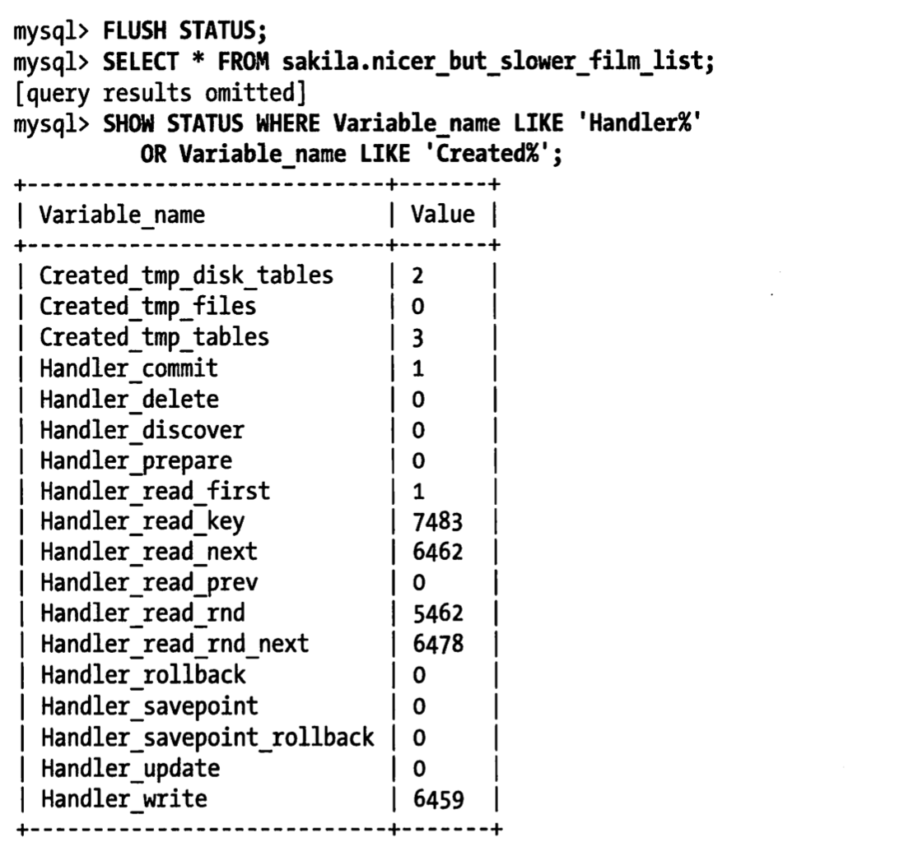
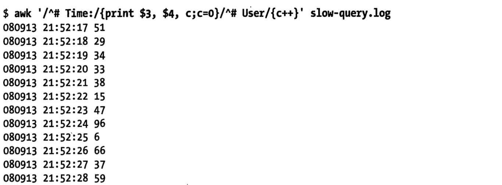

# 服务器性能剖析
性能相关的灵魂三问
* 如何确认服务器是否达到了性能最佳的状态
* 找出某条语句为什么执行不够快
* 诊断被用户描述成"停顿"、"堆积"或者"卡死"的某些间歇性疑难故障

有一个简单方法：专注于测量服务器时间花费在哪里
技术：性能剖析(profiling)

# 3.1性能优化简介

本书关于性能定义：完成某件任务所需要的时间度量(也即响应时间，注意和吞吐量的区别)


本书数据库服务器目的是执行SQL语句，它关注的任务是查询/语句.
性能用查询(包含DDL,DML)响应时间来度量，单位是每个查询花费的时间。

*性能优化就是在一定的工作负载下尽可能的降低响应时间*

提升每秒查询量，其实是吞吐量优化(定义是单位时间内的查询数量，正好是对性能定义的倒数）。
吞吐量的优化可以看作性能优化的副产品。

*性能优化第二个原则：无法测量就无法有效优化.*(90%时间来测量响应时间花在哪里)

## 3.1.1 通过性能剖析进行优化
性能剖析定义:测试和分析时间花费在哪里的主要方法

两个步骤
* 1.测试任务所花费的时间
* 2.对结果进行统计和排序，讲重要的任务排到前面

性能剖析报告:列出所有任务列表，按照任务消耗时间进行降序排序
* 任务名
* 任务执行时间
* 任务消耗时间
* 任务平均执行时间
* 该任务执行时间占全部时间的百分比
* 等等


两种类型
* 基于执行时间的分析:研究什么任务执行时间最长
* 基于等待的分析:判断任务在什么地方被阻塞的时间最长

## 3.1.2 理解性能剖析
只占总响应时间比重很小的查询是不值得优化的。

性能剖析可能缺失的部分
* 异常情况
* 显示可能的"丢失的时间"
* 被隐藏的细节(性能剖析无法显示所有响应时间的分布)
* 无法再更高层次的堆栈中进行交互式的分析

# 3.2 对应用程序进行性能剖析
性能剖析还是建议自上而下地进行，这样可以追踪用户发起到服务器响应的整个流程

可能影响因素
* 外部资源，调用了外部的web服务/搜索引擎
* 需要处理大量数据,比如分析一个超大的XML文件
* 在循环中执行昂贵的操作，比如滥用正则表达式
* 使用低效算法，比如暴力搜索算法来查找列表中的项

建议所有新项目都考虑包含性能剖析代码(可以在框架层面包含，例如各种埋点,调用链,trace)

# 3.2.1测量PHP应用程序
看看就好了
[Facebook出品 xhprof](http://pecl.php.net/package/xhprof)
[ifp](http://code.google.com/p/instrumentation-for-php)

# 3.3 剖析MySQL查询


## 3.3.1剖析服务器负载

工具:慢查询日志
long_query_time=0 捕获所有查询

问题:
I/O开销可以忽略不计
日志可能消耗大量的磁盘空间->部署日志轮转(long rotation)工具

假如线上权限不足，导致无法再服务器记录查询怎么办呢?
### 通过Percona Toolkit中的pt-query-digest，--processlist选项不断查看
SHOW FULL PROCESSLIST输出
### 通过抓取TCP网络包(tcpdump),根据Mysql C/S通讯协议进行解析
然后使用pt-query-digest --type=tcpdump选项来解析并分析查询

### 动过mysql proxy代理层脚本记录所有查询


直接用pt-query-digest工具分析慢sql日志
`pt-query-digest slow.log`
```
chujun@chujundeMacBook-Pro  /tmp  pt-query-digest /tmp/logs/mysql/data/slow.log

# 200ms user time, 40ms system time, 28.95M rss, 4.11G vsz
# Current date: Fri Sep 25 19:01:15 2020
# Hostname: chujundeMacBook-Pro.local
# Files: /tmp/logs/mysql/data/slow.log
# Overall: 6 total, 2 unique, 0.01 QPS, 0.01x concurrency ________________
# Time range: 2020-09-25T09:22:00 to 2020-09-25T09:36:35
# Attribute          total     min     max     avg     95%  stddev  median
# ============     ======= ======= ======= ======= ======= ======= =======
# Exec time             7s   370ms      2s      1s      2s   668ms      2s
# Lock time          787us       0   441us   131us   424us   159us   168us
# Rows sent             93       1      30   15.50   28.75   13.88   28.75
# Rows examine       2.86M       1 976.59k 488.30k 961.27k 480.63k 961.27k
# Query size           198      15      51      33   49.17   17.33   49.17

# Profile
# Rank Query ID                           Response time Calls R/Call V/M
# ==== ================================== ============= ===== ====== =====
#    1 0x59A74D08D407B5EDF9A57DD5A41825CA  5.0058 68.9%     3 1.6686  0.13 SELECT
#    2 0xCBBA82FAFC6C856720133BF496BEC056  2.2621 31.1%     3 0.7540  0.36 SELECT t_user

# Query 1: 0.12 QPS, 0.21x concurrency, ID 0x59A74D08D407B5EDF9A57DD5A41825CA at byte 409
# This item is included in the report because it matches --limit.
# Scores: V/M = 0.13
# Time range: 2020-09-25T09:22:00 to 2020-09-25T09:22:24
# Attribute    pct   total     min     max     avg     95%  stddev  median
# ============ === ======= ======= ======= ======= ======= ======= =======
# Count         50       3
# Exec time     68      5s      1s      2s      2s      2s   458ms      2s
# Lock time      0       0       0       0       0       0       0       0
# Rows sent      3       3       1       1       1       1       0       1
# Rows examine   0       3       1       1       1       1       0       1
# Query size    22      45      15      15      15      15       0      15
# String:
# Databases    trade_in_center
# Hosts        localhost
# Users        root
# Query_time distribution
#   1us
#  10us
# 100us
#   1ms
#  10ms
# 100ms
#    1s  ################################################################
#  10s+
# EXPLAIN /*!50100 PARTITIONS*/
select SLEEP(2)\G

# Query 2: 0.11 QPS, 0.08x concurrency, ID 0xCBBA82FAFC6C856720133BF496BEC056 at byte 835
# This item is included in the report because it matches --limit.
# Scores: V/M = 0.36
# Time range: 2020-09-25T09:36:08 to 2020-09-25T09:36:35
# Attribute    pct   total     min     max     avg     95%  stddev  median
# ============ === ======= ======= ======= ======= ======= ======= =======
# Count         50       3
# Exec time     31      2s   370ms      2s   754ms      1s   519ms   374ms
# Lock time    100   787us    93us   441us   262us   424us   136us   247us
# Rows sent     96      90      30      30      30      30       0      30
# Rows examine  99   2.86M 976.59k 976.59k 976.59k 976.59k       0 976.59k
# Query size    77     153      51      51      51      51       0      51
# String:
# Databases    trade_in_center
# Hosts        localhost
# Users        root
# Query_time distribution
#   1us
#  10us
# 100us
#   1ms
#  10ms
# 100ms  ################################################################
#    1s  ################################
#  10s+
# Tables
#    SHOW TABLE STATUS FROM `trade_in_center` LIKE 't_user'\G
#    SHOW CREATE TABLE `trade_in_center`.`t_user`\G
# EXPLAIN /*!50100 PARTITIONS*/
select * from t_user  order by create_time limit 30\G
 chujun@chujundeMacBook-Pro  /tmp 
```

报告结果分析见

**[MySQL慢查询（二） - pt-query-digest详解慢查询日志](https://www.cnblogs.com/luyucheng/p/6265873.html)**

## 3.3.2 剖析单条查询
本小节目标:测量查询执行各部分花费了多少时间---->有这些数据才能决定采用何种优化
书籍版本5.5能提供的方法
* SHOW PROFILES(官网mysql8.0已经标记成@deprecated,建议用Performance Schema替代了)
* SHOW STATUS
* 慢查询日志

### 使用SHOW PROFILES
profile默认是禁用的，在会话session级别开启
`set profiling=1;`

参数profiling_history_size:保留的profile条数(过期的就查询不到了)

#### 问题怎么理解session级别开启呢


```
show variables like '%profiling%';
"have_profiling"	"YES"
"profiling"	"OFF"
"profiling_history_size"	"15"

set profiling =1 ;
"have_profiling"	"YES"
"profiling"	"OFF"
"profiling_history_size"	"15"

执行一个查询语句
```

`show profile for query query_id;`可以查询一条sql执行步骤极其花费时间

```
mysql> SHOW PROFILE for query 1;
+--------------------------------+----------+
| Status                         | Duration |
+--------------------------------+----------+
| starting                       | 0.000099 |
| Executing hook on transaction  | 0.000007 |
| starting                       | 0.000007 |
| checking permissions           | 0.000009 |
| Opening tables                 | 0.000113 |
| init                           | 0.000018 |
| System lock                    | 0.000010 |
| optimizing                     | 0.000006 |
| statistics                     | 0.000024 |
| preparing                      | 0.000019 |
| executing                      | 0.373558 |
| end                            | 0.000015 |
| query end                      | 0.000004 |
| waiting for handler commit     | 0.000009 |
| closing tables                 | 0.000019 |
| freeing items                  | 0.000015 |
| logging slow query             | 0.000503 |
| cleaning up                    | 0.000025 |
+--------------------------------+----------+
18 rows in set, 1 warning (0.03 sec)
```

这个结果不能用order by之类命令重新排序，直接查询INFORMATION_SCHEMA对应表优化输出

脚本见**[script/query_profile.sql](script/query_profile.sql)**

```
mysql> set @query_id=1;
Query OK, 0 rows affected (0.00 sec)

mysql> select state,sum(duration) as Total_R,
    ->     round(100*sum(duration)/
    ->         (select sum(duration) from information_schema.profiling
    ->         where query_id=@query_id),2) as Pct_R,
    ->     count(*) as Calls,
    ->     sum(duration)/count(*) as "R/Call"
    -> from information_schema.profiling
    -> where query_id=@query_id
    -> group by state
    -> order by Total_R desc;
+--------------------------------+----------+-------+-------+--------------+
| state                          | Total_R  | Pct_R | Calls | R/Call       |
+--------------------------------+----------+-------+-------+--------------+
| executing                      | 0.373558 | 99.76 |     1 | 0.3735580000 |
| logging slow query             | 0.000503 |  0.13 |     1 | 0.0005030000 |
| Opening tables                 | 0.000113 |  0.03 |     1 | 0.0001130000 |
| starting                       | 0.000106 |  0.03 |     2 | 0.0000530000 |
| cleaning up                    | 0.000025 |  0.01 |     1 | 0.0000250000 |
| statistics                     | 0.000024 |  0.01 |     1 | 0.0000240000 |
| preparing                      | 0.000019 |  0.01 |     1 | 0.0000190000 |
| closing tables                 | 0.000019 |  0.01 |     1 | 0.0000190000 |
| init                           | 0.000018 |  0.00 |     1 | 0.0000180000 |
| end                            | 0.000015 |  0.00 |     1 | 0.0000150000 |
| freeing items                  | 0.000015 |  0.00 |     1 | 0.0000150000 |
| System lock                    | 0.000010 |  0.00 |     1 | 0.0000100000 |
| checking permissions           | 0.000009 |  0.00 |     1 | 0.0000090000 |
| waiting for handler commit     | 0.000009 |  0.00 |     1 | 0.0000090000 |
| Executing hook on transaction  | 0.000007 |  0.00 |     1 | 0.0000070000 |
| optimizing                     | 0.000006 |  0.00 |     1 | 0.0000060000 |
| query end                      | 0.000004 |  0.00 |     1 | 0.0000040000 |
+--------------------------------+----------+-------+-------+--------------+
17 rows in set, 18 warnings (0.00 sec)
```
根据这个输出就可以很快捷得分析花费最大的时间部分所在

### 使用SHOW STATUS
SHOW STATUS返回一系列计数器,但是无法给出消耗多少时间
* 服务器级别全局计数器
* 会话级别计数器

* SHOW GLOBAL STATUS:只返回服务器级别计数器
* SHOW SESSION STATUS:只返回session会话级别计数器

Mysql官网文档对所有变量是会话级还是全局级做了详细说明

**[mysql reference manual](https://dev.mysql.com/doc/refman/8.0/en/)**

```
mysql> show status like '%quer%';
+--------------------------+---------------+
| Variable_name            | Value         |
+--------------------------+---------------+
| Com_empty_query          | 0             |
| Last_query_cost          | 100914.549000 |
| Last_query_partial_plans | 1             |
| Queries                  | 3380          |
| Slow_queries             | 1             |
+--------------------------+---------------+
5 rows in set (0.00 sec)

mysql> show global status like '%quer%';
+-----------------+-------+
| Variable_name   | Value |
+-----------------+-------+
| Com_empty_query | 0     |
| Queries         | 3381  |
| Slow_queries    | 20    |
+-----------------+-------+
3 rows in set (0.00 sec)

mysql> show session status like '%quer%';
+--------------------------+---------------+
| Variable_name            | Value         |
+--------------------------+---------------+
| Com_empty_query          | 0             |
| Last_query_cost          | 100914.549000 |
| Last_query_partial_plans | 1             |
| Queries                  | 3382          |
| Slow_queries             | 1             |
+--------------------------+---------------+
5 rows in set (0.00 sec)
```

其中最有用的计数器包括
* 句柄计数器(handler counter),('%handler%')
* 临时文件(''%create%')
* 表计数器
* 等等

刷新会话级别计数器重置为0
`flush status;`

```
mysql> show  status where  variable_name like '%create%' or variable_name like '%handler%';
+-------------------------------------+---------+
| Variable_name                       | Value   |
+-------------------------------------+---------+
| Com_create_db                       | 0       |
| Com_create_event                    | 0       |
| Com_create_function                 | 0       |
| Com_create_index                    | 0       |
| Com_create_procedure                | 0       |
| Com_create_role                     | 0       |
| Com_create_server                   | 0       |
| Com_create_table                    | 0       |
| Com_create_resource_group           | 0       |
| Com_create_trigger                  | 0       |
| Com_create_udf                      | 0       |
| Com_create_user                     | 0       |
| Com_create_view                     | 0       |
| Com_create_spatial_reference_system | 0       |
| Com_show_create_db                  | 0       |
| Com_show_create_event               | 0       |
| Com_show_create_func                | 0       |
| Com_show_create_proc                | 0       |
| Com_show_create_table               | 0       |
| Com_show_create_trigger             | 0       |
| Com_show_create_user                | 0       |
| Created_tmp_disk_tables             | 0       |
| Created_tmp_files                   | 0       |
| Created_tmp_tables                  | 0       |
| Handler_commit                      | 4       |
| Handler_delete                      | 0       |
| Handler_discover                    | 0       |
| Handler_external_lock               | 8       |
| Handler_mrr_init                    | 0       |
| Handler_prepare                     | 0       |
| Handler_read_first                  | 4       |
| Handler_read_key                    | 4       |
| Handler_read_last                   | 0       |
| Handler_read_next                   | 0       |
| Handler_read_prev                   | 0       |
| Handler_read_rnd                    | 0       |
| Handler_read_rnd_next               | 4000004 |
| Handler_rollback                    | 0       |
| Handler_savepoint                   | 0       |
| Handler_savepoint_rollback          | 0       |
| Handler_update                      | 0       |
| Handler_write                       | 0       |
| Innodb_pages_created                | 156     |
| Mysqlx_crud_create_view             | 0       |
| Mysqlx_stmt_create_collection       | 0       |
| Mysqlx_stmt_create_collection_index | 0       |
| Threads_created                     | 4       |
+-------------------------------------+---------+
47 rows in set (0.00 sec)

mysql>
```


### 使用慢查询日志(Percona Server,了解)
介绍了Percona Server对慢查询日志的改进(了解)


### 使用Performance Schema
相比于informance schema更加偏底层一点，
* 内存表所以效果还可以，不会持久化到磁盘
TODO:更多介绍后续直接看官方文档吧

[performance schema](https://dev.mysql.com/doc/refman/8.0/en/performance-schema.html)


## 3.3.3使用性能剖析
问题:拥有查询剖析报告后，该怎么使用呢?

# 3.4诊断间歇性问题
特征
* 系统偶尔停顿，无法确认重现，后续过程中随机出现

科学解决之道
基于充分的数据分析基础上做分析

## 3.4.1单条查询问题还是服务器问题

### 使用show global status
以较高频率(例如一秒一次)执行一次show global status命令捕获数据,
通过某些计数器(Thread_running,Threads_connected,Questions,Queries)的
"尖刺"/"凹陷"来发现。

这个命令每秒捕获一次show global status数据,awk输出每秒查询数，线程连接数，正在执行查询的线程数
```bash
mysqladmin -uroot -proot ext -i1|awk '
	/Queries/{q=$4-qp;qp=$4}
	/Threads_connected/{tc=$4}
	/Threads_running/{printf "%5d %5d %5d\n",q,tc,$4}
'
mysqladmin: [Warning] Using a password on the command line interface can be insecure.
 4743     5     2
    1     5     2
    1     5     2
    1     5     2
    1     5     2
    1     5     2
    1     5     2
    1     5     2
    1     5     2
    1     5     2
    1     5     2
    1     5     2
    3     5     2
    1     5     2
    1     5     2
    1     5     2
    1     5     2
```
三个数据趋势对于服务器级别偶尔停顿敏感度很高。
一般发生此类问题是，每秒查询数一般会下跌，而其他两个则至少有一个会出现尖刺(可以考虑输出图的形式)

### 使用show processlist
不停捕获show processlist输出观察是否有大量线程处于不正常的状态/有其他不正常的特征
例如查询很少会长时间处于"statistics"状态(一般指服务器在查询优化阶段如何确定表关联顺序)，通常非常快

* show processlist统计某列值出现次数
```
mysql -uroot -proot -e 'show processlist\G'|grep State:|sort|uniq -c|sort -rn
mysql: [Warning] Using a password on the command line interface can be insecure.
   4   State:
   1   State: starting
   1   State: Waiting on empty queue
```
`\G`表示以垂直方式输出结果，每一行每一列都单独输出为一行

sort|uniq|sort方式统计计算某个列值出现次数


### 使用慢查询日志
*查询mysql每秒慢查询数量*
```bash(mac)
date -j -f "%Y-%m-%d %H:%M:%S" "2018-08-22 16:39:00"
awk '/^# Time:/{print $3,$4,c;c=0}/^# User/{c++}' /tmp/logs/mysql/data/slow.log
2020-09-25T09:22:00.651630Z
2020-09-25T09:22:06.689749Z  1
2020-09-25T09:22:24.119005Z  1
2020-09-25T09:36:08.139317Z  1
2020-09-25T09:36:10.797957Z  1
2020-09-25T09:36:35.600099Z  1
```


TODO:cj这个执行有误,和预期的不一样，对awk如何执行带格式化的date命令不熟悉
`awk '/^# Time:/{a= date -j -f "%Y-%m-%d %H:%M:%S" $3;print a,c;c=0}/^# User/{c++}' /tmp/logs/mysql/data/slow.log`
```
chujun@chujundeMacBook-Pro  ~  awk '/^# Time:/{a= date -j -f "%Y-%m-%d %H:%M:%S" $3;print a,c;c=0}/^# User/{c++}' /tmp/logs/mysql/data/slow.log
0%Y-%m-%d %H:%M:%S2020-09-25T09:22:00.651630Z
0%Y-%m-%d %H:%M:%S2020-09-25T09:22:06.689749Z 1
0%Y-%m-%d %H:%M:%S2020-09-25T09:22:24.119005Z 1
0%Y-%m-%d %H:%M:%S2020-09-25T09:36:08.139317Z 1
0%Y-%m-%d %H:%M:%S2020-09-25T09:36:10.797957Z 1
0%Y-%m-%d %H:%M:%S2020-09-25T09:36:35.600099Z 1
0%Y-%m-%d %H:%M:%S2020-09-25T11:16:37.135518Z 1
0%Y-%m-%d %H:%M:%S2020-09-25T11:16:39.722217Z 1
0%Y-%m-%d %H:%M:%S2020-09-25T11:16:41.923975Z 1
0%Y-%m-%d %H:%M:%S2020-09-25T11:16:44.440084Z 1
0%Y-%m-%d %H:%M:%S2020-09-25T11:16:50.860636Z 1
```

## 3.4.2捕获诊断数据
针对间歇性问题，在问题出现之前就应该尽可能多的搜集数据，而不只是问题出现的时候

需要两样东西
* 1.一个可靠且实时的"触发器",即能区分什么时候问题出现的方法.
* 2.一个搜集诊断数据的工具

### 诊断触发器
触发器问题标准
关键是找到一些能和正常时阀值进行比较的指标(例如)
* show processlist中线程的异常状态尖峰
* 正在运行的线程数量
* show innodb status的特定输出
* 服务器的平均负载尖峰
* 等等

常见问题
* 误报(错误报告问题)
* 漏检(出现问题时没有捕获到数据)


# 资料
* [percona](https://www.percona.com)
* 关于性能优化的描述[Goal driven performance optimization](https://www.percona.com/blog/2008/12/22/goal-driven-performance-optimization/)
* [percona toolkit github](https://github.com/percona/percona-toolkit)
* [MySQL慢查询（二） - pt-query-digest详解慢查询日志](https://www.cnblogs.com/luyucheng/p/6265873.html)
* [official website:performance schema](https://dev.mysql.com/doc/refman/8.0/en/performance-schema.html)