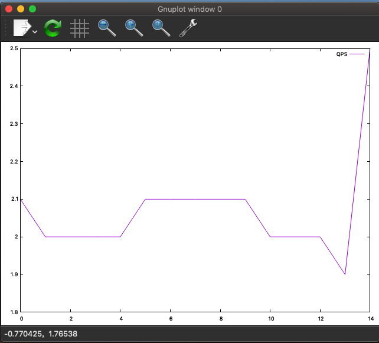

# 基准测试(benchmark)
针对系统设计的一种压力测试

## 为什么需要基准测试
* 测试系统当前运行情况
* 规划未来业务增长
* 找出可能的瓶颈
* 测试不同硬件，软件和操作系统配置
* 重现系统某些异常
* 等等

## 基准测试的策略
**集成式基准测试**

针对整个系统的整体测试

*单组件式基准测试*

单独测试MySQL

### 明确测试目标
* 吞吐量:单位时间内的事务处理数

TPS(每秒事务处),TPM(每分钟事务数)

* 响应时间：测试任务所需的整体时间

平均响应时间，最小响应时间，最大响应时间，百分比响应时间(例如常说的99线)

* 并发性：正在工作中的并发操作/同时工作中的线程数，连接数

例如32/64/128个线程下测试

* 可扩展性


## 基准测试方法
常见错误
* 没有检查错误
* 忽略系统预热
* 测试时间太短

### 设计和规划基准测试

测试准备数据

测试规划
* 记录测试数据(系统性能和状态)
* 系统配置步骤
* 如何测量和分析结果
* 预热方案
* 等等

### 基准测试运行时长考量
* 系统预热时长
* 稳定运行时长应该足够长

### 获取系统性能和状态
* 测试结果(CPU使用率，磁盘I/O,网络流量统计,SHOW GLOBAL STATUS计数器等)
* 配置文件
* 测试指标
* 脚本
* 其他相关说明

### 获得准确的测试结果

### 运行基准测试并分析结果
自动化基准测试

* 装载数据
* 系统预热
* 执行测试
* 记录结果

TODO:cj to 无法跳转
[script/mysql_status.sh](script/mysql_status.sh)

[script/mysql_analyze.sh](script/mysql_analyze.sh)

```bash
chujun@chujundeMacBook-Pro  /tmp/benchmarks/mysql  ./mysql-status.sh
mysql: [Warning] Using a password on the command line interface can be insecure.
4
TS 1600765045.N 2020-09-22 16:57:25
mysql: [Warning] Using a password on the command line interface can be insecure.
mysql: [Warning] Using a password on the command line interface can be insecure.
mysql: [Warning] Using a password on the command line interface can be insecure.
5
TS 1600765050.N 2020-09-22 16:57:30
5
mysql: [Warning] Using a password on the command line interface can be insecure.
mysql: [Warning] Using a password on the command line interface can be insecure.
mysql: [Warning] Using a password on the command line interface can be insecure.
TS 1600765055.N 2020-09-22 16:57:35
mysql: [Warning] Using a password on the command line interface can be insecure.
mysql: [Warning] Using a password on the command line interface can be insecure.
mysql: [Warning] Using a password on the command line interface can be insecure.
5
```
```bash
 ./mysql-analyze.sh 5-sec-status-2020-09-22_05-status
#ts date time load QPS
1600765205 2020-09-22 17:00:05 2.1
1600765210 2020-09-22 17:00:10 2.0
1600765215 2020-09-22 17:00:15 2.0
1600765220 2020-09-22 17:00:20 2.0
1600765225 2020-09-22 17:00:25 2.0
1600765230 2020-09-22 17:00:30 2.1
1600765235 2020-09-22 17:00:35 2.1
1600765240 2020-09-22 17:00:40 2.1
1600765245 2020-09-22 17:00:45 2.1
1600765250 2020-09-22 17:00:50 2.1
1600765255 2020-09-22 17:00:55 2.0
1600765260 2020-09-22 17:01:00 2.0
1600765265 2020-09-22 17:01:05 2.0
1600765270 2020-09-22 17:01:10 1.9
1600765275 2020-09-22 17:01:15 2.5
```

### 2.3.6 绘图的重要性
可以用分析脚本输出作为gnuplot/R绘图的数据来源

`./mysql-analyze.sh 5-sec-status-2020-09-22_05-status>QPS-per-5seconds`

`gnuplot`

`plot "QPS-per-5seconds" using 4 w lines title "QPS"`


```
 ./mysql-analyze.sh 5-sec-status-2020-09-22_05-status>QPS-per-5seconds
 chujun@chujundeMacBook-Pro  /tmp/benchmarks/mysql  ls
5-sec-status-2020-09-21_05-innodbstatus 5-sec-status-2020-09-22_10-innodbstatus
5-sec-status-2020-09-21_05-processlist  5-sec-status-2020-09-22_10-processlist
5-sec-status-2020-09-21_05-status       5-sec-status-2020-09-22_10-status
5-sec-status-2020-09-22_04-innodbstatus QPS-per-5seconds
5-sec-status-2020-09-22_04-processlist  mysql-analyze.sh
5-sec-status-2020-09-22_04-status       mysql-status.sh
5-sec-status-2020-09-22_05-innodbstatus mysql-variables
5-sec-status-2020-09-22_05-processlist  running
5-sec-status-2020-09-22_05-status
 chujun@chujundeMacBook-Pro  /tmp/benchmarks/mysql  gnuplot

	G N U P L O T
	Version 5.4 patchlevel 0    last modified 2020-07-13

	Copyright (C) 1986-1993, 1998, 2004, 2007-2020
	Thomas Williams, Colin Kelley and many others

	gnuplot home:     http://www.gnuplot.info
	faq, bugs, etc:   type "help FAQ"
	immediate help:   type "help"  (plot window: hit 'h')

Terminal type is now 'qt'

gnuplot> plot "QPS-per-5seconds" using 4 w lines title "QPS"

Warning: slow font initializationqt.qpa.fonts: Populating font family aliases took 1095 ms. Replace uses of missing font family "Sans" with one that exists to avoid this cost.

gnuplot>
```


## 2.4基准测试工具
### 2.4.1集成式测试工具
* ab：Apache HTTP服务器基准测试工具。测试HTTP服务器每秒罪过处理多少请求，
只能针对单个URL进行压力测试

* http_load

* JMeter
### 2.4.2单组件式测试工具
* mysqlslap
[mysqlslap](http://dev.mysql.com/doc/refman/8.0/en/mysqlslap.html)

* MySQL Benchmark Suite(sql-bench)

* Super Smack
[Super Smack访问不了](http://vegan.net/tony/supersmack/)

* Database Test Suite
[SourceForge](http://sourceforge.net/projects/osdldbt/)
dbt2:免费的TPC-C OLTP测试工具

* Percona's TPCC-MySQL Tool(good)
作者自研的，专门为MySQL测试开发的
简单测试会用sysbench替代
[项目源码](https://launchpad.net/perconatools)
[github最新地址](https://github.com/Percona-Lab/tpcc-mysql)

* sysbench(good)
[sysbench](https://launchpad.net/sysbench)
[github最新地址](https://github.com/akopytov/sysbench)

# 2.5基准测试案例
## 2.5.1http_load
urls.txt
```
http://www.mysqlperformanceblog.com/
http://www.mysqlperformanceblog.com/page/2/
http://www.mysqlperformanceblog.com/mysql-patches/
http://www.mysqlperformanceblog.com/mysql-performance-presentations/
http://www.mysqlperformanceblog.com/2006/09/06/slow-query-log-analyzes-tools/
```

```bash
http_load -parallel 1 -seconds 10 urls.txt
```

执行结果

一个线程跑10秒
```bash
chujun@chujundeMacBook-Pro  /tmp/benchmarks/http_load  cat urls.txt
http://www.mysqlperformanceblog.com/
http://www.mysqlperformanceblog.com/page/2/
http://www.mysqlperformanceblog.com/mysql-patches/
http://www.mysqlperformanceblog.com/mysql-performance-presentations/
http://www.mysqlperformanceblog.com/2006/09/06/slow-query-log-analyzes-tools/
 chujun@chujundeMacBook-Pro  /tmp/benchmarks/http_load  http_load -parallel 1 -seconds 10 urls.txt
19 fetches, 1 max parallel, 3549 bytes, in 10 seconds
186.789 mean bytes/connection
1.9 fetches/sec, 354.9 bytes/sec
msecs/connect: 233.618 mean, 308.646 max, 195.255 min
msecs/first-response: 272.966 mean, 390.396 max, 211.834 min
HTTP response codes:
  code 302 -- 19
```

5个并发线程跑10秒
```bash
60 fetches, 5 max parallel, 9662 bytes, in 10.0006 seconds
161.033 mean bytes/connection
5.99966 fetches/sec, 966.146 bytes/sec
msecs/connect: 559.017 mean, 4285.79 max, 194.143 min
msecs/first-response: 258.62 mean, 476.163 max, 197.998 min
HTTP response codes:
  code 302 -- 60
```

根据访问速率做测试(例如每秒5次)
```bash
chujun@chujundeMacBook-Pro  /tmp/benchmarks/http_load  http_load -rate 5 -seconds 10 urls.txt
47 fetches, 3 max parallel, 7897 bytes, in 10 seconds
168.021 mean bytes/connection
4.69999 fetches/sec, 789.698 bytes/sec
msecs/connect: 208.598 mean, 272.19 max, 196.752 min
msecs/first-response: 213.182 mean, 269.172 max, 201.517 min
HTTP response codes:
  code 302 -- 47
```

根据访问速率做测试(例如每秒20次)
```bash
 chujun@chujundeMacBook-Pro  /tmp/benchmarks/http_load  http_load -rate 20 -seconds 10 urls.txt
191 fetches, 19 max parallel, 31671 bytes, in 10.0009 seconds
165.817 mean bytes/connection
19.0982 fetches/sec, 3166.81 bytes/sec
msecs/connect: 222.823 mean, 1232.14 max, 194.791 min
msecs/first-response: 219.753 mean, 708.067 max, 198.145 min
HTTP response codes:
  code 302 -- 191
```

## 2.5.2 MySQL基准测试套件
TODO

# 资料
[TPC-C](http://www.tpc.org/)
[ab](http://httpd.apache.org/docs/2.0/programs/ab.html)
[http_load](http://www.acme.com/software/http_load/)
[jmeter](http://jmeter.apache.org/)