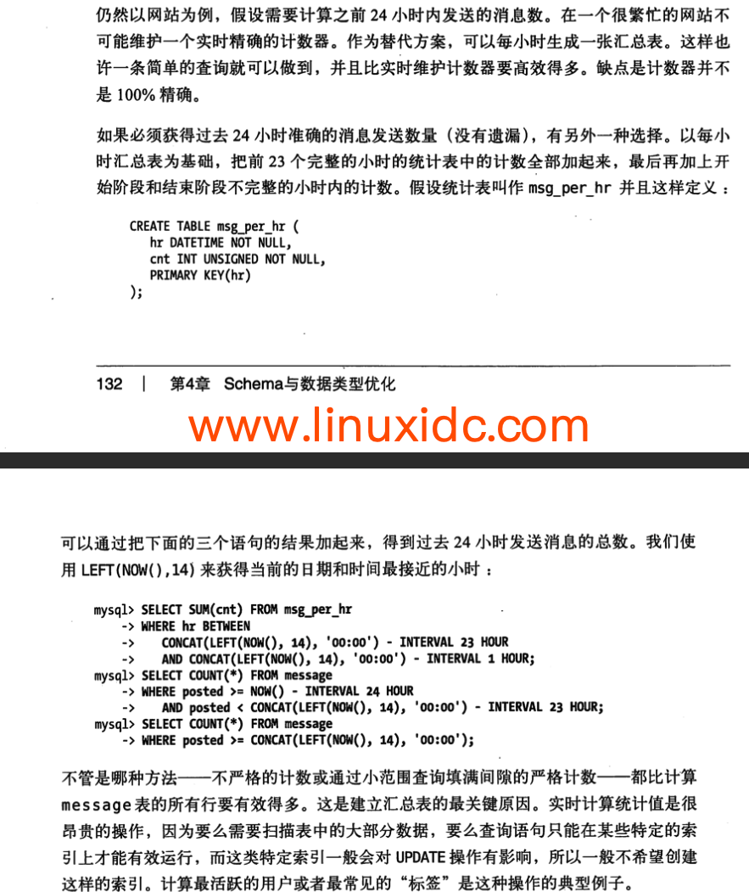
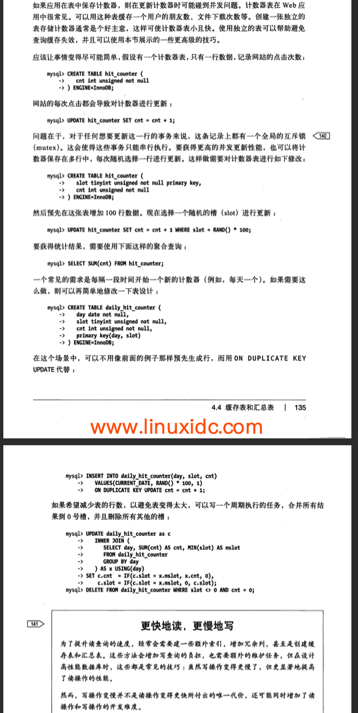
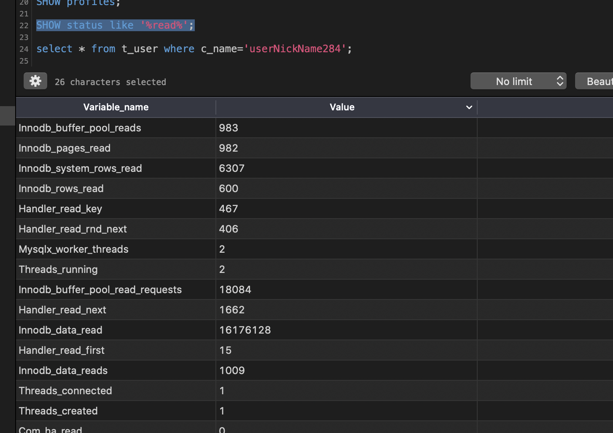
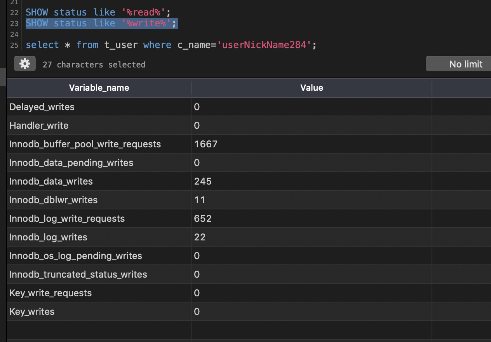
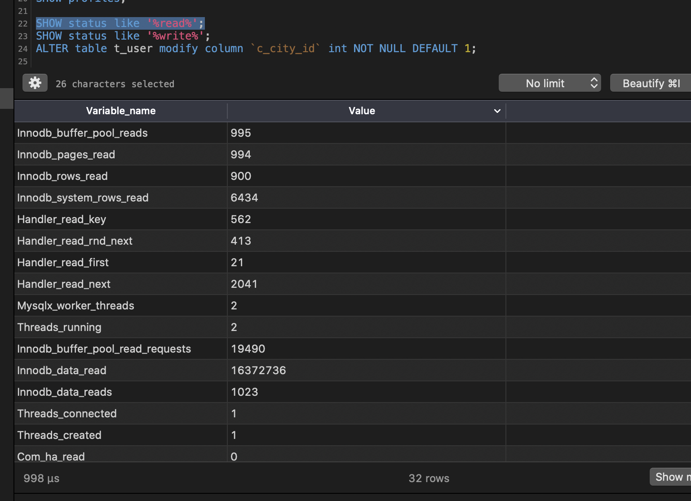
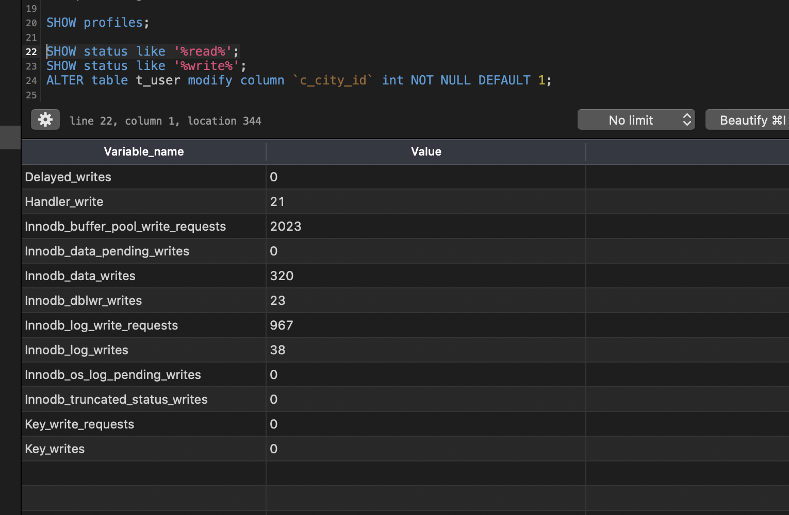
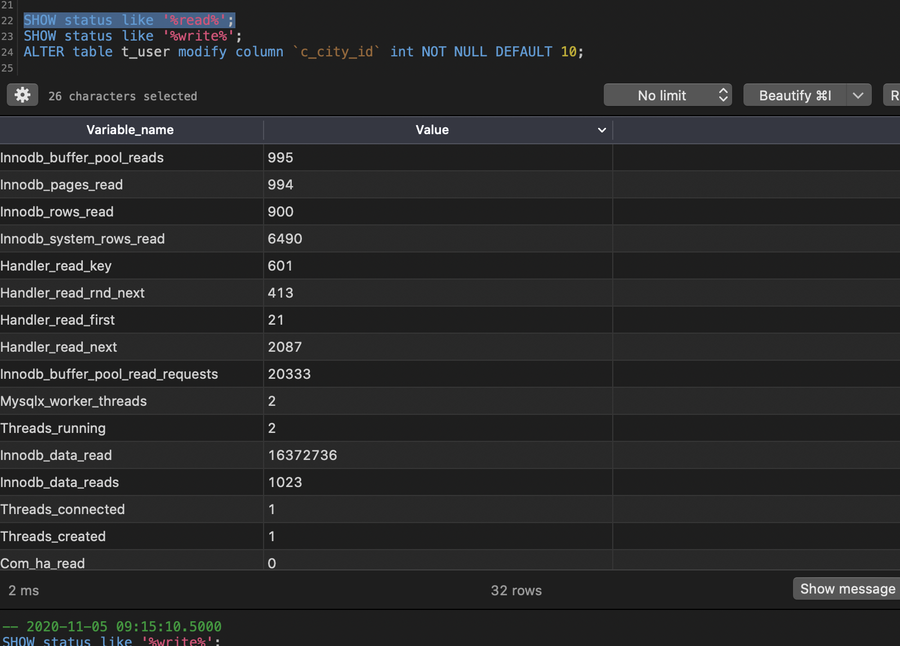
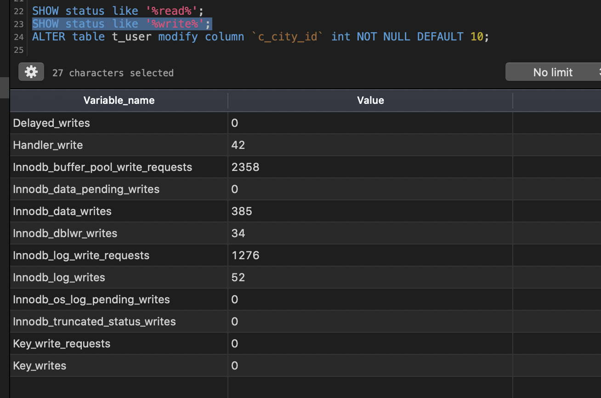

# 4.1选择优化的数据类型
通常原则
* 更小的数据类型范围通常更好
* 数据类型简单就好
* 尽量避免NULL

大类型(数字，字符串，时间等)---->具体类型

## 4.1.1整数类型
整数

|类型|存储空间长度|范围|
|---|---|---|
|TINYINT|8|-2的n-1次方到2的n-1次方减去1，N是存储空间的位数|
|SMALLINT|16||
|MEDIUMINT|24||
|INT|32||
|BIGINT|64||

整数类型有可选的UNSIGNED属性，表示无符号数，可以使正数上限提高一倍

例如TINYINT UNSIGNED可以存储范围0~255,而TINYINT存储范围是-128~127

为整数类型指定宽度(这点常有疑惑)

例如INT(11)含义：对大多数应用没有意义,它不是限制值的合法范围,只是规定了MySQL的一些交互
工具(例如MySQL命令行客户端)用来显示字符的个数.

**对于存储和计算来说,INT(1)和INT(20)是相同的**

## 4.1.2实数类型

实数

|类型|存储范围|精确性||
|---|---|---|---|
|DECIMAL|可以指定小数点前后所允许的最大位数，将数字打包保存到一个二进制字符串(每4个字节存9个数字)|精确类型||
|FLOAT|4字节存储|不精确类型|近似计算，标准浮点运算|
|DOUBLE|8字节存储|不精确类型|近似计算，标准浮点运算|

DECIMAL(18,9)小数点两变将各存储9个数字，一共使用9个字节:小数点前数字4个字节，小数点后数字4个字节，小数点本身占1个字节。

## 4.1.3字符串类型
注意字符串可以有自己的字符集和排序规则，或者说校对规则(collation)

VARCHAR和CHAR这些值怎么存储在磁盘和内存中的，和存储引擎的具体实现有关

#4.2 Mysql schema设计中的陷阱

#4.3 范式和反范式
范式化数据库：每个事实数据会出现且仅出现一次
反范式化数据库，信息是冗余的，可能会存储在多个地方

##4.3.1范式的优点和缺点
优点：
* 更新操作通常比反范式化要快
* 当范式化较好时,很少有或者没有重复数据

缺点：通常需要关联

##4.3.2反范式的优点和缺点
优点：避免关联

缺点：

##4.3.3混用范式和反范式

#4.4缓存表和汇总表
缓存表：存储哪些可以比较简单地从schema其他表获取数(但是每次获取速度比较慢)据的表(例如逻辑上冗余的数据)

汇总表：保存使用GROUP BY语句聚合数据的表(例如，数据不是逻辑上冗余的)，也有人称累积表

## 问题：设计一个数据库方案(不考虑分布式缓存),计算之前24小时发送的消息数
方案1：维护一个实时精确的计数器
方案2：每小时生成一张汇总表，高效，不是100%精确



##4.4.1物化视图
Mysql并不原生支持物化视图(第7章详细讨论这个视图细节)
开源工具Flexviews,

##4.4.2计数器表
问题:更新计数器时有并发问题，怎么解决？


#4.5加快ALTER TABLE操作的速度
MySQl的ALTER TABLE操作的性能对大表来说是个大问题.
耗时多的可能需要花费数个小时

常用技巧
* 1.现在一台不提供服务的机器上执行ALTER TABLE操作，然后和提供服务的主库进行切换    
* 2."影子拷贝"
含义:用要求的表结构创建一张和源表无关的新表，然后通过重命名和删表操作交换两张表

参考工具完成影子拷贝
* [Facebook数据库运维团队 online schema change工具](https://launchpad.net/mysqlatfacebook)
* [Shlomi Noach的openark toolkit](http://code.openark.org)
* [Percona Toolkit](http://www.percona.com/software)

案例
有两种方式改变或者删除一个列的默认值(一种方法很快，另外一种则很慢)

先看慢的方式
```mysql
ALTER TABLE sakila.film 
MODIFY COLUMN rental_duration TINYINT(3) NOT NULL DEFAULT 5;
```
SHOW STATUS显示这个语句做了1000次读和1000次插入操作
===>它拷贝了整张表到一张新表

(TODO:cj 观看哪一个指标呢,实操尝试通过SHOW status like '%read%'和show status like '%write%'
观察100w表t_user的修改指标没有看出来)







快的方式

理论上mysql列的默认值实际上存在表的.frm文件中，所以可以直接修改这个文件而不需要改动表本身.然后Mysql
还没有采用这种优化方法，所有的MODIFY COLUMN操作都将导致表重建

另一种快的方法是通过ALTER COLUMN操作来改变列的默认值
```mysql
ALTER TABLE sakila.film
ALTER COLUMN rental_duration SET DEFAULT 5;
```
这个语句会直接修改.frm文件而不涉及表结构。所以这个操作是非常快的。
(存疑:注意实际操作了一波t_user表1000w数据,两种方式速度是一样快，都在10ms级别
,本机mysql5.8有可能是后面优化了一波，相对于本书版本来说)

##4.5.1只修改.frm文件
黑科技，看看就好了


# 资料
* 书籍数据库设计方面基础知识,Beginning Database Design(Clare Churcher)
* [flexviews老地址](http://code.google.com/p/flexviews/)
* [flexviews新地址swanhart-tools](https://github.com/greenlion/swanhart-tools)
