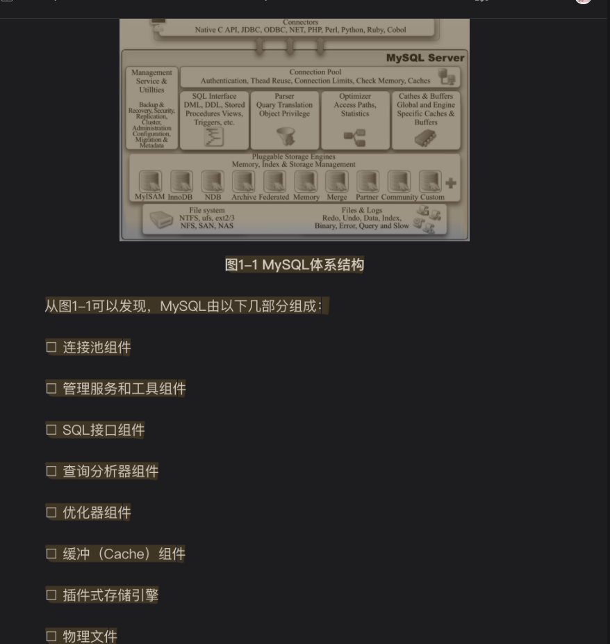
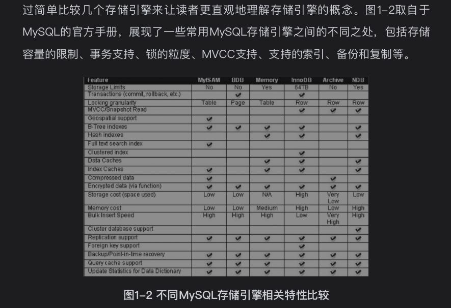

# 1.1定义数据库和实例

## 数据库和实例的区别

* 前者:物理操作系统或其他形式文件类型的集合。 
  数据库文件可以是frm,MYD,MYI,idb结尾的文件
* 后者:由后台线程以及一个共享内存区组成的进程 
  mysql实例单进程多线程

## 查看引用配置文件所在
mysql如何开启慢sql.md文件中有提到如何找my.cnf文件

## 查看数据库数据路径所在

```
show variables like 'datadir';
+---------------+-----------------------+
| Variable_name | Value                 |
+---------------+-----------------------+
| datadir       | /usr/local/var/mysql/ |
+---------------+-----------------------+
1 row in set
  Time: 0.021s
```

## 查看mysql innodb版本
```
show variables like 'innodb_version';
+----------------+--------+
| Variable_name  | Value  |
+----------------+--------+
| innodb_version | 8.0.21 |
+----------------+--------+
1 row in set
Time: 0.076s
```
## 观察innodb引擎运行状态
后面最常用的命令
```
show engine innodb status\G;

```

# 1.2mysql体系结构

区别其他数据库最重要的一个特点就是其插件式的存储引擎。
主要明确的是存储引擎是基于表的，而不是数据库

# 1.3mysql存储引擎
了解即可
## 1.3.1innodb存储引擎
* 支持事务，主要面向在线事务处理(OLTP)应用
* 行锁设计
* MVCC多版本并发控制，4种隔离级别，默认REPEATABLE级别
* next-key locking策略避免幻读现象出现

其他高性能，高可能功能
* 插入缓存(insert buffer)
* 二次写(double write)
* 自适应哈希索引(adaptive hash index,貌似缓存已经在mysql处于待废弃状态了)
* 预读(read ahead)

## 1.3.2MyISAM存储引擎
* 不支持事务，表锁设计（并不是所有应用都需要事务支持）
* 支持全文索引
* 表由MYD和MYI组成，前者存放数据文件，后者存放索引文件

其他存储引擎了解下
* NDB存储引擎
* Memory存储引擎
* Maria存储引擎

# 1.4个存储引擎之间的比较

```
show engines;
+--------------------+---------+----------------------------------------------------------------+--------------+--------+------------+
| Engine             | Support | Comment                                                        | Transactions | XA     | Savepoints |
+--------------------+---------+----------------------------------------------------------------+--------------+--------+------------+
| ARCHIVE            | YES     | Archive storage engine                                         | NO           | NO     | NO         |
| BLACKHOLE          | YES     | /dev/null storage engine (anything you write to it disappears) | NO           | NO     | NO         |
| MRG_MYISAM         | YES     | Collection of identical MyISAM tables                          | NO           | NO     | NO         |
| FEDERATED          | NO      | Federated MySQL storage engine                                 | <null>       | <null> | <null>     |
| MyISAM             | YES     | MyISAM storage engine                                          | NO           | NO     | NO         |
| PERFORMANCE_SCHEMA | YES     | Performance Schema                                             | NO           | NO     | NO         |
| InnoDB             | DEFAULT | Supports transactions, row-level locking, and foreign keys     | YES          | YES    | YES        |
| MEMORY             | YES     | Hash based, stored in memory, useful for temporary tables      | NO           | NO     | NO         |
| CSV                | YES     | CSV storage engine                                             | NO           | NO     | NO         |
+--------------------+---------+----------------------------------------------------------------+--------------+--------+------------+

```

# 资料
## 
* 1.[下载mysql实例数据库,当然找不到啦](http://dev.mysql.com/doc)

