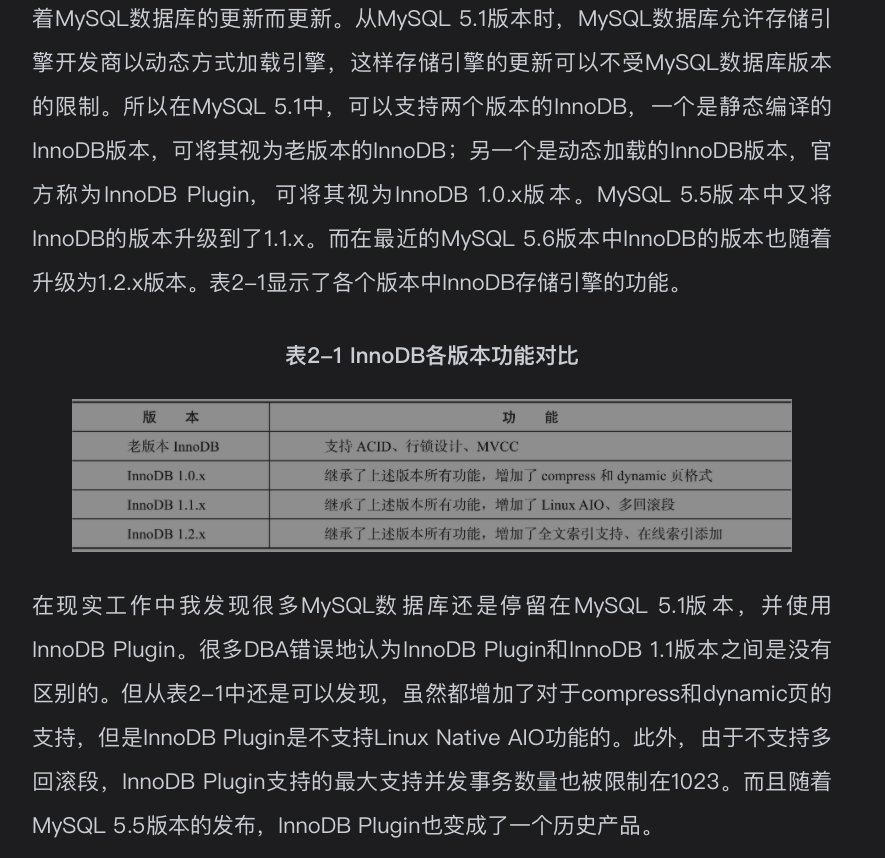
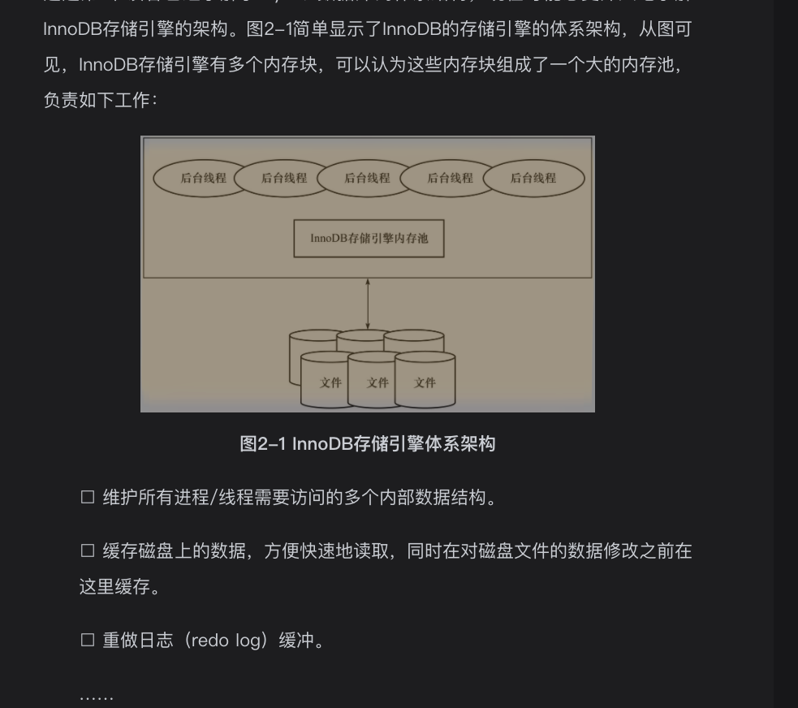
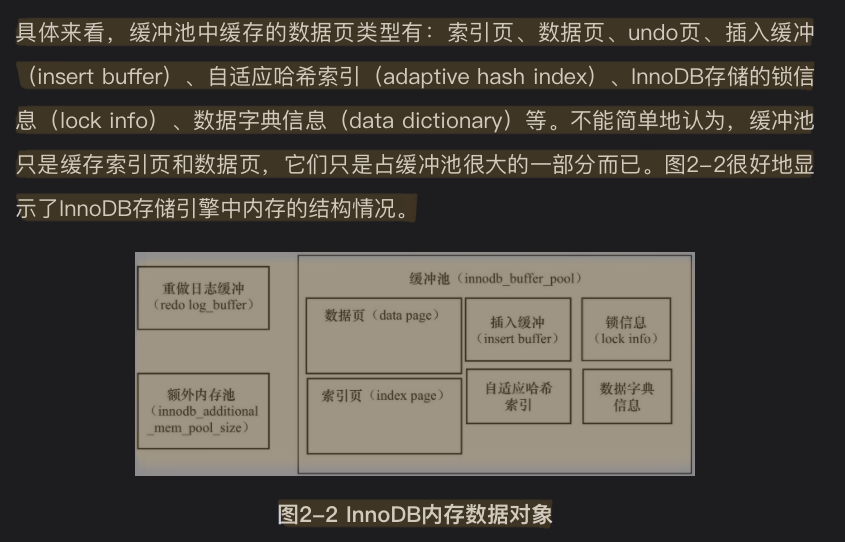
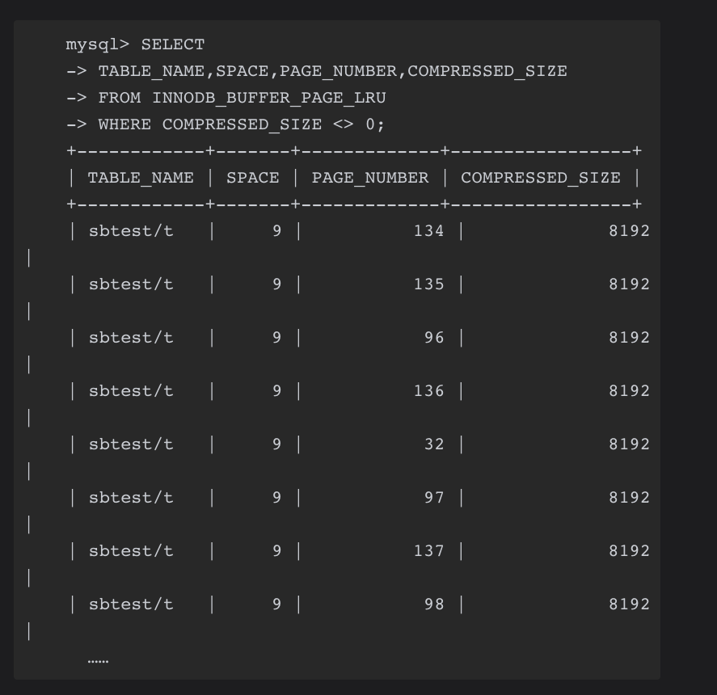

# 2.1InnoDB存储引擎概述
从mysql5.5版本开始是默认的表存储引擎
OLTP应用中核心表的首选存储引擎
第一个完整支持ACID事务的mysql存储引擎

# 2.2Innodb存储引擎版本
|mysql版本|innodb版本|描述|
|---|---|---|
|mysql5.1|老版本innodb||
|mysql5.1|innodb1.0.x版本||
|mysql5.5|innodb1.1.x版本||
|mysql5.6|innodb1.2.x版本||



# 2.3InnoDB体系架构
innodb存储引擎体系架构图重要系列


后台线程的主要作用是
* 负责刷新内存池中的数据，保证缓存池汇总的内存缓存的是最近的数据。
* 将已修改的数据文件刷新到磁盘文件 
* 同时保证在数据库发生异常的情况下InnoDB能恢复到正常运行状态

## 2.3.1后台线程
InnoDB存储引擎是多线程模型,后台有不同的后台线程，负责处理不同的任务

### Master Thread
核心后台线程。2.5节会详细介绍各个版本中Master Thread的工作方式

### IO Thread
Innodb 1.0版本主要有4中IO Thread，write，read，insert buffer和log IO thread.

大量使用AIO(Async IO)来处理写IO请求,io threade主要负责浙西io请求的回调(call back)处理.可以极大提高数据库性能
查看io thread线程数信息
```
#mysql5.7
SHOW VARIables like 'innodb%thread%';
+---------------------------+-------+
| Variable_name             | Value |
+---------------------------+-------+
| innodb_purge_threads      | 1     |
| innodb_read_io_threads    | 4     |
| innodb_thread_concurrency | 0     |
| innodb_thread_sleep_delay | 10000 |
| innodb_write_io_threads   | 4     |
+---------------------------+-------+
5 rows in set
Time: 0.326s

#mysql5.8
+------------------------------+-------+
| Variable_name                | Value |
+------------------------------+-------+
| innodb_parallel_read_threads | 4     |
| innodb_purge_threads         | 4     |
| innodb_read_io_threads       | 4     |
| innodb_thread_concurrency    | 0     |
| innodb_thread_sleep_delay    | 10000 |
| innodb_write_io_threads      | 4     |
+------------------------------+-------+
```
可以通过*show engine innodb status*来观察innodb的IO Thread
```
#mysql 5.7 FILE I/O部分
--------
FILE I/O
--------
I/O thread 0 state: waiting for i/o request (insert buffer thread)
I/O thread 1 state: waiting for i/o request (log thread)
I/O thread 2 state: waiting for i/o request (read thread)
I/O thread 3 state: waiting for i/o request (read thread)
I/O thread 4 state: waiting for i/o request (read thread)
I/O thread 5 state: waiting for i/o request (read thread)
I/O thread 6 state: waiting for i/o request (write thread)
I/O thread 7 state: waiting for i/o request (write thread)
I/O thread 8 state: waiting for i/o request (write thread)
I/O thread 9 state: waiting for i/o request (write thread)
Pending normal aio reads: [0, 0, 0, 0] , aio writes: [0, 0, 0, 0] ,
 ibuf aio reads:, log i/o's:, sync i/o's:
Pending flushes (fsync) log: 0; buffer pool: 0
17132022 OS file reads, 129093260 OS file writes, 126183733 OS fsyncs
0.03 reads/s, 16384 avg bytes/read, 36.86 writes/s, 35.83 fsyncs/s
-------------------------------------
```
可以看出
* IO Thread 0为insert buffer thread
* IO Thread 1为log thread
* 之后就是4个read thread,4个write thread

### Purge Thread
事务提交后，其所使用的undolog可能不再需要，因此需要来回收已经使用并分配的undo页。
* innodb1.1版本之前，purge操作仅在InnoDB存储引擎的master thread中完成
* 从innodb1.1版本开始，purge操作在独立线程中进行
  可以减轻master thread的工作，从而提高CPU的使用率
* 从innodb1.2版本开始，innodb支持多个purge thread，为了进一步加快undo页的回收
  同时由于Purge Thread需要离散地读取undo页，可以可能更进一步利用磁盘的随机读取性能(TODO:cj 这怎么理解)
支持配置purge线程池数
```
##mysql配置文件
[mysqld]
innodb_purge_threads=4
```

### Page Cleaner Thread
innodb1.2.x版本引入，作用将之前版本中脏页的刷新操作都放入到单独的线程中来完成
目的是为了减轻原Master Thread的工作及对用户查询线程的阻塞,进一步提高innodb存储引擎的性能。

## 2.3.2内存
### 1缓冲池
*问题之假如你设计innodb系统，innodb为什么引入缓冲池？*
引入缓存也算是基于磁盘的数据库系统的通用设计思路吧

innodb基于磁盘存储，记录按照页(默认每页16KB)进行管理，属于基于磁盘的数据库系统(Disk-base Database)(了解数据库系统概述部分)

因为总所周知的计算机CPU速度和磁盘速度之间的鸿沟，基于磁盘的数据库系统通常使用缓冲池技术来提高数据库的整体性能。

*问题之innodb缓冲池工作机制* 
内存区域
* 在数据库进行读取页的操作，首先将从磁盘读取的页放在缓冲池中，这个过程称为将页FIX在缓冲池
* 下次读取相同页时，首先判断该页是否在缓冲池中，如在则该页命中缓冲池，直接读取该页。否则读取磁盘上的页。
* 对于数据库中页的修改操作，首先修改在缓冲池中的页(TODO:cj如果缓冲池中没有也先读到缓冲池中嘛，应该是的)，
  然后再以一定的频率刷新到磁盘上。
* 页从缓冲池刷新回磁盘操作并不是在每次页发生更新时触发，而是通过一种称为*checkpoint*的机制刷新回磁盘，为了提高数据库的整体性能

连环问题之自然想知道checkpoint是个啥，TODO:cj后面应该有介绍

#### innodb缓冲池内存结构
* 数据页
* 索引页
* undo页
* 重做日志缓冲  
* 插入缓冲(insert buffer)
* 自适应哈希索引(adaptive hash index)
* innodb存储的锁信息(lock info)
* 数据字典信息(data dictionary)
* 等等



配置*innodb_buffer_pool_size* 配置缓冲池大小
*innodb_buffer_pool_instances* 配置缓冲池实例数量
```
# mysql5.7 uat
SHOW VARIables like 'innodb%buffer%';
+-------------------------------------+----------------+
| Variable_name                       | Value          |
+-------------------------------------+----------------+
| innodb_buffer_pool_chunk_size       | 134217728      |
| innodb_buffer_pool_dump_at_shutdown | ON             |
| innodb_buffer_pool_dump_now         | OFF            |
| innodb_buffer_pool_dump_pct         | 25             |
| innodb_buffer_pool_filename         | ib_buffer_pool |
| innodb_buffer_pool_instances        | 1              |
| innodb_buffer_pool_load_abort       | OFF            |
| innodb_buffer_pool_load_at_startup  | ON             |
| innodb_buffer_pool_load_now         | OFF            |
| innodb_buffer_pool_size             | 3087007744     |
| innodb_change_buffer_max_size       | 25             |
| innodb_change_buffering             | all            |
| innodb_log_buffer_size              | 8388608        |
| innodb_sort_buffer_size             | 1048576        |
+-------------------------------------+----------------+
14 rows in set
Time: 0.046s
```
可以通过show engine innodb status观察buffer pool信息


```
# mysql5.7 uat
use information_schemal;
select pool_id,pool_size,free_buffers,database_pages from innodb_buffer_pool_stats;
+---------+-----------+--------------+----------------+
| pool_id | pool_size | free_buffers | database_pages |
+---------+-----------+--------------+----------------+
| 0       | 188416    | 1024         | 177670         |
+---------+-----------+--------------+----------------+
1 row in set
Time: 0.029s
```
### 2LRU List，Free List和Flush List
*问题之innodb缓冲池怎么对内存区域进行管理的呢?*
* 采用优化过的LRU算法(latest recented used,最近最少使用)

优化点:
* LRU列表中加入了midpoint位置。新读取到的页，虽然是最新访问的页，但并不是直接
  放入到LRU列表的首部，而是放入到LRU列表的midpoint位置。（算法成为midpoint insert strategy）

*连环问题之2与朴素的LRU算法相比，midpoint insert strategy算法有什么优势?*
因为某些SQL操作(例如索引或者数据的扫描操作)可能会读取大量页数据，仅在本次查询中用到，后面就不需要了，
如果将读取到页直接放到队首，会将真正活跃的页刷出。

innodb_old_block_pct:控制该midpoint的位置，默认值为37(差不多3/8位置)
midpoint之后的列表称为old列表，之前的列表称为new列表，简单理解new列表的页面都是最为活跃的热点数据。

连环问题之3如何才能成为LRU列表new列表的热点数据
引入了*innodb_old_blocks_time*配置项,表示页读取到mid位置后需要等待多久才会被加入LRU列表的热端,默认1000ms

```
information_schema> show variables like 'innodb_old%';
+------------------------+-------+
| Variable_name          | Value |
+------------------------+-------+
| innodb_old_blocks_pct  | 37    |
| innodb_old_blocks_time | 1000  |
+------------------------+-------+
2 rows in set
Time: 0.031s
```

缓冲池页大小默认为16KB(这个数字很重要，请记住系列)

page made young:当页从LRU列表的old部分加入到new部分，这个操作
page not made young:页没有从old部分移动到new部分的操作(可能因为innodb_old_blocks_time设置原因)

#### free list

*问题之free列表作用*
数据库刚启动时，LRU列表是空的，这时页都存放在free列表中
当需要从缓冲池中分页时，首先从free列表中查找是否有可有的空闲页，如果有则将该页从free列表中删除，放入到lru列表中
如无，则根据LRU算法，淘汰LRU列表末尾的页，将该内存空间分配给新的页

参考资料网页1，里面解释地更详细

#### unzip_LRU列表
压缩页，即将原本16KB的页压缩为1KB，2KB，4KB和8KB
对于非16KB的页，通过unzip_LRU列表进行管理


*问题之unzip_LRU怎样从缓冲池中分配内存页呢?*
首先，在unzip_LRU列表中对不同压缩页大小页进行分别管理
其次，通过*伙伴算法*进行内存的分配
例如需要从缓冲池中申请页为4KB的大小，其过程如下:
* 1.检查4KB的unzip_LRU列表，检查是否有可用的空闲页
* 2.若有，则直接使用
* 3.若物，则检查8KB的unzip_LRU列表
* 4.若能够得到空闲页，将页分成2个4KB页，存放到4KB的unzip_LRU列表
* 5.若不能得到空闲页,从LRU列表中申请一个16KB的页，将页分为1个8KB的页、2个4KB的页，
  分别存放到对应的unzip_LRU列表中
  
*连环问题之1unzip_LRU列表小页越来越多如何处理?*
TODO:cj猜测是有一种回收机制，例如处理碎片时针对不用的unzip_LRU列表重新释放出来


也可以通过information_schema中innodb_buffer_pool_stats观察缓冲池的运行状态
```
select * from infomation_schema.innodb_buffer_pool_stats;
***************************[ 1. row ]***************************
POOL_ID                          | 0
POOL_SIZE                        | 188416
FREE_BUFFERS                     | 1024
DATABASE_PAGES                   | 182050
OLD_DATABASE_PAGES               | 67182
MODIFIED_DATABASE_PAGES          | 22580
PENDING_DECOMPRESS               | 0
PENDING_READS                    | 0
PENDING_FLUSH_LRU                | 0
PENDING_FLUSH_LIST               | 0
PAGES_MADE_YOUNG                 | 50536893
PAGES_NOT_MADE_YOUNG             | 1011209808
PAGES_MADE_YOUNG_RATE            | 6.40092576435298e-10
PAGES_MADE_NOT_YOUNG_RATE        | 0.0
NUMBER_PAGES_READ                | 34386507
NUMBER_PAGES_CREATED             | 1923740
NUMBER_PAGES_WRITTEN             | 7508068
PAGES_READ_RATE                  | 0.0
PAGES_CREATE_RATE                | 6.40092576435298e-10
PAGES_WRITTEN_RATE               | 8.961296070094172e-09
NUMBER_PAGES_GET                 | 75620777266
HIT_RATE                         | 1000
YOUNG_MAKE_PER_THOUSAND_GETS     | 0
NOT_YOUNG_MAKE_PER_THOUSAND_GETS | 0
NUMBER_PAGES_READ_AHEAD          | 2223703
NUMBER_READ_AHEAD_EVICTED        | 26292
READ_AHEAD_RATE                  | 0.0
READ_AHEAD_EVICTED_RATE          | 0.0
LRU_IO_TOTAL                     | 105
LRU_IO_CURRENT                   | 0
UNCOMPRESS_TOTAL                 | 0
UNCOMPRESS_CURRENT               | 0
```
也可以通过innodb_buffer_page_lru观察每个LRU列表中每个页的具体信息
```
select table_name,space,page_number,page_type from innodb_buffer_page_lru where space=0;
+-------------------+-------+-------------+-------------------+
| table_name        | space | page_number | page_type         |
+-------------------+-------+-------------+-------------------+
| <null>            | 0     | 50986       | IBUF_INDEX        |
| <null>            | 0     | 51524       | IBUF_INDEX        |
| <null>            | 0     | 1811        | IBUF_INDEX        |
| `SYS_COLUMNS`     | 0     | 49524       | INDEX             |
| <null>            | 0     | 98346       | UNDO_LOG          |
| <null>            | 0     | 350         | UNDO_LOG          |
| <null>            | 0     | 16438       | UNDO_LOG          |
| <null>            | 0     | 92027       | UNDO_LOG          |
| <null>            | 0     | 16401       | UNDO_LOG          |
| <null>            | 0     | 92020       | UNDO_LOG          |
| `SYS_TABLES`      | 0     | 385         | INDEX             |
| `SYS_COLUMNS`     | 0     | 3168        | INDEX             |
| `SYS_COLUMNS`     | 0     | 49515       | INDEX             |
| `SYS_COLUMNS`     | 0     | 417         | INDEX             |
| `SYS_COLUMNS`     | 0     | 471         | INDEX             |
| `SYS_COLUMNS`     | 0     | 647         | INDEX             |
| `SYS_COLUMNS`     | 0     | 685         | INDEX             |
| `SYS_COLUMNS`     | 0     | 432         | INDEX             |
| `SYS_COLUMNS`     | 0     | 668         | INDEX             |
| `SYS_COLUMNS`     | 0     | 684         | INDEX             |
| `SYS_TABLES`      | 0     | 2080        | INDEX             |
| `SYS_COLUMNS`     | 0     | 420         | INDEX             |
| `SYS_COLUMNS`     | 0     | 49529       | INDEX             |
| `SYS_INDEXES`     | 0     | 55491       | INDEX             |
| `SYS_COLUMNS`     | 0     | 3149        | INDEX             |
| `SYS_COLUMNS`     | 0     | 3150        | INDEX             |
| `SYS_COLUMNS`     | 0     | 3145        | INDEX             |
| <null>            | 0     | 81977       | UNDO_LOG          |
| <null>            | 0     | 91997       | UNDO_LOG          |
| `SYS_TABLES`      | 0     | 567         | INDEX             |
| <null>            | 0     | 32769       | IBUF_BITMAP       |
| `SYS_INDEXES`     | 0     | 514         | INDEX             |
```

在innodb_buffer_page_lru中观察unzip_LRU列表中的页
正常LRU列表中的compressed_size值为0

```
select table_name,space,page_number,compressed_size from innodb_buffer_page_lru 
where compressed_size <>0;
```
2innodb_buffer_page_lru观察unzip_LRU列表截图


### 3重做日志缓冲(redo log buffer)
innodb将重做日志先放到这个缓冲区，然后按一定频率将其刷新到重做日志文件。

*重做日志缓冲大小设置建议*
一般不需要设置的很大，一般每一秒中会将重做日志缓冲刷新到日志文件，
因此保证每秒产生的事务量在这个缓冲大小即可。

该值由*innodb_log_buffer_size*控制，默认为16MB(mysql8,5.7版本默认为8MB)

在通常情况下8MB的重做日志缓冲池足以满足绝大部分的应用

####问题之重做日志缓冲刷新时机
* master thread每一秒将重做日志缓冲刷新到重做日志文件
* 每个事物提交时会将重做日志缓冲刷新到重做日志文件(保证数据库的ACID)
* 当重做日志缓冲池剩余空间小于1/2时，重做日志缓冲刷新到重做日志文件

后续见重做日志文件的存在意义

连环问题之重做日志一定能保证数据库事务不丢失嘛
为了保证事务ACID的D(Durability持久性)的要求
不一定，因为有重做日志缓存的存在，所以一般最多可能有1秒的重做日志缓存失效

### 4额外的内存池
对内存管理通过内存堆(heap)方式进行
而对一些数据结构本身的内存进行分配时，需要从额外的内存池中进行申请。

例如分配了缓冲池，但是每个缓冲池中的帧缓冲(frame buffer)还有对应的缓冲
控制对象(buffer control block)，这些对象记录了一些诸如
LRU、锁、等待等信息，而这个对象的内存需要从额外内存池中申请。

# 2.4Checkpoint技术
问题背景
脏页:
例如一条DML语句，如update/delete改变了页中的记录，那么此时页是脏的，即
缓冲池中的页的版本要比磁盘的新。
自然地，数据库需要将新版本的页从缓冲池刷新到磁盘。

为了处理异步刷新脏页问题引入了checkpoint概念

*checkpoint干的核心事情就是将脏页从缓冲池刷新到磁盘*

引入checkpoint检查点技术的目的是解决以下问题
* 缩短数据库启动的恢复时间
* 缓冲池不够用时，将脏页刷新到磁盘
* 重做日志不可用时，刷新脏页

进一步说明

1.当数据库发生宕机时，数据库不需要重做所有的日志，因为checkpoint之前的页都已经刷新回磁盘。
故数据库只需对checkpoint后的重做日志进行恢复，这样可以大大缩短恢复时间

2.当缓冲池不够用时，根据LRU算法会溢出最近最少使用的页，若此页为脏页，那么需要强制执行
checkpoint，将脏页也就是页的新版本刷会磁盘。

3.重做日志出现不可用的情况是
当前事务数据库系统对重做日志的设计都是循环使用的(文件组，详见第三章重做日志文件一节)，并不是让其无限增大的，也没有必要。
重做日志可以被重用的部分是指这些重做日志已经不再需要，即当数据库发生宕机时，
数据库恢复操作不需要这部分的重做日志，因此这部分就可以被覆盖重用。

## LSN(Log Sequence Number)
innodb通用，用于标记版本，8字节数据，单位是字节。
每个页，重做日志，checkpoint都有LSN
使用show engine innodb status观察
```
---
LOG
---
Log sequence number 2992140559934
Log flushed up to   2992140557755
Pages flushed up to 2991952365634
Last checkpoint at  2991952365634
0 pending log flushes, 0 pending chkp writes
125605471 log i/o's done, 35.60 log i/o's/second
----------------------
```


# 资料
## 网页
* 1.[一看就懂的MySQL的FreeList机制](http://www.likecs.com/show-120096.html)
* 1.1[印象笔记backup](https://app.yinxiang.com/shard/s23/nl/6983422/3b174bee-d40a-4be8-a178-902745cf3bb4)

* 2.[MySQL checkpoint深入分析](https://www.cnblogs.com/geaozhang/p/7341333.html)
* 2.1[印象笔记backup](https://app.yinxiang.com/shard/s23/nl/6983422/dc34034c-34c9-4b75-a89f-c15bee9af13c)