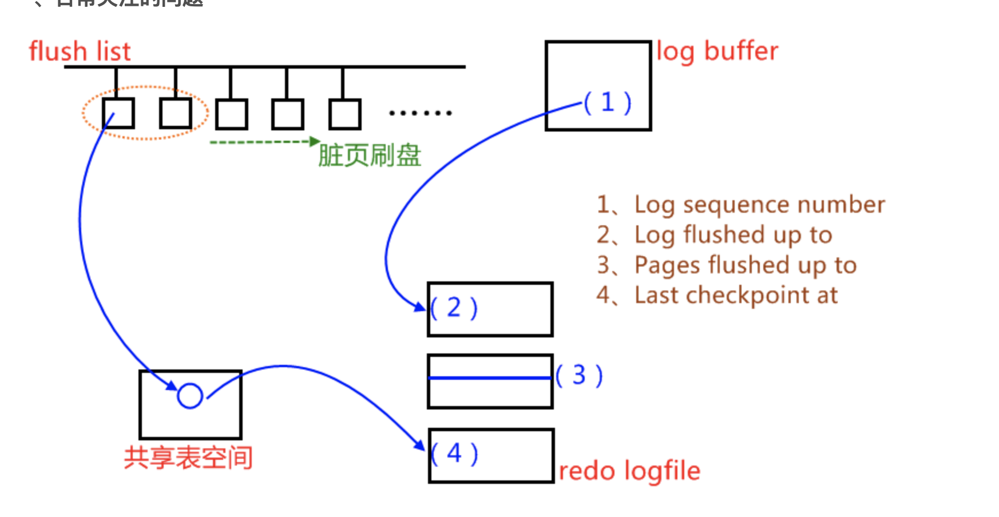
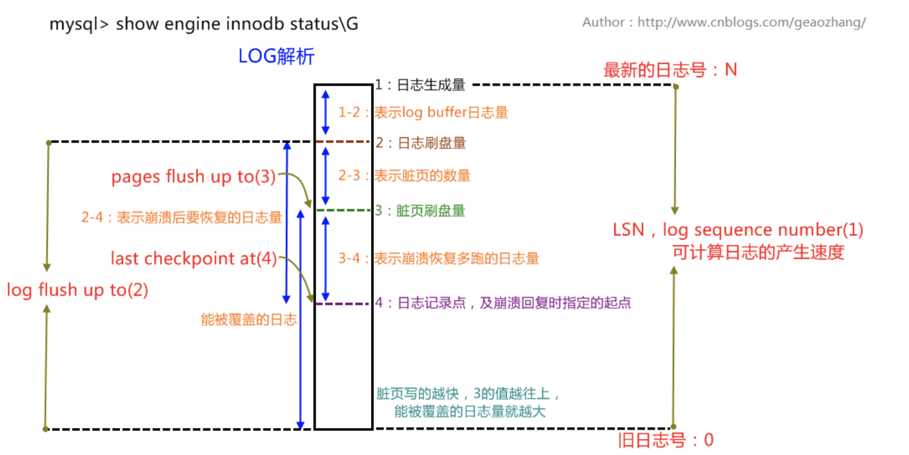
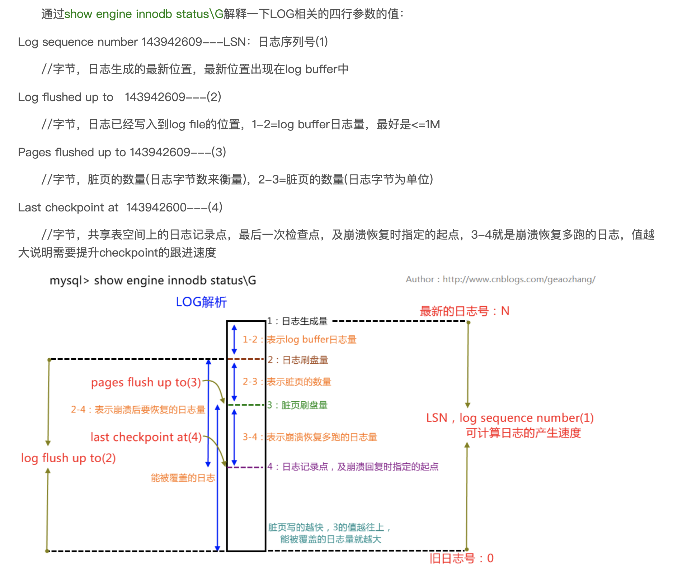

# 命令概述 
该命令展示的不是当前状态，而是过去某个时间范围内innodb存储引擎的状态，例如
`Per second averages calculated from the last 35 seconds`
表示信息为过去35秒的数据库状态

# BUFFER POOL AND MEMORY 部分
## LRU列表以及Free列表

解析内容
buffer pool size表示缓冲池总页数,*16KB就是缓冲池的大小
free buffer：表示当前列表页的数量
database pages表示LRU列表中页的数量
一般 free buffer+database pages<buffer pool size


详参见2InnoDB存储引擎.md的2.3.2内存

## unzip_LRU列表

需要注意的是LRU中的页包含了unzip_LRU列表中的页
一共1539个页，而unzip_LRU列表中有156个页


# LOG部分
```
---
LOG
---
Log sequence number 2992140559934
Log flushed up to   2992140557755
Pages flushed up to 2991952365634
Last checkpoint at  2991952365634
0 pending log flushes, 0 pending chkp writes
125605471 log i/o's done, 35.60 log i/o's/second
----------------------
```

通过show engine innodb status\G解释一下LOG相关的四行参数的值：

Log sequence number 143942609---LSN：日志序列号(1)
//字节，日志生成的最新位置，最新位置出现在log buffer中

Log flushed up to   143942609---(2)
//字节，日志已经写入到log file的位置，1-2=log buffer日志量，最好是<=1M

Pages flushed up to 143942609---(3)
//字节，脏页的数量(日志字节数来衡量)，2-3=脏页的数量(日志字节为单位)

Last checkpoint at  143942600---(4)
//字节，共享表空间上的日志记录点，最后一次检查点，及崩溃恢复时指定的起点，3-4就是崩溃恢复多跑的日志，值越大说明需要提升checkpoint的跟进速度



LSN日志分析 对各个字段的含义整体梳理分析




# 资料

