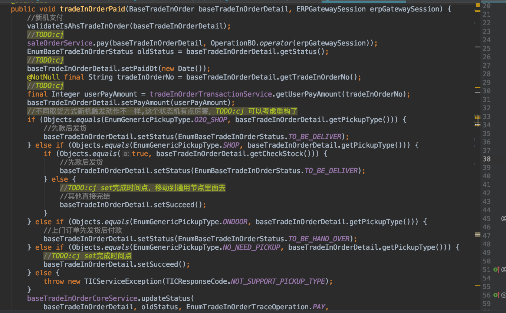
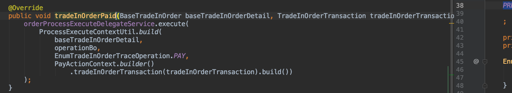
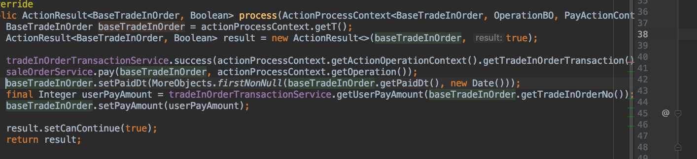

# 中台订单服务状态机设计分享
# 1.问题
## 1.1引入状态机之前的代码现状

***忽略TODO***

代码坏味道
* 可读性差
* 可维护性差
* 可扩展性差

## 1.2复杂的订单状态机
[换新订单流汇总](https://www.processon.com/view/link/5d5a542de4b04399f5aa0ad3)

## 1.3需要手动写大量的前置校验逻辑校验是否允许订单翻转订单状态

## 1.4线上踩过的坑:会碰到订单明明应该到目标状态却翻转回之前的状态
* 场景:一站换新订单重复收到合作方支付通知

# 2.需求分析
## 2.1进一步分析订单状态图
* 根据业务上下文判断当前状态翻转到哪个状态
* 同一个节点支持多流向，多动作
* 动作支持不同角色操作(取消)
* 不同订单流程相同状态需要处理的业务逻辑也不尽相同--->多条件处理器

## 2.2支持幂等操作

## 2.3允许跳转回前置状态

## 2.4设计一个通用状态机，可以运用到多个业务系统中，而不仅仅是针对订单的订单状态机

## 2.5可绘制，可视化输出能力(TODO)

# 3.设计
## 1个订单状态流 VS 多个订单状态流 
业务动作驱动订单机状态变化

## 3.2模型
* 流程(Process)
* 节点(ProcessNode)
* 流向(ProcessFlow)
* 动作(ProcessAction)

* 角色(ProcessOperator)
* 操作上下文(ProcessBiz)
* 业务流程上下文(BizProcessContext)

## 3.3组件
* 流程引擎(ProcessEngine)
* 订单流程绑定器(ProcessBinder)

* 流程执行调用链(ProcessExecuteCallChain)
* 流程加载器(ProcessLoader) yml/db
* 流程持有器(ProcessHolder)

### 多条件处理器
* 动作处理器
* 路由处理器(多流向路由处理器)
* 节点处理器

## 3.4组件交互
[订单流组件交互图](https://www.processon.com/diagraming/5f5882677d9c08028bddedfd)
[订单状态流执行过程分析](https://www.processon.com/diagraming/5ea5674763768974669292e9)

# 4.实现--->show me code
## 4.1代码组织架构

## 4.2订单状态机描述(yml方式)

## 4.3单元测试

## 4.4引入状态机之后的代码效果

+

# 5.优化与展望
## 优化
* 多个动作处理器执行结果优雅处理

## 展望
* 一个业务系统中支持多个状态机
* 引入SpEL,ognl等表达式支持复杂上下文表达式
* 状态机特性:自动跳过指定节点
* 前端可编辑,展示状态机，可拖拽,简化状态机维护成本和可视化输出
plantuml

* 其他你想的

# 6.招贤令

# 资料
[通用订单状态模型梳理](https://www.processon.com/diagraming/5eb664cfe401fd16f4274ba3)
[订单状态流执行过程分析](https://www.processon.com/diagraming/5ea5674763768974669292e9)
