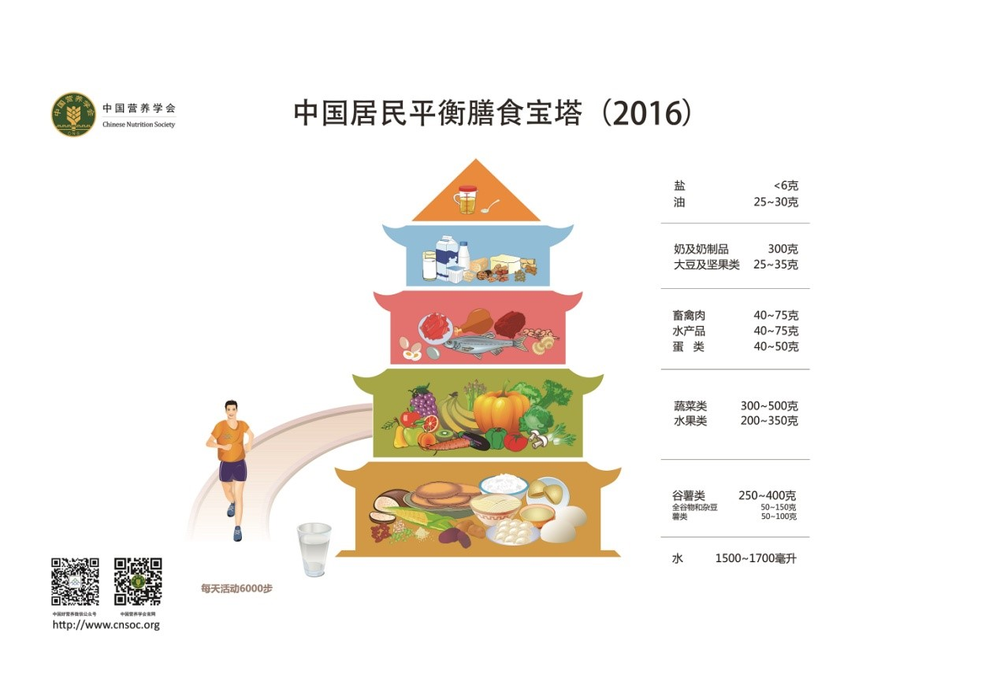
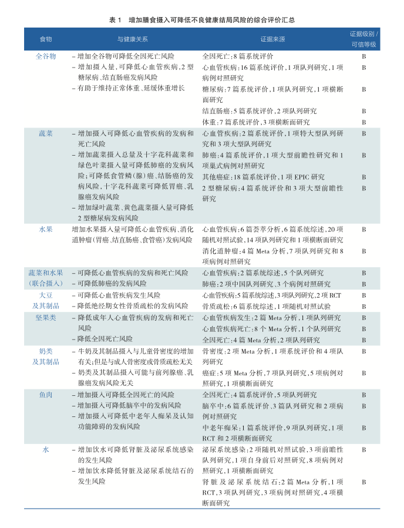
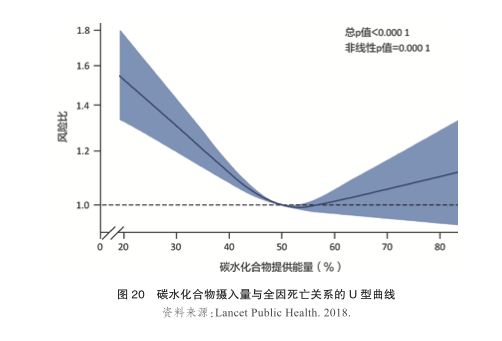

# 介绍

# 中国营养膳食指南

中国营养学会

[《中国居民膳食指南科学研究报告（2021）》简本.pdf 副本](https://github.com/chujun/gitBackupConfig/blob/master/document/book/%E7%94%9F%E6%B4%BB/1%E4%B8%AD%E5%9B%BD%E5%B1%85%E6%B0%91%20%E8%86%B3%E9%A3%9F%E6%8C%87%E5%8D%97%20%E7%A7%91%E5%AD%A6%E7%A0%94%E7%A9%B6%E6%8A%A5%E5%91%8A2021.pdf)

## 增加膳食摄入可降低不良健康结局风险的综合评价汇总

* 全谷类
* 蔬菜类 （十字花科类蔬菜效果最好）(500g)
* 水果类
* 大豆及其制品
* 坚果类(28g)
* 奶类及其制品（200g)
* 鱼肉
* 水

### 定量分析

* 全谷类
* 蔬菜类 (500g)
* 水果类
* 大豆及其制品
* 坚果类  (28g)
* 奶类及其制品
* 鱼肉 （50g）
* 水
  

## 过量膳食摄入可增加慢性疾病风险的膳食因素

* 畜肉
* 烟熏肉类
* 酒
* 盐(低钠 <1.5g/d)
* 糖
* 油脂（不饱和脂肪酸）

## 毛病

###  

* 摄入坚果类可以改善成年人血脂
* 增加饮水量降低肾脏和泌尿系统感染的风险

## 胃

* 增加蔬菜摄入总量与胃癌发病风险无关,但葱类蔬菜和十字花蔬菜对预防胃癌有保护作用
* 增加水果摄入可降低胃癌的发病风险
* 每天增加6倍绿茶可降低21%胃癌发病风险(适量喝点)

## 健康膳食模式

* 地中海模式
* DASH模式（主要面向降低血压）
* 江南模式

|膳食模式|地区|推荐性|特点|主要食物|
|---|---|---|---|---|
|DASH模式|DASH降血压饮食方案|AAAAA|强调摄食足量的蔬菜、水果，低脂或脱脂奶，以维持足够的钾，镁，钙等离子的摄取，并尽量减少饮食中盐和油脂（特别是富含饱和脂肪酸的动物性油脂）的摄入量，可有效降低血压||
|地中海模式|意大利南部，希腊大部分地区,尤其是克里特岛|AAAA|食物多样，清淡和加工简单，营养素丰富，单不饱和脂肪酸（橄榄油）和膳食纤维（全谷物）的摄入量很高|常吃谷类，蔬菜，水果，坚果种子类，橄榄油，奶酪与酸奶，饮水和茶水，大蒜和洋葱等香料，每周或者每月食用包括鱼类，禽肉（白肉）、蛋类|
|中国江南地区膳食|以江浙沪地区为代表|AAAA|以米类为主食,新鲜蔬菜水果摄入量充足；动物性食物以猪肉和鱼虾类为主，鱼虾摄入相对较高，猪肉摄入量低；烹饪清淡少油少盐，比较接近理想膳食模式||

### 膳食功能比例与健康

能量主要由碳水化合物,脂肪和蛋白质提供 建议碳水化合物比例在50-55%之间最佳

## 体重与健康
TODO:cj 
## 总结建议
A,B表示可信级别
* 多运动 A
* 应该增加膳食摄入的食物种类(见上文) B
* 应该减少膳食摄入的食物种类(见上文) B
* 膳食碳水化合物供能比例在50%-55%之间最佳 B
* 多吃蔬菜和水果 B
* 少盐少油 B
* 适量饮茶 B
* 多喝水 B
* 不用久坐 B

# 食物分析

## 定性

## 定量

# 实践

大数据分析

* 尽可能统计每日体重，分析提供体重变化趋势

# 软件

饮食:薄荷营养师 健身:keep

# 资料

* [中国居民膳食指南2021版](http://dg.cnsoc.org/article/2021b.html)
* [《中国居民膳食指南科学研究报告（2021）》简本.pdf](http://dg.cnsoc.org/upload/affix/20210301174345895.pdf)