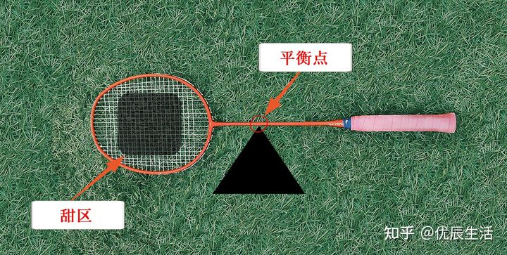

#

# 基本知识

## 球拍材质

碳素是现在主流球拍的材质，特点就是轻，很轻，最重100g左右。轻的好处是省力，对非专业人士身体的损伤也小一些。

## 磅数

U表示重量，而李宁羽毛球拍则是用W表示重量参数。 羽毛球拍有1U、2U、3U、4U、5U，数字越大表示重量越轻。轻的拍子确实更灵活，但其实不是越轻越好，太轻的话可能没手感。

|参数  |  重量|
|---|---|
|1U|95-100克|	
|2U|90-94克|
|3U|85-89克|
|4U|80-84克|
|5U|75-79克|

如上所述，李宁羽毛球拍用W表示重量。

W1对应5U，W2对应4U，W3对应3U，W4对应2U和1U。

|参数  |  重量|
|---|---|
|W1    |≤80克|
|W2    |81-84克|
|W3    |85-89克|
|W4    |≥90克|

在球馆比较常见的、适合大数人的是3U（李宁W3）和4U（李宁W2）。

那么3U 4U怎么选呢？3U的虽然比4U的重，但是更稳定，进攻力度也会更大一些，适合力量大一些的人，男士选3U的多。 女生，本身力量有限，打久了，就觉得累、拍子沉，所以4U的更轻巧，挥杆自然会更快，也更省力，女生选4U的多。

## 甜区

* 羽毛球拍的甜区一般位于横线第4根的附近下方的区域成为甜区，
* 一般情况下方形拍头的甜区比圆形拍头的甜区大，羽毛球拍的甜区越大越容易掌控，更有效的击球、控球等，

大甜区对新手入门来说是一个不错的选择。

## 平衡点

平衡点就是从羽毛球拍底端到球拍重心的距离，距离越大所用的力臂越大， 所产生的进攻力度也就越强，就意味着可以用很少的力气达到更强的进攻效果。

### 怎么寻找羽毛球拍平衡点呢？

*让球拍悬空横放在一个支点上，能让球拍保持平衡的那个支点就是平衡点了。*

这种方法没有那么精确，但是可以判断球拍哪支羽毛球拍头重。

羽毛球拍平衡点范围一般在280mm-320mm之间，

* 头重（>295mm）的球拍，适合进攻，因为拍头重击球力度更大。
* 头轻（<285mm）的球拍，适合防守，因为挥杆更灵活、反应更快。
* 新手，果断选平衡点在285-295mm之间的就可以来，平衡型，攻守兼备。

羽毛球拍选择平衡点数值参考：

|性能|    范围|    类型|
|---|---|---|
|防守型|    小于285mm|    拍头轻杆软|
|控球型|    285mm-295mm|    攻守兼备|
|进攻型|    大于295mm|    拍头重杆硬|

## 中杆硬度

* 中杆硬，弹性小，挥出来的球更有力，也更快；当然，较硬中杆也要求手腕有力道。
* 中杆软，弹性大，所以不用太费力就可以把球打出去，对入门新手来说可以更好的击球。

强烈建议新手买中杆硬度标注“较软”的或者“适中”的，对身体素质和力量要求不是特别高。

## 拉线磅数

*磅数是球拍上穿的线的松紧度。*
这个参数其实是羽毛球拍非常非常重要的一个参数，运动员经常换球拍线，

但是，对于新手和以锻炼娱乐为目的的人来说，使用球拍自带的球拍线即可。

|磅数|    级别|
|---|---|
|≤20磅|    低磅|
|20-23磅|    中低磅|
|23-25磅|    中磅|
|25-27磅|    中高磅|
|≥28磅|    高磅|

* 力量小的女士，建议和我一样，选中低磅20-23磅；
* 力量大一些的男士，或者自认为有羽毛球基础、想重拾锻炼的，不管男女，选中磅23-25磅。

# 资料

[2021羽毛球拍推荐「羽毛球拍怎么选」全价位品牌推荐（持续更新）](https://zhuanlan.zhihu.com/p/363714990?utm_source=wechat_session&utm_medium=social&utm_oi=33972801241088&utm_campaign=shareopn)