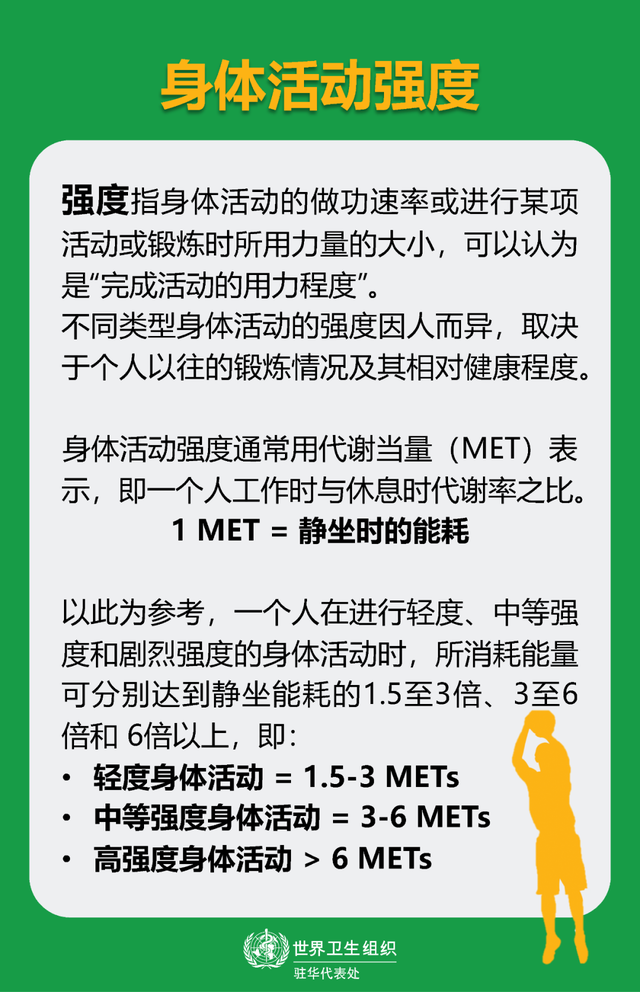
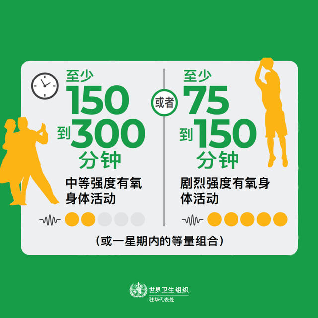
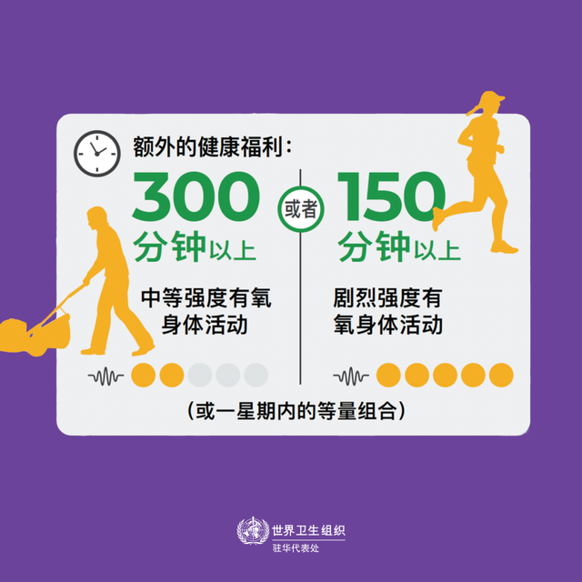
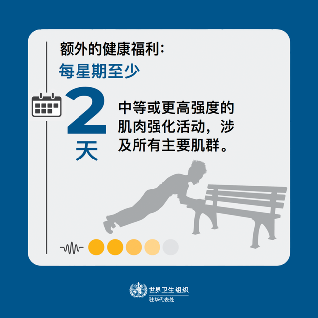

以周计算
每周至少300min中等强度运动/150min高强度运动

# 身体活动强度
强度:指身体活动的做功率或进行某项活动或锻炼时所用力量的大小，可以认为是"完成活动的用力程度"。

身体运动强度通常用代谢量（MET）表示,即一个人工作时与休息时代谢率之比。

*1MET = 静坐时的能耗*

|身体运动强度|MET|心率|身体感觉|典型活动|
|---|---|---|---|---|
|轻度身体运动强度|1.5-3MET|100~120/min|感觉身体轻微发热|散步，遛狗，做家务|
|中等身体运动强度|3-6MET|130~150/min|活动时能感觉到出汗，呼吸比较急促，略感吃力|例如健步走、慢跑、骑自行车、太极拳等。|
|高强度身体运动强度|>6MET|160~170次/min|感觉大汗淋漓、气喘吁吁|例如游泳，羽毛球，篮球等等|

# 世界卫生组织推荐的运动量

# 常见问题
## 如何区分有氧运动、无氧运动？
TODO:cj

## 多大运动量算适量运动
一种可大致判断的方法：*2小时疼痛原则*
含义：不论做哪一种锻炼形式，只要练习结束后，持续疼痛超过两个小时，就说明锻炼过量，需要在下次运动时降低强度。

# 资料
[什么？运动也有标准。世卫推荐的运动量，看看你达标了吗？](https://www.sohu.com/a/466391328_374887)