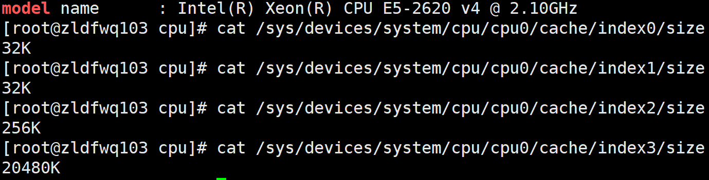

# CPU多级缓存

# CPU多级缓存架构
[CPU多级缓存架构](img/CPU多级缓存架构.jpg)
两个一级缓存(index0,index1),分别对待指令和数据
# 各个系统如何查看缓存大小
## linux
```bash
cat /sys/devices/system/cpu/cpu0/cache/index0/size
32K
cat /sys/devices/system/cpu/cpu0/cache/index1/size
32K
cat /sys/devices/system/cpu/cpu0/cache/index2/size
256K
cat /sys/devices/system/cpu/cpu0/cache/index3/size
40960K
```

## window
* wmic cup命令
* CPU-Z知名工具
# mac
```bash
sysctl machdep.cpu|grep 
cachemachdep.cpu.cache.linesize: 64
machdep.cpu.cache.L2_associativity: 4
machdep.cpu.cache.size: 256
```
大小计算???
64bit*4*256=8K
参考这个计算公式
[一篇对伪共享、缓存行填充和CPU缓存讲的很透彻的文章](https://blog.csdn.net/qq_27680317/article/details/78486220)

# 缓存命中率
## demo 以不同方式访问二维数组 与CPU缓存行有关系
因为二维数组 array 所占用的内存是连续的，比如若长度 N 的值为 2，那么内存中从前至后各元素的顺序是：
```
array[0][0]，array[0][1]，array[1][0]，array[1][1]。
```

