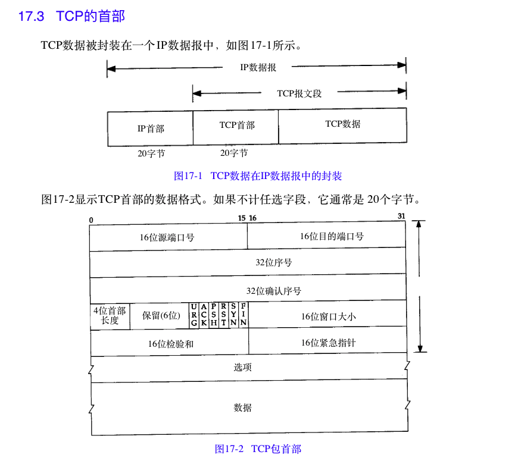
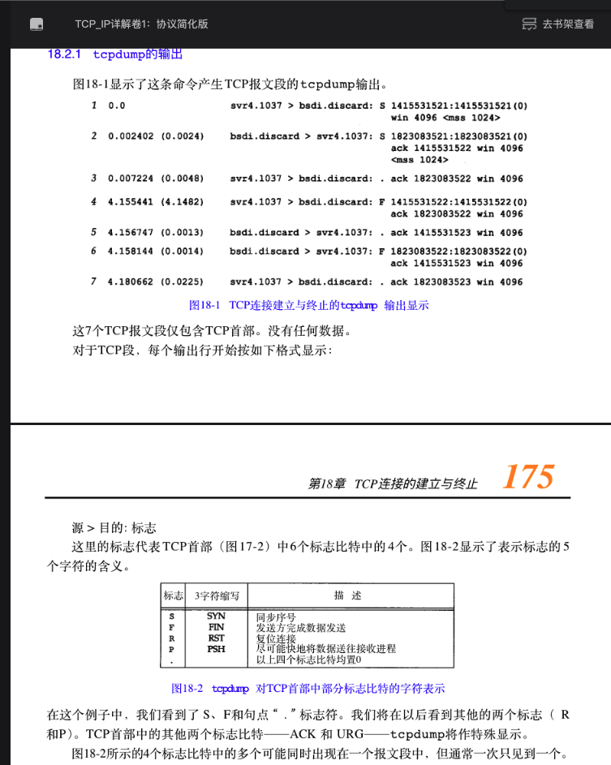
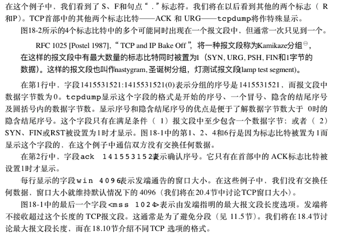
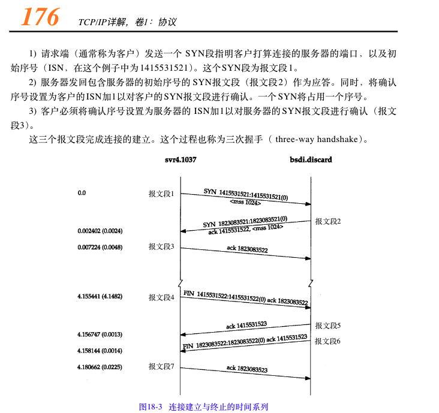
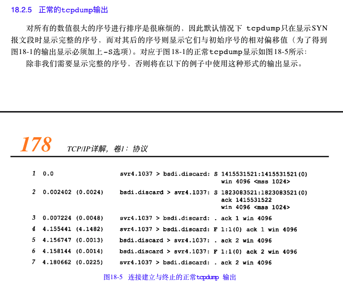
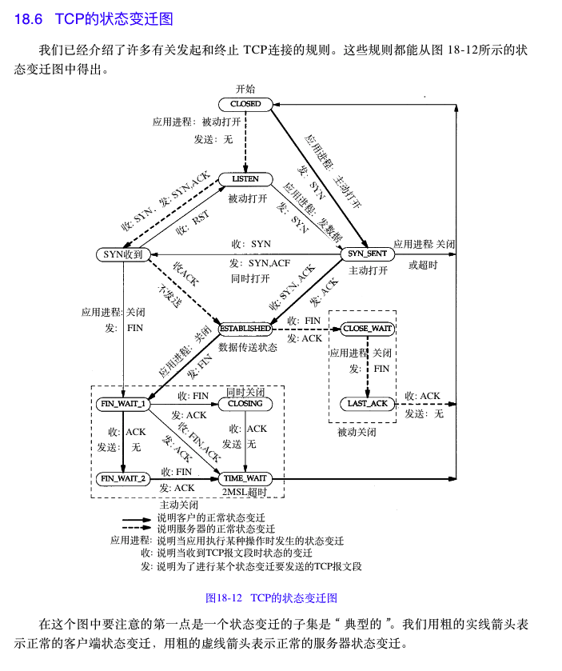
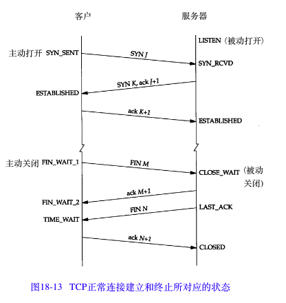

# 介绍
空空如也

## tcp协议设计需要解决的问题
全双工：
面向连接：  UDP无连接， 实际应用:打电话（拨号->喂->我是某某某->继续内容沟通）
可靠：数据包重复，丢失，乱序，篡改（检验和）
安全：检测半打开连接(keepalive)
性能：TCP流量控制窗口

# 资料
tcp/id详解券一:协议

# 图

# 简称
## tcp
MSL Maximum Segment Lifetime:tcp报文段最大生存时长 2MSL
# 工具
## tcpdump
## netstat
## telnet

# 临时杂谈记录
## tcp首部最多60字节解释
Offset:给出首部中32 bit字的数目，需要这个值是因为任选字段的长度是可变的。这个字段占4bit（最多能表示15个32bit的的字，即4*15=60个字节的首部长度），因此TCP最多有60字节的首部。然而，没有任选字段，正常的长度是20字节
## 1.12 telnet

tcpdump抓包实例
## tcpdump 附录A
## ISN生成算法 RFC

## tcp的状态迁移图
ESTABLISHED状态
FIN_WAIT_2和CLOSE_WAIT正常都是临时存在的，而非大量存在的状态

## tcp检测半打开连接
RST报文类型作用

## 
[TCP/IP详解 卷1：协议在线阅读](http://www.52im.net/topic-tcpipvol1.html)
[TCP/IP详解 卷1：协议 附录D 部分习题的解答](http://docs.52im.net/extend/docs/book/tcpip/vol1/d/#hd_17)