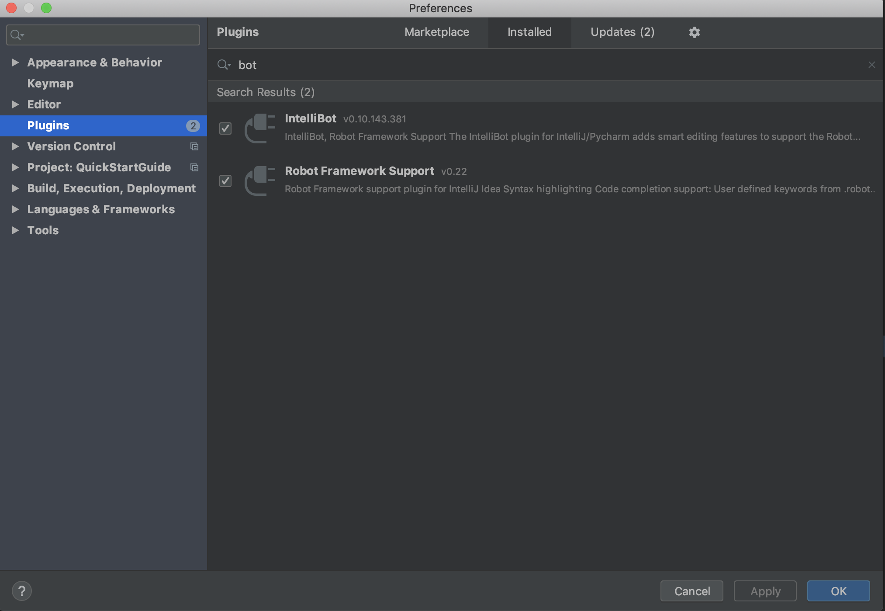
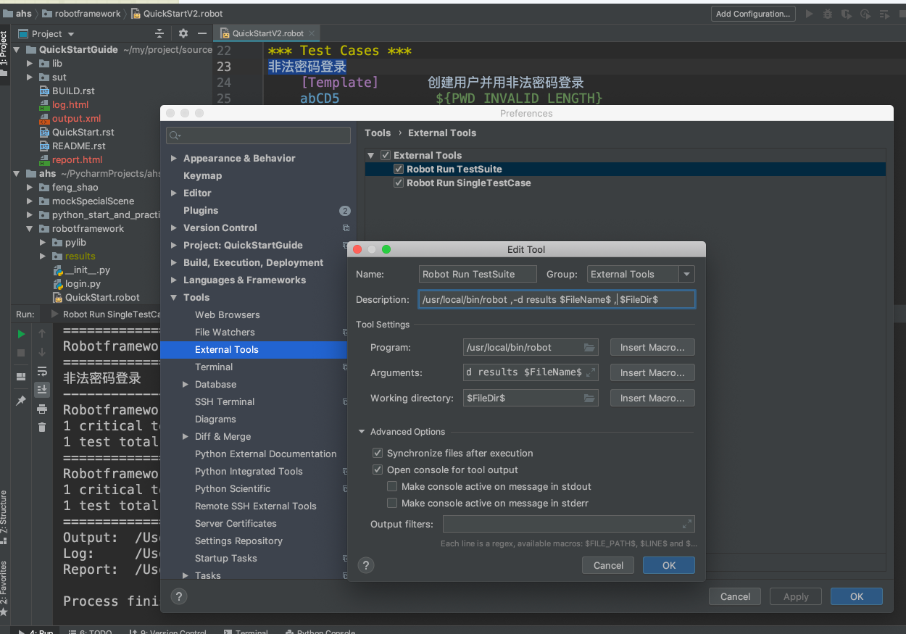
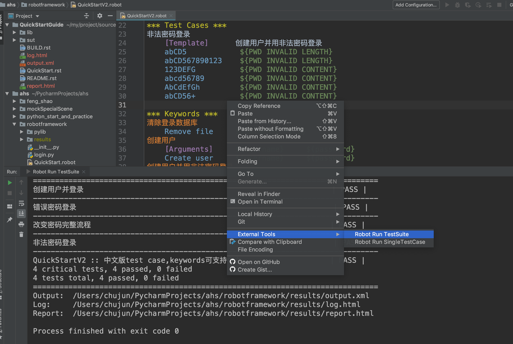
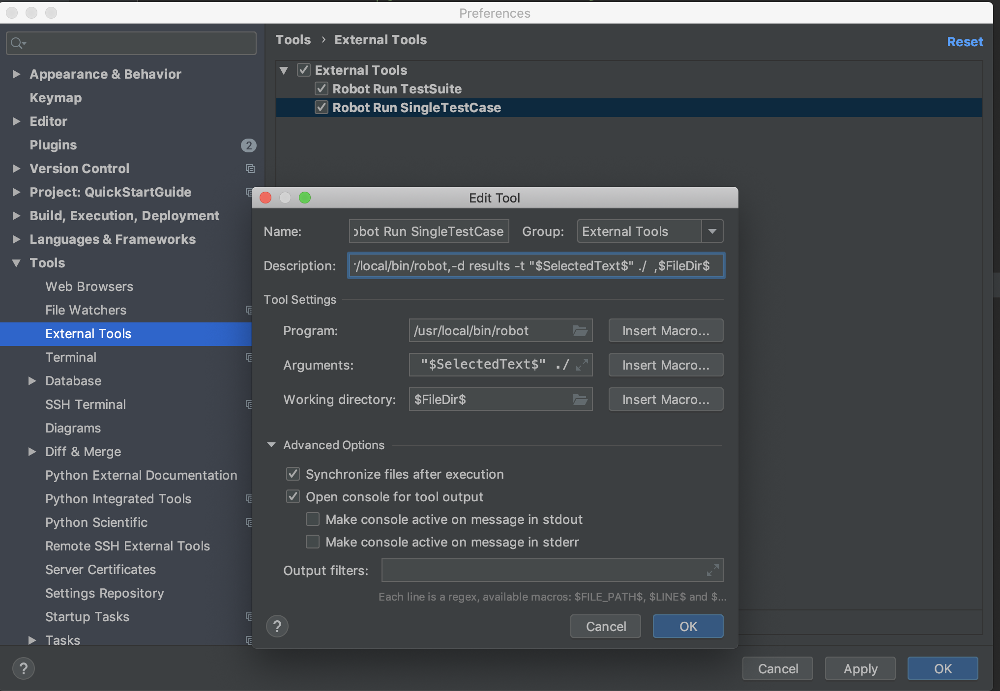
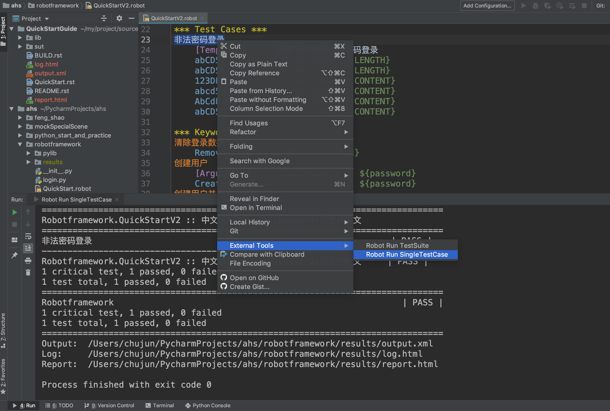

# 资料
+ [official website](https://robotframework.org/) 
+ [github website](https://github.com/robotframework/robotframework)
+ [QuickStartGuide](https://github.com/robotframework/QuickStartGuide/blob/master/QuickStart.rst)
# install
```bash
pip3 install robotframework
```

# command
## robot
```bash
robot robot QuickStart.rst
robot --log custom_log.html --name Custom_Name QuickStart.rst
robot --help
```

# 文档
* [standard-library](http://robotframework.org/robotframework/#standard-libraries)

# 开发环境搭建
## pycharm + 插件intellibot +插件Robot Framework support
* 安装pycharm
* 安装这两个插件

* 编辑external tools方便执行命令
添加执行测试套件的配置
```
Robot Run TestSuite

-d results $FileName$

$FileDir$
```

执行效果


添加执行单个用户的配置
```
Robot Run SingleTestCase

-d results -t "$SelectedText$" ./

$FileDir$
```

执行效果


## 好处
* 语法检查
* 支持自动搜索library关键函数

# 常见问题列表
## 用robot执行rst文件时，报错： Suite 'XXX' contains no tests or tasks.
* 解决办法：将rst文件修改为robot格式即可

