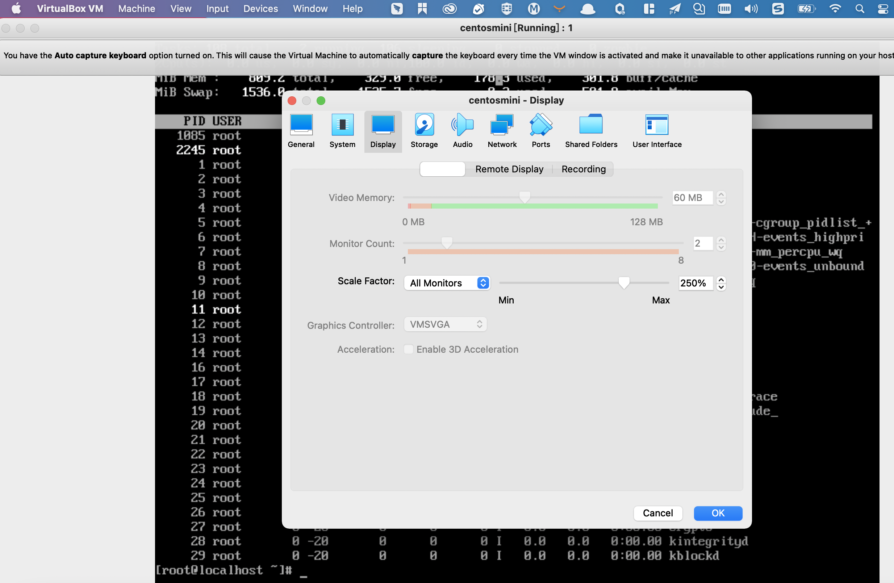

# 介绍

# 热键
本机实践：双击command键唤起Alfred可退出虚拟机

# 网络
待实践

# 问题
## 安装centos系统后鼠标没法正常显示
```shell
yum install gpm*
service gpm start
systemctl enable
```
这三条语句的意思分别是安装,启动,开机自启gpm服务

[virtual box在centos页面中看不到鼠标](https://blog.csdn.net/xljsister/article/details/97634271?share_token=6bdc3e7c-e5eb-42a0-990d-fb14c4d0d217)
## kernal-driver-not-installed-rc-1908-error-mac

https://appuals.com/kernal-driver-not-installed-rc-1908-error-mac/

## mac上安装的win10不能全屏打开，上下左右留白很多
您需要安装Virtualbox guest虚拟机来执行此操作。
在打开的虚拟机客户端界面上方弹出菜单栏（而非mac的virtual box页面），选择devices->install guest additions CD images
[](https://cn.kevinmcgowan.org/810341-fullscreen-virtualbox-QODCJP-article)
其实我已经安装上了这个guest了
Machine->display界面中进行设置



## mac上安装的centos不能全品打开
[VBoxGuestAdditions_6.1.30.iso](http://download.virtualbox.org/virtualbox/6.1.30/)

# 资料
[virtualbox官方手册html版本第一章](https://www.virtualbox.org/manual/ch01.html)
[快速理解VirtualBox的四种网络连接方式](https://www.cnblogs.com/york-hust/archive/2012/03/29/2422911.html)
[解决mac OS下VirtualBox网络设置桥接模式后无法获取虚拟机IP问题](https://blog.csdn.net/adorable_/article/details/109495249)