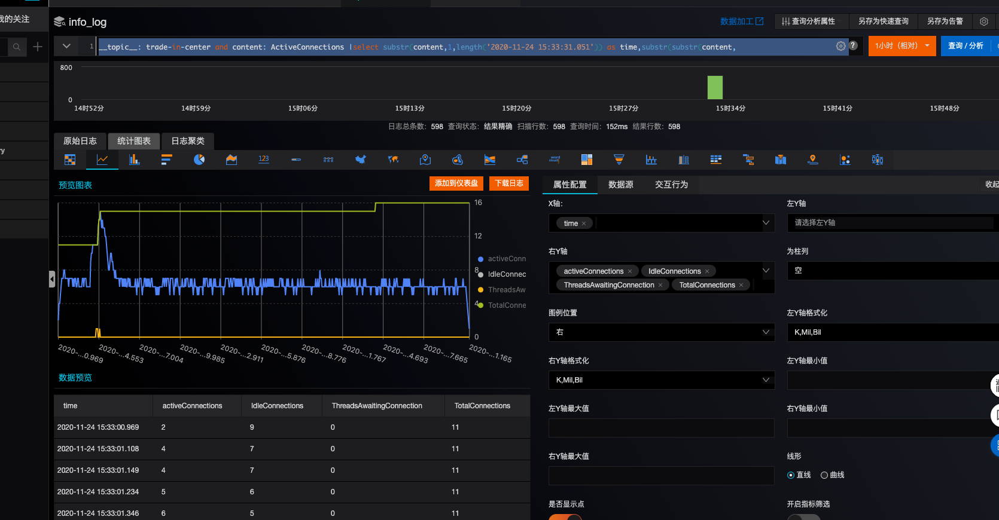

# 常用查询语句

```
* and __topic__: trade-in-center and /erp/base-trade-in-orders |select uri,COUNT(*) as cnt group by uri order by cnt desc
```


#线性图展示
```
__topic__: trade-in-center and content: ActiveConnections |
select substr(content,1,length('2020-11-24 15:33:31.051')) as time,
substr(substr(content, position('ActiveConnections:' IN content)) ,length('ActiveConnections:')+1,4) as activeConnections,
substr(substr(content, position('IdleConnections:' IN content)),length('IdleConnections:')+1,4) as IdleConnections,
substr(substr(content, position('ThreadsAwaitingConnection:' IN content)),length('ThreadsAwaitingConnection:')+1,4) as ThreadsAwaitingConnection,
substr(substr(content, position('TotalConnections:' IN content)),length('TotalConnections:')+1,4) as TotalConnections 
limit 600
```

